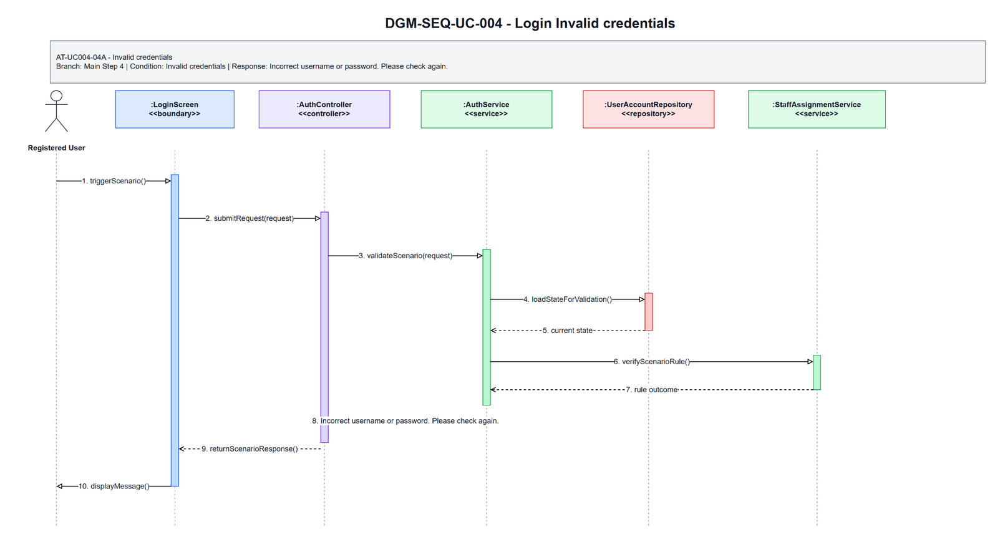
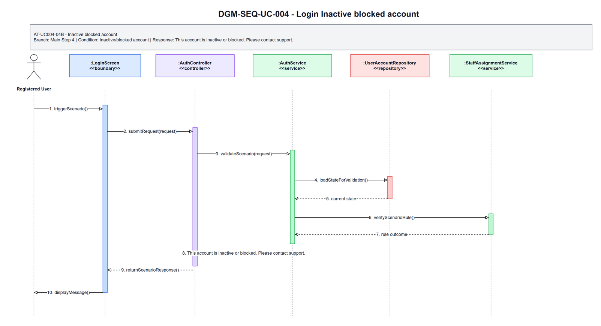
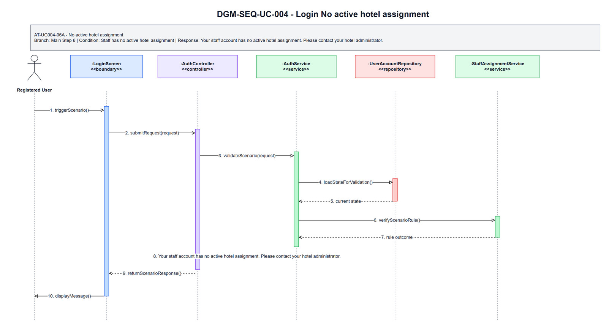

# 3.4 UC-004 - Login

## 3.4.1 Design Purpose

This section describes the detailed design for **UC-004 Login**. The use case covers authenticate user and access role-specific functions. The design is based on the SRS/SDD only; class names and methods are conceptual design assumptions because no implementation codebase was inspected.

**Related SRS items:** FEAT-AUTH, UC-004, SCR-002, ENT-001, ENT-002, ENT-003, BR-AUTH-002, BR-AUTH-003, BR-STAFF-002, MSG-AUTH-001, MSG-AUTH-006, MSG-AUTH-008, TR-004, AT-UC004-04A, AT-UC004-04B, AT-UC004-06A.

**Precondition:** Actor has an account that can be validated.

**Trigger:** Actor submits login credentials.

**Post-condition:** POS-01: The actor is authenticated and routed to the role-specific landing area.

The flow must:

- Main step 1: Actor opens Login Screen.
- Main step 2: System displays email/phone and password fields.
- Main step 3: Actor enters credentials and submits login.
- Main step 4: System validates credentials and account status.
- Main step 5: System authenticates actor.
- Main step 6: System displays appropriate landing screen according to role and hotel assignment.
- Enforce related business rules: BR-AUTH-002, BR-AUTH-003, BR-STAFF-002.
- Return a separate scenario response for each alternative/error flow: AT-UC004-04A, AT-UC004-04B, AT-UC004-06A.

## 3.4.2 Class Diagram

This part presents the class diagram for UC-004 Login.

**Figure 3.4-1: Class Diagram of UC-004 Login**

## 3.4.3 Class Specifications

This part explains the key methods shown in the class diagram. The classes are conceptual design assumptions unless source code is inspected.

### LoginScreen Class

**Description:** Boundary object for the user-visible entry point of UC-004 Login.

| No | Method | Description |
|---:|---|---|
| 1 | `openOrDisplay()` | Displays the use-case screen or user-visible entry state described by the SRS. |
| 2 | `collectInput()` | Collects actor input before request submission. |
| 3 | `renderResult(response)` | Displays the result, validation message, or next action to the actor. |

### AuthController Class

**Description:** API/application entry controller for UC-004 Login.

| No | Method | Description |
|---:|---|---|
| 1 | `handleRequest(request)` | Receives the request from the boundary and delegates the business operation to the service. |
| 2 | `validateRequest(request)` | Checks required request shape before business rule execution. |
| 3 | `authorizeActor(actorContext)` | Verifies that the current actor may execute this use case within role or hotel scope. |

### LoginRequest Class

**Description:** Request DTO carrying input for UC-004 Login.

| No | Method | Description |
|---:|---|---|
| 1 | `hasRequiredFields()` | Returns whether mandatory fields from the SRS screen/use-case step are present. |
| 2 | `normalizeInput()` | Normalizes filter, status, note, amount, date, or reference input before service validation. |
| 3 | `containsActorContext()` | Confirms the request carries the authenticated actor or guest context needed for authorization. |

### AuthService Class

**Description:** Application service that coordinates the main flow, business rules, persistence, and response creation for Login.

| No | Method | Description |
|---:|---|---|
| 1 | `login(request)` | Executes the UC-004 main flow and returns a response for the boundary. |
| 2 | `applyBusinessRules(request)` | Applies the related SRS business rules and state-transition constraints. |
| 3 | `buildResponse(result)` | Builds success, empty-state, or validation responses without exposing unauthorized data. |

### UserAccountRepository Class

**Description:** Repository abstraction for loading and saving data required by Login.

| No | Method | Description |
|---:|---|---|
| 1 | `findForUseCase(criteria)` | Loads the entity state required for validation and display. |
| 2 | `findById(id)` | Retrieves a specific record within actor, hotel, or platform scope. |
| 3 | `saveChanges(entity)` | Persists allowed state changes when the use case modifies data. |

### StaffAssignmentService Class

**Description:** Supporting service or integration used by UC-004 Login.

| No | Method | Description |
|---:|---|---|
| 1 | `verifyRuleContext(entity)` | Checks specialized policy, authorization, calculation, notification, or external status context. |
| 2 | `performSupportingAction(entity)` | Performs notification, calculation, audit, or external reconciliation support when required. |
| 3 | `returnResult()` | Returns the supporting result to the application service for final response composition. |

### LoginResponse Class

**Description:** Response DTO returned by UC-004 Login.

| No | Method | Description |
|---:|---|---|
| 1 | `includeSummary()` | Adds the display or operation summary needed by the screen. |
| 2 | `includeUserMessage()` | Adds the user-facing success, empty-state, or validation message. |
| 3 | `includeNextAction()` | Adds the next available action when the SRS flow continues or returns for correction. |

### UserAccount Class

**Description:** Primary domain entity affected or displayed by UC-004 Login.

| No | Method | Description |
|---:|---|---|
| 1 | `isInAllowedState()` | Determines whether the entity state allows the requested use-case operation. |
| 2 | `applyUseCaseChange()` | Applies the state or data change permitted by the validated flow. |
| 3 | `getDisplaySummary()` | Provides safe summary data for the response or audit record. |

### HotelStaffAssignment Class

**Description:** Supporting domain entity affected or displayed by UC-004 Login.

| No | Method | Description |
|---:|---|---|
| 1 | `isLinkedToUseCase()` | Determines whether the entity is related to the current use-case operation. |
| 2 | `updateStatus()` | Updates status or lifecycle information when the validated flow requires it. |
| 3 | `getAuditSummary()` | Provides auditable summary data for protected state changes. |

## 3.4.4 Sequence Diagram

This part presents the sequence diagrams for UC-004 Login. The main-flow diagram shows only the successful scenario. Each alternative/error scenario has its own diagram.

**Figure 3.4-2: Sequence Diagram of UC-004 Login - Main Flow**

### AT-UC004-04A - Invalid credentials

- **Branch from Main Step:** 4
- **Condition:** Invalid credentials
- **Expected Response:** Incorrect username or password. Please check again.

**Figure 3.4-3: Sequence Diagram of UC-004 Login - AT-UC004-04A Invalid credentials**

### AT-UC004-04B - Inactive blocked account

- **Branch from Main Step:** 4
- **Condition:** Inactive/blocked account
- **Expected Response:** This account is inactive or blocked. Please contact support.

**Figure 3.4-4: Sequence Diagram of UC-004 Login - AT-UC004-04B Inactive blocked account**

### AT-UC004-06A - No active hotel assignment

- **Branch from Main Step:** 6
- **Condition:** Staff has no active hotel assignment
- **Expected Response:** Your staff account has no active hotel assignment. Please contact your hotel administrator.

**Figure 3.4-5: Sequence Diagram of UC-004 Login - AT-UC004-06A No active hotel assignment**

### Validation, Authorization, Transaction, and Error Handling Notes

| Area | Design |
|---|---|
| Validation | Validate required input, current entity status, date/amount/reference values, and SRS business rules before any state change. |
| Authorization | Allow only the SRS actor scope for Registered User; enforce role, ownership, hotel-scope, or platform-scope preconditions before protected data is displayed or changed. |
| Transaction | Use a single application transaction for validated state changes, persistence updates, audit records, and notification records where applicable. Read-only flows do not create domain records. |
| Error Handling | AT-UC004-04A returns "Incorrect username or password. Please check again."; AT-UC004-04B returns "This account is inactive or blocked. Please contact support."; AT-UC004-06A returns "Your staff account has no active hotel assignment. Please contact your hotel administrator.". |
| Privacy | Return only fields allowed for the current role and scope; staff roles must not receive unrelated customer, platform finance, or cross-hotel data. |

## Assumptions and Open Issues

- ASSUMP-UC004-001: Controller, service, repository, DTO, and entity class names are conceptual SDD design names because no source implementation was inspected.
- ASSUMP-UC004-002: Final API routes, database column names, and UI widget names may differ from these SDD class names but must preserve the traced SRS behavior.
- OQ-UC004-001: Confirm final implementation class/package names before treating the conceptual design as code-level documentation.
