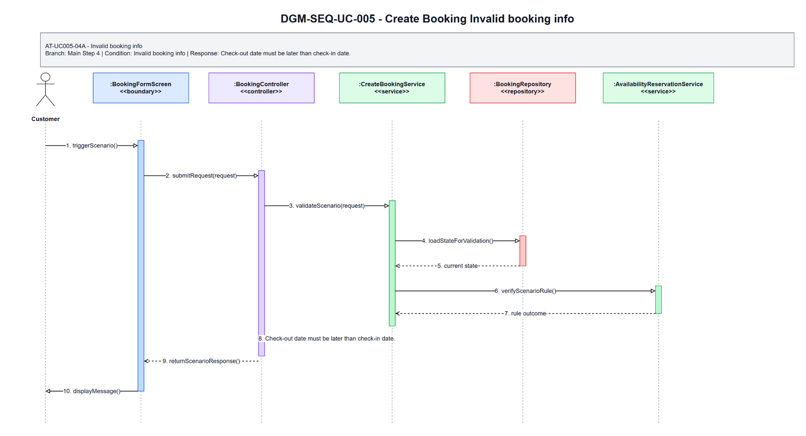
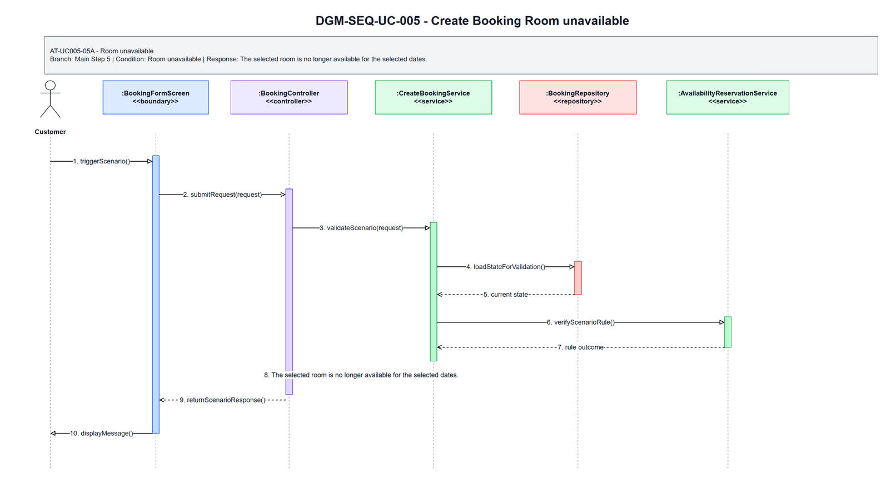
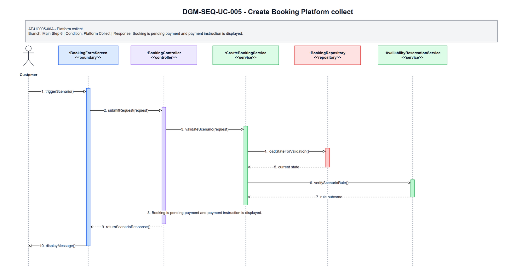
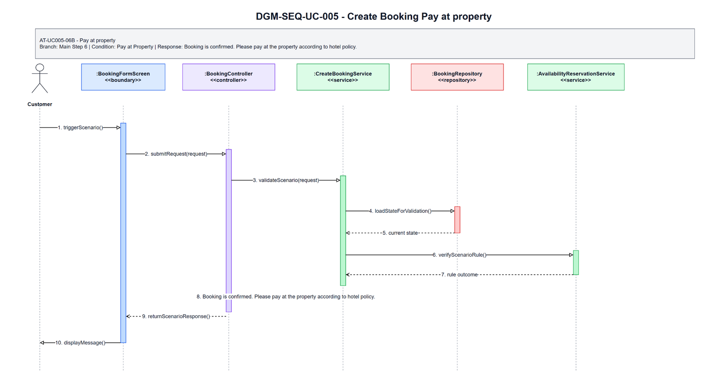

# 3.5 UC-005 - Create Booking

## 3.5.1 Design Purpose

This section describes the detailed design for **UC-005 Create Booking**. The use case covers create an instant booking after availability validation. The design is based on the SRS/SDD only; class names and methods are conceptual design assumptions because no implementation codebase was inspected.

**Related SRS items:** FEAT-CUST-BOOK, UC-005, SCR-007, SCR-008, ENT-009, ENT-010, ENT-012, ENT-013, ENT-014, ENT-020, BR-AUTH-001, BR-BOOK-001, BR-BOOK-005, BR-BOOK-011, BR-BOOK-012, BR-BOOK-013, BR-FIN-001, BR-FIN-003, MSG-BOOK-001, MSG-BOOK-002, MSG-BOOK-003, MSG-PAY-004, TR-005, AT-UC005-04A, AT-UC005-05A, AT-UC005-06A, AT-UC005-06B.

**Precondition:** Customer is authenticated; hotel approved/active; selected room type active.

**Trigger:** Customer submits booking information.

**Post-condition:** POS-01: A booking is created for one room type with quantity; availability is reserved according to payment mode; booking amount uses room price only.

The flow must:

- Main step 1: Customer selects approved hotel and available private room type.
- Main step 2: System displays Booking Form with dates, guest count, room quantity, guest contact, price summary, policy, and payment modes.
- Main step 3: Customer enters booking information and selects payment mode.
- Main step 4: System validates booking information, dates, guest count, quantity, and payment mode.
- Main step 5: System atomically validates availability and reserves requested room type quantity for the date range.
- Main step 6: System creates the booking with the correct initial status.
- Main step 7: System captures commission rate snapshot.
- Main step 8: System sends or records booking notification.
- Main step 9: Customer views booking confirmation or payment instruction.
- Enforce related business rules: BR-AUTH-001, BR-BOOK-001, BR-BOOK-005, BR-BOOK-011, BR-BOOK-012, BR-BOOK-013, BR-FIN-001, BR-FIN-003.
- Return a separate scenario response for each alternative/error flow: AT-UC005-04A, AT-UC005-05A, AT-UC005-06A, AT-UC005-06B.

## 3.5.2 Class Diagram

This part presents the class diagram for UC-005 Create Booking.

**Figure 3.5-1: Class Diagram of UC-005 Create Booking**

## 3.5.3 Class Specifications

This part explains the key methods shown in the class diagram. The classes are conceptual design assumptions unless source code is inspected.

### BookingFormScreen Class

**Description:** Boundary object for the user-visible entry point of UC-005 Create Booking.

| No | Method | Description |
|---:|---|---|
| 1 | `openOrDisplay()` | Displays the use-case screen or user-visible entry state described by the SRS. |
| 2 | `collectInput()` | Collects actor input before request submission. |
| 3 | `renderResult(response)` | Displays the result, validation message, or next action to the actor. |

### BookingController Class

**Description:** API/application entry controller for UC-005 Create Booking.

| No | Method | Description |
|---:|---|---|
| 1 | `handleRequest(request)` | Receives the request from the boundary and delegates the business operation to the service. |
| 2 | `validateRequest(request)` | Checks required request shape before business rule execution. |
| 3 | `authorizeActor(actorContext)` | Verifies that the current actor may execute this use case within role or hotel scope. |

### CreateBookingRequest Class

**Description:** Request DTO carrying input for UC-005 Create Booking.

| No | Method | Description |
|---:|---|---|
| 1 | `hasRequiredFields()` | Returns whether mandatory fields from the SRS screen/use-case step are present. |
| 2 | `normalizeInput()` | Normalizes filter, status, note, amount, date, or reference input before service validation. |
| 3 | `containsActorContext()` | Confirms the request carries the authenticated actor or guest context needed for authorization. |

### CreateBookingService Class

**Description:** Application service that coordinates the main flow, business rules, persistence, and response creation for Create Booking.

| No | Method | Description |
|---:|---|---|
| 1 | `createbooking(request)` | Executes the UC-005 main flow and returns a response for the boundary. |
| 2 | `applyBusinessRules(request)` | Applies the related SRS business rules and state-transition constraints. |
| 3 | `buildResponse(result)` | Builds success, empty-state, or validation responses without exposing unauthorized data. |

### BookingRepository Class

**Description:** Repository abstraction for loading and saving data required by Create Booking.

| No | Method | Description |
|---:|---|---|
| 1 | `findForUseCase(criteria)` | Loads the entity state required for validation and display. |
| 2 | `findById(id)` | Retrieves a specific record within actor, hotel, or platform scope. |
| 3 | `saveChanges(entity)` | Persists allowed state changes when the use case modifies data. |

### AvailabilityReservationService Class

**Description:** Supporting service or integration used by UC-005 Create Booking.

| No | Method | Description |
|---:|---|---|
| 1 | `verifyRuleContext(entity)` | Checks specialized policy, authorization, calculation, notification, or external status context. |
| 2 | `performSupportingAction(entity)` | Performs notification, calculation, audit, or external reconciliation support when required. |
| 3 | `returnResult()` | Returns the supporting result to the application service for final response composition. |

### CreateBookingResponse Class

**Description:** Response DTO returned by UC-005 Create Booking.

| No | Method | Description |
|---:|---|---|
| 1 | `includeSummary()` | Adds the display or operation summary needed by the screen. |
| 2 | `includeUserMessage()` | Adds the user-facing success, empty-state, or validation message. |
| 3 | `includeNextAction()` | Adds the next available action when the SRS flow continues or returns for correction. |

### Booking Class

**Description:** Primary domain entity affected or displayed by UC-005 Create Booking.

| No | Method | Description |
|---:|---|---|
| 1 | `isInAllowedState()` | Determines whether the entity state allows the requested use-case operation. |
| 2 | `applyUseCaseChange()` | Applies the state or data change permitted by the validated flow. |
| 3 | `getDisplaySummary()` | Provides safe summary data for the response or audit record. |

### BookingRoom Class

**Description:** Supporting domain entity affected or displayed by UC-005 Create Booking.

| No | Method | Description |
|---:|---|---|
| 1 | `isLinkedToUseCase()` | Determines whether the entity is related to the current use-case operation. |
| 2 | `updateStatus()` | Updates status or lifecycle information when the validated flow requires it. |
| 3 | `getAuditSummary()` | Provides auditable summary data for protected state changes. |

## 3.5.4 Sequence Diagram

This part presents the sequence diagrams for UC-005 Create Booking. The main-flow diagram shows only the successful scenario. Each alternative/error scenario has its own diagram.

**Figure 3.5-2: Sequence Diagram of UC-005 Create Booking - Main Flow**

### AT-UC005-04A - Invalid booking info

- **Branch from Main Step:** 4
- **Condition:** Invalid booking info
- **Expected Response:** Check-out date must be later than check-in date.

**Figure 3.5-3: Sequence Diagram of UC-005 Create Booking - AT-UC005-04A Invalid booking info**

### AT-UC005-05A - Room unavailable

- **Branch from Main Step:** 5
- **Condition:** Room unavailable
- **Expected Response:** The selected room is no longer available for the selected dates.

**Figure 3.5-4: Sequence Diagram of UC-005 Create Booking - AT-UC005-05A Room unavailable**

### AT-UC005-06A - Platform collect

- **Branch from Main Step:** 6
- **Condition:** Platform Collect
- **Expected Response:** Booking is pending payment and payment instruction is displayed.

**Figure 3.5-5: Sequence Diagram of UC-005 Create Booking - AT-UC005-06A Platform collect**

### AT-UC005-06B - Pay at property

- **Branch from Main Step:** 6
- **Condition:** Pay at Property
- **Expected Response:** Booking is confirmed. Please pay at the property according to hotel policy.

**Figure 3.5-6: Sequence Diagram of UC-005 Create Booking - AT-UC005-06B Pay at property**

### Validation, Authorization, Transaction, and Error Handling Notes

| Area | Design |
|---|---|
| Validation | Validate required input, current entity status, date/amount/reference values, and SRS business rules before any state change. |
| Authorization | Allow only the SRS actor scope for Customer; enforce role, ownership, hotel-scope, or platform-scope preconditions before protected data is displayed or changed. |
| Transaction | Use a single application transaction for validated state changes, persistence updates, audit records, and notification records where applicable. Read-only flows do not create domain records. |
| Error Handling | AT-UC005-04A returns "Check-out date must be later than check-in date."; AT-UC005-05A returns "The selected room is no longer available for the selected dates."; AT-UC005-06A returns "Booking is pending payment and payment instruction is displayed."; AT-UC005-06B returns "Booking is confirmed. Please pay at the property according to hotel policy.". |
| Privacy | Return only fields allowed for the current role and scope; staff roles must not receive unrelated customer, platform finance, or cross-hotel data. |

## Assumptions and Open Issues

- ASSUMP-UC005-001: Controller, service, repository, DTO, and entity class names are conceptual SDD design names because no source implementation was inspected.
- ASSUMP-UC005-002: Final API routes, database column names, and UI widget names may differ from these SDD class names but must preserve the traced SRS behavior.
- OQ-UC005-001: Confirm final implementation class/package names before treating the conceptual design as code-level documentation.
