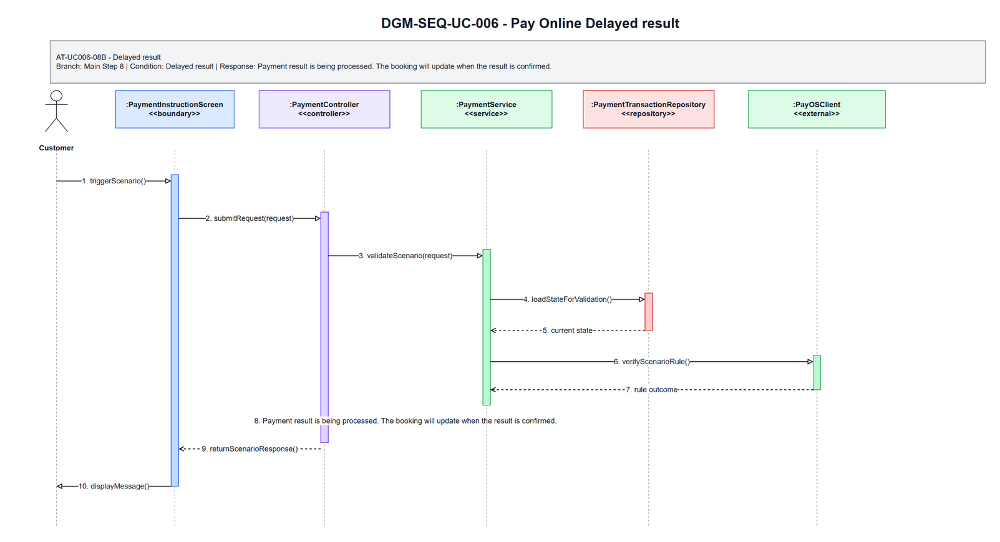
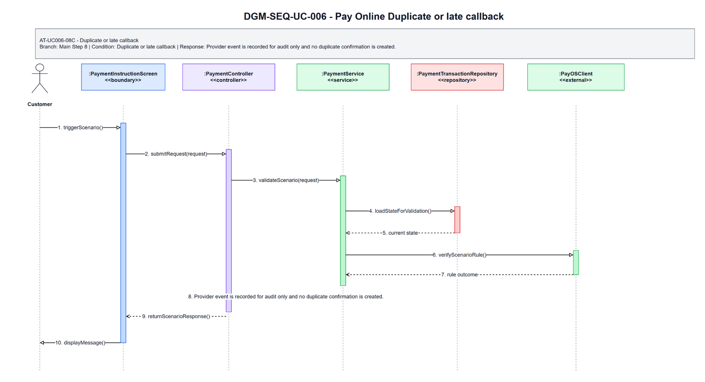

# 3.6 UC-006 - Pay Online

## 3.6.1 Design Purpose

This section describes the detailed design for **UC-006 Pay Online**. The use case covers pay booking amount through payOS for Platform Collect bookings. The design is based on the SRS/SDD only; class names and methods are conceptual design assumptions because no implementation codebase was inspected.

**Related SRS items:** FEAT-CUST-BOOK, UC-006, SCR-008, SCR-011, SCR-012, NSF-001, ENT-013, ENT-016, ENT-020, BR-PAY-001, BR-PAY-003, BR-PAY-005, BR-BOOK-006, BR-BOOK-007, BR-FIN-001, BR-FIN-002, MSG-PAY-001, MSG-PAY-002, MSG-PAY-003, MSG-BOOK-006, TR-006, AT-UC006-08A, AT-UC006-08B, AT-UC006-02A, AT-UC006-08C.

**Precondition:** Customer is authenticated; a Pending Payment booking exists and belongs to the Customer.

**Trigger:** Customer proceeds to online payment.

**Post-condition:** POS-01: Payment status and booking status are updated according to payOS result or timeout.

The flow must:

- Main step 1: Customer selects payment for Pending Payment booking.
- Main step 2: System validates ownership, Pending Payment status, and payment deadline.
- Main step 3: System displays payment summary and deadline.
- Main step 4: Customer confirms online payment.
- Main step 5: System presents payOS payment instruction/redirection.
- Main step 6: Customer completes payment through payOS.
- Main step 7: payOS Payment Gateway returns or sends payment result.
- Main step 8: System idempotently records payment result.
- Main step 9: System updates payment to Paid and booking to Confirmed.
- Main step 10: System calculates commission and hotel payable.
- Main step 11: System displays payment result and sends or records notification.
- Enforce related business rules: BR-PAY-001, BR-PAY-003, BR-PAY-005, BR-BOOK-006, BR-BOOK-007, BR-FIN-001, BR-FIN-002.
- Return a separate scenario response for each alternative/error flow: AT-UC006-08A, AT-UC006-08B, AT-UC006-02A, AT-UC006-08C.

## 3.6.2 Class Diagram

This part presents the class diagram for UC-006 Pay Online.

**Figure 3.6-1: Class Diagram of UC-006 Pay Online**

## 3.6.3 Class Specifications

This part explains the key methods shown in the class diagram. The classes are conceptual design assumptions unless source code is inspected.

### PaymentInstructionScreen Class

**Description:** Boundary object for the user-visible entry point of UC-006 Pay Online.

| No | Method | Description |
|---:|---|---|
| 1 | `openOrDisplay()` | Displays the use-case screen or user-visible entry state described by the SRS. |
| 2 | `collectInput()` | Collects actor input before request submission. |
| 3 | `renderResult(response)` | Displays the result, validation message, or next action to the actor. |

### PaymentController Class

**Description:** API/application entry controller for UC-006 Pay Online.

| No | Method | Description |
|---:|---|---|
| 1 | `handleRequest(request)` | Receives the request from the boundary and delegates the business operation to the service. |
| 2 | `validateRequest(request)` | Checks required request shape before business rule execution. |
| 3 | `authorizeActor(actorContext)` | Verifies that the current actor may execute this use case within role or hotel scope. |

### PayOnlineRequest Class

**Description:** Request DTO carrying input for UC-006 Pay Online.

| No | Method | Description |
|---:|---|---|
| 1 | `hasRequiredFields()` | Returns whether mandatory fields from the SRS screen/use-case step are present. |
| 2 | `normalizeInput()` | Normalizes filter, status, note, amount, date, or reference input before service validation. |
| 3 | `containsActorContext()` | Confirms the request carries the authenticated actor or guest context needed for authorization. |

### PaymentService Class

**Description:** Application service that coordinates the main flow, business rules, persistence, and response creation for Pay Online.

| No | Method | Description |
|---:|---|---|
| 1 | `payonline(request)` | Executes the UC-006 main flow and returns a response for the boundary. |
| 2 | `applyBusinessRules(request)` | Applies the related SRS business rules and state-transition constraints. |
| 3 | `buildResponse(result)` | Builds success, empty-state, or validation responses without exposing unauthorized data. |

### PaymentTransactionRepository Class

**Description:** Repository abstraction for loading and saving data required by Pay Online.

| No | Method | Description |
|---:|---|---|
| 1 | `findForUseCase(criteria)` | Loads the entity state required for validation and display. |
| 2 | `findById(id)` | Retrieves a specific record within actor, hotel, or platform scope. |
| 3 | `saveChanges(entity)` | Persists allowed state changes when the use case modifies data. |

### PayOSClient Class

**Description:** Supporting service or integration used by UC-006 Pay Online.

| No | Method | Description |
|---:|---|---|
| 1 | `verifyRuleContext(entity)` | Checks specialized policy, authorization, calculation, notification, or external status context. |
| 2 | `performSupportingAction(entity)` | Performs notification, calculation, audit, or external reconciliation support when required. |
| 3 | `returnResult()` | Returns the supporting result to the application service for final response composition. |

### PayOnlineResponse Class

**Description:** Response DTO returned by UC-006 Pay Online.

| No | Method | Description |
|---:|---|---|
| 1 | `includeSummary()` | Adds the display or operation summary needed by the screen. |
| 2 | `includeUserMessage()` | Adds the user-facing success, empty-state, or validation message. |
| 3 | `includeNextAction()` | Adds the next available action when the SRS flow continues or returns for correction. |

### Booking Class

**Description:** Primary domain entity affected or displayed by UC-006 Pay Online.

| No | Method | Description |
|---:|---|---|
| 1 | `isInAllowedState()` | Determines whether the entity state allows the requested use-case operation. |
| 2 | `applyUseCaseChange()` | Applies the state or data change permitted by the validated flow. |
| 3 | `getDisplaySummary()` | Provides safe summary data for the response or audit record. |

### PaymentTransaction Class

**Description:** Supporting domain entity affected or displayed by UC-006 Pay Online.

| No | Method | Description |
|---:|---|---|
| 1 | `isLinkedToUseCase()` | Determines whether the entity is related to the current use-case operation. |
| 2 | `updateStatus()` | Updates status or lifecycle information when the validated flow requires it. |
| 3 | `getAuditSummary()` | Provides auditable summary data for protected state changes. |

## 3.6.4 Sequence Diagram

This part presents the sequence diagrams for UC-006 Pay Online. The main-flow diagram shows only the successful scenario. Each alternative/error scenario has its own diagram.

**Figure 3.6-2: Sequence Diagram of UC-006 Pay Online - Main Flow**

### AT-UC006-08A - Payment failed cancelled

- **Branch from Main Step:** 8
- **Condition:** Payment failed/cancelled
- **Expected Response:** Payment was not completed. You may retry before the booking expires.

**Figure 3.6-3: Sequence Diagram of UC-006 Pay Online - AT-UC006-08A Payment failed cancelled**

### AT-UC006-08B - Delayed result

- **Branch from Main Step:** 8
- **Condition:** Delayed result
- **Expected Response:** Payment result is being processed. The booking will update when the result is confirmed.

**Figure 3.6-4: Sequence Diagram of UC-006 Pay Online - AT-UC006-08B Delayed result**

### AT-UC006-02A - Booking expired

- **Branch from Main Step:** 2
- **Condition:** Booking expired
- **Expected Response:** This pending payment booking has expired. Please create a new booking.

**Figure 3.6-5: Sequence Diagram of UC-006 Pay Online - AT-UC006-02A Booking expired**

### AT-UC006-08C - Duplicate or late callback

- **Branch from Main Step:** 8
- **Condition:** Duplicate or late callback
- **Expected Response:** Provider event is recorded for audit only and no duplicate confirmation is created.

**Figure 3.6-6: Sequence Diagram of UC-006 Pay Online - AT-UC006-08C Duplicate or late callback**

### Validation, Authorization, Transaction, and Error Handling Notes

| Area | Design |
|---|---|
| Validation | Validate required input, current entity status, date/amount/reference values, and SRS business rules before any state change. |
| Authorization | Allow only the SRS actor scope for Customer; enforce role, ownership, hotel-scope, or platform-scope preconditions before protected data is displayed or changed. |
| Transaction | Use a single application transaction for validated state changes, persistence updates, audit records, and notification records where applicable. Read-only flows do not create domain records. |
| Error Handling | AT-UC006-08A returns "Payment was not completed. You may retry before the booking expires."; AT-UC006-08B returns "Payment result is being processed. The booking will update when the result is confirmed."; AT-UC006-02A returns "This pending payment booking has expired. Please create a new booking."; AT-UC006-08C returns "Provider event is recorded for audit only and no duplicate confirmation is created.". |
| Privacy | Return only fields allowed for the current role and scope; staff roles must not receive unrelated customer, platform finance, or cross-hotel data. |

## Assumptions and Open Issues

- ASSUMP-UC006-001: Controller, service, repository, DTO, and entity class names are conceptual SDD design names because no source implementation was inspected.
- ASSUMP-UC006-002: Final API routes, database column names, and UI widget names may differ from these SDD class names but must preserve the traced SRS behavior.
- OQ-UC006-001: Confirm final implementation class/package names before treating the conceptual design as code-level documentation.
