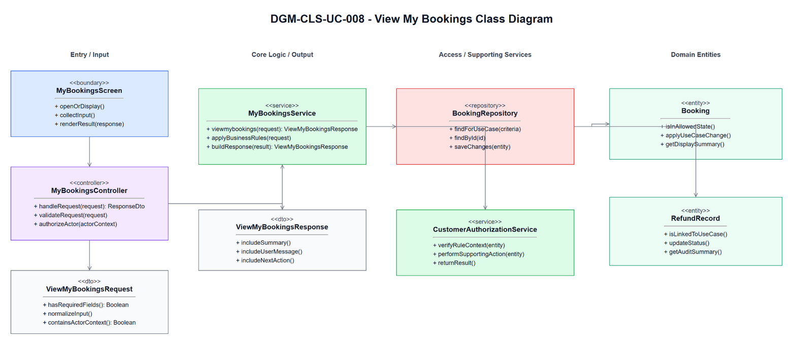
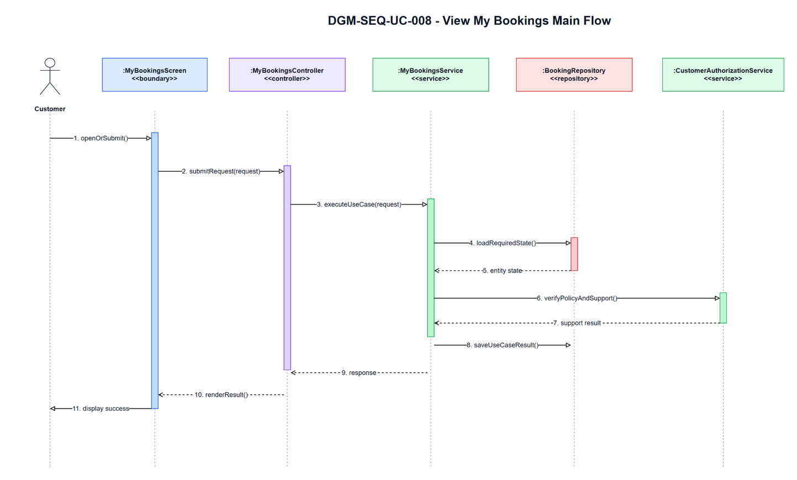
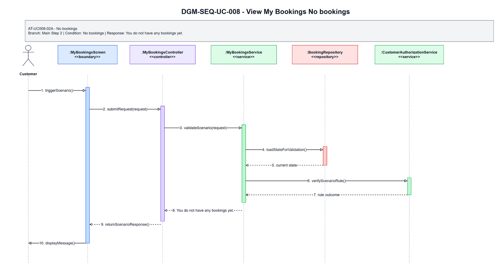

# 3.8 UC-008 - View My Bookings

## 3.8.1 Design Purpose

This section describes the detailed design for **UC-008 View My Bookings**. The use case covers view customer booking list, status, payment status, and booking detail. The design is based on the SRS/SDD only; class names and methods are conceptual design assumptions because no implementation codebase was inspected.

**Related SRS items:** FEAT-CUST-MYBOOK, UC-008, SCR-009, SCR-010, ENT-013, BR-BOOK-008, MSG-BOOK-008, TR-008, AT-UC008-02A.

**Precondition:** Customer is authenticated.

**Trigger:** Customer opens My Bookings.

**Post-condition:** POS-01: Customer sees own booking list/detail only.

The flow must:

- Main step 1: Customer opens My Bookings Screen.
- Main step 2: System displays own booking list with booking code, hotel, dates, booking status, payment status, and main actions.
- Main step 3: Customer filters or selects booking.
- Main step 4: System displays booking detail including room, guest count, payment mode, price, refund status, and allowed actions.
- Enforce related business rules: BR-BOOK-008.
- Return a separate scenario response for each alternative/error flow: AT-UC008-02A.

## 3.8.2 Class Diagram

This part presents the class diagram for UC-008 View My Bookings.

**Figure 3.8-1: Class Diagram of UC-008 View My Bookings**

## 3.8.3 Class Specifications

This part explains the key methods shown in the class diagram. The classes are conceptual design assumptions unless source code is inspected.

### MyBookingsScreen Class

**Description:** Boundary object for the user-visible entry point of UC-008 View My Bookings.

| No | Method | Description |
|---:|---|---|
| 1 | `openOrDisplay()` | Displays the use-case screen or user-visible entry state described by the SRS. |
| 2 | `collectInput()` | Collects actor input before request submission. |
| 3 | `renderResult(response)` | Displays the result, validation message, or next action to the actor. |

### MyBookingsController Class

**Description:** API/application entry controller for UC-008 View My Bookings.

| No | Method | Description |
|---:|---|---|
| 1 | `handleRequest(request)` | Receives the request from the boundary and delegates the business operation to the service. |
| 2 | `validateRequest(request)` | Checks required request shape before business rule execution. |
| 3 | `authorizeActor(actorContext)` | Verifies that the current actor may execute this use case within role or hotel scope. |

### ViewMyBookingsRequest Class

**Description:** Request DTO carrying input for UC-008 View My Bookings.

| No | Method | Description |
|---:|---|---|
| 1 | `hasRequiredFields()` | Returns whether mandatory fields from the SRS screen/use-case step are present. |
| 2 | `normalizeInput()` | Normalizes filter, status, note, amount, date, or reference input before service validation. |
| 3 | `containsActorContext()` | Confirms the request carries the authenticated actor or guest context needed for authorization. |

### MyBookingsService Class

**Description:** Application service that coordinates the main flow, business rules, persistence, and response creation for View My Bookings.

| No | Method | Description |
|---:|---|---|
| 1 | `viewmybookings(request)` | Executes the UC-008 main flow and returns a response for the boundary. |
| 2 | `applyBusinessRules(request)` | Applies the related SRS business rules and state-transition constraints. |
| 3 | `buildResponse(result)` | Builds success, empty-state, or validation responses without exposing unauthorized data. |

### BookingRepository Class

**Description:** Repository abstraction for loading and saving data required by View My Bookings.

| No | Method | Description |
|---:|---|---|
| 1 | `findForUseCase(criteria)` | Loads the entity state required for validation and display. |
| 2 | `findById(id)` | Retrieves a specific record within actor, hotel, or platform scope. |
| 3 | `saveChanges(entity)` | Persists allowed state changes when the use case modifies data. |

### CustomerAuthorizationService Class

**Description:** Supporting service or integration used by UC-008 View My Bookings.

| No | Method | Description |
|---:|---|---|
| 1 | `verifyRuleContext(entity)` | Checks specialized policy, authorization, calculation, notification, or external status context. |
| 2 | `performSupportingAction(entity)` | Performs notification, calculation, audit, or external reconciliation support when required. |
| 3 | `returnResult()` | Returns the supporting result to the application service for final response composition. |

### ViewMyBookingsResponse Class

**Description:** Response DTO returned by UC-008 View My Bookings.

| No | Method | Description |
|---:|---|---|
| 1 | `includeSummary()` | Adds the display or operation summary needed by the screen. |
| 2 | `includeUserMessage()` | Adds the user-facing success, empty-state, or validation message. |
| 3 | `includeNextAction()` | Adds the next available action when the SRS flow continues or returns for correction. |

### Booking Class

**Description:** Primary domain entity affected or displayed by UC-008 View My Bookings.

| No | Method | Description |
|---:|---|---|
| 1 | `isInAllowedState()` | Determines whether the entity state allows the requested use-case operation. |
| 2 | `applyUseCaseChange()` | Applies the state or data change permitted by the validated flow. |
| 3 | `getDisplaySummary()` | Provides safe summary data for the response or audit record. |

### RefundRecord Class

**Description:** Supporting domain entity affected or displayed by UC-008 View My Bookings.

| No | Method | Description |
|---:|---|---|
| 1 | `isLinkedToUseCase()` | Determines whether the entity is related to the current use-case operation. |
| 2 | `updateStatus()` | Updates status or lifecycle information when the validated flow requires it. |
| 3 | `getAuditSummary()` | Provides auditable summary data for protected state changes. |

## 3.8.4 Sequence Diagram

This part presents the sequence diagrams for UC-008 View My Bookings. The main-flow diagram shows only the successful scenario. Each alternative/error scenario has its own diagram.

**Figure 3.8-2: Sequence Diagram of UC-008 View My Bookings - Main Flow**

### AT-UC008-02A - No bookings

- **Branch from Main Step:** 2
- **Condition:** No bookings
- **Expected Response:** You do not have any bookings yet.

**Figure 3.8-3: Sequence Diagram of UC-008 View My Bookings - AT-UC008-02A No bookings**

### Validation, Authorization, Transaction, and Error Handling Notes

| Area | Design |
|---|---|
| Validation | Validate required input, current entity status, date/amount/reference values, and SRS business rules before any state change. |
| Authorization | Allow only the SRS actor scope for Customer; enforce role, ownership, hotel-scope, or platform-scope preconditions before protected data is displayed or changed. |
| Transaction | Use a single application transaction for validated state changes, persistence updates, audit records, and notification records where applicable. Read-only flows do not create domain records. |
| Error Handling | AT-UC008-02A returns "You do not have any bookings yet.". |
| Privacy | Return only fields allowed for the current role and scope; staff roles must not receive unrelated customer, platform finance, or cross-hotel data. |

## Assumptions and Open Issues

- ASSUMP-UC008-001: Controller, service, repository, DTO, and entity class names are conceptual SDD design names because no source implementation was inspected.
- ASSUMP-UC008-002: Final API routes, database column names, and UI widget names may differ from these SDD class names but must preserve the traced SRS behavior.
- OQ-UC008-001: Confirm final implementation class/package names before treating the conceptual design as code-level documentation.
