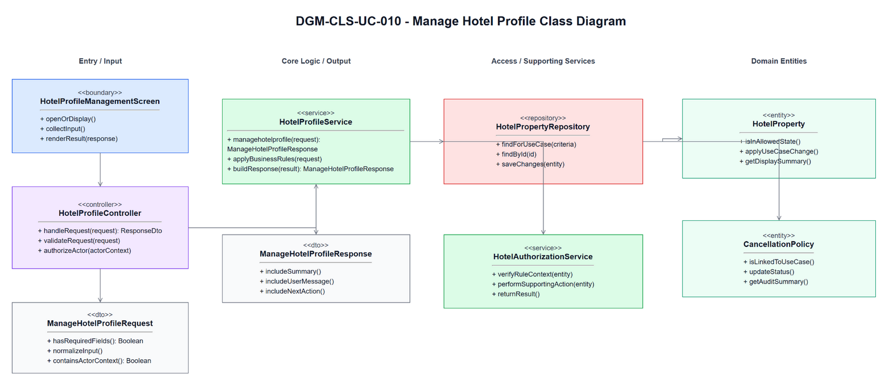
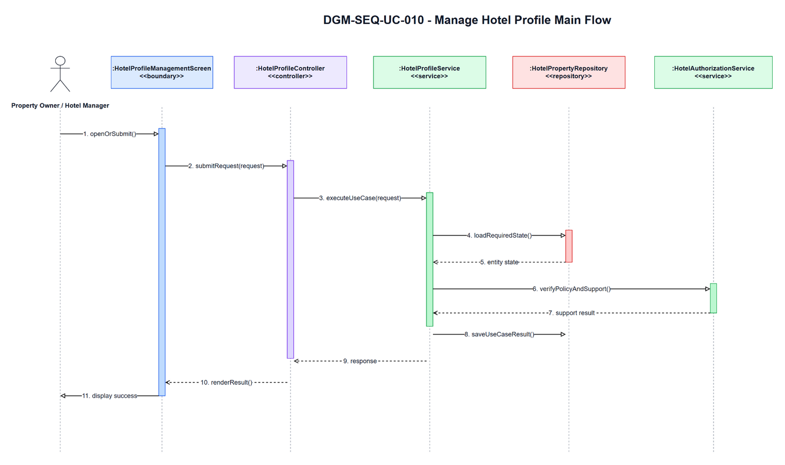
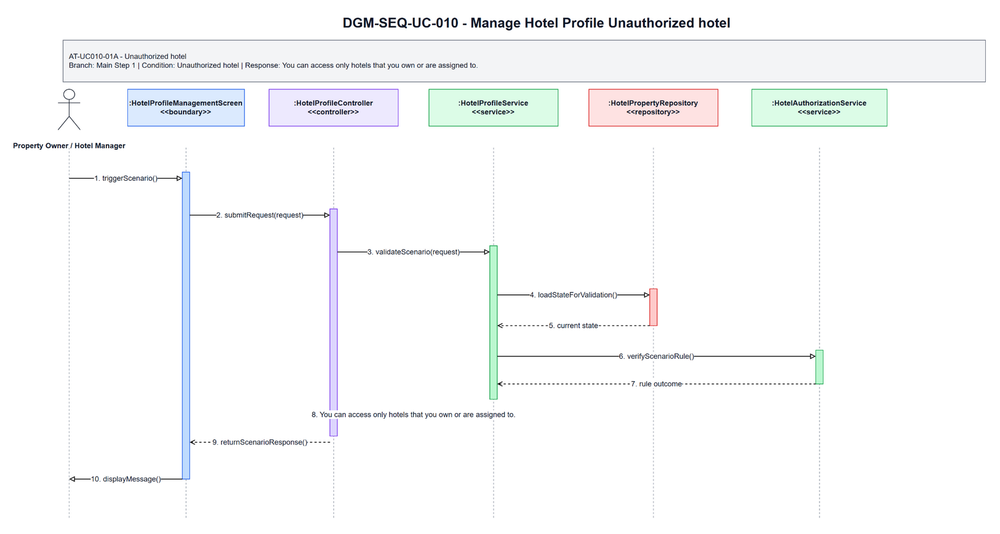
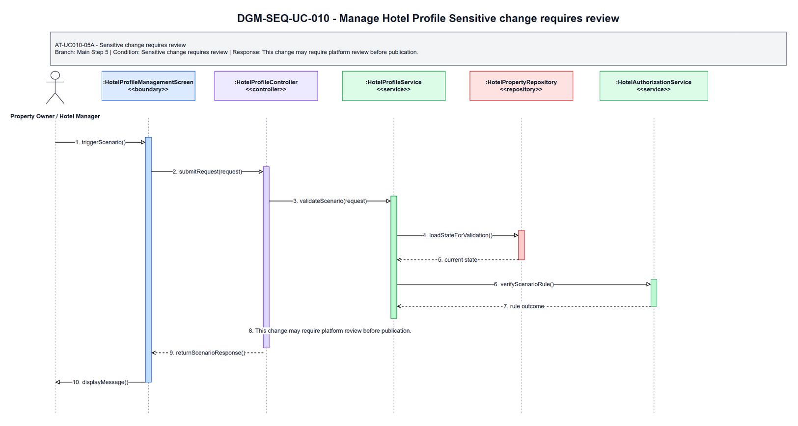

# 3.10 UC-010 - Manage Hotel Profile

## 3.10.1 Design Purpose

This section describes the detailed design for **UC-010 Manage Hotel Profile**. The use case covers update owned or assigned hotel information, images, amenities, and policies. The design is based on the SRS/SDD only; class names and methods are conceptual design assumptions because no implementation codebase was inspected.

**Related SRS items:** FEAT-HOTEL-SETUP, UC-010, SCR-016, ENT-005, ENT-006, ENT-007, ENT-008, ENT-009, BR-OWNER-001, BR-STAFF-002, BR-MKT-001, MSG-OWNER-002, MSG-OWNER-004, MSG-OWNER-006, TR-010, AT-UC010-01A, AT-UC010-05A.

**Precondition:** Actor authenticated; selected hotel access can be validated before hotel profile data is displayed.

**Trigger:** Actor opens Hotel Profile Management.

**Post-condition:** POS-01: Hotel profile, images, amenities, or policy information is updated according to permission and approval rules.

The flow must:

- Main step 1: Actor selects owned or assigned hotel.
- Main step 2: System validates selected hotel access and displays hotel profile and approval/publication status.
- Main step 3: Actor updates editable hotel information, images, amenities, or policies.
- Main step 4: System validates updates.
- Main step 5: System records changes.
- Main step 6: System displays success message.
- Enforce related business rules: BR-OWNER-001, BR-STAFF-002, BR-MKT-001.
- Return a separate scenario response for each alternative/error flow: AT-UC010-01A, AT-UC010-05A.

## 3.10.2 Class Diagram

This part presents the class diagram for UC-010 Manage Hotel Profile.

**Figure 3.10-1: Class Diagram of UC-010 Manage Hotel Profile**

## 3.10.3 Class Specifications

This part explains the key methods shown in the class diagram. The classes are conceptual design assumptions unless source code is inspected.

### HotelProfileManagementScreen Class

**Description:** Boundary object for the user-visible entry point of UC-010 Manage Hotel Profile.

| No | Method | Description |
|---:|---|---|
| 1 | `openOrDisplay()` | Displays the use-case screen or user-visible entry state described by the SRS. |
| 2 | `collectInput()` | Collects actor input before request submission. |
| 3 | `renderResult(response)` | Displays the result, validation message, or next action to the actor. |

### HotelProfileController Class

**Description:** API/application entry controller for UC-010 Manage Hotel Profile.

| No | Method | Description |
|---:|---|---|
| 1 | `handleRequest(request)` | Receives the request from the boundary and delegates the business operation to the service. |
| 2 | `validateRequest(request)` | Checks required request shape before business rule execution. |
| 3 | `authorizeActor(actorContext)` | Verifies that the current actor may execute this use case within role or hotel scope. |

### ManageHotelProfileRequest Class

**Description:** Request DTO carrying input for UC-010 Manage Hotel Profile.

| No | Method | Description |
|---:|---|---|
| 1 | `hasRequiredFields()` | Returns whether mandatory fields from the SRS screen/use-case step are present. |
| 2 | `normalizeInput()` | Normalizes filter, status, note, amount, date, or reference input before service validation. |
| 3 | `containsActorContext()` | Confirms the request carries the authenticated actor or guest context needed for authorization. |

### HotelProfileService Class

**Description:** Application service that coordinates the main flow, business rules, persistence, and response creation for Manage Hotel Profile.

| No | Method | Description |
|---:|---|---|
| 1 | `managehotelprofile(request)` | Executes the UC-010 main flow and returns a response for the boundary. |
| 2 | `applyBusinessRules(request)` | Applies the related SRS business rules and state-transition constraints. |
| 3 | `buildResponse(result)` | Builds success, empty-state, or validation responses without exposing unauthorized data. |

### HotelPropertyRepository Class

**Description:** Repository abstraction for loading and saving data required by Manage Hotel Profile.

| No | Method | Description |
|---:|---|---|
| 1 | `findForUseCase(criteria)` | Loads the entity state required for validation and display. |
| 2 | `findById(id)` | Retrieves a specific record within actor, hotel, or platform scope. |
| 3 | `saveChanges(entity)` | Persists allowed state changes when the use case modifies data. |

### HotelAuthorizationService Class

**Description:** Supporting service or integration used by UC-010 Manage Hotel Profile.

| No | Method | Description |
|---:|---|---|
| 1 | `verifyRuleContext(entity)` | Checks specialized policy, authorization, calculation, notification, or external status context. |
| 2 | `performSupportingAction(entity)` | Performs notification, calculation, audit, or external reconciliation support when required. |
| 3 | `returnResult()` | Returns the supporting result to the application service for final response composition. |

### ManageHotelProfileResponse Class

**Description:** Response DTO returned by UC-010 Manage Hotel Profile.

| No | Method | Description |
|---:|---|---|
| 1 | `includeSummary()` | Adds the display or operation summary needed by the screen. |
| 2 | `includeUserMessage()` | Adds the user-facing success, empty-state, or validation message. |
| 3 | `includeNextAction()` | Adds the next available action when the SRS flow continues or returns for correction. |

### HotelProperty Class

**Description:** Primary domain entity affected or displayed by UC-010 Manage Hotel Profile.

| No | Method | Description |
|---:|---|---|
| 1 | `isInAllowedState()` | Determines whether the entity state allows the requested use-case operation. |
| 2 | `applyUseCaseChange()` | Applies the state or data change permitted by the validated flow. |
| 3 | `getDisplaySummary()` | Provides safe summary data for the response or audit record. |

### CancellationPolicy Class

**Description:** Supporting domain entity affected or displayed by UC-010 Manage Hotel Profile.

| No | Method | Description |
|---:|---|---|
| 1 | `isLinkedToUseCase()` | Determines whether the entity is related to the current use-case operation. |
| 2 | `updateStatus()` | Updates status or lifecycle information when the validated flow requires it. |
| 3 | `getAuditSummary()` | Provides auditable summary data for protected state changes. |

## 3.10.4 Sequence Diagram

This part presents the sequence diagrams for UC-010 Manage Hotel Profile. The main-flow diagram shows only the successful scenario. Each alternative/error scenario has its own diagram.

**Figure 3.10-2: Sequence Diagram of UC-010 Manage Hotel Profile - Main Flow**

### AT-UC010-01A - Unauthorized hotel

- **Branch from Main Step:** 1
- **Condition:** Unauthorized hotel
- **Expected Response:** You can access only hotels that you own or are assigned to.

**Figure 3.10-3: Sequence Diagram of UC-010 Manage Hotel Profile - AT-UC010-01A Unauthorized hotel**

### AT-UC010-05A - Sensitive change requires review

- **Branch from Main Step:** 5
- **Condition:** Sensitive change requires review
- **Expected Response:** This change may require platform review before publication.

**Figure 3.10-4: Sequence Diagram of UC-010 Manage Hotel Profile - AT-UC010-05A Sensitive change requires review**

### Validation, Authorization, Transaction, and Error Handling Notes

| Area | Design |
|---|---|
| Validation | Validate required input, current entity status, date/amount/reference values, and SRS business rules before any state change. |
| Authorization | Allow only the SRS actor scope for Property Owner / Hotel Manager; enforce role, ownership, hotel-scope, or platform-scope preconditions before protected data is displayed or changed. |
| Transaction | Use a single application transaction for validated state changes, persistence updates, audit records, and notification records where applicable. Read-only flows do not create domain records. |
| Error Handling | AT-UC010-01A returns "You can access only hotels that you own or are assigned to."; AT-UC010-05A returns "This change may require platform review before publication.". |
| Privacy | Return only fields allowed for the current role and scope; staff roles must not receive unrelated customer, platform finance, or cross-hotel data. |

## Assumptions and Open Issues

- ASSUMP-UC010-001: Controller, service, repository, DTO, and entity class names are conceptual SDD design names because no source implementation was inspected.
- ASSUMP-UC010-002: Final API routes, database column names, and UI widget names may differ from these SDD class names but must preserve the traced SRS behavior.
- OQ-UC010-001: Confirm final implementation class/package names before treating the conceptual design as code-level documentation.
