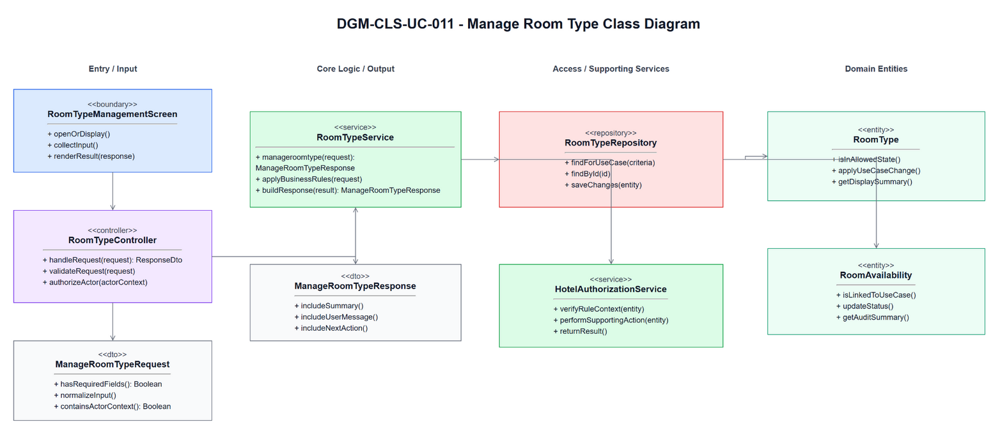
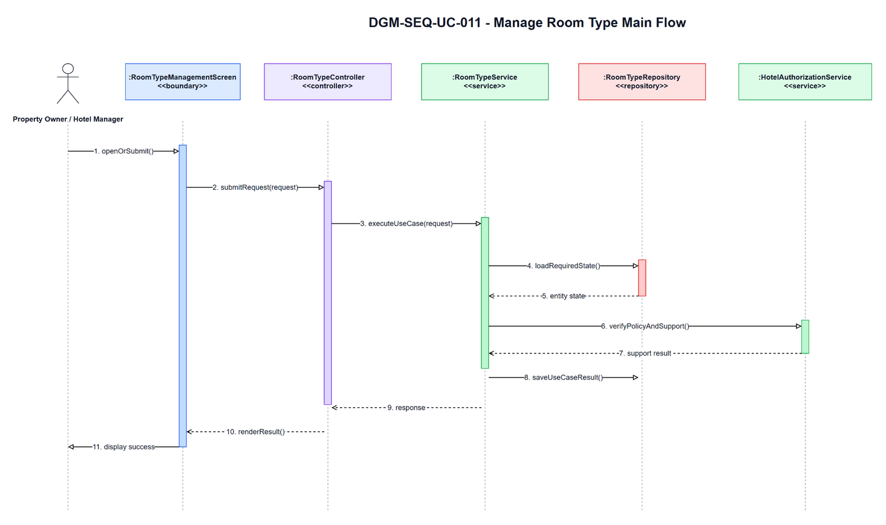
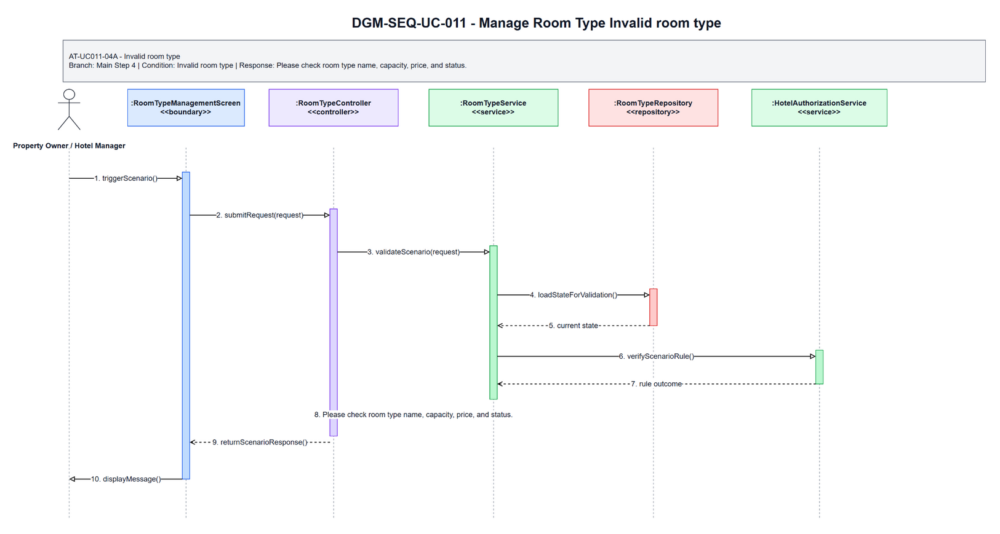
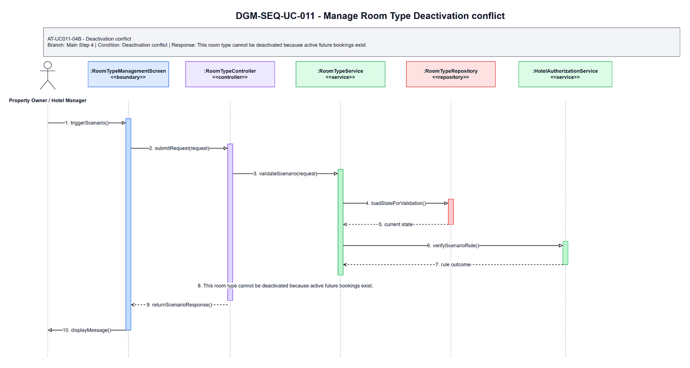

# 3.11 UC-011 - Manage Room Type

## 3.11.1 Design Purpose

This section describes the detailed design for **UC-011 Manage Room Type**. The use case covers create and update private room types, base price, capacity, and facilities. The design is based on the SRS/SDD only; class names and methods are conceptual design assumptions because no implementation codebase was inspected.

**Related SRS items:** FEAT-ROOM-INV, UC-011, SCR-017, ENT-010, BR-ROOM-003, BR-ROOM-004, BR-OWNER-001, BR-STAFF-002, MSG-ROOM-001, MSG-ROOM-002, MSG-ROOM-005, TR-011, AT-UC011-04A, AT-UC011-04B.

**Precondition:** Actor authenticated; hotel owned or assigned.

**Trigger:** Actor opens Room Type Management.

**Post-condition:** POS-01: Room type information is created or updated for an owned/assigned hotel.

The flow must:

- Main step 1: Actor selects hotel and opens Room Type Management.
- Main step 2: System displays room types and actions.
- Main step 3: Actor creates or updates room type information.
- Main step 4: System validates name, capacity, base price, and status.
- Main step 5: System records room type.
- Main step 6: System displays success message.
- Enforce related business rules: BR-ROOM-003, BR-ROOM-004, BR-OWNER-001, BR-STAFF-002.
- Return a separate scenario response for each alternative/error flow: AT-UC011-04A, AT-UC011-04B.

## 3.11.2 Class Diagram

This part presents the class diagram for UC-011 Manage Room Type.

**Figure 3.11-1: Class Diagram of UC-011 Manage Room Type**

## 3.11.3 Class Specifications

This part explains the key methods shown in the class diagram. The classes are conceptual design assumptions unless source code is inspected.

### RoomTypeManagementScreen Class

**Description:** Boundary object for the user-visible entry point of UC-011 Manage Room Type.

| No | Method | Description |
|---:|---|---|
| 1 | `openOrDisplay()` | Displays the use-case screen or user-visible entry state described by the SRS. |
| 2 | `collectInput()` | Collects actor input before request submission. |
| 3 | `renderResult(response)` | Displays the result, validation message, or next action to the actor. |

### RoomTypeController Class

**Description:** API/application entry controller for UC-011 Manage Room Type.

| No | Method | Description |
|---:|---|---|
| 1 | `handleRequest(request)` | Receives the request from the boundary and delegates the business operation to the service. |
| 2 | `validateRequest(request)` | Checks required request shape before business rule execution. |
| 3 | `authorizeActor(actorContext)` | Verifies that the current actor may execute this use case within role or hotel scope. |

### ManageRoomTypeRequest Class

**Description:** Request DTO carrying input for UC-011 Manage Room Type.

| No | Method | Description |
|---:|---|---|
| 1 | `hasRequiredFields()` | Returns whether mandatory fields from the SRS screen/use-case step are present. |
| 2 | `normalizeInput()` | Normalizes filter, status, note, amount, date, or reference input before service validation. |
| 3 | `containsActorContext()` | Confirms the request carries the authenticated actor or guest context needed for authorization. |

### RoomTypeService Class

**Description:** Application service that coordinates the main flow, business rules, persistence, and response creation for Manage Room Type.

| No | Method | Description |
|---:|---|---|
| 1 | `manageroomtype(request)` | Executes the UC-011 main flow and returns a response for the boundary. |
| 2 | `applyBusinessRules(request)` | Applies the related SRS business rules and state-transition constraints. |
| 3 | `buildResponse(result)` | Builds success, empty-state, or validation responses without exposing unauthorized data. |

### RoomTypeRepository Class

**Description:** Repository abstraction for loading and saving data required by Manage Room Type.

| No | Method | Description |
|---:|---|---|
| 1 | `findForUseCase(criteria)` | Loads the entity state required for validation and display. |
| 2 | `findById(id)` | Retrieves a specific record within actor, hotel, or platform scope. |
| 3 | `saveChanges(entity)` | Persists allowed state changes when the use case modifies data. |

### HotelAuthorizationService Class

**Description:** Supporting service or integration used by UC-011 Manage Room Type.

| No | Method | Description |
|---:|---|---|
| 1 | `verifyRuleContext(entity)` | Checks specialized policy, authorization, calculation, notification, or external status context. |
| 2 | `performSupportingAction(entity)` | Performs notification, calculation, audit, or external reconciliation support when required. |
| 3 | `returnResult()` | Returns the supporting result to the application service for final response composition. |

### ManageRoomTypeResponse Class

**Description:** Response DTO returned by UC-011 Manage Room Type.

| No | Method | Description |
|---:|---|---|
| 1 | `includeSummary()` | Adds the display or operation summary needed by the screen. |
| 2 | `includeUserMessage()` | Adds the user-facing success, empty-state, or validation message. |
| 3 | `includeNextAction()` | Adds the next available action when the SRS flow continues or returns for correction. |

### RoomType Class

**Description:** Primary domain entity affected or displayed by UC-011 Manage Room Type.

| No | Method | Description |
|---:|---|---|
| 1 | `isInAllowedState()` | Determines whether the entity state allows the requested use-case operation. |
| 2 | `applyUseCaseChange()` | Applies the state or data change permitted by the validated flow. |
| 3 | `getDisplaySummary()` | Provides safe summary data for the response or audit record. |

### RoomAvailability Class

**Description:** Supporting domain entity affected or displayed by UC-011 Manage Room Type.

| No | Method | Description |
|---:|---|---|
| 1 | `isLinkedToUseCase()` | Determines whether the entity is related to the current use-case operation. |
| 2 | `updateStatus()` | Updates status or lifecycle information when the validated flow requires it. |
| 3 | `getAuditSummary()` | Provides auditable summary data for protected state changes. |

## 3.11.4 Sequence Diagram

This part presents the sequence diagrams for UC-011 Manage Room Type. The main-flow diagram shows only the successful scenario. Each alternative/error scenario has its own diagram.

**Figure 3.11-2: Sequence Diagram of UC-011 Manage Room Type - Main Flow**

### AT-UC011-04A - Invalid room type

- **Branch from Main Step:** 4
- **Condition:** Invalid room type
- **Expected Response:** Please check room type name, capacity, price, and status.

**Figure 3.11-3: Sequence Diagram of UC-011 Manage Room Type - AT-UC011-04A Invalid room type**

### AT-UC011-04B - Deactivation conflict

- **Branch from Main Step:** 4
- **Condition:** Deactivation conflict
- **Expected Response:** This room type cannot be deactivated because active future bookings exist.

**Figure 3.11-4: Sequence Diagram of UC-011 Manage Room Type - AT-UC011-04B Deactivation conflict**

### Validation, Authorization, Transaction, and Error Handling Notes

| Area | Design |
|---|---|
| Validation | Validate required input, current entity status, date/amount/reference values, and SRS business rules before any state change. |
| Authorization | Allow only the SRS actor scope for Property Owner / Hotel Manager; enforce role, ownership, hotel-scope, or platform-scope preconditions before protected data is displayed or changed. |
| Transaction | Use a single application transaction for validated state changes, persistence updates, audit records, and notification records where applicable. Read-only flows do not create domain records. |
| Error Handling | AT-UC011-04A returns "Please check room type name, capacity, price, and status."; AT-UC011-04B returns "This room type cannot be deactivated because active future bookings exist.". |
| Privacy | Return only fields allowed for the current role and scope; staff roles must not receive unrelated customer, platform finance, or cross-hotel data. |

## Assumptions and Open Issues

- ASSUMP-UC011-001: Controller, service, repository, DTO, and entity class names are conceptual SDD design names because no source implementation was inspected.
- ASSUMP-UC011-002: Final API routes, database column names, and UI widget names may differ from these SDD class names but must preserve the traced SRS behavior.
- OQ-UC011-001: Confirm final implementation class/package names before treating the conceptual design as code-level documentation.
