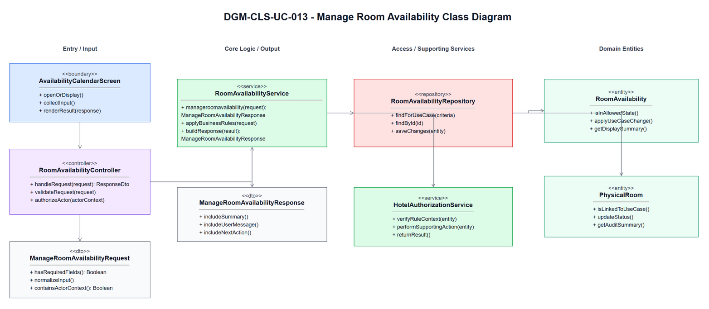
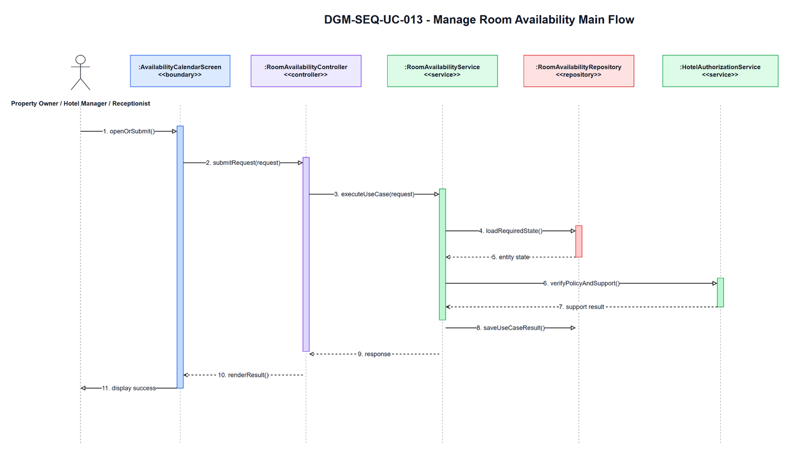
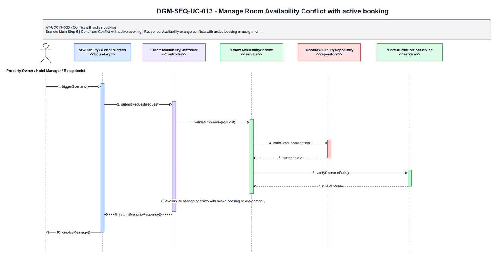
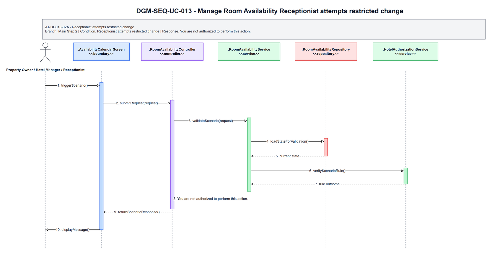
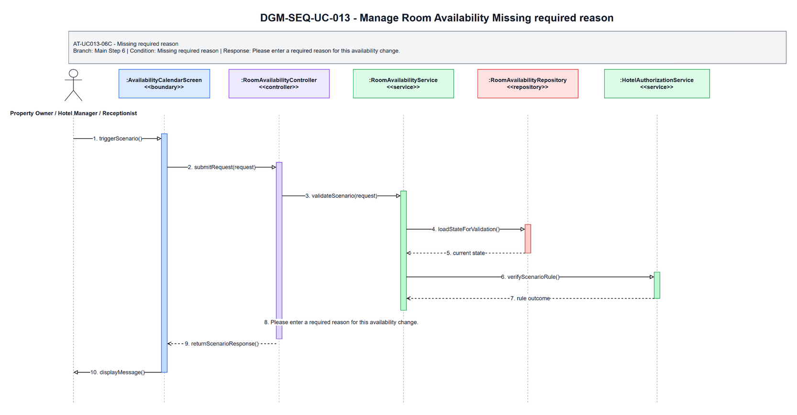

# 3.13 UC-013 - Manage Room Availability

## 3.13.1 Design Purpose

This section describes the detailed design for **UC-013 Manage Room Availability**. The use case covers open, close, block, or unblock room availability by date range, according to role permissions. The design is based on the SRS/SDD only; class names and methods are conceptual design assumptions because no implementation codebase was inspected.

**Related SRS items:** FEAT-ROOM-INV, UC-013, SCR-019, SCR-035, ENT-012, ENT-027, BR-BOOK-001, BR-ROOM-002, BR-AVAIL-001, BR-AVAIL-002, BR-STAFF-003, MSG-BOOK-001, MSG-AVAIL-001, MSG-AVAIL-002, MSG-AUTH-007, TR-013, AT-UC013-06A, AT-UC013-06B, AT-UC013-02A, AT-UC013-06C.

**Precondition:** Actor authenticated and permitted for hotel.

**Trigger:** Actor opens Availability Calendar.

**Post-condition:** POS-01: Availability or block record is updated and marketplace availability is refreshed accordingly.

The flow must:

- Main step 1: Actor opens Availability Calendar.
- Main step 2: System validates actor hotel scope and allowed availability actions before displaying availability data.
- Main step 3: System displays room type availability, physical room status, existing bookings, and blocked dates within permitted scope.
- Main step 4: Actor selects room/date range.
- Main step 5: Actor chooses open/close/block/unblock and enters reason if required.
- Main step 6: System validates date range, required reason, permission, and conflicts.
- Main step 7: System records change.
- Main step 8: System updates marketplace availability display.
- Enforce related business rules: BR-BOOK-001, BR-ROOM-002, BR-AVAIL-001, BR-AVAIL-002, BR-STAFF-003.
- Return a separate scenario response for each alternative/error flow: AT-UC013-06A, AT-UC013-06B, AT-UC013-02A, AT-UC013-06C.

## 3.13.2 Class Diagram

This part presents the class diagram for UC-013 Manage Room Availability.

**Figure 3.13-1: Class Diagram of UC-013 Manage Room Availability**

## 3.13.3 Class Specifications

This part explains the key methods shown in the class diagram. The classes are conceptual design assumptions unless source code is inspected.

### AvailabilityCalendarScreen Class

**Description:** Boundary object for the user-visible entry point of UC-013 Manage Room Availability.

| No | Method | Description |
|---:|---|---|
| 1 | `openOrDisplay()` | Displays the use-case screen or user-visible entry state described by the SRS. |
| 2 | `collectInput()` | Collects actor input before request submission. |
| 3 | `renderResult(response)` | Displays the result, validation message, or next action to the actor. |

### RoomAvailabilityController Class

**Description:** API/application entry controller for UC-013 Manage Room Availability.

| No | Method | Description |
|---:|---|---|
| 1 | `handleRequest(request)` | Receives the request from the boundary and delegates the business operation to the service. |
| 2 | `validateRequest(request)` | Checks required request shape before business rule execution. |
| 3 | `authorizeActor(actorContext)` | Verifies that the current actor may execute this use case within role or hotel scope. |

### ManageRoomAvailabilityRequest Class

**Description:** Request DTO carrying input for UC-013 Manage Room Availability.

| No | Method | Description |
|---:|---|---|
| 1 | `hasRequiredFields()` | Returns whether mandatory fields from the SRS screen/use-case step are present. |
| 2 | `normalizeInput()` | Normalizes filter, status, note, amount, date, or reference input before service validation. |
| 3 | `containsActorContext()` | Confirms the request carries the authenticated actor or guest context needed for authorization. |

### RoomAvailabilityService Class

**Description:** Application service that coordinates the main flow, business rules, persistence, and response creation for Manage Room Availability.

| No | Method | Description |
|---:|---|---|
| 1 | `manageroomavailability(request)` | Executes the UC-013 main flow and returns a response for the boundary. |
| 2 | `applyBusinessRules(request)` | Applies the related SRS business rules and state-transition constraints. |
| 3 | `buildResponse(result)` | Builds success, empty-state, or validation responses without exposing unauthorized data. |

### RoomAvailabilityRepository Class

**Description:** Repository abstraction for loading and saving data required by Manage Room Availability.

| No | Method | Description |
|---:|---|---|
| 1 | `findForUseCase(criteria)` | Loads the entity state required for validation and display. |
| 2 | `findById(id)` | Retrieves a specific record within actor, hotel, or platform scope. |
| 3 | `saveChanges(entity)` | Persists allowed state changes when the use case modifies data. |

### HotelAuthorizationService Class

**Description:** Supporting service or integration used by UC-013 Manage Room Availability.

| No | Method | Description |
|---:|---|---|
| 1 | `verifyRuleContext(entity)` | Checks specialized policy, authorization, calculation, notification, or external status context. |
| 2 | `performSupportingAction(entity)` | Performs notification, calculation, audit, or external reconciliation support when required. |
| 3 | `returnResult()` | Returns the supporting result to the application service for final response composition. |

### ManageRoomAvailabilityResponse Class

**Description:** Response DTO returned by UC-013 Manage Room Availability.

| No | Method | Description |
|---:|---|---|
| 1 | `includeSummary()` | Adds the display or operation summary needed by the screen. |
| 2 | `includeUserMessage()` | Adds the user-facing success, empty-state, or validation message. |
| 3 | `includeNextAction()` | Adds the next available action when the SRS flow continues or returns for correction. |

### RoomAvailability Class

**Description:** Primary domain entity affected or displayed by UC-013 Manage Room Availability.

| No | Method | Description |
|---:|---|---|
| 1 | `isInAllowedState()` | Determines whether the entity state allows the requested use-case operation. |
| 2 | `applyUseCaseChange()` | Applies the state or data change permitted by the validated flow. |
| 3 | `getDisplaySummary()` | Provides safe summary data for the response or audit record. |

### PhysicalRoom Class

**Description:** Supporting domain entity affected or displayed by UC-013 Manage Room Availability.

| No | Method | Description |
|---:|---|---|
| 1 | `isLinkedToUseCase()` | Determines whether the entity is related to the current use-case operation. |
| 2 | `updateStatus()` | Updates status or lifecycle information when the validated flow requires it. |
| 3 | `getAuditSummary()` | Provides auditable summary data for protected state changes. |

## 3.13.4 Sequence Diagram

This part presents the sequence diagrams for UC-013 Manage Room Availability. The main-flow diagram shows only the successful scenario. Each alternative/error scenario has its own diagram.

**Figure 3.13-2: Sequence Diagram of UC-013 Manage Room Availability - Main Flow**

### AT-UC013-06A - Invalid date

- **Branch from Main Step:** 6
- **Condition:** Invalid date
- **Expected Response:** Check-out date must be later than check-in date.

**Figure 3.13-3: Sequence Diagram of UC-013 Manage Room Availability - AT-UC013-06A Invalid date**

### AT-UC013-06B - Conflict with active booking

- **Branch from Main Step:** 6
- **Condition:** Conflict with active booking
- **Expected Response:** Availability change conflicts with active booking or assignment.

**Figure 3.13-4: Sequence Diagram of UC-013 Manage Room Availability - AT-UC013-06B Conflict with active booking**

### AT-UC013-02A - Receptionist attempts restricted change

- **Branch from Main Step:** 2
- **Condition:** Receptionist attempts restricted change
- **Expected Response:** You are not authorized to perform this action.

**Figure 3.13-5: Sequence Diagram of UC-013 Manage Room Availability - AT-UC013-02A Receptionist attempts restricted change**

### AT-UC013-06C - Missing required reason

- **Branch from Main Step:** 6
- **Condition:** Missing required reason
- **Expected Response:** Please enter a required reason for this availability change.

**Figure 3.13-6: Sequence Diagram of UC-013 Manage Room Availability - AT-UC013-06C Missing required reason**

### Validation, Authorization, Transaction, and Error Handling Notes

| Area | Design |
|---|---|
| Validation | Validate required input, current entity status, date/amount/reference values, and SRS business rules before any state change. |
| Authorization | Allow only the SRS actor scope for Property Owner / Hotel Manager / Receptionist; enforce role, ownership, hotel-scope, or platform-scope preconditions before protected data is displayed or changed. |
| Transaction | Use a single application transaction for validated state changes, persistence updates, audit records, and notification records where applicable. Read-only flows do not create domain records. |
| Error Handling | AT-UC013-06A returns "Check-out date must be later than check-in date."; AT-UC013-06B returns "Availability change conflicts with active booking or assignment."; AT-UC013-02A returns "You are not authorized to perform this action."; AT-UC013-06C returns "Please enter a required reason for this availability change.". |
| Privacy | Return only fields allowed for the current role and scope; staff roles must not receive unrelated customer, platform finance, or cross-hotel data. |

## Assumptions and Open Issues

- ASSUMP-UC013-001: Controller, service, repository, DTO, and entity class names are conceptual SDD design names because no source implementation was inspected.
- ASSUMP-UC013-002: Final API routes, database column names, and UI widget names may differ from these SDD class names but must preserve the traced SRS behavior.
- OQ-UC013-001: Confirm final implementation class/package names before treating the conceptual design as code-level documentation.
