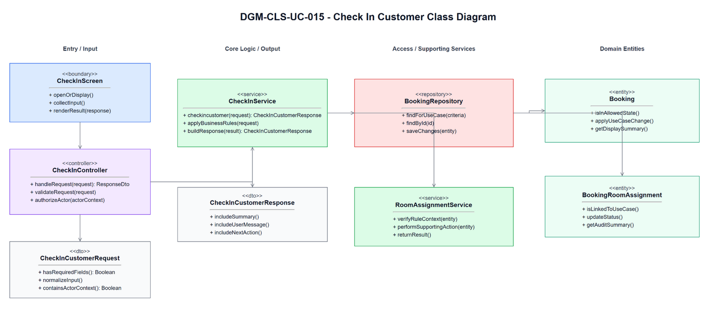
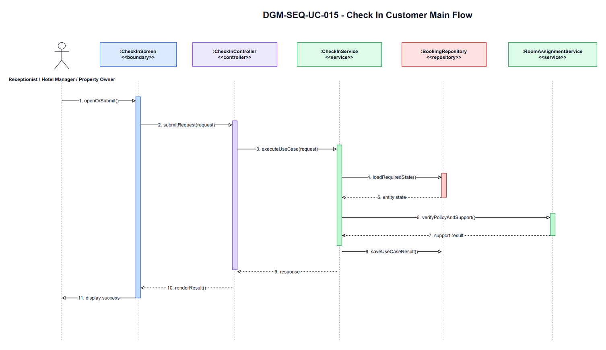
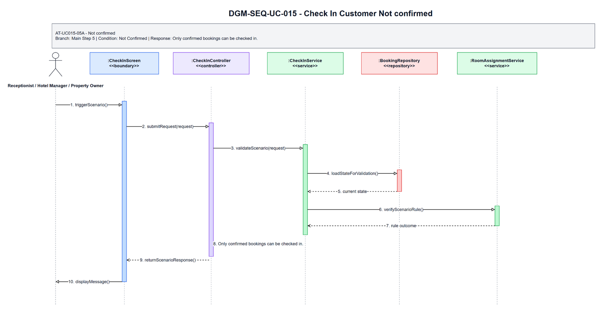
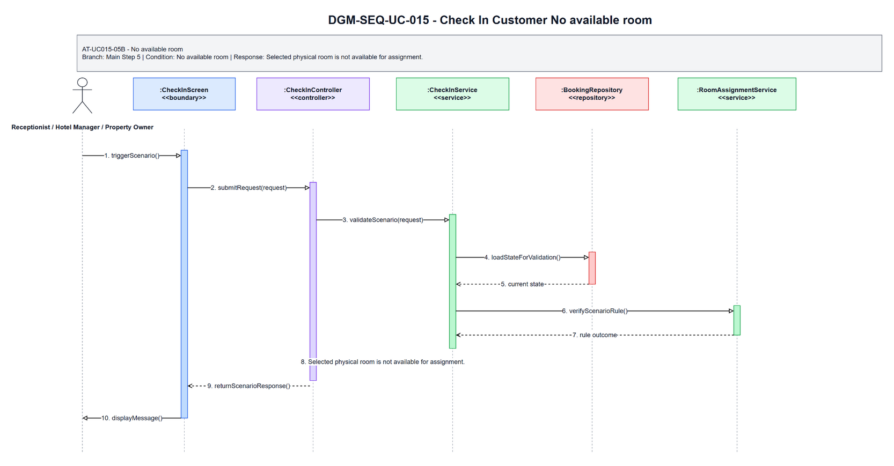
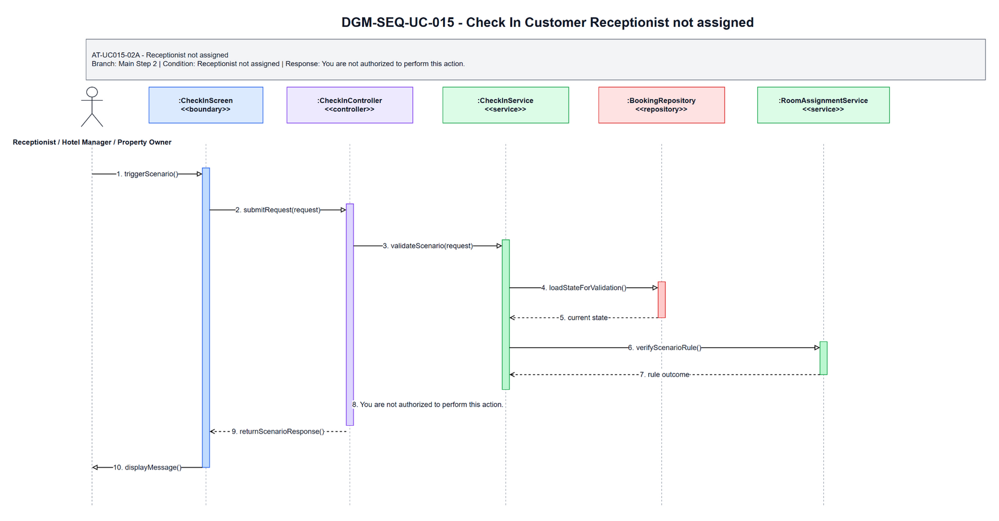
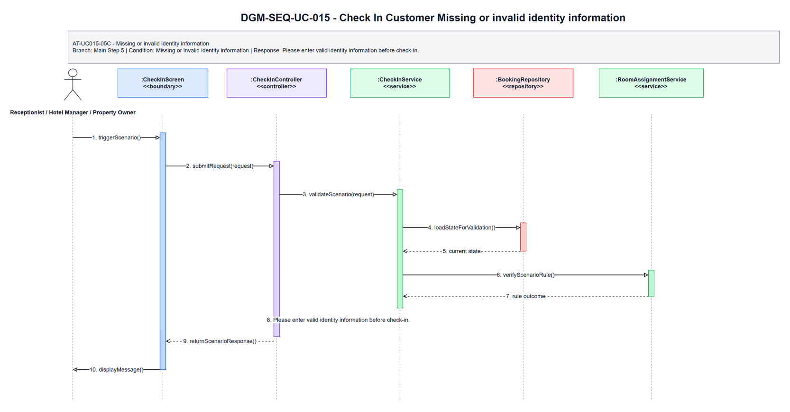

# 3.15 UC-015 - Check In Customer

## 3.15.1 Design Purpose

This section describes the detailed design for **UC-015 Check In Customer**. The use case covers verify confirmed booking, assign physical room if needed, and mark check-in. The design is based on the SRS/SDD only; class names and methods are conceptual design assumptions because no implementation codebase was inspected.

**Related SRS items:** FEAT-FRONTDESK, UC-015, SCR-021, SCR-024, SCR-025, ENT-013, ENT-015, ENT-028, BR-STAY-001, BR-ROOM-001, BR-STAFF-002, BR-STAFF-003, BR-STAY-005, BR-AUDIT-001, MSG-STAY-001, MSG-STAY-003, MSG-STAY-004, MSG-AUTH-007, TR-015, AT-UC015-05A, AT-UC015-05B, AT-UC015-02A, AT-UC015-05C.

**Precondition:** Actor authenticated; booking exists and hotel scope can be validated before check-in details are displayed.

**Trigger:** Actor selects Check In.

**Post-condition:** POS-01: Booking status becomes Checked In; identity document information is recorded if required; physical room becomes Occupied.

The flow must:

- Main step 1: Actor opens booking detail for check-in.
- Main step 2: System validates actor hotel scope before displaying check-in data.
- Main step 3: System displays booking, guest information, stay dates, room type, booked quantity, and assigned or available physical rooms.
- Main step 4: Actor verifies guest arrival, enters required identity information, and selects or validates one physical room per booked quantity.
- Main step 5: System validates booking status, date eligibility, identity fields, room count, and room availability.
- Main step 6: System assigns any missing physical rooms if valid and records assignment history.
- Main step 7: System updates booking to Checked In and assigned rooms to Occupied atomically.
- Main step 8: System records audit and sends or records notification.
- Main step 9: System displays check-in success.
- Enforce related business rules: BR-STAY-001, BR-ROOM-001, BR-STAFF-002, BR-STAFF-003, BR-STAY-005, BR-AUDIT-001.
- Return a separate scenario response for each alternative/error flow: AT-UC015-05A, AT-UC015-05B, AT-UC015-02A, AT-UC015-05C.

## 3.15.2 Class Diagram

This part presents the class diagram for UC-015 Check In Customer.

**Figure 3.15-1: Class Diagram of UC-015 Check In Customer**

## 3.15.3 Class Specifications

This part explains the key methods shown in the class diagram. The classes are conceptual design assumptions unless source code is inspected.

### CheckInScreen Class

**Description:** Boundary object for the user-visible entry point of UC-015 Check In Customer.

| No | Method | Description |
|---:|---|---|
| 1 | `openOrDisplay()` | Displays the use-case screen or user-visible entry state described by the SRS. |
| 2 | `collectInput()` | Collects actor input before request submission. |
| 3 | `renderResult(response)` | Displays the result, validation message, or next action to the actor. |

### CheckInController Class

**Description:** API/application entry controller for UC-015 Check In Customer.

| No | Method | Description |
|---:|---|---|
| 1 | `handleRequest(request)` | Receives the request from the boundary and delegates the business operation to the service. |
| 2 | `validateRequest(request)` | Checks required request shape before business rule execution. |
| 3 | `authorizeActor(actorContext)` | Verifies that the current actor may execute this use case within role or hotel scope. |

### CheckInCustomerRequest Class

**Description:** Request DTO carrying input for UC-015 Check In Customer.

| No | Method | Description |
|---:|---|---|
| 1 | `hasRequiredFields()` | Returns whether mandatory fields from the SRS screen/use-case step are present. |
| 2 | `normalizeInput()` | Normalizes filter, status, note, amount, date, or reference input before service validation. |
| 3 | `containsActorContext()` | Confirms the request carries the authenticated actor or guest context needed for authorization. |

### CheckInService Class

**Description:** Application service that coordinates the main flow, business rules, persistence, and response creation for Check In Customer.

| No | Method | Description |
|---:|---|---|
| 1 | `checkincustomer(request)` | Executes the UC-015 main flow and returns a response for the boundary. |
| 2 | `applyBusinessRules(request)` | Applies the related SRS business rules and state-transition constraints. |
| 3 | `buildResponse(result)` | Builds success, empty-state, or validation responses without exposing unauthorized data. |

### BookingRepository Class

**Description:** Repository abstraction for loading and saving data required by Check In Customer.

| No | Method | Description |
|---:|---|---|
| 1 | `findForUseCase(criteria)` | Loads the entity state required for validation and display. |
| 2 | `findById(id)` | Retrieves a specific record within actor, hotel, or platform scope. |
| 3 | `saveChanges(entity)` | Persists allowed state changes when the use case modifies data. |

### RoomAssignmentService Class

**Description:** Supporting service or integration used by UC-015 Check In Customer.

| No | Method | Description |
|---:|---|---|
| 1 | `verifyRuleContext(entity)` | Checks specialized policy, authorization, calculation, notification, or external status context. |
| 2 | `performSupportingAction(entity)` | Performs notification, calculation, audit, or external reconciliation support when required. |
| 3 | `returnResult()` | Returns the supporting result to the application service for final response composition. |

### CheckInCustomerResponse Class

**Description:** Response DTO returned by UC-015 Check In Customer.

| No | Method | Description |
|---:|---|---|
| 1 | `includeSummary()` | Adds the display or operation summary needed by the screen. |
| 2 | `includeUserMessage()` | Adds the user-facing success, empty-state, or validation message. |
| 3 | `includeNextAction()` | Adds the next available action when the SRS flow continues or returns for correction. |

### Booking Class

**Description:** Primary domain entity affected or displayed by UC-015 Check In Customer.

| No | Method | Description |
|---:|---|---|
| 1 | `isInAllowedState()` | Determines whether the entity state allows the requested use-case operation. |
| 2 | `applyUseCaseChange()` | Applies the state or data change permitted by the validated flow. |
| 3 | `getDisplaySummary()` | Provides safe summary data for the response or audit record. |

### BookingRoomAssignment Class

**Description:** Supporting domain entity affected or displayed by UC-015 Check In Customer.

| No | Method | Description |
|---:|---|---|
| 1 | `isLinkedToUseCase()` | Determines whether the entity is related to the current use-case operation. |
| 2 | `updateStatus()` | Updates status or lifecycle information when the validated flow requires it. |
| 3 | `getAuditSummary()` | Provides auditable summary data for protected state changes. |

## 3.15.4 Sequence Diagram

This part presents the sequence diagrams for UC-015 Check In Customer. The main-flow diagram shows only the successful scenario. Each alternative/error scenario has its own diagram.

**Figure 3.15-2: Sequence Diagram of UC-015 Check In Customer - Main Flow**

### AT-UC015-05A - Not confirmed

- **Branch from Main Step:** 5
- **Condition:** Not Confirmed
- **Expected Response:** Only confirmed bookings can be checked in.

**Figure 3.15-3: Sequence Diagram of UC-015 Check In Customer - AT-UC015-05A Not confirmed**

### AT-UC015-05B - No available room

- **Branch from Main Step:** 5
- **Condition:** No available room
- **Expected Response:** Selected physical room is not available for assignment.

**Figure 3.15-4: Sequence Diagram of UC-015 Check In Customer - AT-UC015-05B No available room**

### AT-UC015-02A - Receptionist not assigned

- **Branch from Main Step:** 2
- **Condition:** Receptionist not assigned
- **Expected Response:** You are not authorized to perform this action.

**Figure 3.15-5: Sequence Diagram of UC-015 Check In Customer - AT-UC015-02A Receptionist not assigned**

### AT-UC015-05C - Missing or invalid identity information

- **Branch from Main Step:** 5
- **Condition:** Missing or invalid identity information
- **Expected Response:** Please enter valid identity information before check-in.

**Figure 3.15-6: Sequence Diagram of UC-015 Check In Customer - AT-UC015-05C Missing or invalid identity information**

### Validation, Authorization, Transaction, and Error Handling Notes

| Area | Design |
|---|---|
| Validation | Validate required input, current entity status, date/amount/reference values, and SRS business rules before any state change. |
| Authorization | Allow only the SRS actor scope for Receptionist / Hotel Manager / Property Owner; enforce role, ownership, hotel-scope, or platform-scope preconditions before protected data is displayed or changed. |
| Transaction | Use a single application transaction for validated state changes, persistence updates, audit records, and notification records where applicable. Read-only flows do not create domain records. |
| Error Handling | AT-UC015-05A returns "Only confirmed bookings can be checked in."; AT-UC015-05B returns "Selected physical room is not available for assignment."; AT-UC015-02A returns "You are not authorized to perform this action."; AT-UC015-05C returns "Please enter valid identity information before check-in.". |
| Privacy | Return only fields allowed for the current role and scope; staff roles must not receive unrelated customer, platform finance, or cross-hotel data. |

## Assumptions and Open Issues

- ASSUMP-UC015-001: Controller, service, repository, DTO, and entity class names are conceptual SDD design names because no source implementation was inspected.
- ASSUMP-UC015-002: Final API routes, database column names, and UI widget names may differ from these SDD class names but must preserve the traced SRS behavior.
- OQ-UC015-001: Confirm final implementation class/package names before treating the conceptual design as code-level documentation.
