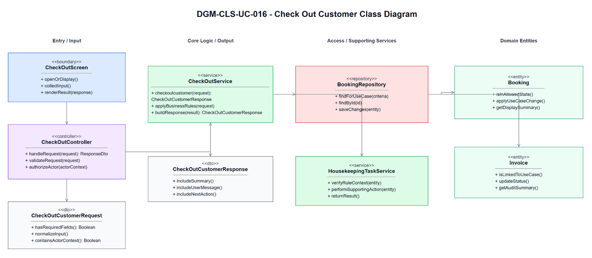
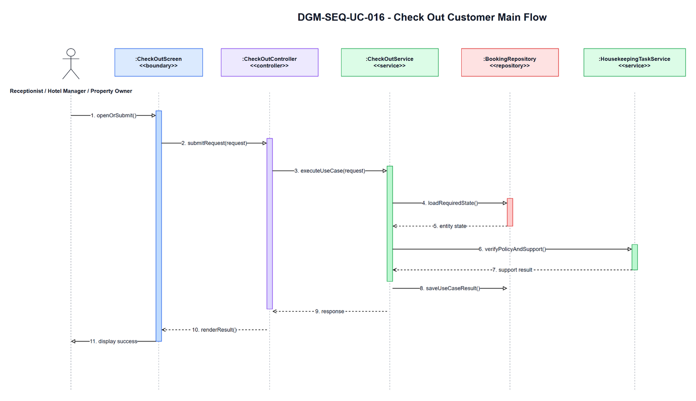
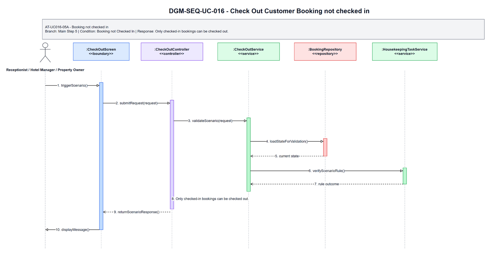
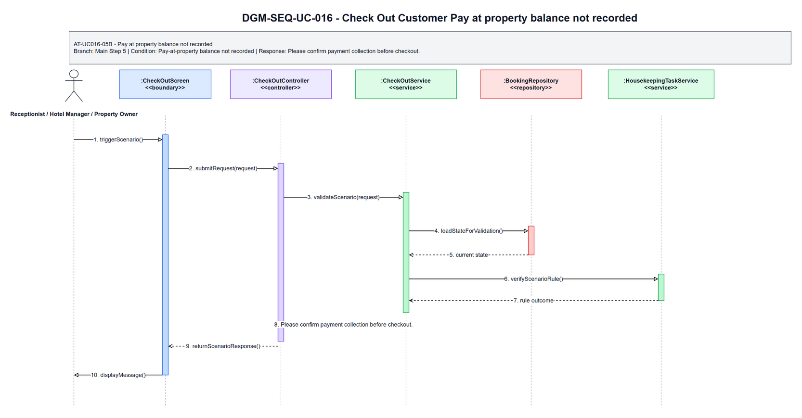

# 3.16 UC-016 - Check Out Customer

## 3.16.1 Design Purpose

This section describes the detailed design for **UC-016 Check Out Customer**. The use case covers finalize stay, confirm pay-at-property collection if needed, generate basic invoice/folio, and release room to housekeeping. The design is based on the SRS/SDD only; class names and methods are conceptual design assumptions because no implementation codebase was inspected.

**Related SRS items:** FEAT-FRONTDESK, UC-016, SCR-021, SCR-026, NSF-008, ENT-019, ENT-025, ENT-027, ENT-028, BR-STAY-002, BR-STAY-003, BR-STAY-006, BR-HK-001, BR-FIN-002, BR-FIN-003, BR-AUDIT-001, BR-FIN-006, MSG-STAY-002, MSG-STAY-005, MSG-STAY-009, MSG-ROOM-008, TR-016, AT-UC016-05A, AT-UC016-05B, AT-UC016-06A.

**Precondition:** Actor authenticated; checked-in booking exists for a hotel the actor owns or is assigned to.

**Trigger:** Actor selects Check Out.

**Post-condition:** POS-01: Booking status becomes Checked Out; customer receipt is available; room becomes Dirty/cleaning-required; housekeeping task is created.

The flow must:

- Main step 1: Actor opens checked-in booking detail.
- Main step 2: System validates actor hotel scope and booking access before displaying checkout data.
- Main step 3: System displays stay summary, payment mode/status, room charge, hotel-visible balance, and receipt preview without platform commission details.
- Main step 4: Actor reviews checkout information and confirms checkout.
- Main step 5: System validates booking status, payment collection requirement, outstanding balance, and room lifecycle readiness.
- Main step 6: System atomically finalizes staff-visible folio/receipt, updates booking to Checked Out, changes assigned rooms to Dirty, and creates housekeeping tasks.
- Main step 7: System records audit and sends or records notification.
- Main step 8: System displays checkout success.
- Enforce related business rules: BR-STAY-002, BR-STAY-003, BR-STAY-006, BR-HK-001, BR-FIN-002, BR-FIN-003, BR-AUDIT-001, BR-FIN-006.
- Return a separate scenario response for each alternative/error flow: AT-UC016-05A, AT-UC016-05B, AT-UC016-06A.

## 3.16.2 Class Diagram

This part presents the class diagram for UC-016 Check Out Customer.

**Figure 3.16-1: Class Diagram of UC-016 Check Out Customer**

## 3.16.3 Class Specifications

This part explains the key methods shown in the class diagram. The classes are conceptual design assumptions unless source code is inspected.

### CheckOutScreen Class

**Description:** Boundary object for the user-visible entry point of UC-016 Check Out Customer.

| No | Method | Description |
|---:|---|---|
| 1 | `openOrDisplay()` | Displays the use-case screen or user-visible entry state described by the SRS. |
| 2 | `collectInput()` | Collects actor input before request submission. |
| 3 | `renderResult(response)` | Displays the result, validation message, or next action to the actor. |

### CheckOutController Class

**Description:** API/application entry controller for UC-016 Check Out Customer.

| No | Method | Description |
|---:|---|---|
| 1 | `handleRequest(request)` | Receives the request from the boundary and delegates the business operation to the service. |
| 2 | `validateRequest(request)` | Checks required request shape before business rule execution. |
| 3 | `authorizeActor(actorContext)` | Verifies that the current actor may execute this use case within role or hotel scope. |

### CheckOutCustomerRequest Class

**Description:** Request DTO carrying input for UC-016 Check Out Customer.

| No | Method | Description |
|---:|---|---|
| 1 | `hasRequiredFields()` | Returns whether mandatory fields from the SRS screen/use-case step are present. |
| 2 | `normalizeInput()` | Normalizes filter, status, note, amount, date, or reference input before service validation. |
| 3 | `containsActorContext()` | Confirms the request carries the authenticated actor or guest context needed for authorization. |

### CheckOutService Class

**Description:** Application service that coordinates the main flow, business rules, persistence, and response creation for Check Out Customer.

| No | Method | Description |
|---:|---|---|
| 1 | `checkoutcustomer(request)` | Executes the UC-016 main flow and returns a response for the boundary. |
| 2 | `applyBusinessRules(request)` | Applies the related SRS business rules and state-transition constraints. |
| 3 | `buildResponse(result)` | Builds success, empty-state, or validation responses without exposing unauthorized data. |

### BookingRepository Class

**Description:** Repository abstraction for loading and saving data required by Check Out Customer.

| No | Method | Description |
|---:|---|---|
| 1 | `findForUseCase(criteria)` | Loads the entity state required for validation and display. |
| 2 | `findById(id)` | Retrieves a specific record within actor, hotel, or platform scope. |
| 3 | `saveChanges(entity)` | Persists allowed state changes when the use case modifies data. |

### HousekeepingTaskService Class

**Description:** Supporting service or integration used by UC-016 Check Out Customer.

| No | Method | Description |
|---:|---|---|
| 1 | `verifyRuleContext(entity)` | Checks specialized policy, authorization, calculation, notification, or external status context. |
| 2 | `performSupportingAction(entity)` | Performs notification, calculation, audit, or external reconciliation support when required. |
| 3 | `returnResult()` | Returns the supporting result to the application service for final response composition. |

### CheckOutCustomerResponse Class

**Description:** Response DTO returned by UC-016 Check Out Customer.

| No | Method | Description |
|---:|---|---|
| 1 | `includeSummary()` | Adds the display or operation summary needed by the screen. |
| 2 | `includeUserMessage()` | Adds the user-facing success, empty-state, or validation message. |
| 3 | `includeNextAction()` | Adds the next available action when the SRS flow continues or returns for correction. |

### Booking Class

**Description:** Primary domain entity affected or displayed by UC-016 Check Out Customer.

| No | Method | Description |
|---:|---|---|
| 1 | `isInAllowedState()` | Determines whether the entity state allows the requested use-case operation. |
| 2 | `applyUseCaseChange()` | Applies the state or data change permitted by the validated flow. |
| 3 | `getDisplaySummary()` | Provides safe summary data for the response or audit record. |

### Invoice Class

**Description:** Supporting domain entity affected or displayed by UC-016 Check Out Customer.

| No | Method | Description |
|---:|---|---|
| 1 | `isLinkedToUseCase()` | Determines whether the entity is related to the current use-case operation. |
| 2 | `updateStatus()` | Updates status or lifecycle information when the validated flow requires it. |
| 3 | `getAuditSummary()` | Provides auditable summary data for protected state changes. |

## 3.16.4 Sequence Diagram

This part presents the sequence diagrams for UC-016 Check Out Customer. The main-flow diagram shows only the successful scenario. Each alternative/error scenario has its own diagram.

**Figure 3.16-2: Sequence Diagram of UC-016 Check Out Customer - Main Flow**

### AT-UC016-05A - Booking not checked in

- **Branch from Main Step:** 5
- **Condition:** Booking not Checked In
- **Expected Response:** Only checked-in bookings can be checked out.

**Figure 3.16-3: Sequence Diagram of UC-016 Check Out Customer - AT-UC016-05A Booking not checked in**

### AT-UC016-05B - Pay at property balance not recorded

- **Branch from Main Step:** 5
- **Condition:** Pay-at-property balance not recorded
- **Expected Response:** Please confirm payment collection before checkout.

**Figure 3.16-4: Sequence Diagram of UC-016 Check Out Customer - AT-UC016-05B Pay at property balance not recorded**

### AT-UC016-06A - Room release failed

- **Branch from Main Step:** 6
- **Condition:** Room release failed
- **Expected Response:** The selected room status transition is not allowed.

**Figure 3.16-5: Sequence Diagram of UC-016 Check Out Customer - AT-UC016-06A Room release failed**

### Validation, Authorization, Transaction, and Error Handling Notes

| Area | Design |
|---|---|
| Validation | Validate required input, current entity status, date/amount/reference values, and SRS business rules before any state change. |
| Authorization | Allow only the SRS actor scope for Receptionist / Hotel Manager / Property Owner; enforce role, ownership, hotel-scope, or platform-scope preconditions before protected data is displayed or changed. |
| Transaction | Use a single application transaction for validated state changes, persistence updates, audit records, and notification records where applicable. Read-only flows do not create domain records. |
| Error Handling | AT-UC016-05A returns "Only checked-in bookings can be checked out."; AT-UC016-05B returns "Please confirm payment collection before checkout."; AT-UC016-06A returns "The selected room status transition is not allowed.". |
| Privacy | Return only fields allowed for the current role and scope; staff roles must not receive unrelated customer, platform finance, or cross-hotel data. |

## Assumptions and Open Issues

- ASSUMP-UC016-001: Controller, service, repository, DTO, and entity class names are conceptual SDD design names because no source implementation was inspected.
- ASSUMP-UC016-002: Final API routes, database column names, and UI widget names may differ from these SDD class names but must preserve the traced SRS behavior.
- OQ-UC016-001: Confirm final implementation class/package names before treating the conceptual design as code-level documentation.
