# Software Design Document

## Document Control

| Item | Value |
|---|---|
| Document | Software Design Document |
| Project | Hotel Marketplace Management System |
| Version | 1.0 Draft |
| Date | 2026-07-03 |
| Source SRS | `hotel_management_system_srs_v1_2_staff_screen_mockup_ready.md` |
| Design Basis | SRS-only design draft; no codebase was inspected. |
| Detailed Design Scope | Section 3 is initialized with placeholders only. Full class specifications and sequence diagrams are deferred. |

## Source Map

| Source ID | Source Type | Path / Artifact | What it reveals | Confidence |
|---|---|---|---|---|
| SRC-001 | SRS | `hotel_management_system_srs_v1_2_staff_screen_mockup_ready.md` | Product scope, actors, use cases, screens, business rules, logical entities, NFRs, messages, and traceability. | High |
| SRC-002 | BA/SDD Rules | `srs_sdd_ba_rules.md` | Required SDD structure, diagram placeholder rules, traceability rules, and hallucination controls. | High |
| SRC-003 | User clarification | Current conversation | Commission default/range, availability design, identity document scope, and Hotel Manager staff authority. | High |

## Clarification Decisions Applied

| Decision ID | Decision | SDD Impact |
|---|---|---|
| DEC-001 | Commission rate defaults to 10%, allowed range 0%–30%. | Commission configuration validation and finance design. |
| DEC-002 | Availability uses hybrid design: public booking checks room type quantity/date; front desk assigns physical rooms later. | Booking, availability, physical room assignment, and database design. |
| DEC-003 | Check-in stores basic identity document fields only. | Guest stay/check-in privacy and validation design. |
| DEC-004 | Hotel Manager may fully manage staff within assigned hotel, but cannot grant Property Owner or Platform Administrator authority. | Staff authorization design. |

---

## I. Record of Changes

| Date | A/M/D | In Charge | Change Description |
|---|---|---|---|
| 2026-07-03 | A | Claude BA/SA Agent | Initial SDD draft created from SRS v1.2 and user clarifications. Detailed Design initialized as placeholders only. |

---

## II. Software Design Document

# 1. System Design

## 1.1 System Architecture

The Hotel Marketplace Management System is designed as a multi-tenant client-server application. The target operating environment from the SRS is Flutter for the mobile client, ASP.NET Core Web API for the backend, Clean Architecture for the backend design style, Microsoft SQL Server for persistence, payOS for online payment, and a mock or future notification provider for notification delivery.

Because no repository/codebase was provided for this draft, package names, class names, endpoint names, and table names are design proposals derived from the SRS. They must be revalidated against the actual implementation before final submission.

### 1.1.1 Architecture Style

| Design Area | Decision | Rationale | Related SRS Items |
|---|---|---|---|
| Overall style | Client-server with backend API and mobile client | Fits Flutter client + ASP.NET Core Web API operating environment. | NFR-COMP-001, NFR-SEC-001 |
| Backend layering | Clean Architecture | Separates API, application logic, domain rules, and infrastructure concerns. | SRS 1.4, NFR-MAINT-001 |
| Tenancy model | Hotel-scoped multi-tenant access | Property Owner and staff access must be restricted by owned/assigned hotel. | BR-OWNER-001, BR-STAFF-002, NFR-SEC-002 |
| Booking availability | Hybrid availability model | Marketplace booking reserves room type quantity/date; physical room assignment occurs before or during check-in. | UC-005, UC-013, UC-015, UC-029, DEC-002 |
| Payment | Dual payment mode | Platform Collect uses payOS; Pay at Property uses hotel-side collection records. | UC-006, UC-030, BR-PAY-004 |
| Notification | Event-based notification record with optional external delivery | MVP can record notifications even if external delivery is mocked. | NSF-003, BR-NOTI-001 |
| Finance operation | Manual refund, settlement, reconciliation marking | SRS confirms MVP manual finance operations by Platform Administrator. | UC-020, UC-021, UC-022 |

### 1.1.2 Main Components

| Component | Type | Responsibility | Communicates With | Related Requirements |
|---|---|---|---|---|
| Flutter Mobile Client | Client | Provides customer, owner, staff, and platform-admin user interface. | Backend API, payOS redirect/result page where applicable | UC-001 to UC-037 |
| Backend API | API Layer | Exposes authenticated and public endpoints, validates requests, maps DTOs, and returns responses. | Mobile Client, Application Services | NFR-SEC-001, NFR-USE-002 |
| Application Services | Application Layer | Coordinates use cases, authorization, transactions, notifications, and persistence operations. | Domain Model, Repositories, External Clients | UC-003 to UC-037 |
| Domain Model | Domain Layer | Represents core business concepts and rules for users, hotels, booking, payment, room operation, finance, housekeeping, and maintenance. | Application Services | BR-AUTH, BR-BOOK, BR-ROOM, BR-FIN, BR-HK, BR-MAINT |
| Infrastructure Persistence | Infrastructure Layer | Implements repositories and database access against SQL Server. | SQL Server Database | NFR-REL-001, NFR-AUD-001 |
| SQL Server Database | Database | Stores accounts, hotels, inventory, booking, finance, operations, notifications, and audit data. | Backend Infrastructure | ENT-001 to ENT-028 |
| payOS Client | External Integration | Creates payment instructions and receives/verifies payment result notifications. | payOS Payment Gateway, Payment Services | UC-006, NSF-001 |
| Notification Adapter | External/Mock Integration | Sends or records notification events. | Notification Service / Mock | NSF-003 |
| Scheduler Worker | Background Component | Runs time-based jobs such as unpaid booking expiration. | Application Services, Database | UC-024, NSF-002 |

### 1.1.3 Architecture Diagram Placeholder

Diagram source: [DGM-SDD-ARCH-001 - System Architecture](sdd_assets/diagram/dgm-sdd-arch-001-system-architecture.drawio)

## 1.2 Package Diagram

The following package design follows Clean Architecture. Names are proposed conceptual package names and must be aligned with the actual codebase when implementation exists.

| No | Package / Namespace | Description | Key Classes / Files | Depends On |
|---:|---|---|---|---|
| 01 | `Presentation.Api` | HTTP controllers, request/response contracts, authentication filters, and API configuration. | AuthController, BookingController, HotelController, StaffController, FinanceController | `Application` |
| 02 | `Application` | Use case services, command/query handlers, validators, DTOs, transaction orchestration, and authorization checks. | AuthService, BookingService, AvailabilityService, FrontDeskService, FinanceService | `Domain`, repository abstractions |
| 03 | `Domain` | Domain entities, value objects, enumerations, and business rule methods. | Booking, RoomType, PhysicalRoom, CommissionRecord, HousekeepingTask | None |
| 04 | `Infrastructure.Persistence` | SQL Server database context, repository implementations, migrations, and persistence configuration. | AppDbContext, BookingRepository, RoomRepository, PaymentRepository | `Application`, `Domain` |
| 05 | `Infrastructure.Payment` | payOS client, payment signature/notification verification, and gateway error mapping. | PayOsClient, PaymentWebhookVerifier | `Application` payment abstractions |
| 06 | `Infrastructure.Notification` | Notification adapter for mock or future real notification service. | NotificationDispatcher, MockNotificationProvider | `Application` notification abstractions |
| 07 | `Infrastructure.Scheduling` | Background jobs for unpaid booking expiration and reminder/notification triggers. | ExpireUnpaidBookingJob | `Application` services |
| 08 | `SharedKernel` | Common result types, exceptions, constants, date/time helpers, audit context, and cross-cutting contracts. | Result, DomainException, CurrentUserContext | Shared by backend packages |

### 1.2.1 Package Diagram Placeholder

Diagram source: [DGM-SDD-PKG-001 - Package Diagram](sdd_assets/diagram/dgm-sdd-pkg-001-package-diagram.drawio)

## 1.3 Cross-Cutting Design

### 1.3.1 Authentication and Authorization

| Concern | Design |
|---|---|
| Authentication | Protected functions require authenticated user session/token. Exact token/session mechanism is implementation-specific and must be confirmed from code. |
| Role authorization | User roles include Customer, Property Owner, Hotel Manager, Receptionist, Housekeeping Staff, Maintenance Staff, and Platform Administrator. |
| Hotel scope | Hotel-scoped staff access is checked through `HotelStaffAssignment` or equivalent assignment data. |
| Manager staff authority | Hotel Manager can manage staff within assigned hotel but cannot grant Property Owner or Platform Administrator authority. |
| Platform separation | Platform Administrator can perform platform approval and finance administration but does not automatically receive hotel operational authority unless explicitly modeled. |
| Privacy | Housekeeping and Maintenance roles receive minimum room/task data and no payment/refund/commission/settlement detail. |

### 1.3.2 Validation Strategy

| Validation Area | Enforced In | Examples |
|---|---|---|
| Request shape and mandatory fields | API/Application validators | Required account, hotel, room, booking, payment, and staff fields. |
| Domain/business rules | Domain/Application services | Date range, availability, room assignment overlap, status transitions, commission range. |
| Authorization/scope | Application authorization checks | Customer owns booking, staff assigned to hotel, manager permission. |
| Financial integrity | Application services and database constraints | Duplicate payment callback protection, commission snapshot, settlement eligibility. |

### 1.3.3 Transaction Strategy

| Use Case Area | Transaction Boundary | Consistency Requirement |
|---|---|---|
| Create Booking | Booking header, booking room, availability reservation, initial payment/commission state where applicable | No confirmed/pending booking without consistent availability reservation. |
| Payment Notification | Payment transaction, booking status, commission record, audit/notification | Duplicate notifications must not double-confirm or double-count. |
| Check-in | Booking status, room assignment, guest stay record, room status history, audit | Physical room cannot overlap active stay. |
| Check-out | Booking/stay status, invoice/folio, payment collection if required, room status, housekeeping task | Checkout creates cleaning path and preserves finance traceability. |
| Staff Assignment | Staff account/invitation, role assignment, audit | Staff cannot receive authority outside allowed role and hotel scope. |
| Refund/Settlement | Refund/settlement/commission status, admin note, audit | Manual finance actions are traceable and cannot bypass eligibility. |

# 2. Database Design

## 2.1 Database Overview

The SDD database design is derived from the SRS logical entities. It proposes SQL Server relational tables for implementation. Table and column names must be adjusted to match the actual codebase and migration style when available.

### 2.1.1 Data Design Principles

| Principle | Application |
|---|---|
| Multi-tenant hotel scope | Hotel-owned data includes `HotelId` and is filtered by ownership or staff assignment. |
| Historical traceability | Booking, payment, commission, settlement, room status, housekeeping, maintenance, and audit records preserve status history. |
| Finance separation | payOS online payments use payment transactions; Pay at Property uses hotel-side collection records. |
| Hybrid availability | Public booking uses room type quantity/date availability; physical rooms are assigned later and validated for overlap/status. |
| Sensitive data minimization | Identity document data is basic and limited to authorized front desk/manager/owner access. |
| Auditability | Protected operational and financial actions create audit records. |

## 2.2 Database Table Relationship

The database relationship design mirrors the SRS logical ERD:

- `UserAccounts` has many `HotelStaffAssignments`, `StaffInvitations`, `Bookings`, and audit actions.
- `HotelProperties` belongs to a Property Owner and has many room types, physical rooms, staff assignments, bookings, housekeeping tasks, maintenance requests, commissions, and settlements.
- `RoomTypes` has many `PhysicalRooms`, `RoomAvailabilities`, and `BookingRooms`.
- `Bookings` has one or more supporting records: booking room line, optional physical room assignments, payment transactions, collection records, refund record, invoice, commission record, notification records, and audit records.
- `PhysicalRooms` has status history, housekeeping tasks, maintenance requests, and booking assignments.
- Finance records connect booking, payment, commission, settlement header, and settlement items.

### 2.2.1 Database Relationship Diagram Placeholder

Diagram source: [DGM-SDD-DB-001 - Database Relationship Diagram](sdd_assets/diagram/dgm-sdd-db-001-database-relationship.drawio)

## 2.3 Table Descriptions

| No | Table | Description | Primary Key | Foreign Keys | Important Constraints | Related Entities |
|---:|---|---|---|---|---|---|
| 01 | `UserAccounts` | Stores registered users for all human roles. | `UserAccountId` | None | Unique email/phone where required; password not plain text; account status required. | ENT-001 |
| 02 | `UserRoles` | Stores role definitions. | `RoleId` | None | Role code unique; role scope identifies platform/hotel/customer scope. | ENT-002 |
| 03 | `UserAccountRoles` | Optional many-to-many mapping for global roles if implementation uses separate role mapping. | `UserAccountRoleId` | `UserAccountId`, `RoleId` | Prevent duplicate active role mapping. | ENT-001, ENT-002 |
| 04 | `HotelStaffAssignments` | Maps staff user to hotel and hotel-scoped role. | `StaffAssignmentId` | `UserAccountId`, `HotelId`, `RoleId`, `AssignedByUserAccountId` | Active assignment must reference allowed hotel-scoped role. | ENT-003 |
| 05 | `StaffInvitations` | Stores staff invitation/onboarding records. | `StaffInvitationId` | `HotelId`, `RoleId`, `InvitedByUserAccountId` | Invitation expiration and status required. | ENT-004 |
| 06 | `HotelProperties` | Stores hotel profile and approval/publication status. | `HotelId` | `OwnerUserAccountId` | Approval status and publication status required. | ENT-005 |
| 07 | `HotelImages` | Stores hotel gallery image references. | `HotelImageId` | `HotelId` | Display order; active/inactive image status. | ENT-006 |
| 08 | `Amenities` | Stores amenity master data. | `AmenityId` | None | Amenity name/type required. | ENT-007 |
| 09 | `HotelAmenities` | Maps hotels to amenities. | `HotelAmenityId` | `HotelId`, `AmenityId` | Prevent duplicate hotel-amenity pair. | ENT-008 |
| 10 | `CancellationPolicies` | Stores hotel-level cancellation policy. | `CancellationPolicyId` | `HotelId` | Free-cancel hours and refund percentage must be valid. | ENT-009 |
| 11 | `RoomTypes` | Stores private room types and base price. | `RoomTypeId` | `HotelId` | Capacity > 0; base price >= 0. | ENT-010 |
| 12 | `PhysicalRooms` | Stores individual private rooms. | `PhysicalRoomId` | `HotelId`, `RoomTypeId` | Room number unique within hotel; valid room status. | ENT-011 |
| 13 | `RoomAvailabilities` | Stores room type or physical-room date block/open records. | `AvailabilityId` | `HotelId`, `RoomTypeId`, nullable `PhysicalRoomId` | Date range valid; status required; supports hybrid availability. | ENT-012 |
| 14 | `Bookings` | Stores booking header and lifecycle status. | `BookingId` | `CustomerUserAccountId`, `HotelId` | Check-out > check-in; payment mode required; booking source required. | ENT-013 |
| 15 | `BookingRooms` | Stores room type line and quantity for booking. | `BookingRoomId` | `BookingId`, `RoomTypeId` | MVP contains exactly one room type line per booking; quantity > 0. | ENT-014 |
| 16 | `BookingRoomAssignments` | Stores physical room assignments. | `AssignmentId` | `BookingId`, `BookingRoomId`, `PhysicalRoomId` | No overlapping active assignment for same physical room. | ENT-015 |
| 17 | `PaymentTransactions` | Stores payOS online payment transaction data. | `PaymentTransactionId` | `BookingId` | Gateway reference unique when present; idempotent success handling. | ENT-016 |
| 18 | `PaymentCollectionRecords` | Stores Pay at Property collection records. | `PaymentCollectionId` | `BookingId`, `CollectedByUserAccountId` | Amount valid; collection status lifecycle required. | ENT-017 |
| 19 | `RefundRecords` | Stores refund eligibility, decision, and manual processing status. | `RefundRecordId` | `BookingId` | Approved amount cannot exceed paid amount. | ENT-018 |
| 20 | `Invoices` | Stores basic invoice/folio for checkout. | `InvoiceId` | `BookingId` | Amount fields non-negative; status required. | ENT-019 |
| 21 | `CommissionRecords` | Stores commission snapshot and amount for booking. | `CommissionRecordId` | `BookingId` | Commission rate snapshot must be 0%–30%; default 10% when not overridden. | ENT-020 |
| 22 | `SettlementRecords` | Stores manual settlement/collection header. | `SettlementRecordId` | `HotelId` | Settlement type and status required; admin note for exception. | ENT-021 |
| 23 | `SettlementItems` | Stores settlement line items linked to booking/commission/payment. | `SettlementItemId` | `SettlementRecordId`, nullable `BookingId`, nullable `CommissionRecordId`, nullable `PaymentTransactionId` | Item amount non-negative; item status required. | ENT-022 |
| 24 | `NotificationRecords` | Stores notification events and delivery/recording status. | `NotificationId` | nullable `RecipientUserAccountId` | Related entity type/id required for event traceability where applicable. | ENT-023 |
| 25 | `AuditRecords` | Stores protected action audit events. | `AuditRecordId` | `ActorUserAccountId` | Action type, target entity, timestamp, and summary required. | ENT-024 |
| 26 | `HousekeepingTasks` | Stores cleaning and inspection tasks. | `HousekeepingTaskId` | `HotelId`, `PhysicalRoomId`, nullable `BookingId`, nullable `AssignedToUserAccountId` | Task status lifecycle required. | ENT-025 |
| 27 | `MaintenanceRequests` | Stores room maintenance issues and resolution notes. | `MaintenanceRequestId` | `HotelId`, `PhysicalRoomId`, `ReportedByUserAccountId`, nullable `AssignedToUserAccountId` | Status, severity, and description required. | ENT-026 |
| 28 | `RoomStatusHistories` | Stores physical room status changes. | `RoomStatusHistoryId` | `PhysicalRoomId`, nullable `ChangedByUserAccountId` | Old/new status and timestamp required. | ENT-027 |
| 29 | `GuestStayRecords` | Stores operational check-in/check-out record. | `GuestStayRecordId` | `BookingId`, `CheckedInByUserAccountId`, nullable `CheckedOutByUserAccountId` | Includes basic identity document fields with restricted access. | ENT-028 |

## 2.4 Important Physical Constraints and Indexes

| Area | Proposed Constraint / Index | Reason |
|---|---|---|
| User account | Unique index on email and/or phone according to account policy. | Prevent duplicate login identity. |
| Staff assignment | Composite unique index on active `UserAccountId`, `HotelId`, `RoleId`. | Prevent duplicate staff role assignment. |
| Physical room | Unique index on `HotelId`, `RoomNumber`. | Enforce BR-ROOM-005. |
| Booking search | Index on `HotelId`, `CheckInDate`, `CheckOutDate`, `BookingStatus`. | Support availability and hotel booking list. |
| Availability | Index on `HotelId`, `RoomTypeId`, `StartDate`, `EndDate`, `AvailabilityStatus`. | Support room type/date availability checks. |
| Room assignment | Index on `PhysicalRoomId`, assignment date/status fields. | Detect overlapping active physical room assignment. |
| Payment | Unique index on payOS gateway reference. | Support idempotent payment result handling. |
| Commission | Unique or controlled one-active commission record per booking. | Prevent duplicate commission. |
| Audit | Index on `TargetEntityType`, `TargetEntityId`, `ActionTimestamp`. | Support audit trace review. |

# 3. Detailed Design

The following detailed design sections are integrated from the prepared SDD assets under `sdd_assets/`. The class names, method names, and interaction flows are conceptual design assumptions derived from the SRS because no implementation codebase was inspected. They must be revalidated against the final source code before implementation or final submission.

## 3.1 UC-001 - Search Hotels

#### 3.1.1 Design Purpose

This section describes the detailed design for **UC-001 Search Hotels**. The use case allows Guest and Customer actors to search approved hotels by destination, stay dates, guest count, and filters. The design is based on the SRS only; class names and methods are conceptual design assumptions and must be revalidated against the final codebase.

**Related SRS items:** FEAT-MKT, UC-001, SCR-004, SCR-005, ENT-005, ENT-007, ENT-008, ENT-010, ENT-011, ENT-012, BR-MKT-001, BR-BOOK-001, BR-ROOM-002, MSG-MKT-001, MSG-BOOK-001, TR-001, AT-UC001-04A, AT-UC001-05A.

The search flow must:

- Accept public search criteria from Guest or Customer.
- Validate destination, check-in date, check-out date, and guest count before querying.
- Return only approved and published hotels.
- Include only room types that can satisfy the selected date range and guest count.
- Use the hybrid availability decision: marketplace search checks room type quantity/date; physical room assignment is deferred to front desk check-in flow.

#### 3.1.2 Class Diagram

This part presents the class diagram for the Search Hotels use case.

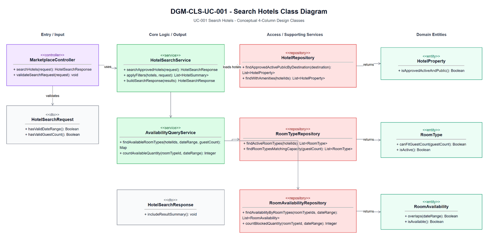

**Figure 3.1-1: Class Diagram of UC-001 Search Hotels**

#### 3.1.3 Class Specifications

This part explains the key methods shown in the class diagram. The classes are conceptual design assumptions because no implementation codebase was inspected.

### MarketplaceController Class

**Description:** API entry point for public marketplace search requests.

| No | Method | Description |
|---:|---|---|
| 1 | `searchHotels(request)` | Receives search criteria from the client, coordinates request validation, calls search service, and returns `HotelSearchResponse`. |
| 2 | `validateSearchRequest(request)` | Checks required search fields, date range, guest count, and filter input before service execution. |

### HotelSearchRequest Class

**Description:** Request DTO carrying user search criteria from the search screen to the backend.

| No | Method | Description |
|---:|---|---|
| 1 | `hasValidDateRange()` | Verifies that check-in date and check-out date are present and that check-out date is after check-in date. |
| 2 | `hasValidGuestCount()` | Verifies that guest count is positive and can be used for capacity matching. |

### HotelSearchService Class

**Description:** Application service that coordinates approved hotel lookup, availability checking, filter application, and response creation.

| No | Method | Description |
|---:|---|---|
| 1 | `searchApprovedHotels(request)` | Executes the main UC-001 search flow by finding approved hotels, checking room type availability, applying filters, and returning search results. |
| 2 | `applyFilters(hotels, request)` | Applies optional user filters to candidate hotels and available room types. |
| 3 | `buildSearchResponse(results)` | Converts matched hotels and room availability summaries into `HotelSearchResponse`. |

### AvailabilityQueryService Class

**Description:** Service that determines whether room types have enough availability for the requested date range and guest count.

| No | Method | Description |
|---:|---|---|
| 1 | `findAvailableRoomTypes(hotelIds, dateRange, guestCount)` | Finds room types for the candidate hotels that satisfy guest capacity and availability over the requested stay dates. |
| 2 | `countAvailableQuantity(roomTypeId, dateRange)` | Calculates available quantity for a room type and date range under the hybrid availability model. |

### HotelSearchResponse Class

**Description:** Response DTO returned to the client with hotel search results and metadata.

| No | Method | Description |
|---:|---|---|
| 1 | `includeResultSummary()` | Adds total count and applied criteria summary for the search result display. |

### HotelRepository Class

**Description:** Repository for retrieving marketplace-visible hotel property data.

| No | Method | Description |
|---:|---|---|
| 1 | `findApprovedPublishedByDestination(destination)` | Finds hotels that match the requested destination and are approved and published for public display. |
| 2 | `findWithAmenitiesAndPolicies(hotelIds)` | Loads hotel details needed for result cards, including amenities and cancellation policy summary when required by UI. |

### RoomTypeRepository Class

**Description:** Repository for retrieving active room types that may satisfy the requested guest count.

| No | Method | Description |
|---:|---|---|
| 1 | `findActiveRoomTypes(hotelIds)` | Retrieves active room types for candidate hotels. |
| 2 | `findRoomTypesMatchingCapacity(guestCount)` | Finds room types whose adult/child capacity can satisfy the requested guest count. |

### RoomAvailabilityRepository Class

**Description:** Repository for retrieving availability records for candidate room types and date ranges.

| No | Method | Description |
|---:|---|---|
| 1 | `findAvailabilityByRoomTypes(roomTypeIds, dateRange)` | Loads availability or block records that overlap the requested date range. |
| 2 | `countBlockedQuantity(roomTypeId, dateRange)` | Counts unavailable room quantity caused by block records or availability restrictions. |

### HotelProperty Class

**Description:** Domain entity representing a hotel listed on the marketplace.

| No | Method | Description |
|---:|---|---|
| 1 | `isApprovedAndPublished()` | Returns whether the hotel can be shown publicly based on approval and publication status. |

### RoomType Class

**Description:** Domain entity representing a private room type offered by a hotel.

| No | Method | Description |
|---:|---|---|
| 1 | `canFitGuestCount(guestCount)` | Checks whether the room type capacity can satisfy the requested guest count. |
| 2 | `isActive()` | Returns whether the room type can be sold or displayed in marketplace search. |

### RoomAvailability Class

**Description:** Domain entity representing availability or block status for a room type or physical room over a date range.

| No | Method | Description |
|---:|---|---|
| 1 | `overlaps(dateRange)` | Checks whether the availability record overlaps the requested stay dates. |
| 2 | `isAvailable()` | Returns whether the availability record allows the room type to be considered available. |

#### 3.1.4 Sequence Diagram

This part presents the sequence diagrams for UC-001 Search Hotels. The main-flow diagram shows only the successful scenario. Each alternative/error scenario has its own diagram.

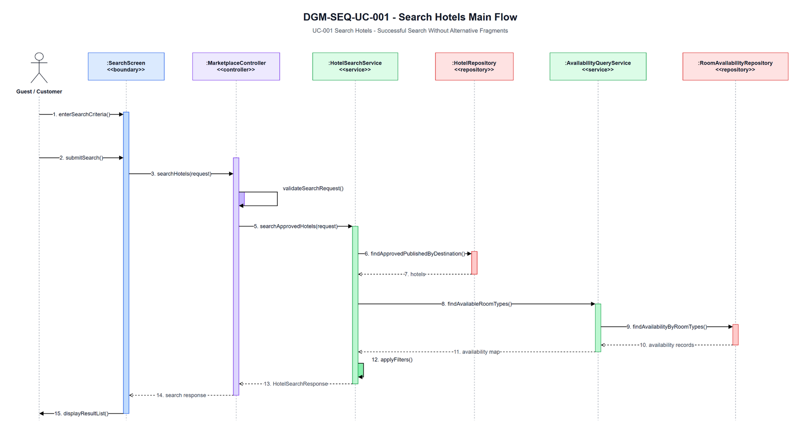

**Figure 3.1-2: Sequence Diagram of UC-001 Search Hotels - Main Flow**

### AT-UC001-04A - Invalid Date Range

- **Branch from Main Step:** 4
- **Condition:** Invalid date range.
- **Expected Response:** Check-out date must be later than check-in date.

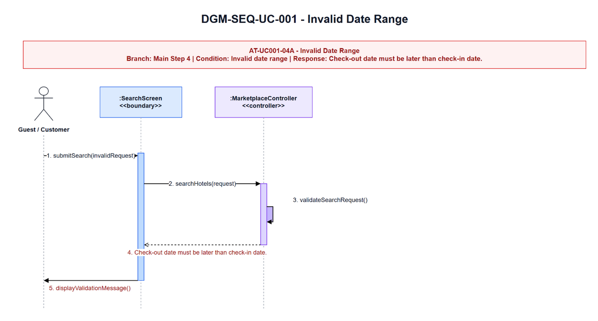

**Figure 3.1-3: Sequence Diagram of UC-001 Search Hotels - AT-UC001-04A Invalid Date Range**

### AT-UC001-05A - No Matching Hotels

- **Branch from Main Step:** 5
- **Condition:** No matching hotels.
- **Expected Response:** No hotels match your search criteria. Please adjust your search.

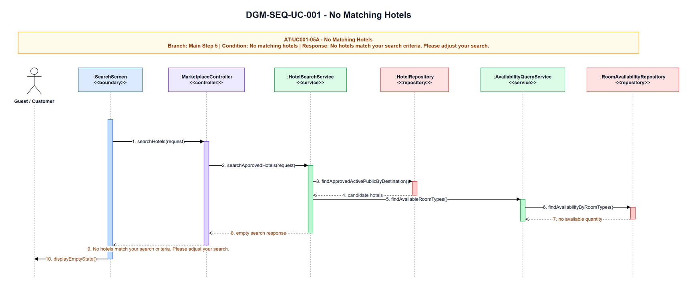

**Figure 3.1-4: Sequence Diagram of UC-001 Search Hotels - AT-UC001-05A No Matching Hotels**

### Validation, Authorization, Transaction, and Error Handling Notes

| Area | Design |
|---|---|
| Validation | Validate date range, guest count, destination/filter values, and pagination/sorting parameters if present. Check-in date must be before check-out date. Guest count must be positive. |
| Authorization | UC-001 is public. Guest and Customer can search. The API must not expose management-only fields or unpublished hotel data. |
| Transaction | Search is read-only and does not create booking, payment, or room assignment records. No write transaction is required. |
| Availability Consistency | Use room type/date availability for marketplace search. Physical room assignment is outside this use case and belongs to front desk/check-in design. |
| Error Handling | Return validation errors for invalid criteria, empty results for no matches, and safe generic error responses for unexpected repository/service failures. |
| Privacy | Do not expose owner/staff private data, internal notes, audit records, or unpublished hotel configuration in the public search response. |

## Assumptions and Open Issues

- Exact API route, DTO field names, and repository names are conceptual because no codebase was inspected.
- The SRS confirms search by destination, dates, guest count, and filters, but does not define all filter fields; later detailed design should align filter fields with UI mockups and final database schema.
- Alternative/error sequence flows are separated from the main flow to keep diagrams readable and avoid inaccurate combined-fragment rendering.

# 3.2 UC-002 - View Hotel Detail

## 3.2.1 Design Purpose

This section describes the detailed design for **UC-002 View Hotel Detail**. The use case allows Guest and Customer actors to open a marketplace hotel listing and view approved hotel detail, images, amenities, cancellation policy, room types, base prices, and availability information. The design is based on the SRS only; class names and methods are conceptual design assumptions and must be revalidated against the final codebase.

**Related SRS items:** FEAT-MKT, UC-002, SCR-006, ENT-005, ENT-006, ENT-007, ENT-008, ENT-009, ENT-010, ENT-011, ENT-012, BR-MKT-001, BR-AUTH-001, BR-ROOM-002, MSG-MKT-002, MSG-AUTH-002, TR-002, AT-UC002-02A, AT-UC002-05A.

The hotel detail flow must:

- Load only approved, active, and publicly available hotel properties.
- Display hotel profile, gallery images, amenities, cancellation policy summary, and contact information.
- Display room types with capacity, base price, and selected-date availability when dates are provided.
- Allow an authenticated Customer to choose an available room type and continue to booking.
- Guide a Guest to login or registration before booking.
- Avoid creating booking data during hotel detail browsing.

## 3.2.2 Class Diagram

This part presents the class diagram for the use case.

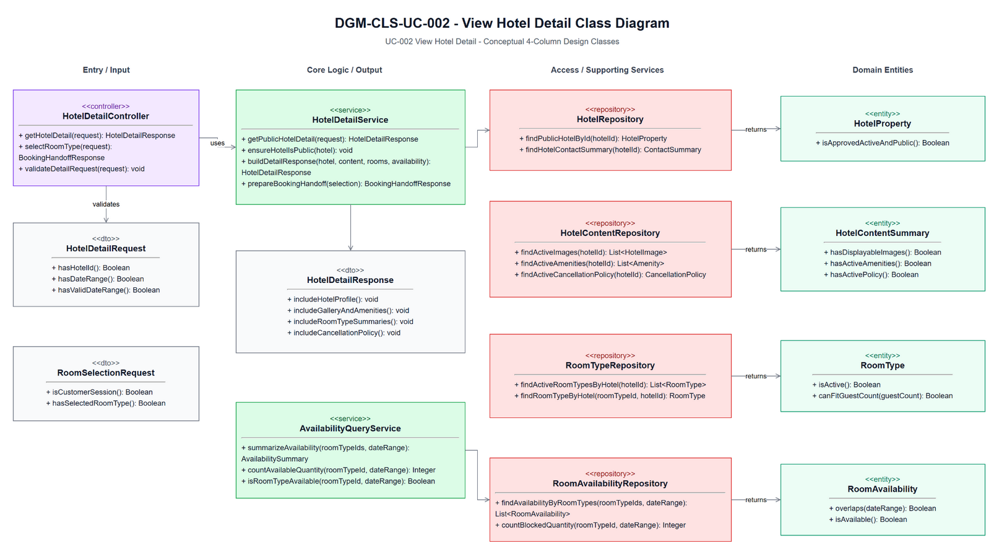

**Figure 3.2-1: Class Diagram of UC-002 View Hotel Detail**

## 3.2.3 Class Specifications

This part explains the key methods shown in the class diagram. The classes are conceptual design assumptions because no implementation codebase was inspected.

### HotelDetailController Class

**Description:** API entry point for hotel detail page requests and room selection handoff.

| No | Method | Description |
|---:|---|---|
| 1 | `getHotelDetail(request)` | Receives hotel detail request from SCR-006, validates hotel/date input, calls `HotelDetailService`, and returns `HotelDetailResponse`. |
| 2 | `selectRoomType(request)` | Receives the selected room type from SCR-006 and either prepares booking handoff for Customer or returns login guidance for Guest. |
| 3 | `validateDetailRequest(request)` | Checks that hotel identifier is present and that optional selected dates are usable before service execution. |

### HotelDetailRequest Class

**Description:** Request DTO carrying selected hotel, optional stay dates, guest count, and actor session context.

| No | Method | Description |
|---:|---|---|
| 1 | `hasHotelId()` | Confirms that the requested hotel identifier is present. |
| 2 | `hasDateRange()` | Indicates whether check-in/check-out dates were provided for availability display. |
| 3 | `hasValidDateRange()` | Verifies that provided check-out date is later than check-in date before availability is calculated. |

### RoomSelectionRequest Class

**Description:** Request DTO carrying the room type selection made on the hotel detail screen.

| No | Method | Description |
|---:|---|---|
| 1 | `isCustomerSession()` | Determines whether the actor is an authenticated Customer who may proceed to booking. |
| 2 | `hasSelectedRoomType()` | Confirms that a room type was selected before booking handoff. |

### HotelDetailService Class

**Description:** Application service that coordinates public hotel detail lookup, related content loading, availability display, and response creation.

| No | Method | Description |
|---:|---|---|
| 1 | `getPublicHotelDetail(request)` | Executes the main UC-002 detail flow by loading the public hotel, gallery, amenities, policy, room types, and availability summary. |
| 2 | `ensureHotelIsPublic(hotel)` | Enforces BR-MKT-001 before any hotel detail is displayed. |
| 3 | `buildDetailResponse(hotel, rooms, availability)` | Converts domain data into `HotelDetailResponse` for SCR-006. |
| 4 | `prepareBookingHandoff(selection)` | Creates a booking-start response for an authenticated Customer without creating booking records inside UC-002. |

### AvailabilityQueryService Class

**Description:** Service that calculates selected-date room type availability for marketplace display.

| No | Method | Description |
|---:|---|---|
| 1 | `summarizeAvailability(roomTypeIds, dateRange)` | Builds availability summaries for displayed room types when selected stay dates are available. |
| 2 | `countAvailableQuantity(roomTypeId, dateRange)` | Calculates available quantity for a room type while excluding room statuses described by BR-ROOM-002. |
| 3 | `isRoomTypeAvailable(roomTypeId, dateRange)` | Returns whether a room type can be selected for booking for the selected dates. |

### HotelDetailResponse Class

**Description:** Response DTO returned to the client with hotel detail content and room availability display data.

| No | Method | Description |
|---:|---|---|
| 1 | `includeHotelProfile()` | Adds hotel name, address, description, contact summary, and public metadata. |
| 2 | `includeGalleryAndAmenities()` | Adds ordered hotel images and amenities for SCR-006 display. |
| 3 | `includeRoomTypeSummaries()` | Adds room type capacity, base price, facilities, and selected-date availability summary. |
| 4 | `includeCancellationPolicy()` | Adds hotel cancellation policy summary when available for booking context. |

### HotelContentSummary Class

**Description:** Conceptual display aggregate that summarizes hotel gallery, amenities, and cancellation policy content for the class diagram without expanding every content entity.

| No | Method | Description |
|---:|---|---|
| 1 | `hasDisplayableImages()` | Returns whether the hotel has active gallery images that can be shown on SCR-006. |
| 2 | `hasActiveAmenities()` | Returns whether the hotel has active amenities associated with the detail view. |
| 3 | `hasActivePolicy()` | Returns whether a cancellation policy summary is available for the detail view. |

### HotelRepository Class

**Description:** Repository for retrieving marketplace-visible hotel property data.

| No | Method | Description |
|---:|---|---|
| 1 | `findPublicHotelById(hotelId)` | Finds a hotel by identifier only when it is approved, active, and publicly available. |
| 2 | `findHotelContactSummary(hotelId)` | Loads public contact information shown on the hotel detail screen. |

### HotelContentRepository Class

**Description:** Repository for retrieving gallery images, amenities, and cancellation policy content for a hotel.

| No | Method | Description |
|---:|---|---|
| 1 | `findActiveImages(hotelId)` | Loads ordered active images for the hotel gallery. |
| 2 | `findActiveAmenities(hotelId)` | Loads active amenities associated with the hotel. |
| 3 | `findActiveCancellationPolicy(hotelId)` | Loads the active hotel-level cancellation policy summary used for booking context. |

### RoomTypeRepository Class

**Description:** Repository for retrieving room types displayed on the hotel detail screen.

| No | Method | Description |
|---:|---|---|
| 1 | `findActiveRoomTypesByHotel(hotelId)` | Retrieves active private room types for the selected hotel. |
| 2 | `findRoomTypeByHotel(roomTypeId, hotelId)` | Confirms that a selected room type belongs to the current hotel before booking handoff. |

### RoomAvailabilityRepository Class

**Description:** Repository for retrieving availability records for room types and date ranges.

| No | Method | Description |
|---:|---|---|
| 1 | `findAvailabilityByRoomTypes(roomTypeIds, dateRange)` | Loads availability or block records that overlap the selected stay dates. |
| 2 | `countBlockedQuantity(roomTypeId, dateRange)` | Counts unavailable room quantity caused by block records or unavailable operational room statuses. |

### HotelProperty Class

**Description:** Domain entity representing a hotel listed on the marketplace.

| No | Method | Description |
|---:|---|---|
| 1 | `isApprovedActiveAndPublic()` | Returns whether the hotel can be displayed on marketplace search and detail pages under BR-MKT-001. |

### RoomType Class

**Description:** Domain entity representing a private room type displayed for a hotel.

| No | Method | Description |
|---:|---|---|
| 1 | `isActive()` | Returns whether the room type can be displayed and selected in the marketplace. |
| 2 | `canFitGuestCount(guestCount)` | Checks whether the room type capacity can satisfy the guest count when such criteria are provided. |

### RoomAvailability Class

**Description:** Domain entity representing availability or block status for a room type or physical room over a date range.

| No | Method | Description |
|---:|---|---|
| 1 | `overlaps(dateRange)` | Checks whether the availability record overlaps the requested stay dates. |
| 2 | `isAvailable()` | Returns whether the availability record allows the room type to be considered available. |

## 3.2.4 Sequence Diagram

This part presents the sequence diagrams for UC-002 View Hotel Detail. The main-flow diagram shows only the successful scenario. Each alternative/error scenario has its own diagram.

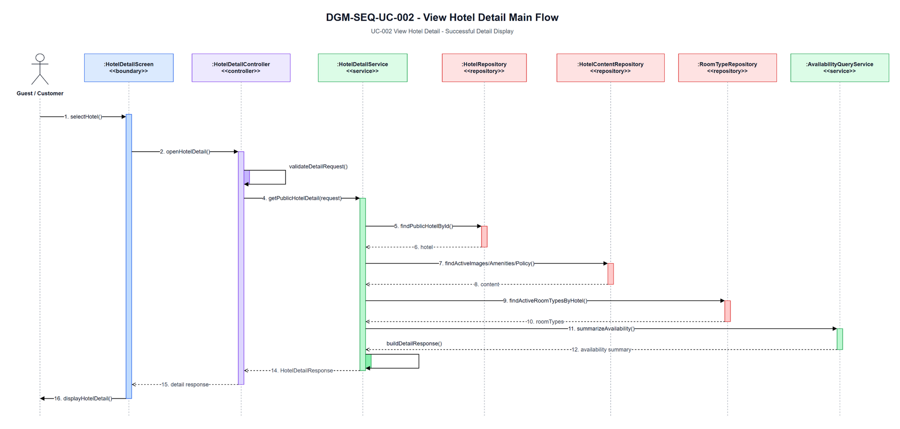

**Figure 3.2-2: Sequence Diagram of UC-002 View Hotel Detail - Main Flow**

### AT-UC002-02A - Hotel No Longer Available

- **Branch from Main Step:** 2
- **Condition:** Hotel no longer available.
- **Expected Response:** This hotel is no longer available for public booking.

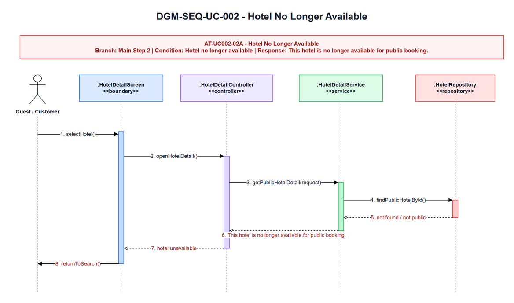

**Figure 3.2-3: Sequence Diagram of UC-002 View Hotel Detail - AT-UC002-02A Hotel No Longer Available**

### AT-UC002-05A - Guest Selects Booking

- **Branch from Main Step:** 5
- **Condition:** Guest selects booking.
- **Expected Response:** Please log in or register before creating a booking.

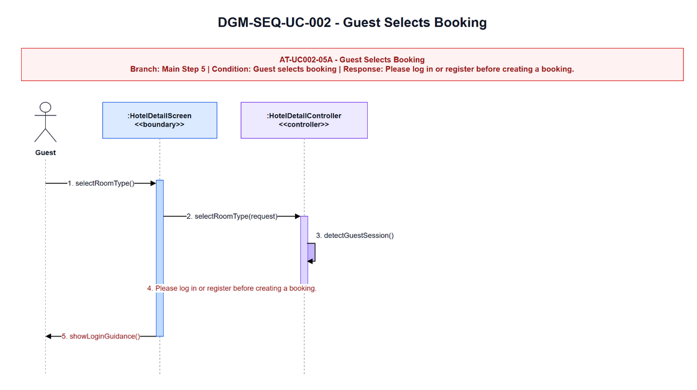

**Figure 3.2-4: Sequence Diagram of UC-002 View Hotel Detail - AT-UC002-05A Guest Selects Booking**

### Validation, Authorization, Transaction, and Error Handling Notes

| Area | Design |
|---|---|
| Validation | Validate hotel identifier, optional check-in/check-out date range, guest count when present, and selected room type before booking handoff. Date-range validation is applied only when dates are provided for availability display. |
| Authorization | Viewing hotel detail is public for Guest and Customer, but BR-MKT-001 restricts output to approved, active, and publicly available hotels. Booking continuation requires authenticated Customer status under BR-AUTH-001. |
| Transaction | UC-002 is read-only for hotel detail browsing. Selecting a room type only prepares a booking handoff and must not create booking, payment, assignment, or invoice records. |
| Availability Consistency | Availability is shown at room type/date level for marketplace browsing. Physical room assignment remains outside UC-002 and belongs to later booking/front desk flows. |
| Error Handling | If the hotel is no longer public, return MSG-MKT-002 and guide the actor back to search. If a Guest selects booking, return MSG-AUTH-002 and guide the actor to login/register before booking. If a selected room type is unavailable, later booking flow must handle MSG-BOOK-002. |
| Privacy | Do not expose owner/staff private data, unpublished hotel configuration, internal notes, audit records, or non-public operational room details on SCR-006. |

## Assumptions and Open Issues

- ASSUMP-UC002-001: Exact API route, DTO field names, repository names, and method signatures are conceptual because no implementation codebase was inspected.
- ASSUMP-UC002-002: `CancellationPolicy` is included in the detail design because SCR-006 displays a cancellation policy summary, even though ENT-009 is primarily listed under booking/customer booking management features.
- ASSUMP-UC002-003: Room availability displayed on the hotel detail screen is a read-only room type availability summary; physical room assignment is deferred to booking/front desk designs.
- ASSUMP-UC002-004: `HotelContentSummary` summarizes `HotelImage`, `Amenity`, `HotelAmenity`, and `CancellationPolicy` in the class diagram to keep the diagram readable while preserving SRS traceability.
- OQ-UC002-001: The SRS does not specify whether SCR-006 should display room types without selected dates as “date required” or as base information without availability quantity.

# 3.3 UC-003 - Register Account

## 3.3.1 Design Purpose

This section describes the detailed design for **UC-003 Register Account**. The use case allows a Guest to register a Customer or Property Owner account from the Register Screen. The design is based on the SRS only; class names and methods are conceptual design assumptions and must be revalidated against the final codebase.

**Related SRS items:** UC-003, FEAT-AUTH, SCR-001, ENT-001, ENT-002, ENT-023, BR-AUTH-001, BR-AUTH-002, BR-AUTH-003, MSG-AUTH-003, MSG-AUTH-004, MSG-AUTH-005, NSF-003.

The registration flow must:

- Accept account type, full name, email, optional phone number, password, password confirmation, and terms confirmation from a Guest.
- Validate mandatory fields, format, password confirmation, password policy, and email/phone uniqueness before account creation.
- Create a `UserAccount` with the selected Customer or Property Owner role.
- Send or record a registration notification because the SRS lists Notification Service as a secondary actor for UC-003 and NSF-003 includes registration events.
- Return a clear success or validation message without exposing technical details.

## 3.3.2 Class Diagram

This part presents the class diagram for the use case.

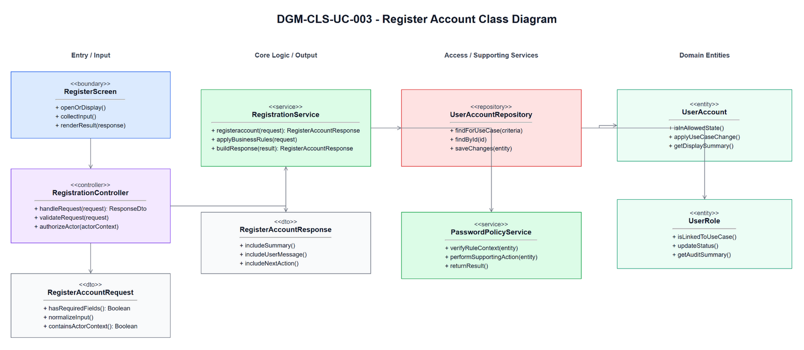

**Figure 3.3-1: Class Diagram of UC-003 Register Account**

## 3.3.3 Class Specifications

This part explains the key methods shown in the class diagram. The classes are conceptual design assumptions because no implementation codebase was inspected.

### RegistrationController Class

**Description:** API entry point for account registration requests from the Register Screen.

| No | Method | Description |
|---:|---|---|
| 1 | `registerAccount(request)` | Receives registration input, coordinates request validation, calls `RegistrationService`, and returns `RegistrationResponse`. |
| 2 | `validateRegistrationRequest(request)` | Checks required fields, field length, accepted account type, password confirmation, and terms confirmation before service execution. |

### RegisterAccountRequest Class

**Description:** Request DTO carrying registration data from SCR-001.

| No | Method | Description |
|---:|---|---|
| 1 | `hasRequiredFields()` | Verifies that account type, full name, email, password, confirm password, and required terms confirmation are present. |
| 2 | `passwordMatchesConfirmation()` | Verifies that password and confirm password contain the same value before account creation. |
| 3 | `hasValidContactFormat()` | Verifies email format and phone format when a phone number is provided. |

### RegistrationService Class

**Description:** Application service that enforces registration rules, creates the account and role assignment, and starts the registration notification event.

| No | Method | Description |
|---:|---|---|
| 1 | `registerAccount(request)` | Executes UC-003 successful registration by validating uniqueness, resolving the selected role, creating account credentials, saving the account, and returning a response. |
| 2 | `ensureUniqueEmailAndPhone(email, phoneNumber)` | Checks that submitted email and provided phone number are not already used by another account. |
| 3 | `buildRegistrationResponse(account)` | Converts the created account and selected role into the response used by the Register Screen. |

### PasswordPolicyService Class

**Description:** Service that validates password policy and creates protected password credential data.

| No | Method | Description |
|---:|---|---|
| 1 | `validatePassword(password, confirmation)` | Checks password policy and matching confirmation for MSG-AUTH-005 conditions. |
| 2 | `createPasswordCredential(password)` | Creates the protected credential value stored on `UserAccount`; exact hashing implementation is a design detail outside the SRS. |

### UserAccountRepository Class

**Description:** Repository for querying and storing user account records.

| No | Method | Description |
|---:|---|---|
| 1 | `existsByEmailOrPhone(email, phoneNumber)` | Checks uniqueness for email and provided phone number before account creation. |
| 2 | `save(userAccount)` | Persists the new account record after validation succeeds. |

### UserRoleRepository Class

**Description:** Repository for retrieving supported self-registration roles.

| No | Method | Description |
|---:|---|---|
| 1 | `findSelfRegistrationRole(accountType)` | Finds the Customer or Property Owner role selected on the Register Screen. |

### NotificationServiceClient Class

**Description:** Client or adapter for sending or recording notification events. Included because the SRS confirms Notification Service as a secondary actor for UC-003 and allows mock notification support.

| No | Method | Description |
|---:|---|---|
| 1 | `sendOrRecordRegistrationNotification(account)` | Sends or records a registration notification event for the created account. |

### RegistrationResponse Class

**Description:** Response DTO returned after successful account creation or validation failure.

| No | Method | Description |
|---:|---|---|
| 1 | `success(account)` | Builds a success response for the Register Screen after the account is created. |
| 2 | `validationError(messageCode)` | Builds a validation error response using SRS message codes such as MSG-AUTH-003, MSG-AUTH-004, or MSG-AUTH-005. |

### UserAccount Class

**Description:** Domain entity representing a registered account.

| No | Method | Description |
|---:|---|---|
| 1 | `createRegisteredAccount(request, role, credential)` | Creates a new `UserAccount` with full name, email, optional phone number, credential, selected role, account status, and timestamps. |
| 2 | `assignRole(role)` | Associates the selected Customer or Property Owner role with the account. |

### UserRole Class

**Description:** Domain entity representing a platform or hotel-scoped role definition.

| No | Method | Description |
|---:|---|---|
| 1 | `isAllowedForSelfRegistration()` | Returns whether the role can be selected by a Guest during UC-003. |

### NotificationRecord Class

**Description:** Domain entity representing a sent or recorded notification event.

| No | Method | Description |
|---:|---|---|
| 1 | `createRegistrationEvent(account)` | Creates notification event data for registration, linked to the newly created account. |

## 3.3.4 Sequence Diagram

This part presents the sequence diagrams for the use case.

**Figure 3.3-2: Sequence Diagram of UC-003 Register Account - Main Flow**

**Figure 3.3-3: Sequence Diagram of UC-003 Register Account - Alternative/Error Flows**

### Validation, Authorization, Transaction, and Error Handling Notes

| Area | Design |
|---|---|
| Validation | The controller validates required input and basic request shape. The service validates email/phone uniqueness. Password policy and password confirmation use `PasswordPolicyService`. Duplicate email/phone maps to MSG-AUTH-003; missing required account fields map to MSG-AUTH-004; invalid password or mismatch maps to MSG-AUTH-005. |
| Authorization | UC-003 is public and starts from a Guest. Only Customer and Property Owner account types are self-registered. Hotel staff accounts are created/invited through staff management, not UC-003. |
| Transaction | Account creation, selected role assignment, and registration notification record creation should be consistent. If notification is only an external send, account creation should remain successful and notification failure should be recorded or retried according to the notification design. |
| Error Handling | Validation errors return user-facing message codes and keep submitted non-secret data available for correction. Unexpected repository or service errors return a safe generic failure response without exposing credentials or stack traces. |
| Security and Privacy | Password is never returned in the response or diagrams as stored plaintext. Password credential storage is represented conceptually; exact hashing and storage implementation must be aligned with final security architecture. |

## Assumptions and Open Issues

- Class names, method names, API route, DTO field names, and repository names are conceptual design assumptions because no implementation codebase was inspected.
- Notification handling is included because UC-003 lists Notification Service as a secondary actor and NSF-003 includes registration notifications; the SRS allows mock notification support.
- The SRS confirms Customer and Property Owner self-registration only. Staff and platform administrator account creation is outside UC-003.
- The SRS references password policy but does not define detailed password complexity; final implementation must align this with the security NFR or project policy.

# 3.4 UC-004 - Login

## 3.4.1 Design Purpose

This section describes the detailed design for **UC-004 Login**. The use case allows Customer, Property Owner, Hotel Manager, Receptionist, Housekeeping Staff, Maintenance Staff, and Platform Administrator actors to authenticate and open the correct role-specific landing area.

**Related SRS items:** UC-004, FEAT-AUTH, SCR-002, ENT-001, ENT-002, ENT-003, BR-AUTH-002, BR-AUTH-003, BR-STAFF-002, MSG-AUTH-001, MSG-AUTH-006, MSG-AUTH-008.

The login design must accept email/phone and password credentials from SCR-002, authenticate only active accounts, resolve user role(s), resolve active hotel assignment before opening hotel-scoped staff workspace, and route the authenticated actor without inventing token/session details.

## 3.4.2 Class Diagram

This part presents the class diagram for the use case.

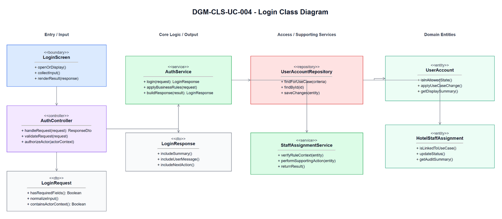

**Figure 3.4-1: Class Diagram of UC-004 Login**

## 3.4.3 Class Specifications

This part explains the key methods shown in the class diagram. The classes are conceptual design assumptions because no implementation codebase was inspected.

### LoginScreen Class

**Description:** Boundary component that collects credentials and displays login result or error messages.

| No | Method | Description |
|---:|---|---|
| 1 | `submitLogin()` | Sends entered email/phone and password to the controller for authentication. |
| 2 | `displayLanding(result)` | Opens the role-specific landing area after successful authentication and assignment resolution. |
| 3 | `displayError(messageCode)` | Shows user-facing authentication or assignment error messages from the SRS. |

### AuthController Class

**Description:** Entry point for login requests and response mapping.

| No | Method | Description |
|---:|---|---|
| 1 | `login(request)` | Receives a `LoginRequest`, validates basic input, calls `AuthService`, and returns `LoginResponse`. |
| 2 | `validateLoginRequest(request)` | Checks required identifier and password fields before service authentication. |
| 3 | `mapLoginResult(result)` | Converts authentication result, role data, and assignment data into a response understood by the client. |

### LoginRequest Class

**Description:** Request DTO carrying the login identifier and password from SCR-002.

| No | Method | Description |
|---:|---|---|
| 1 | `hasRequiredCredentials()` | Verifies that email/phone and password are present before authentication. |
| 2 | `normalizeIdentifier()` | Normalizes the email/phone identifier for lookup without changing the submitted password. |

### AuthService Class

**Description:** Core service that authenticates account credentials and coordinates role and hotel assignment checks.

| No | Method | Description |
|---:|---|---|
| 1 | `authenticateUser(request)` | Performs the main UC-004 success flow by finding the user, verifying credentials, checking account status, resolving roles, and preparing a login result. |
| 2 | `verifyCredentials(userAccount, password)` | Compares the submitted password against the stored credential through the configured credential verification design. |
| 3 | `ensureAccountActive(userAccount)` | Enforces BR-AUTH-003 by rejecting inactive or blocked accounts. |
| 4 | `buildLoginResult(userAccount, roles, assignments)` | Builds the conceptual login result used to choose the proper landing area. |

### RoleService Class

**Description:** Service that resolves platform roles and hotel-scoped roles for the authenticated user.

| No | Method | Description |
|---:|---|---|
| 1 | `resolveRoles(userAccountId)` | Loads all active roles for the user account. |
| 2 | `requiresHotelAssignment(roles)` | Determines whether the resolved role set includes hotel-scoped staff access. |
| 3 | `determineLandingArea(roles, assignments)` | Selects the role-specific landing area after role and assignment checks are complete. |

### StaffAssignmentService Class

**Description:** Service that validates hotel-scoped staff assignments for staff actors.

| No | Method | Description |
|---:|---|---|
| 1 | `resolveActiveAssignments(userAccountId)` | Loads active hotel staff assignments for the authenticated user. |
| 2 | `ensureStaffHasActiveHotelAssignment(roles, assignments)` | Enforces BR-STAFF-002 by rejecting hotel-scoped staff workspace access when no active assignment exists. |

### UserAccountRepository Class

**Description:** Repository for account lookup during login.

| No | Method | Description |
|---:|---|---|
| 1 | `findByEmailOrPhone(identifier)` | Finds a registered user account by email or phone login identifier. |
| 2 | `loadCredential(userAccountId)` | Loads the stored credential data needed for password verification. |

### RoleRepository Class

**Description:** Repository for loading role definitions assigned to a user.

| No | Method | Description |
|---:|---|---|
| 1 | `findActiveRolesByUser(userAccountId)` | Retrieves active role definitions for the authenticated user. |

### StaffAssignmentRepository Class

**Description:** Repository for loading hotel staff assignment records.

| No | Method | Description |
|---:|---|---|
| 1 | `findActiveAssignmentsByUser(userAccountId)` | Retrieves active hotel assignments for hotel-scoped staff role validation. |

### UserAccount Class

**Description:** Domain entity representing a registered account.

| No | Method | Description |
|---:|---|---|
| 1 | `isActive()` | Returns whether the account may be authenticated under BR-AUTH-003. |
| 2 | `matchesIdentifier(identifier)` | Indicates whether the account matches the normalized email/phone identifier. |

### UserRole Class

**Description:** Domain entity representing a platform or hotel-scoped role.

| No | Method | Description |
|---:|---|---|
| 1 | `isHotelScoped()` | Returns whether the role requires hotel assignment validation. |
| 2 | `isPlatformScoped()` | Returns whether the role represents platform-level access. |

### HotelStaffAssignment Class

**Description:** Domain entity mapping a staff account to a hotel and hotel-scoped role.

| No | Method | Description |
|---:|---|---|
| 1 | `isActive()` | Returns whether the assignment can grant hotel-scoped workspace access. |
| 2 | `belongsToRole(roleId)` | Indicates whether the assignment supports the resolved staff role. |

### LoginResponse Class

**Description:** Response DTO returned after login success or controlled failure.

| No | Method | Description |
|---:|---|---|
| 1 | `success(landingArea)` | Builds a successful login response with role-specific landing information. |
| 2 | `failure(messageCode)` | Builds a controlled failure response using SRS application message codes. |

## 3.4.4 Sequence Diagram

This part presents the sequence diagrams for the use case.

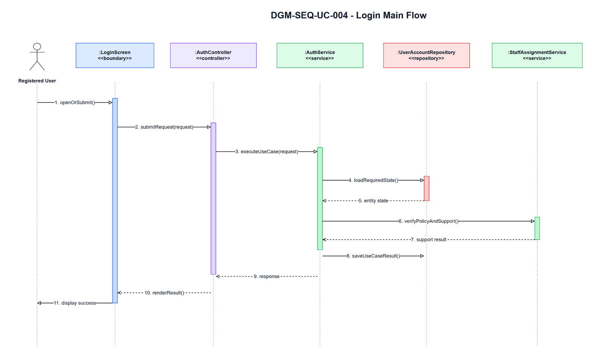

**Figure 3.4-2: Sequence Diagram of UC-004 Login - Main Flow**

**Figure 3.4-3: Sequence Diagram of UC-004 Login - Alternative/Error Flows**

### Validation, Authorization, Transaction, and Error Handling Notes

| Area | Design |
|---|---|
| Validation | Login input validation checks that email/phone and password are provided before account lookup. |
| Authorization | BR-AUTH-002 is enforced by resolving roles and separating platform access from hotel-scoped access. BR-STAFF-002 is enforced before opening hotel workspace for staff roles. |
| Transaction | UC-004 is primarily read-only for account, role, and assignment lookup. No booking, room, payment, or hotel data transaction is required. |
| Error Handling | Invalid credentials return MSG-AUTH-001; inactive/blocked accounts return MSG-AUTH-006; staff without active hotel assignment returns MSG-AUTH-008. |
| Security and Privacy | Password verification is conceptual only; exact hashing, token, session, cookie, or refresh mechanism is intentionally not invented. |

## Assumptions and Open Issues

| Assumption ID | Assumption | Reason | Impact if Wrong | Confirmation Needed |
|---|---|---|---|---|
| ASSUMP-UC004-001 | The design uses conceptual controller, service, repository, DTO, and entity classes for authentication. | No source code repository was provided for this SDD asset. | Class names and method names may need renaming to match implementation. | Confirm final backend architecture and naming. |
| ASSUMP-UC004-002 | Staff hotel assignment validation happens during login routing for hotel-scoped roles. | UC-004 alternative flow AT-UC004-06A requires preventing hotel workspace access when staff has no active hotel assignment. | If assignment is checked after landing, the sequence and error point must change. | Confirm desired enforcement point. |
| ASSUMP-UC004-003 | Authentication returns conceptual landing information only. | User requested not to invent token/session details. | Technical session design must be documented later in architecture/security design. | Confirm actual session/token mechanism when implementation exists. |

| Question ID | Question | Why It Matters | Affected Sections | Priority |
|---|---|---|---|---|
| OQ-UC004-001 | What exact account statuses exist besides active, inactive, and blocked? | Affects `UserAccount.isActive()` and MSG-AUTH-006 mapping. | Class specs, alternative sequence, error handling notes | Medium |

# 3.5 UC-005 - Create Booking

## 3.5.1 Design Purpose

This section describes the detailed design for **UC-005 Create Booking**. The use case allows an authenticated Customer to create an instant booking for one selected hotel room type and quantity after validation and atomic availability reservation.

**Related SRS items:** UC-005, FEAT-CUST-BOOK, SCR-007, SCR-008, ENT-009, ENT-010, ENT-012, ENT-013, ENT-014, ENT-020, ENT-023, BR-AUTH-001, BR-BOOK-001, BR-BOOK-005, BR-BOOK-011, BR-BOOK-012, BR-BOOK-013, BR-FIN-001, BR-FIN-003, MSG-BOOK-001, MSG-BOOK-002, MSG-BOOK-003, MSG-PAY-004.

The design follows the accepted hybrid availability decision: marketplace/customer booking checks room type quantity and date range; physical room assignment is deferred to check-in/front desk flows.

The flow must:

- Accept booking information from SCR-007 for an authenticated Customer.
- Validate date range, guest count, room quantity, contact fields, payment mode, selected hotel, and selected active room type.
- Atomically reserve requested room type quantity for the date range to prevent overbooking across customer and walk-in channels.
- Create one Booking and one BookingRoom line for the selected room type.
- Create a Confirmed booking immediately for Pay at Property and record commission receivable.
- Create a Pending Payment booking for Platform Collect and continue to UC-006 for online payment.
- Send or record booking notification events for Customer and hotel operation roles.

## 3.5.2 Class Diagram

This part presents the class diagram for the use case.

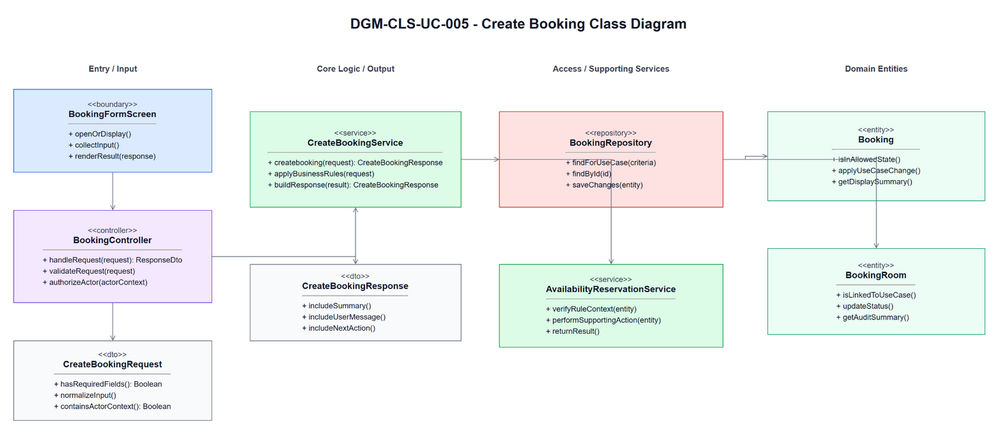

**Figure 3.5-1: Class Diagram of UC-005 Create Booking**

## 3.5.3 Class Specifications

This part explains the key methods shown in the class diagram. The classes are conceptual design assumptions because no implementation codebase was inspected.

### BookingController Class

**Description:** API entry point for create booking requests from the Booking Form Screen.

| No | Method | Description |
|---:|---|---|
| 1 | `createBooking(request)` | Receives Customer booking request, validates request shape, checks authentication context, and delegates creation to `BookingService`. |
| 2 | `validateCreateBookingRequest(request)` | Checks required fields before business processing: dates, quantity, guest count, contact data, room type, hotel, and payment mode. |

### CreateBookingRequest Class

**Description:** Request DTO carrying booking form input from SCR-007.

| No | Method | Description |
|---:|---|---|
| 1 | `hasValidDateRange()` | Verifies that check-out date is later than check-in date, supporting BR-BOOK-001 and MSG-BOOK-001. |
| 2 | `hasValidQuantity()` | Verifies selected room quantity is positive for the single room type allowed by BR-BOOK-011. |
| 3 | `hasSupportedPaymentMode()` | Verifies payment mode is either Platform Collect or Pay at Property as defined by UC-005. |

### BookingService Class

**Description:** Application service that coordinates validation, atomic availability reservation, booking creation, commission handling, and notification publishing.

| No | Method | Description |
|---:|---|---|
| 1 | `createBooking(customerId, request)` | Executes the UC-005 main flow and returns booking confirmation or payment instruction data. |
| 2 | `validateBookingRules(request)` | Enforces booking rules including active selected room type, date range, guest count, quantity, and amount calculation scope. |
| 3 | `calculateRoomPriceAmount(roomType, request)` | Calculates room-price-only amount as unit price per night x room quantity x night count, supporting BR-BOOK-012. |
| 4 | `determineInitialStatus(paymentMode)` | Sets Pending Payment for Platform Collect or Confirmed for Pay at Property. |
| 5 | `buildBookingResponse(booking)` | Builds confirmation response for SCR-008, including booking code, status, amount, payment mode, and payment deadline when applicable. |

### AvailabilityReservationService Class

**Description:** Service that atomically checks and reserves room type quantity for the requested date range.

| No | Method | Description |
|---:|---|---|
| 1 | `reserveRoomTypeQuantity(hotelId, roomTypeId, dateRange, quantity)` | Performs the atomic availability check and reservation required by BR-BOOK-013. |
| 2 | `releaseReservation(bookingId)` | Releases reserved availability if booking creation fails or later payment timeout handling expires the booking. |

### BookingRepository Class

**Description:** Repository for persisting and retrieving booking header records.

| No | Method | Description |
|---:|---|---|
| 1 | `save(booking)` | Persists the Booking entity with generated booking code, status, amount, payment mode, source, and customer reference. |
| 2 | `findByCode(bookingCode)` | Retrieves a booking by booking code for confirmation display or later payment flow. |

### BookingRoomRepository Class

**Description:** Repository for persisting booking room line items.

| No | Method | Description |
|---:|---|---|
| 1 | `save(bookingRoom)` | Persists the single BookingRoom line for selected room type, quantity, unit price, night count, and line amount. |

### RoomTypeRepository Class

**Description:** Repository for retrieving the selected room type and its saleable room price data.

| No | Method | Description |
|---:|---|---|
| 1 | `findActiveRoomType(hotelId, roomTypeId)` | Loads selected active room type for the approved hotel and rejects unavailable or inactive room types. |

### CommissionService Class

**Description:** Service that captures commission rate snapshot and records commission when booking is confirmed.

| No | Method | Description |
|---:|---|---|
| 1 | `captureCommissionSnapshot(booking)` | Captures the commission rate snapshot for later commission calculation, supporting BR-FIN-001. |
| 2 | `recordPayAtPropertyReceivable(booking)` | Creates commission receivable for Pay at Property confirmed bookings, supporting BR-FIN-003. |

### NotificationService Class

**Description:** Service that sends or records booking notification events.

| No | Method | Description |
|---:|---|---|
| 1 | `recordBookingCreated(booking)` | Creates notification records for Customer and hotel operation roles after booking creation. |

### BookingResponse Class

**Description:** Response DTO for SCR-008 confirmation or payment instruction transition.

| No | Method | Description |
|---:|---|---|
| 1 | `includeConfirmationMessage()` | Includes MSG-BOOK-003 for created booking or MSG-PAY-004 for Pay at Property confirmation where appropriate. |
| 2 | `includePaymentDeadline()` | Includes payment deadline when the booking is Pending Payment for Platform Collect. |

### RoomType Class

**Description:** Domain entity representing the selected private room type.

| No | Method | Description |
|---:|---|---|
| 1 | `isActive()` | Confirms the room type can be booked. |
| 2 | `getBasePricePerNight()` | Provides room price used for room-price-only amount calculation. |

### Booking Class

**Description:** Domain entity representing a customer reservation.

| No | Method | Description |
|---:|---|---|
| 1 | `markPendingPayment(deadline)` | Sets Platform Collect booking to Pending Payment until payment or timeout. |
| 2 | `markConfirmed()` | Sets Pay at Property booking to Confirmed immediately after successful availability validation. |
| 3 | `attachCommissionSnapshot(rate)` | Stores commission rate snapshot for future commission records. |

### BookingRoom Class

**Description:** Domain entity representing the booking line for one room type and room quantity.

| No | Method | Description |
|---:|---|---|
| 1 | `calculateLineAmount()` | Calculates unit price per night x quantity x night count. |

### CommissionRecord Class

**Description:** Domain entity representing platform commission for a booking.

| No | Method | Description |
|---:|---|---|
| 1 | `createReceivable(booking)` | Creates commission receivable for Pay at Property booking. |

### NotificationRecord Class

**Description:** Domain entity representing notification event data.

| No | Method | Description |
|---:|---|---|
| 1 | `createForBookingCreated(booking)` | Creates a notification event linked to the booking. |

## 3.5.4 Sequence Diagram

This part presents the sequence diagrams for the use case.

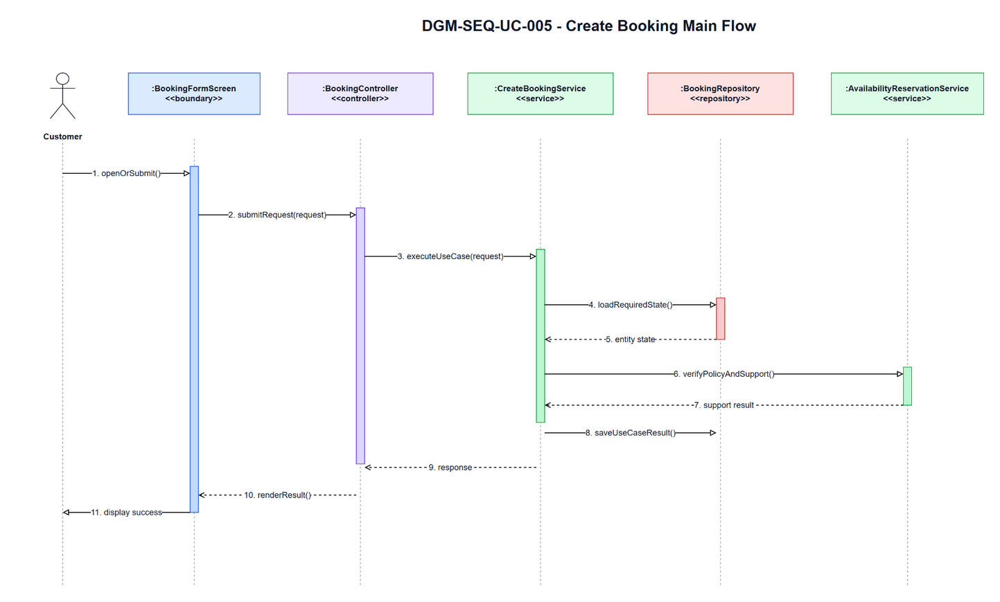

**Figure 3.5-2: Sequence Diagram of UC-005 Create Booking - Main Flow**

**Figure 3.5-3: Sequence Diagram of UC-005 Create Booking - Alternative/Error Flows**

### Validation, Authorization, Transaction, and Error Handling Notes

| Area | Design |
|---|---|
| Validation | Validate authentication context, selected approved hotel, active room type, date range, guest count, room quantity, contact name, contact phone, optional contact email, and payment mode. Use MSG-BOOK-001 for invalid date range and general validation messaging for other invalid booking data. |
| Authorization | Only authenticated Customer can create Customer booking. Guest must register or log in before booking per BR-AUTH-001. Customer may create only for own customer account. |
| Transaction | Booking creation uses a single transaction around availability reservation, booking header creation, booking room creation, commission snapshot/receivable where applicable, and notification record creation. Roll back all writes when validation, availability, or persistence fails. |
| Availability Consistency | Apply accepted hybrid availability decision: reserve room type quantity/date atomically for booking. Do not assign `PhysicalRoom`; assignment belongs to front desk/check-in design. |
| Payment Mode | Platform Collect creates Pending Payment and hands off to UC-006. Pay at Property creates Confirmed booking immediately and records commission receivable. |
| Error Handling | Invalid data returns validation response without write. Unavailable room returns MSG-BOOK-002 and does not create booking. Persistence/notification failure must not expose stack traces; booking transaction should roll back unless notification dispatch is explicitly implemented as outbox/record-after-commit. |

## Assumptions and Open Issues

| ID | Type | Description | Impact |
|---|---|---|---|
| ASSUMP-UC005-001 | Assumption | Class names, method names, and repository boundaries are conceptual because no source implementation was inspected. | Final code may use different names or package boundaries. |
| ASSUMP-UC005-002 | Assumption | Notification processing can be implemented as synchronous record creation inside the booking transaction or outbox-style after commit. | Transaction behavior should be aligned with final architecture. |
| OQ-UC005-001 | Open Issue | Exact non-date validation message codes for missing contact fields, invalid phone/email, quantity, and payment mode are not defined in the provided UC-005 message list. | UI and API error mapping may need additional message catalog entries. |

# 3.6 UC-006 - Pay Online

## 3.6.1 Design Purpose

This section describes the detailed design for **UC-006 Pay Online**. The use case allows an authenticated Customer to pay a Platform Collect booking through payOS while the system keeps `PaymentTransaction`, `Booking`, commission, and notification records consistent.

**Related SRS items:** UC-006, FEAT-CUST-BOOK, SCR-008, SCR-011, SCR-012, NSF-001, INT-PAY-001, INT-PAY-002, INT-NOTI-001, ENT-013, ENT-016, ENT-020, ENT-023, BR-PAY-001, BR-PAY-003, BR-PAY-005, BR-BOOK-006, BR-BOOK-007, BR-FIN-001, BR-FIN-002, NFR-REL-002, NFR-SEC-001, MSG-PAY-001, MSG-PAY-002, MSG-PAY-003, MSG-BOOK-006.

The payment flow must:

- Allow payment only for the authenticated Customer who owns the Pending Payment booking.
- Validate that the booking is still within the 15-minute payment deadline before initiating payment.
- Create or reuse a Pending `PaymentTransaction` for payOS instruction generation.
- Accept a successful payOS result through return or notification and process it idempotently.
- Atomically update the payment to Paid, confirm the booking, create commission records, and record notification events.
- Keep failed, cancelled, delayed, duplicate, late, or expired results from duplicating successful payment, commission, or confirmation effects.

Class names and methods are conceptual design assumptions because no implementation codebase was inspected.

## 3.6.2 Class Diagram

This part presents the class diagram for the use case.

**Figure 3.6-1: Class Diagram of UC-006 Pay Online**

## 3.6.3 Class Specifications

This part explains the key methods shown in the class diagram. The classes are conceptual design assumptions because no implementation codebase was inspected.

### PaymentController Class

**Description:** API entry point for Customer payment initiation and payOS payment result handling.

| No | Method | Description |
|---:|---|---|
| 1 | `initiatePayment(request)` | Receives a Customer request to pay a Pending Payment booking, validates the request boundary, and returns payOS instruction data. |
| 2 | `handlePaymentReturn(request)` | Handles Customer return from payOS and queries/records the payment result for display. |
| 3 | `handlePaymentNotification(payload)` | Receives payOS result notification for NSF-001 and delegates idempotent processing. |
| 4 | `getPaymentResult(bookingId)` | Returns the latest customer-visible payment result for SCR-012. |

### PaymentRequest Class

**Description:** Request DTO carrying booking payment initiation data from SCR-008/SCR-011.

| No | Method | Description |
|---:|---|---|
| 1 | `validateRequiredFields()` | Checks that the booking reference and customer context required for payment initiation are present. |
| 2 | `toPaymentCommand()` | Converts screen/API input into a service command without exposing gateway configuration values. |

### PaymentResultPayload Class

**Description:** DTO representing the payOS return or notification result without storing credentials or secret configuration.

| No | Method | Description |
|---:|---|---|
| 1 | `extractGatewayReference()` | Reads the gateway transaction reference used for idempotency and audit. |
| 2 | `isSuccessful()` | Indicates whether the provider result should be mapped to a successful payment transition. |
| 3 | `isFinalFailure()` | Indicates whether the provider result maps to failed or cancelled payment status. |

### PaymentInstructionResponse Class

**Description:** Response DTO carrying payOS instruction or redirection data for SCR-011 Payment Instruction Screen.

| No | Method | Description |
|---:|---|---|
| 1 | `includeInstructionData()` | Adds customer-visible payOS instruction or redirect data returned after payment initiation. |
| 2 | `includeDeadline()` | Adds the payment deadline so SCR-011 can show the remaining time for the Pending Payment booking. |

### PaymentResultResponse Class

**Description:** Response DTO carrying customer-visible payment and booking result data for SCR-012 Payment Result Screen.

| No | Method | Description |
|---:|---|---|
| 1 | `includePaymentStatus()` | Adds the mapped payment status and user-facing message such as MSG-PAY-001, MSG-PAY-002, or MSG-PAY-003. |
| 2 | `includeBookingStatus()` | Adds the updated booking status so the Customer can see whether the booking is Confirmed, still Pending Payment, or Expired. |

### PaymentService Class

**Description:** Application service coordinating payment initiation, ownership/status/deadline validation, gateway interaction, and result processing.

| No | Method | Description |
|---:|---|---|
| 1 | `initiatePayment(command)` | Validates ownership, Pending Payment status, and deadline, creates or reuses a Pending transaction, and requests payOS instruction. |
| 2 | `processGatewayResult(payload)` | Idempotently records payOS result and performs the first valid successful transition to Paid/Confirmed. |
| 3 | `validatePaymentEligibility(booking, customerId)` | Enforces Customer ownership, Pending Payment status, and non-expired payment deadline before payment initiation. |
| 4 | `mapProviderStatus(payload)` | Maps payOS result into internal payment status values: Processing, Paid, Failed, Cancelled, or Expired. |

### PayOSClient Class

**Description:** External client boundary for payOS payment instruction creation and result interpretation.

| No | Method | Description |
|---:|---|---|
| 1 | `createPaymentInstruction(transaction)` | Sends payment request data to payOS and returns instruction or redirect information. |
| 2 | `parseResult(payload)` | Normalizes payOS return/notification data into internal result fields. |

### BookingRepository Class

**Description:** Repository for reading and updating `Booking` records involved in payment.

| No | Method | Description |
|---:|---|---|
| 1 | `findByIdForCustomer(bookingId, customerId)` | Finds the Customer-owned booking for authorization and payment eligibility checks. |
| 2 | `confirmIfPendingPayment(bookingId)` | Atomically changes a Pending Payment booking to Confirmed when successful payment wins the state transition. |
| 3 | `expireIfPaymentDeadlinePassed(bookingId)` | Marks the booking Expired when the payment deadline has passed before payment success. |

### PaymentTransactionRepository Class

**Description:** Repository for persisting and querying `PaymentTransaction` records.

| No | Method | Description |
|---:|---|---|
| 1 | `findActiveByBookingId(bookingId)` | Finds the current payment transaction for a Pending Payment booking. |
| 2 | `createPendingTransaction(booking)` | Creates a Pending payOS transaction for the booking amount. |
| 3 | `recordProviderResult(payload)` | Stores provider result fields and gateway reference for audit and status display. |
| 4 | `markPaidIfNotProcessed(transactionId)` | Performs an idempotent transition to Paid only if no successful result has already been processed. |

### CommissionService Class

**Description:** Service for creating commission and hotel payable records when payment confirms a booking.

| No | Method | Description |
|---:|---|---|
| 1 | `createCommissionForConfirmedBooking(booking)` | Calculates commission from booking amount and rate snapshot after booking confirmation. |
| 2 | `calculateHotelPayable(booking, payment)` | Calculates Platform Collect hotel payable using paid amount, refund amount, and commission amount. |

### NotificationService Class

**Description:** Service for recording or sending customer and hotel operation notification events.

| No | Method | Description |
|---:|---|---|
| 1 | `recordPaymentSuccessNotification(booking, payment)` | Records/sends notification for successful payment and confirmed booking. |
| 2 | `recordPaymentFailureNotification(booking, payment)` | Records customer-visible failed/cancelled payment event when applicable. |

### Booking Class

**Description:** Domain entity representing the Customer booking being paid.

| No | Method | Description |
|---:|---|---|
| 1 | `isPendingPayment()` | Determines whether UC-006 payment can still proceed. |
| 2 | `isPaymentDeadlinePassed()` | Determines whether the booking must expire instead of accepting new payment attempts. |
| 3 | `markConfirmed()` | Applies the successful payment state transition to Confirmed. |

### PaymentTransaction Class

**Description:** Domain entity representing the online payOS payment transaction.

| No | Method | Description |
|---:|---|---|
| 1 | `canProcessSuccess()` | Determines whether a successful gateway result may still be processed. |
| 2 | `markPaid(gatewayReference, paidAt)` | Applies successful payment result data. |
| 3 | `markFailedOrCancelled(status, gatewayReference)` | Records failed or cancelled provider results without confirming the booking. |

### CommissionRecord Class

**Description:** Domain entity representing platform commission for the confirmed booking.

| No | Method | Description |
|---:|---|---|
| 1 | `createFromBooking(booking, rateSnapshot)` | Creates a commission record using the booking amount and commission rate snapshot. |

### NotificationRecord Class

**Description:** Domain entity representing recorded notification events.

| No | Method | Description |
|---:|---|---|
| 1 | `createPaymentEvent(recipientId, bookingId, status)` | Creates an auditable payment notification event for customer or hotel operation roles. |

## 3.6.4 Sequence Diagram

This part presents the sequence diagrams for the use case.

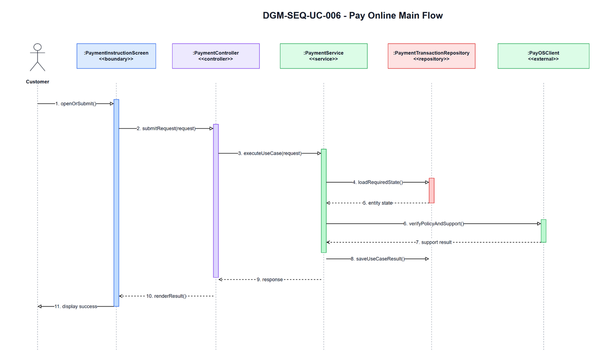

**Figure 3.6-2: Sequence Diagram of UC-006 Pay Online - Main Flow**

**Figure 3.6-3: Sequence Diagram of UC-006 Pay Online - Alternative/Error Flows**

### Validation, Authorization, Transaction, and Error Handling Notes

| Area | Design |
|---|---|
| Validation | `PaymentController` validates required request shape. `PaymentService.validatePaymentEligibility()` validates Customer ownership, Pending Payment status, and the 15-minute payment deadline before payOS instruction creation. payOS result payloads are normalized through `PayOSClient.parseResult()` and mapped to internal statuses. |
| Authorization | UC-006 is protected by authentication per NFR-SEC-001. The booking lookup uses `findByIdForCustomer(bookingId, customerId)` so a Customer can pay only their own booking. Hotel staff cannot manually change Platform Collect payment status per BR-PAY-002. |
| Transaction | The successful result path is one database transaction: record provider result, mark transaction Paid if not already processed, confirm Pending Payment booking, create commission/hotel payable records, and record notification events. BR-PAY-005 applies: the first atomic transition to Confirmed or Expired wins. |
| Error Handling | Failed/cancelled results are recorded and shown as MSG-PAY-002 while the booking remains Pending Payment until timeout. Delayed/processing results show MSG-PAY-003. Expired bookings show MSG-BOOK-006 and prevent resubmission. Duplicate or late callbacks are audit-only and must not duplicate payment, commission, booking confirmation, or availability reservation. |

## Assumptions and Open Issues

| ID | Type | Description | Impact |
|---|---|---|---|
| ASSUMP-UC006-001 | Assumption | The final implementation will expose controller/service/repository classes similar to the conceptual design above. | Class names may need renaming to match final source code. |
| ASSUMP-UC006-002 | Assumption | payOS credential names, webhook secrets, and real endpoint configuration are intentionally omitted from the SDD assets. | Prevents accidental exposure of secrets while preserving the integration boundary. |
| OQ-UC006-001 | Open Issue | Final payOS callback signature verification mechanism is not specified in the SRS. | Security design may need an additional verifier class once implementation details are confirmed. |

# 3.18 UC-018 - Approve Hotel Property

## 3.18.1 Design Purpose

This section describes the detailed design for **UC-018 Approve Hotel Property**. The use case covers Approve or reject submitted hotel properties. The design is based on the SRS/SDD only; class names and methods are conceptual design assumptions because no implementation codebase was inspected.

**Related SRS items:** FEAT-ADMIN-APPROVAL, UC-018, SCR-037, ENT-005, ENT-024, BR-MKT-001, BR-ADMIN-001, BR-AUDIT-001, MSG-ADMIN-001, MSG-ADMIN-003, MSG-ADMIN-004, TR-018, AT-UC018-06A, AT-UC018-06B.

**Precondition:** Platform Administrator authenticated; hotel submission exists.

**Trigger:** Admin opens Hotel Approval.

**Post-condition:** POS-01: Hotel approval status is updated and marketplace visibility follows the new approval state.

The flow must:

- Main step 1: Platform Administrator admin opens Hotel Approval Screen.
- Main step 2: System displays pending hotel submissions.
- Main step 3: Platform Administrator admin selects a hotel.
- Main step 4: System displays submitted hotel data, images, amenities, policies, owner info, and review notes.
- Main step 5: Platform Administrator admin approves/rejects and enters reason if required.
- Main step 6: System validates decision.
- Main step 7: System updates status and records audit.
- Continue through the remaining SRS main-flow steps until the UC-018 post-condition is reached.
- Enforce related business rules: BR-MKT-001, BR-ADMIN-001, BR-AUDIT-001.
- Return a separate scenario response for each alternative/error flow: AT-UC018-06A, AT-UC018-06B.

## 3.18.2 Class Diagram

This part presents the class diagram for UC-018 Approve Hotel Property.

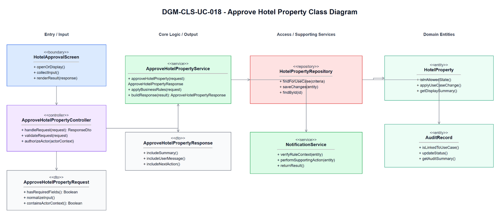

**Figure 3.18-1: Class Diagram of UC-018 Approve Hotel Property**

## 3.18.3 Class Specifications

This part explains the key methods shown in the class diagram. The classes are conceptual design assumptions unless source code is inspected.

### HotelApprovalScreen Class

**Description:** Boundary object for the user-visible or scheduled entry point of UC-018 Approve Hotel Property.

| No | Method | Description |
|---:|---|---|
| 1 | `openOrDisplay()` | Displays the use-case screen or activates the scheduled entry point described by the SRS. |
| 2 | `collectInput()` | Collects actor input or scheduler criteria before request submission. |
| 3 | `renderResult(response)` | Displays the result, validation message, or next action to the actor. |

### ApproveHotelPropertyController Class

**Description:** API/application entry controller for UC-018 Approve Hotel Property.

| No | Method | Description |
|---:|---|---|
| 1 | `handleRequest(request)` | Receives the request from the boundary and delegates the business operation to the service. |
| 2 | `validateRequest(request)` | Checks required request shape before business rule execution. |
| 3 | `authorizeActor(actorContext)` | Verifies that the current actor may execute this use case and related hotel/platform scope. |

### ApproveHotelPropertyRequest Class

**Description:** Request DTO carrying input for UC-018 Approve Hotel Property.

| No | Method | Description |
|---:|---|---|
| 1 | `hasRequiredFields()` | Returns whether mandatory fields from the SRS screen/use-case step are present. |
| 2 | `normalizeInput()` | Normalizes filter, status, note, amount, date, or reference input before service validation. |
| 3 | `containsActorContext()` | Confirms the request carries the authenticated actor or scheduler context needed for authorization. |

### ApproveHotelPropertyService Class

**Description:** Application service that coordinates the main flow, business rules, persistence, and response creation for Approve Hotel Property.

| No | Method | Description |
|---:|---|---|
| 1 | `approveHotelProperty(request)` | Executes the UC-018 main flow and returns a response for the boundary. |
| 2 | `applyBusinessRules(request)` | Applies the related SRS business rules and state-transition constraints. |
| 3 | `buildResponse(result)` | Builds success, empty-state, or validation responses without exposing unauthorized data. |

### HotelPropertyRepository Class

**Description:** Repository abstraction for loading and saving data required by Approve Hotel Property.

| No | Method | Description |
|---:|---|---|
| 1 | `findForUseCase(criteria)` | Loads the entity state required for validation and display. |
| 2 | `findById(id)` | Retrieves a specific record within actor, hotel, or platform scope. |
| 3 | `saveChanges(entity)` | Persists allowed state changes when the use case modifies data. |

### NotificationService Class

**Description:** Supporting service or integration used by UC-018 Approve Hotel Property.

| No | Method | Description |
|---:|---|---|
| 1 | `verifyRuleContext(entity)` | Checks specialized policy, authorization, calculation, notification, or external status context. |
| 2 | `performSupportingAction(entity)` | Performs notification, calculation, audit, or external reconciliation support when required. |
| 3 | `returnResult()` | Returns the supporting result to the application service for final response composition. |

### ApproveHotelPropertyResponse Class

**Description:** Response DTO returned by UC-018 Approve Hotel Property.

| No | Method | Description |
|---:|---|---|
| 1 | `includeSummary()` | Adds the display or operation summary needed by the screen. |
| 2 | `includeUserMessage()` | Adds the user-facing success, empty-state, or validation message. |
| 3 | `includeNextAction()` | Adds the next available action when the SRS flow continues or returns for correction. |

### HotelProperty Class

**Description:** Hotel listed and managed on the platform.

| No | Method | Description |
|---:|---|---|
| 1 | `isInAllowedState()` | Determines whether the entity state allows the requested use-case operation. |
| 2 | `applyUseCaseChange()` | Applies the state or data change permitted by the validated flow. |
| 3 | `getDisplaySummary()` | Provides safe summary data for the response or audit record. |

### AuditRecord Class

**Description:** Administrative, financial, staff, booking, room, housekeeping, and maintenance action audit record.

| No | Method | Description |
|---:|---|---|
| 1 | `isInAllowedState()` | Determines whether the entity state allows the requested use-case operation. |
| 2 | `applyUseCaseChange()` | Applies the state or data change permitted by the validated flow. |
| 3 | `getDisplaySummary()` | Provides safe summary data for the response or audit record. |

## 3.18.4 Sequence Diagram

This part presents the sequence diagrams for UC-018 Approve Hotel Property. The main-flow diagram shows only the successful scenario. Each alternative/error scenario has its own diagram.

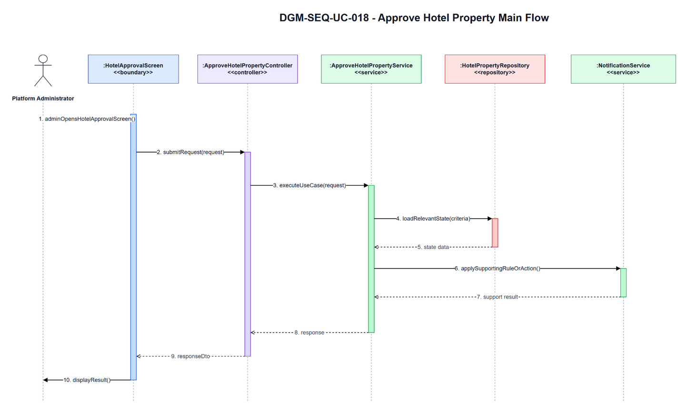

**Figure 3.18-2: Sequence Diagram of UC-018 Approve Hotel Property - Main Flow**

### AT-UC018-06A - Missing rejection reason

- **Branch from Main Step:** 6
- **Condition:** Missing rejection reason
- **Expected Response:** Please enter a rejection reason.

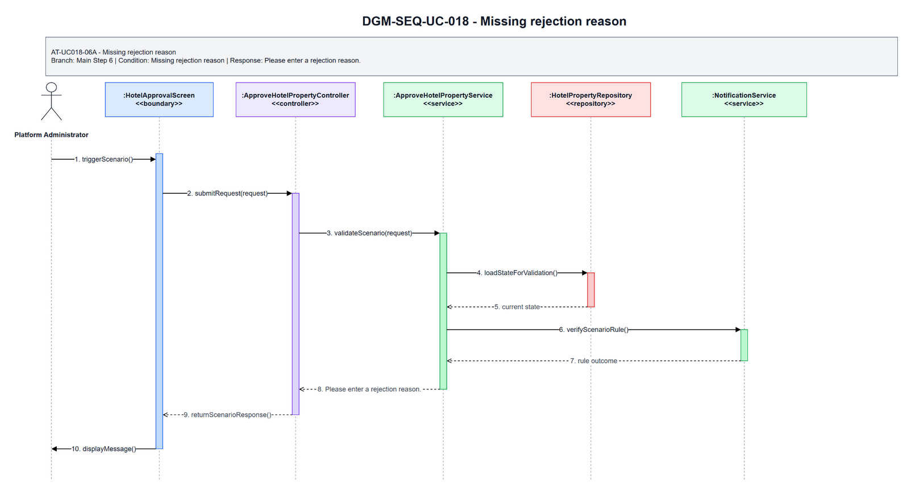

**Figure 3.18-3: Sequence Diagram of UC-018 Approve Hotel Property - AT-UC018-06A Missing rejection reason**

### AT-UC018-06B - Already reviewed

- **Branch from Main Step:** 6
- **Condition:** Already reviewed
- **Expected Response:** This hotel submission has already been reviewed. Please refresh the page.

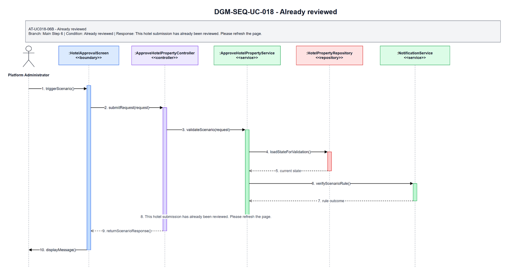

**Figure 3.18-4: Sequence Diagram of UC-018 Approve Hotel Property - AT-UC018-06B Already reviewed**

### Validation, Authorization, Transaction, and Error Handling Notes

| Area | Design |
|---|---|
| Validation | Validate required input, current entity status, date/amount/reference values, and SRS business rules before any state change. |
| Authorization | Allow only Platform Administrator according to the SRS actor, role, hotel-scope, or platform-scope precondition. |
| Transaction | Use a single application transaction for validated state changes, persistence updates, audit records, and notification records where applicable. |
| Error Handling | AT-UC018-06A returns "Please enter a rejection reason."; AT-UC018-06B returns "This hotel submission has already been reviewed. Please refresh the page.". |
| Privacy | Return only fields allowed for the current role and scope; staff roles must not receive unrelated customer, platform finance, or cross-hotel data. |

## Assumptions and Open Issues

- ASSUMP-UC018-001: Controller, service, repository, DTO, and entity class names are conceptual SDD design names because no source implementation was inspected.
- ASSUMP-UC018-002: Final API routes, database column names, and UI widget names may differ from these SDD class names but must preserve the traced SRS behavior.
- OQ-UC018-001: Confirm final implementation class/package names before treating the conceptual design as code-level documentation.

# 3.19 UC-019 - Manage Commission Rate

## 3.19.1 Design Purpose

This section describes the detailed design for **UC-019 Manage Commission Rate**. The use case covers Set commission rate per approved hotel. The design is based on the SRS/SDD only; class names and methods are conceptual design assumptions because no implementation codebase was inspected.

**Related SRS items:** FEAT-ADMIN-FINANCE, UC-019, SCR-038, ENT-020, BR-FIN-001, BR-ADMIN-002, BR-AUDIT-001, MSG-FIN-002, MSG-ADMIN-002, MSG-ADMIN-005, TR-019, AT-UC019-04A, AT-UC019-04B.

**Precondition:** Platform Administrator authenticated; hotel exists.

**Trigger:** Admin opens Commission Management.

**Post-condition:** POS-01: Commission rate is saved for future booking snapshots.

The flow must:

- Main step 1: Platform Administrator admin opens Commission Management.
- Main step 2: System displays hotels and current rates.
- Main step 3: Platform Administrator admin selects hotel and enters new rate/note/effective date.
- Main step 4: System validates rate range and effective date.
- Main step 5: System records rate for future bookings.
- Main step 6: System preserves existing booking snapshots.
- Main step 7: System records audit and displays success.
- Enforce related business rules: BR-FIN-001, BR-ADMIN-002, BR-AUDIT-001.
- Return a separate scenario response for each alternative/error flow: AT-UC019-04A, AT-UC019-04B.

## 3.19.2 Class Diagram

This part presents the class diagram for UC-019 Manage Commission Rate.

**Figure 3.19-1: Class Diagram of UC-019 Manage Commission Rate**

## 3.19.3 Class Specifications

This part explains the key methods shown in the class diagram. The classes are conceptual design assumptions unless source code is inspected.

### CommissionManagementScreen Class

**Description:** Boundary object for the user-visible or scheduled entry point of UC-019 Manage Commission Rate.

| No | Method | Description |
|---:|---|---|
| 1 | `openOrDisplay()` | Displays the use-case screen or activates the scheduled entry point described by the SRS. |
| 2 | `collectInput()` | Collects actor input or scheduler criteria before request submission. |
| 3 | `renderResult(response)` | Displays the result, validation message, or next action to the actor. |

### ManageCommissionRateController Class

**Description:** API/application entry controller for UC-019 Manage Commission Rate.

| No | Method | Description |
|---:|---|---|
| 1 | `handleRequest(request)` | Receives the request from the boundary and delegates the business operation to the service. |
| 2 | `validateRequest(request)` | Checks required request shape before business rule execution. |
| 3 | `authorizeActor(actorContext)` | Verifies that the current actor may execute this use case and related hotel/platform scope. |

### ManageCommissionRateRequest Class

**Description:** Request DTO carrying input for UC-019 Manage Commission Rate.

| No | Method | Description |
|---:|---|---|
| 1 | `hasRequiredFields()` | Returns whether mandatory fields from the SRS screen/use-case step are present. |
| 2 | `normalizeInput()` | Normalizes filter, status, note, amount, date, or reference input before service validation. |
| 3 | `containsActorContext()` | Confirms the request carries the authenticated actor or scheduler context needed for authorization. |

### ManageCommissionRateService Class

**Description:** Application service that coordinates the main flow, business rules, persistence, and response creation for Manage Commission Rate.

| No | Method | Description |
|---:|---|---|
| 1 | `manageCommissionRate(request)` | Executes the UC-019 main flow and returns a response for the boundary. |
| 2 | `applyBusinessRules(request)` | Applies the related SRS business rules and state-transition constraints. |
| 3 | `buildResponse(result)` | Builds success, empty-state, or validation responses without exposing unauthorized data. |

### CommissionRecordRepository Class

**Description:** Repository abstraction for loading and saving data required by Manage Commission Rate.

| No | Method | Description |
|---:|---|---|
| 1 | `findForUseCase(criteria)` | Loads the entity state required for validation and display. |
| 2 | `findById(id)` | Retrieves a specific record within actor, hotel, or platform scope. |
| 3 | `saveChanges(entity)` | Persists allowed state changes when the use case modifies data. |

### CommissionPolicyService Class

**Description:** Supporting service or integration used by UC-019 Manage Commission Rate.

| No | Method | Description |
|---:|---|---|
| 1 | `verifyRuleContext(entity)` | Checks specialized policy, authorization, calculation, notification, or external status context. |
| 2 | `performSupportingAction(entity)` | Performs notification, calculation, audit, or external reconciliation support when required. |
| 3 | `returnResult()` | Returns the supporting result to the application service for final response composition. |

### ManageCommissionRateResponse Class

**Description:** Response DTO returned by UC-019 Manage Commission Rate.

| No | Method | Description |
|---:|---|---|
| 1 | `includeSummary()` | Adds the display or operation summary needed by the screen. |
| 2 | `includeUserMessage()` | Adds the user-facing success, empty-state, or validation message. |
| 3 | `includeNextAction()` | Adds the next available action when the SRS flow continues or returns for correction. |

### CommissionRecord Class

**Description:** Platform commission calculated for a booking.

| No | Method | Description |
|---:|---|---|
| 1 | `isInAllowedState()` | Determines whether the entity state allows the requested use-case operation. |
| 2 | `applyUseCaseChange()` | Applies the state or data change permitted by the validated flow. |
| 3 | `getDisplaySummary()` | Provides safe summary data for the response or audit record. |

## 3.19.4 Sequence Diagram

This part presents the sequence diagrams for UC-019 Manage Commission Rate. The main-flow diagram shows only the successful scenario. Each alternative/error scenario has its own diagram.

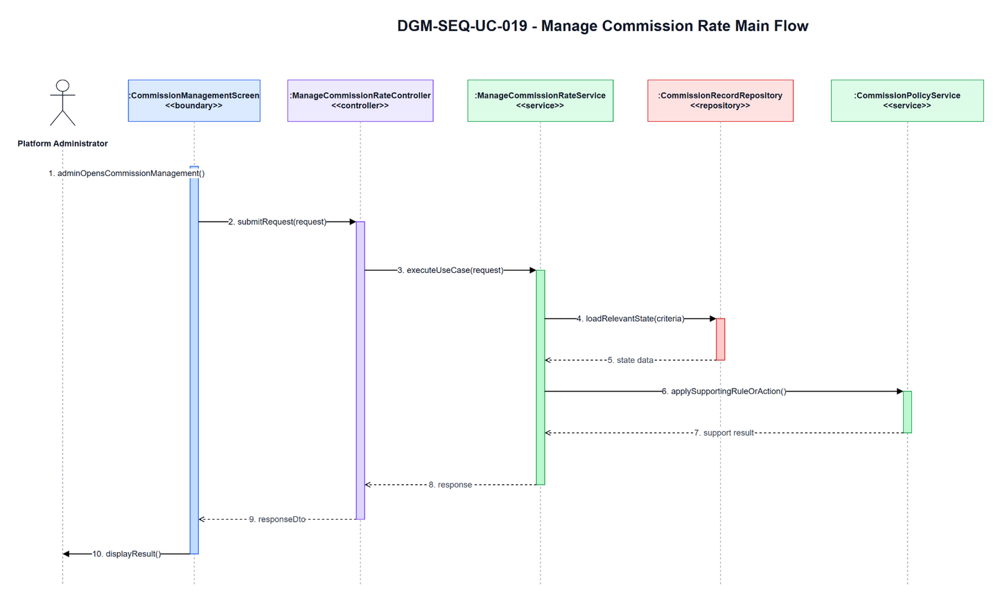

**Figure 3.19-2: Sequence Diagram of UC-019 Manage Commission Rate - Main Flow**

### AT-UC019-04A - Invalid rate

- **Branch from Main Step:** 4
- **Condition:** Invalid rate
- **Expected Response:** Please enter a valid commission rate.

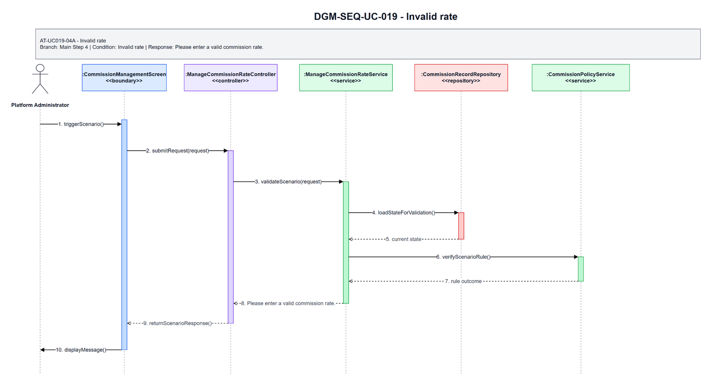

**Figure 3.19-3: Sequence Diagram of UC-019 Manage Commission Rate - AT-UC019-04A Invalid rate**

### AT-UC019-04B - Hotel not approved

- **Branch from Main Step:** 4
- **Condition:** Hotel not approved
- **Expected Response:** Commission rate can be configured only for an approved hotel.

**Figure 3.19-4: Sequence Diagram of UC-019 Manage Commission Rate - AT-UC019-04B Hotel not approved**

### Validation, Authorization, Transaction, and Error Handling Notes

| Area | Design |
|---|---|
| Validation | Validate required input, current entity status, date/amount/reference values, and SRS business rules before any state change. |
| Authorization | Allow only Platform Administrator according to the SRS actor, role, hotel-scope, or platform-scope precondition. |
| Transaction | Use a single application transaction for validated state changes, persistence updates, audit records, and notification records where applicable. |
| Error Handling | AT-UC019-04A returns "Please enter a valid commission rate."; AT-UC019-04B returns "Commission rate can be configured only for an approved hotel.". |
| Privacy | Return only fields allowed for the current role and scope; staff roles must not receive unrelated customer, platform finance, or cross-hotel data. |

## Assumptions and Open Issues

- ASSUMP-UC019-001: Controller, service, repository, DTO, and entity class names are conceptual SDD design names because no source implementation was inspected.
- ASSUMP-UC019-002: Final API routes, database column names, and UI widget names may differ from these SDD class names but must preserve the traced SRS behavior.
- OQ-UC019-001: Confirm final implementation class/package names before treating the conceptual design as code-level documentation.

# 3.20 UC-020 - Reconcile Payment

## 3.20.1 Design Purpose

This section describes the detailed design for **UC-020 Reconcile Payment**. The use case covers Review payment transaction status and mark reconciliation result. The design is based on the SRS/SDD only; class names and methods are conceptual design assumptions because no implementation codebase was inspected.

**Related SRS items:** FEAT-ADMIN-FINANCE, UC-020, SCR-039, NSF-001, ENT-016, ENT-024, BR-PAY-003, BR-FIN-002, BR-ADMIN-003, BR-AUDIT-001, MSG-FIN-003, MSG-FIN-004, TR-020, AT-UC020-06A, AT-UC020-06B.

**Precondition:** Platform Administrator authenticated; payment transaction exists.

**Trigger:** Admin opens Payment Reconciliation.

**Post-condition:** POS-01: Payment transaction reconciliation status is updated and audit is recorded.

The flow must:

- Main step 1: Platform Administrator admin opens Payment Reconciliation.
- Main step 2: System displays transactions with filters.
- Main step 3: Platform Administrator admin selects transaction.
- Main step 4: System displays payment, booking, provider reference, amount, and reconciliation status.
- Main step 5: Platform Administrator admin marks Reconciled or Exception and enters note if required.
- Main step 6: System validates decision, required note, current reconciliation state, and duplicate/concurrent update guard.
- Main step 7: System records reconciliation status and audit if the transaction is still eligible for update.
- Continue through the remaining SRS main-flow steps until the UC-020 post-condition is reached.
- Enforce related business rules: BR-PAY-003, BR-FIN-002, BR-ADMIN-003, BR-AUDIT-001.
- Return a separate scenario response for each alternative/error flow: AT-UC020-06A, AT-UC020-06B.

## 3.20.2 Class Diagram

This part presents the class diagram for UC-020 Reconcile Payment.

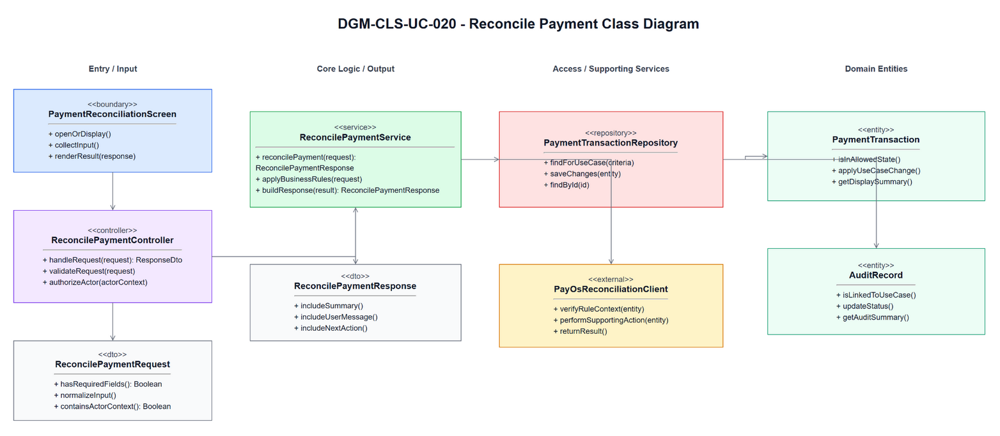

**Figure 3.20-1: Class Diagram of UC-020 Reconcile Payment**

## 3.20.3 Class Specifications

This part explains the key methods shown in the class diagram. The classes are conceptual design assumptions unless source code is inspected.

### PaymentReconciliationScreen Class

**Description:** Boundary object for the user-visible or scheduled entry point of UC-020 Reconcile Payment.

| No | Method | Description |
|---:|---|---|
| 1 | `openOrDisplay()` | Displays the use-case screen or activates the scheduled entry point described by the SRS. |
| 2 | `collectInput()` | Collects actor input or scheduler criteria before request submission. |
| 3 | `renderResult(response)` | Displays the result, validation message, or next action to the actor. |

### ReconcilePaymentController Class

**Description:** API/application entry controller for UC-020 Reconcile Payment.

| No | Method | Description |
|---:|---|---|
| 1 | `handleRequest(request)` | Receives the request from the boundary and delegates the business operation to the service. |
| 2 | `validateRequest(request)` | Checks required request shape before business rule execution. |
| 3 | `authorizeActor(actorContext)` | Verifies that the current actor may execute this use case and related hotel/platform scope. |

### ReconcilePaymentRequest Class

**Description:** Request DTO carrying input for UC-020 Reconcile Payment.

| No | Method | Description |
|---:|---|---|
| 1 | `hasRequiredFields()` | Returns whether mandatory fields from the SRS screen/use-case step are present. |
| 2 | `normalizeInput()` | Normalizes filter, status, note, amount, date, or reference input before service validation. |
| 3 | `containsActorContext()` | Confirms the request carries the authenticated actor or scheduler context needed for authorization. |

### ReconcilePaymentService Class

**Description:** Application service that coordinates the main flow, business rules, persistence, and response creation for Reconcile Payment.

| No | Method | Description |
|---:|---|---|
| 1 | `reconcilePayment(request)` | Executes the UC-020 main flow and returns a response for the boundary. |
| 2 | `applyBusinessRules(request)` | Applies the related SRS business rules and state-transition constraints. |
| 3 | `buildResponse(result)` | Builds success, empty-state, or validation responses without exposing unauthorized data. |

### PaymentTransactionRepository Class

**Description:** Repository abstraction for loading and saving data required by Reconcile Payment.

| No | Method | Description |
|---:|---|---|
| 1 | `findForUseCase(criteria)` | Loads the entity state required for validation and display. |
| 2 | `findById(id)` | Retrieves a specific record within actor, hotel, or platform scope. |
| 3 | `saveChanges(entity)` | Persists allowed state changes when the use case modifies data. |

### PayOsReconciliationClient Class

**Description:** Supporting service or integration used by UC-020 Reconcile Payment.

| No | Method | Description |
|---:|---|---|
| 1 | `verifyRuleContext(entity)` | Checks specialized policy, authorization, calculation, notification, or external status context. |
| 2 | `performSupportingAction(entity)` | Performs notification, calculation, audit, or external reconciliation support when required. |
| 3 | `returnResult()` | Returns the supporting result to the application service for final response composition. |

### ReconcilePaymentResponse Class

**Description:** Response DTO returned by UC-020 Reconcile Payment.

| No | Method | Description |
|---:|---|---|
| 1 | `includeSummary()` | Adds the display or operation summary needed by the screen. |
| 2 | `includeUserMessage()` | Adds the user-facing success, empty-state, or validation message. |
| 3 | `includeNextAction()` | Adds the next available action when the SRS flow continues or returns for correction. |

### PaymentTransaction Class

**Description:** Online payment transaction for Platform Collect booking.

| No | Method | Description |
|---:|---|---|
| 1 | `isInAllowedState()` | Determines whether the entity state allows the requested use-case operation. |
| 2 | `applyUseCaseChange()` | Applies the state or data change permitted by the validated flow. |
| 3 | `getDisplaySummary()` | Provides safe summary data for the response or audit record. |

### AuditRecord Class

**Description:** Administrative, financial, staff, booking, room, housekeeping, and maintenance action audit record.

| No | Method | Description |
|---:|---|---|
| 1 | `isInAllowedState()` | Determines whether the entity state allows the requested use-case operation. |
| 2 | `applyUseCaseChange()` | Applies the state or data change permitted by the validated flow. |
| 3 | `getDisplaySummary()` | Provides safe summary data for the response or audit record. |

## 3.20.4 Sequence Diagram

This part presents the sequence diagrams for UC-020 Reconcile Payment. The main-flow diagram shows only the successful scenario. Each alternative/error scenario has its own diagram.

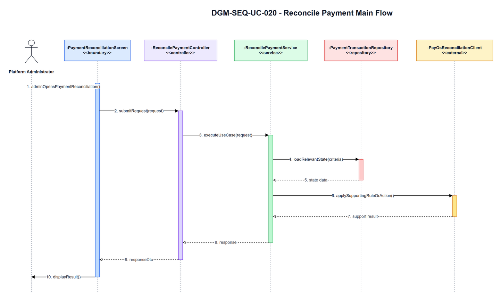

**Figure 3.20-2: Sequence Diagram of UC-020 Reconcile Payment - Main Flow**

### AT-UC020-06A - Amount/status mismatch

- **Branch from Main Step:** 6
- **Condition:** Amount/status mismatch
- **Expected Response:** Payment reconciliation status has been updated successfully.

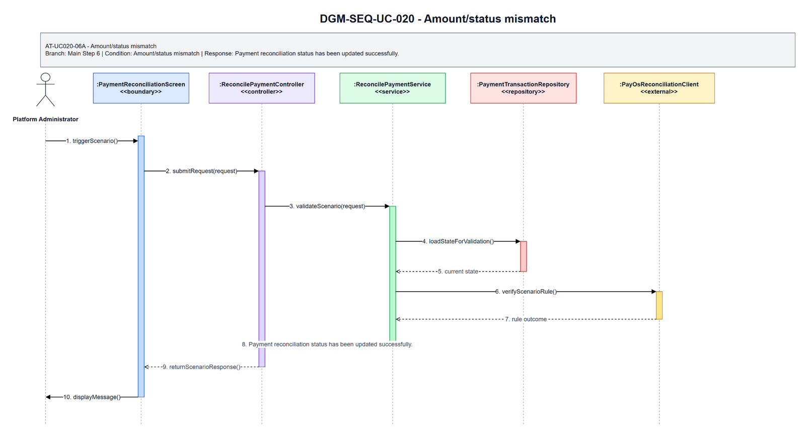

**Figure 3.20-3: Sequence Diagram of UC-020 Reconcile Payment - AT-UC020-06A Amount/status mismatch**

### AT-UC020-06B - Duplicate reconciliation action or already reconciled transaction

- **Branch from Main Step:** 6
- **Condition:** Duplicate reconciliation action or already reconciled transaction
- **Expected Response:** Payment reconciliation status has been updated successfully.

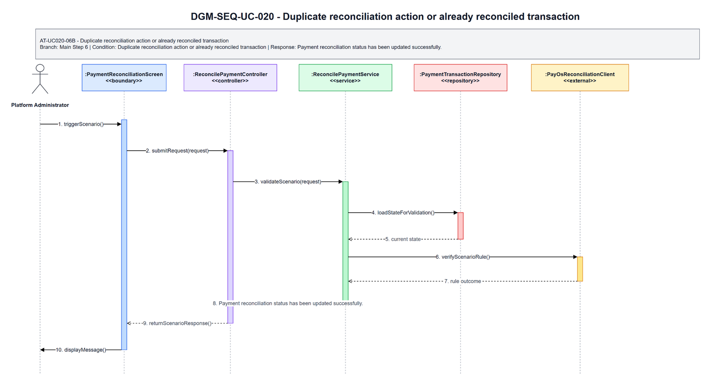

**Figure 3.20-4: Sequence Diagram of UC-020 Reconcile Payment - AT-UC020-06B Duplicate reconciliation action or already reconciled transaction**

### Validation, Authorization, Transaction, and Error Handling Notes

| Area | Design |
|---|---|
| Validation | Validate required input, current entity status, date/amount/reference values, and SRS business rules before any state change. |
| Authorization | Allow only Platform Administrator according to the SRS actor, role, hotel-scope, or platform-scope precondition. |
| Transaction | Use a single application transaction for validated state changes, persistence updates, audit records, and notification records where applicable. |
| Error Handling | AT-UC020-06A returns "Payment reconciliation status has been updated successfully."; AT-UC020-06B returns "Payment reconciliation status has been updated successfully.". |
| Privacy | Return only fields allowed for the current role and scope; staff roles must not receive unrelated customer, platform finance, or cross-hotel data. |

## Assumptions and Open Issues

- ASSUMP-UC020-001: Controller, service, repository, DTO, and entity class names are conceptual SDD design names because no source implementation was inspected.
- ASSUMP-UC020-002: Final API routes, database column names, and UI widget names may differ from these SDD class names but must preserve the traced SRS behavior.
- OQ-UC020-001: Confirm final implementation class/package names before treating the conceptual design as code-level documentation.

# 3.21 UC-021 - Process Refund Status

## 3.21.1 Design Purpose

This section describes the detailed design for **UC-021 Process Refund Status**. The use case covers Record manual refund decision and refund status. The design is based on the SRS/SDD only; class names and methods are conceptual design assumptions because no implementation codebase was inspected.

**Related SRS items:** FEAT-ADMIN-FINANCE, UC-021, SCR-040, ENT-018, ENT-024, BR-REF-001, BR-REF-002, BR-FIN-002, BR-AUDIT-001, MSG-REF-001, MSG-REF-003, MSG-REF-004, TR-021, AT-UC021-06A, AT-UC021-06B.

**Precondition:** Platform Administrator authenticated; RefundRecord exists.

**Trigger:** Admin opens Refund Management.

**Post-condition:** POS-01: Refund status is updated and customer-visible refund status changes accordingly.

The flow must:

- Main step 1: Platform Administrator admin opens Refund Management.
- Main step 2: System displays refund request list.
- Main step 3: Platform Administrator admin selects refund.
- Main step 4: System displays booking, payment, policy, paid amount, requested amount, and current refund status.
- Main step 5: Platform Administrator admin approves/rejects/marks processed and enters amount/note if required.
- Main step 6: System validates amount and transition.
- Main step 7: System updates refund status and records audit.
- Continue through the remaining SRS main-flow steps until the UC-021 post-condition is reached.
- Enforce related business rules: BR-REF-001, BR-REF-002, BR-FIN-002, BR-AUDIT-001.
- Return a separate scenario response for each alternative/error flow: AT-UC021-06A, AT-UC021-06B.

## 3.21.2 Class Diagram

This part presents the class diagram for UC-021 Process Refund Status.

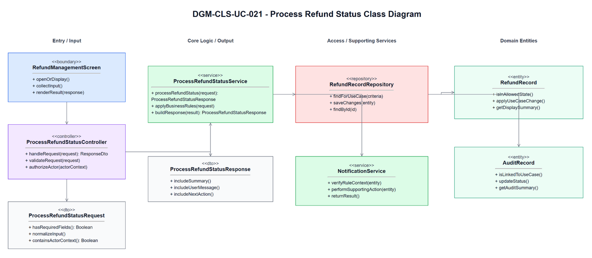

**Figure 3.21-1: Class Diagram of UC-021 Process Refund Status**

## 3.21.3 Class Specifications

This part explains the key methods shown in the class diagram. The classes are conceptual design assumptions unless source code is inspected.

### RefundManagementScreen Class

**Description:** Boundary object for the user-visible or scheduled entry point of UC-021 Process Refund Status.

| No | Method | Description |
|---:|---|---|
| 1 | `openOrDisplay()` | Displays the use-case screen or activates the scheduled entry point described by the SRS. |
| 2 | `collectInput()` | Collects actor input or scheduler criteria before request submission. |
| 3 | `renderResult(response)` | Displays the result, validation message, or next action to the actor. |

### ProcessRefundStatusController Class

**Description:** API/application entry controller for UC-021 Process Refund Status.

| No | Method | Description |
|---:|---|---|
| 1 | `handleRequest(request)` | Receives the request from the boundary and delegates the business operation to the service. |
| 2 | `validateRequest(request)` | Checks required request shape before business rule execution. |
| 3 | `authorizeActor(actorContext)` | Verifies that the current actor may execute this use case and related hotel/platform scope. |

### ProcessRefundStatusRequest Class

**Description:** Request DTO carrying input for UC-021 Process Refund Status.

| No | Method | Description |
|---:|---|---|
| 1 | `hasRequiredFields()` | Returns whether mandatory fields from the SRS screen/use-case step are present. |
| 2 | `normalizeInput()` | Normalizes filter, status, note, amount, date, or reference input before service validation. |
| 3 | `containsActorContext()` | Confirms the request carries the authenticated actor or scheduler context needed for authorization. |

### ProcessRefundStatusService Class

**Description:** Application service that coordinates the main flow, business rules, persistence, and response creation for Process Refund Status.

| No | Method | Description |
|---:|---|---|
| 1 | `processRefundStatus(request)` | Executes the UC-021 main flow and returns a response for the boundary. |
| 2 | `applyBusinessRules(request)` | Applies the related SRS business rules and state-transition constraints. |
| 3 | `buildResponse(result)` | Builds success, empty-state, or validation responses without exposing unauthorized data. |

### RefundRecordRepository Class

**Description:** Repository abstraction for loading and saving data required by Process Refund Status.

| No | Method | Description |
|---:|---|---|
| 1 | `findForUseCase(criteria)` | Loads the entity state required for validation and display. |
| 2 | `findById(id)` | Retrieves a specific record within actor, hotel, or platform scope. |
| 3 | `saveChanges(entity)` | Persists allowed state changes when the use case modifies data. |

### NotificationService Class

**Description:** Supporting service or integration used by UC-021 Process Refund Status.

| No | Method | Description |
|---:|---|---|
| 1 | `verifyRuleContext(entity)` | Checks specialized policy, authorization, calculation, notification, or external status context. |
| 2 | `performSupportingAction(entity)` | Performs notification, calculation, audit, or external reconciliation support when required. |
| 3 | `returnResult()` | Returns the supporting result to the application service for final response composition. |

### ProcessRefundStatusResponse Class

**Description:** Response DTO returned by UC-021 Process Refund Status.

| No | Method | Description |
|---:|---|---|
| 1 | `includeSummary()` | Adds the display or operation summary needed by the screen. |
| 2 | `includeUserMessage()` | Adds the user-facing success, empty-state, or validation message. |
| 3 | `includeNextAction()` | Adds the next available action when the SRS flow continues or returns for correction. |

### RefundRecord Class

**Description:** Refund eligibility, decision, and manual processing status.

| No | Method | Description |
|---:|---|---|
| 1 | `isInAllowedState()` | Determines whether the entity state allows the requested use-case operation. |
| 2 | `applyUseCaseChange()` | Applies the state or data change permitted by the validated flow. |
| 3 | `getDisplaySummary()` | Provides safe summary data for the response or audit record. |

### AuditRecord Class

**Description:** Administrative, financial, staff, booking, room, housekeeping, and maintenance action audit record.

| No | Method | Description |
|---:|---|---|
| 1 | `isInAllowedState()` | Determines whether the entity state allows the requested use-case operation. |
| 2 | `applyUseCaseChange()` | Applies the state or data change permitted by the validated flow. |
| 3 | `getDisplaySummary()` | Provides safe summary data for the response or audit record. |

## 3.21.4 Sequence Diagram

This part presents the sequence diagrams for UC-021 Process Refund Status. The main-flow diagram shows only the successful scenario. Each alternative/error scenario has its own diagram.

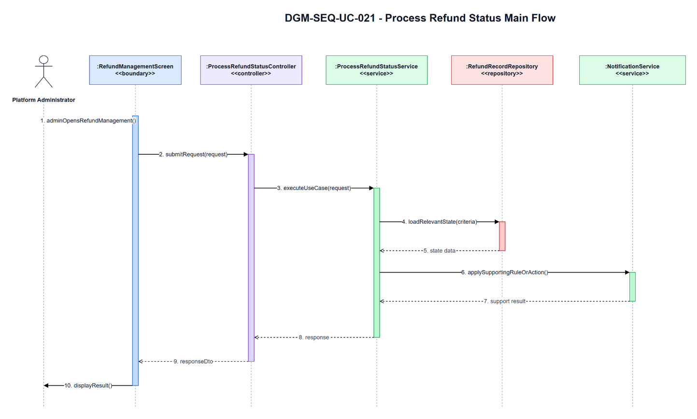

**Figure 3.21-2: Sequence Diagram of UC-021 Process Refund Status - Main Flow**

### AT-UC021-06A - Invalid transition

- **Branch from Main Step:** 6
- **Condition:** Invalid transition
- **Expected Response:** The selected refund status transition is not allowed.

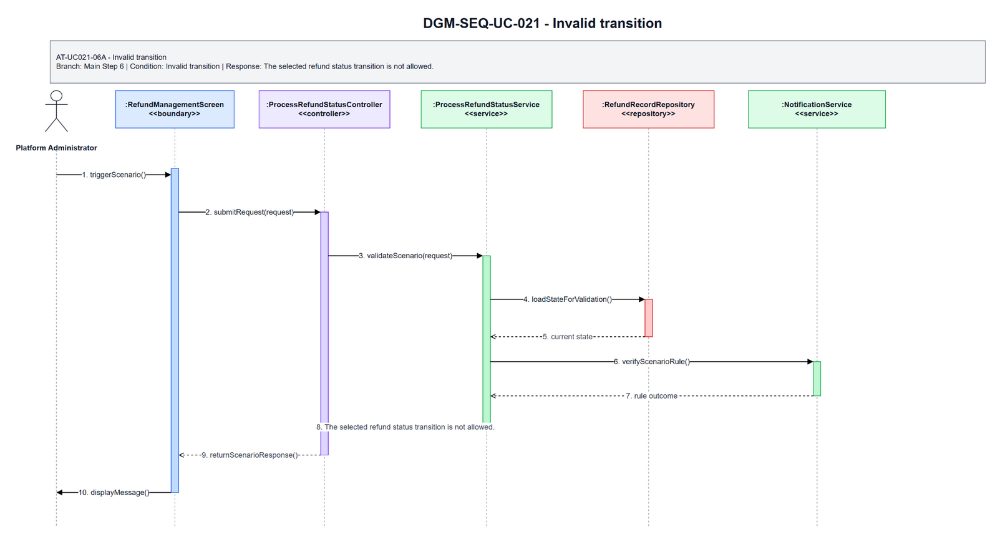

**Figure 3.21-3: Sequence Diagram of UC-021 Process Refund Status - AT-UC021-06A Invalid transition**

### AT-UC021-06B - Amount exceeds paid amount

- **Branch from Main Step:** 6
- **Condition:** Amount exceeds paid amount
- **Expected Response:** Refund amount cannot exceed the paid amount.

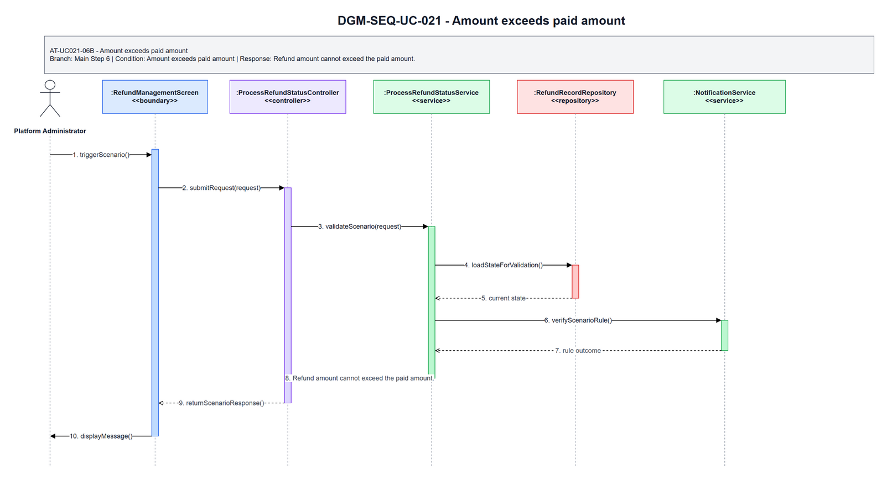

**Figure 3.21-4: Sequence Diagram of UC-021 Process Refund Status - AT-UC021-06B Amount exceeds paid amount**

### Validation, Authorization, Transaction, and Error Handling Notes

| Area | Design |
|---|---|
| Validation | Validate required input, current entity status, date/amount/reference values, and SRS business rules before any state change. |
| Authorization | Allow only Platform Administrator according to the SRS actor, role, hotel-scope, or platform-scope precondition. |
| Transaction | Use a single application transaction for validated state changes, persistence updates, audit records, and notification records where applicable. |
| Error Handling | AT-UC021-06A returns "The selected refund status transition is not allowed."; AT-UC021-06B returns "Refund amount cannot exceed the paid amount.". |
| Privacy | Return only fields allowed for the current role and scope; staff roles must not receive unrelated customer, platform finance, or cross-hotel data. |

## Assumptions and Open Issues

- ASSUMP-UC021-001: Controller, service, repository, DTO, and entity class names are conceptual SDD design names because no source implementation was inspected.
- ASSUMP-UC021-002: Final API routes, database column names, and UI widget names may differ from these SDD class names but must preserve the traced SRS behavior.
- OQ-UC021-001: Confirm final implementation class/package names before treating the conceptual design as code-level documentation.

# 3.22 UC-022 - Mark Settlement

## 3.22.1 Design Purpose

This section describes the detailed design for **UC-022 Mark Settlement**. The use case covers Mark hotel payable settlement or commission collection as completed. The design is based on the SRS/SDD only; class names and methods are conceptual design assumptions because no implementation codebase was inspected.

**Related SRS items:** FEAT-ADMIN-FINANCE, UC-022, SCR-041, ENT-021, ENT-022, ENT-024, BR-FIN-002, BR-FIN-003, BR-FIN-005, BR-FIN-007, BR-AUDIT-001, MSG-FIN-001, MSG-FIN-005, MSG-FIN-006, MSG-FIN-007, TR-022, AT-UC022-07A, AT-UC022-07B, AT-UC022-07C, AT-UC022-07D.

**Precondition:** Platform Administrator authenticated; settlement or commission candidate records exist.

**Trigger:** Admin opens Settlement Management.

**Post-condition:** POS-01: Settlement or commission collection status is updated and notification/audit is recorded.

The flow must:

- Main step 1: Platform Administrator admin opens Settlement Management.
- Main step 2: System calculates eligibility by Settlement Type: Hotel Settlement uses Platform Collect reconciliation/refund/stay status, while Commission Collection uses CommissionRecord and Pay-at-Property collection/receivable status without requiring payOS reconciliation.
- Main step 3: System displays eligible hotel settlement records and eligible commission collection records only.
- Main step 4: Platform Administrator admin selects record/batch.
- Main step 5: System displays expected amount, settlement type, related items, hotel, applicable reconciliation/refund/commission/collection state, exception state, and current settlement status.
- Main step 6: Platform Administrator admin enters settlement date, amount, reference, and note.
- Main step 7: System validates selected settlement type eligibility, amount, required reference/date, applicable unresolved refund/reconciliation/commission/collection state, and exception state.
- Continue through the remaining SRS main-flow steps until the UC-022 post-condition is reached.
- Enforce related business rules: BR-FIN-002, BR-FIN-003, BR-FIN-005, BR-FIN-007, BR-AUDIT-001.
- Return a separate scenario response for each alternative/error flow: AT-UC022-07A, AT-UC022-07B, AT-UC022-07C, AT-UC022-07D.

## 3.22.2 Class Diagram

This part presents the class diagram for UC-022 Mark Settlement.

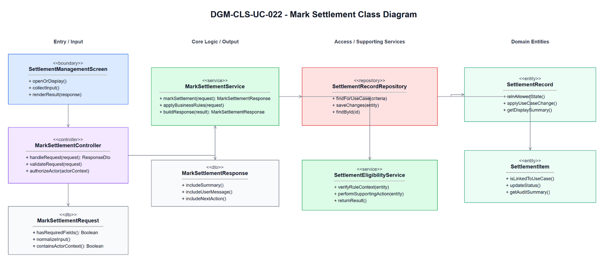

**Figure 3.22-1: Class Diagram of UC-022 Mark Settlement**

## 3.22.3 Class Specifications

This part explains the key methods shown in the class diagram. The classes are conceptual design assumptions unless source code is inspected.

### SettlementManagementScreen Class

**Description:** Boundary object for the user-visible or scheduled entry point of UC-022 Mark Settlement.

| No | Method | Description |
|---:|---|---|
| 1 | `openOrDisplay()` | Displays the use-case screen or activates the scheduled entry point described by the SRS. |
| 2 | `collectInput()` | Collects actor input or scheduler criteria before request submission. |
| 3 | `renderResult(response)` | Displays the result, validation message, or next action to the actor. |

### MarkSettlementController Class

**Description:** API/application entry controller for UC-022 Mark Settlement.

| No | Method | Description |
|---:|---|---|
| 1 | `handleRequest(request)` | Receives the request from the boundary and delegates the business operation to the service. |
| 2 | `validateRequest(request)` | Checks required request shape before business rule execution. |
| 3 | `authorizeActor(actorContext)` | Verifies that the current actor may execute this use case and related hotel/platform scope. |

### MarkSettlementRequest Class

**Description:** Request DTO carrying input for UC-022 Mark Settlement.

| No | Method | Description |
|---:|---|---|
| 1 | `hasRequiredFields()` | Returns whether mandatory fields from the SRS screen/use-case step are present. |
| 2 | `normalizeInput()` | Normalizes filter, status, note, amount, date, or reference input before service validation. |
| 3 | `containsActorContext()` | Confirms the request carries the authenticated actor or scheduler context needed for authorization. |

### MarkSettlementService Class

**Description:** Application service that coordinates the main flow, business rules, persistence, and response creation for Mark Settlement.

| No | Method | Description |
|---:|---|---|
| 1 | `markSettlement(request)` | Executes the UC-022 main flow and returns a response for the boundary. |
| 2 | `applyBusinessRules(request)` | Applies the related SRS business rules and state-transition constraints. |
| 3 | `buildResponse(result)` | Builds success, empty-state, or validation responses without exposing unauthorized data. |

### SettlementRecordRepository Class

**Description:** Repository abstraction for loading and saving data required by Mark Settlement.

| No | Method | Description |
|---:|---|---|
| 1 | `findForUseCase(criteria)` | Loads the entity state required for validation and display. |
| 2 | `findById(id)` | Retrieves a specific record within actor, hotel, or platform scope. |
| 3 | `saveChanges(entity)` | Persists allowed state changes when the use case modifies data. |

### SettlementEligibilityService Class

**Description:** Supporting service or integration used by UC-022 Mark Settlement.

| No | Method | Description |
|---:|---|---|
| 1 | `verifyRuleContext(entity)` | Checks specialized policy, authorization, calculation, notification, or external status context. |
| 2 | `performSupportingAction(entity)` | Performs notification, calculation, audit, or external reconciliation support when required. |
| 3 | `returnResult()` | Returns the supporting result to the application service for final response composition. |

### MarkSettlementResponse Class

**Description:** Response DTO returned by UC-022 Mark Settlement.

| No | Method | Description |
|---:|---|---|
| 1 | `includeSummary()` | Adds the display or operation summary needed by the screen. |
| 2 | `includeUserMessage()` | Adds the user-facing success, empty-state, or validation message. |
| 3 | `includeNextAction()` | Adds the next available action when the SRS flow continues or returns for correction. |

### SettlementRecord Class

**Description:** Manual hotel settlement or commission collection header.

| No | Method | Description |
|---:|---|---|
| 1 | `isInAllowedState()` | Determines whether the entity state allows the requested use-case operation. |
| 2 | `applyUseCaseChange()` | Applies the state or data change permitted by the validated flow. |
| 3 | `getDisplaySummary()` | Provides safe summary data for the response or audit record. |

### SettlementItem Class

**Description:** Line item linking settlement to booking/commission/payment records.

| No | Method | Description |
|---:|---|---|
| 1 | `isInAllowedState()` | Determines whether the entity state allows the requested use-case operation. |
| 2 | `applyUseCaseChange()` | Applies the state or data change permitted by the validated flow. |
| 3 | `getDisplaySummary()` | Provides safe summary data for the response or audit record. |

## 3.22.4 Sequence Diagram

This part presents the sequence diagrams for UC-022 Mark Settlement. The main-flow diagram shows only the successful scenario. Each alternative/error scenario has its own diagram.

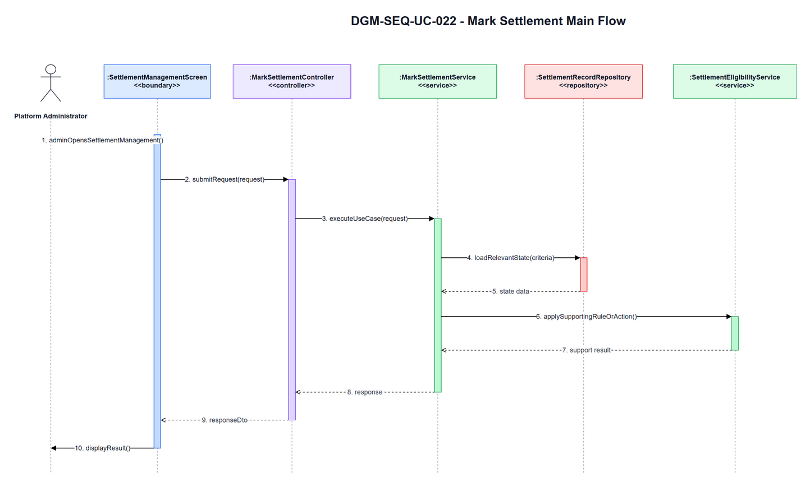

**Figure 3.22-2: Sequence Diagram of UC-022 Mark Settlement - Main Flow**

### AT-UC022-07A - Ineligible record

- **Branch from Main Step:** 7
- **Condition:** Ineligible record
- **Expected Response:** This record is not eligible for settlement or collection.

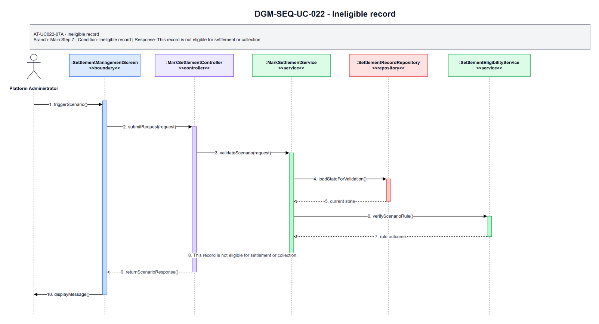

**Figure 3.22-3: Sequence Diagram of UC-022 Mark Settlement - AT-UC022-07A Ineligible record**

### AT-UC022-07B - Amount mismatch

- **Branch from Main Step:** 7
- **Condition:** Amount mismatch
- **Expected Response:** The entered amount does not match the expected amount.

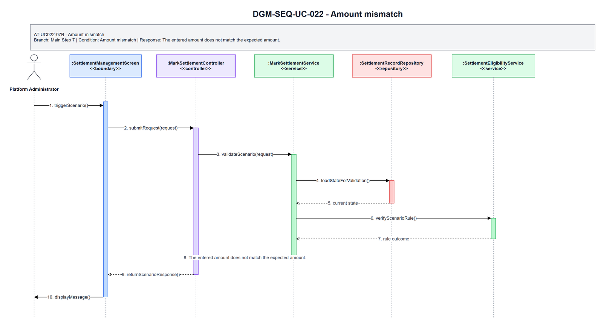

**Figure 3.22-4: Sequence Diagram of UC-022 Mark Settlement - AT-UC022-07B Amount mismatch**

### AT-UC022-07C - Missing settlement date or reference

- **Branch from Main Step:** 7
- **Condition:** Missing settlement date or reference
- **Expected Response:** Please enter the settlement or collection date.

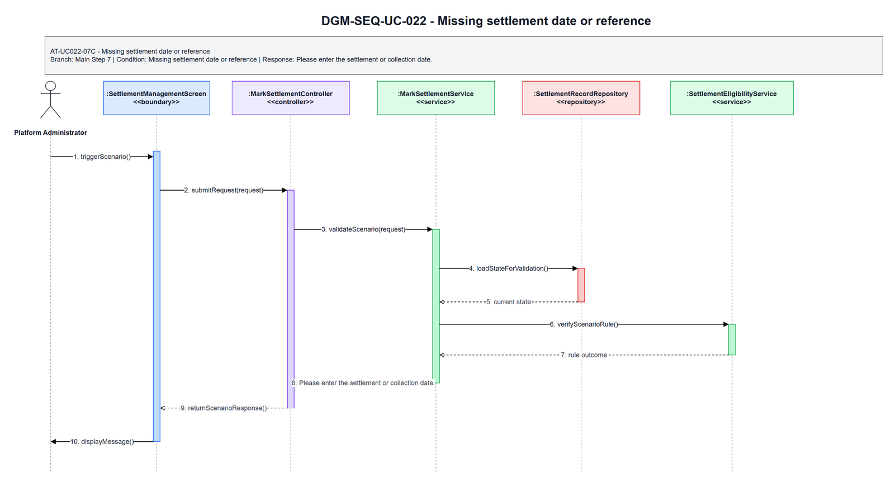

**Figure 3.22-5: Sequence Diagram of UC-022 Mark Settlement - AT-UC022-07C Missing settlement date or reference**

### AT-UC022-07D - Unresolved required prerequisite or finance exception

- **Branch from Main Step:** 7
- **Condition:** Unresolved required prerequisite or finance exception
- **Expected Response:** This record is not eligible for settlement or collection.

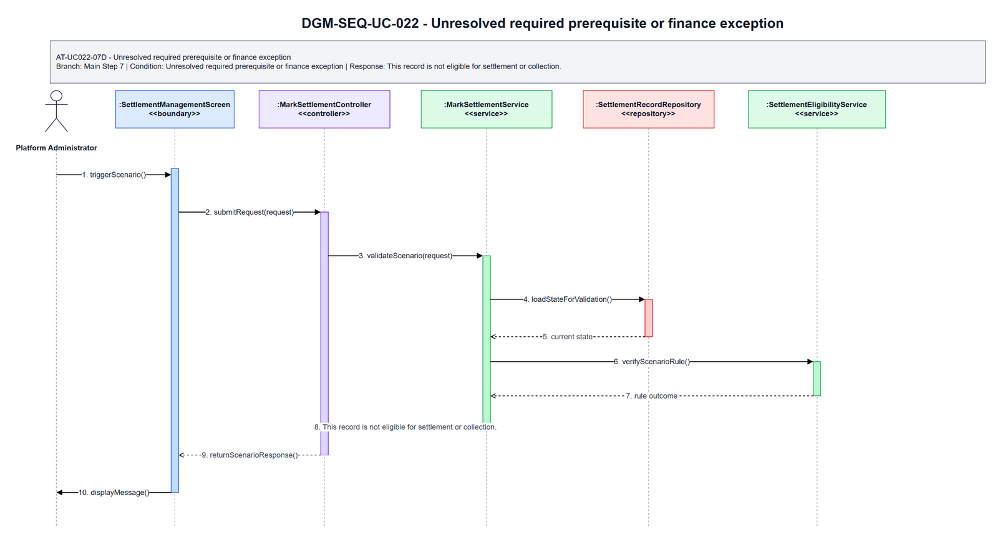

**Figure 3.22-6: Sequence Diagram of UC-022 Mark Settlement - AT-UC022-07D Unresolved required prerequisite or finance exception**

### Validation, Authorization, Transaction, and Error Handling Notes

| Area | Design |
|---|---|
| Validation | Validate required input, current entity status, date/amount/reference values, and SRS business rules before any state change. |
| Authorization | Allow only Platform Administrator according to the SRS actor, role, hotel-scope, or platform-scope precondition. |
| Transaction | Use a single application transaction for validated state changes, persistence updates, audit records, and notification records where applicable. |
| Error Handling | AT-UC022-07A returns "This record is not eligible for settlement or collection."; AT-UC022-07B returns "The entered amount does not match the expected amount."; AT-UC022-07C returns "Please enter the settlement or collection date."; AT-UC022-07D returns "This record is not eligible for settlement or collection.". |
| Privacy | Return only fields allowed for the current role and scope; staff roles must not receive unrelated customer, platform finance, or cross-hotel data. |

## Assumptions and Open Issues

- ASSUMP-UC022-001: Controller, service, repository, DTO, and entity class names are conceptual SDD design names because no source implementation was inspected.
- ASSUMP-UC022-002: Final API routes, database column names, and UI widget names may differ from these SDD class names but must preserve the traced SRS behavior.
- OQ-UC022-001: Confirm final implementation class/package names before treating the conceptual design as code-level documentation.

# 3.23 UC-023 - View Platform Dashboard

## 3.23.1 Design Purpose

This section describes the detailed design for **UC-023 View Platform Dashboard**. The use case covers View platform booking, revenue, commission, payment, refund, and settlement metrics. The design is based on the SRS/SDD only; class names and methods are conceptual design assumptions because no implementation codebase was inspected.

**Related SRS items:** FEAT-ADMIN-REPORT, UC-023, SCR-036, NSF-007, ENT-013, ENT-016, ENT-020, ENT-022, BR-ADMIN-004, MSG-RPT-001, TR-023, AT-UC023-04A.

**Precondition:** Platform Administrator authenticated.

**Trigger:** Admin opens Dashboard.

**Post-condition:** POS-01: Platform dashboard metrics are displayed for the selected filters.

The flow must:

- Main step 1: Platform Administrator admin opens dashboard.
- Main step 2: System displays date/hotel filters and metrics for bookings, revenue, commission, refund, settlement, and hotel approval.
- Main step 3: Platform Administrator admin applies filters.
- Main step 4: System refreshes metrics.
- Main step 5: Platform Administrator admin navigates to details if needed.
- Enforce related business rules: BR-ADMIN-004.
- Return a separate scenario response for each alternative/error flow: AT-UC023-04A.

## 3.23.2 Class Diagram

This part presents the class diagram for UC-023 View Platform Dashboard.

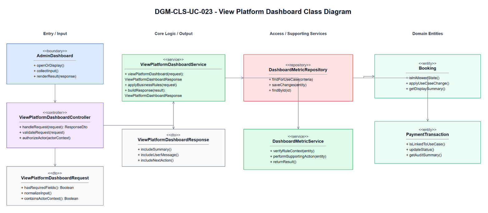

**Figure 3.23-1: Class Diagram of UC-023 View Platform Dashboard**

## 3.23.3 Class Specifications

This part explains the key methods shown in the class diagram. The classes are conceptual design assumptions unless source code is inspected.

### AdminDashboard Class

**Description:** Boundary object for the user-visible or scheduled entry point of UC-023 View Platform Dashboard.

| No | Method | Description |
|---:|---|---|
| 1 | `openOrDisplay()` | Displays the use-case screen or activates the scheduled entry point described by the SRS. |
| 2 | `collectInput()` | Collects actor input or scheduler criteria before request submission. |
| 3 | `renderResult(response)` | Displays the result, validation message, or next action to the actor. |

### ViewPlatformDashboardController Class

**Description:** API/application entry controller for UC-023 View Platform Dashboard.

| No | Method | Description |
|---:|---|---|
| 1 | `handleRequest(request)` | Receives the request from the boundary and delegates the business operation to the service. |
| 2 | `validateRequest(request)` | Checks required request shape before business rule execution. |
| 3 | `authorizeActor(actorContext)` | Verifies that the current actor may execute this use case and related hotel/platform scope. |

### ViewPlatformDashboardRequest Class

**Description:** Request DTO carrying input for UC-023 View Platform Dashboard.

| No | Method | Description |
|---:|---|---|
| 1 | `hasRequiredFields()` | Returns whether mandatory fields from the SRS screen/use-case step are present. |
| 2 | `normalizeInput()` | Normalizes filter, status, note, amount, date, or reference input before service validation. |
| 3 | `containsActorContext()` | Confirms the request carries the authenticated actor or scheduler context needed for authorization. |

### ViewPlatformDashboardService Class

**Description:** Application service that coordinates the main flow, business rules, persistence, and response creation for View Platform Dashboard.

| No | Method | Description |
|---:|---|---|
| 1 | `viewPlatformDashboard(request)` | Executes the UC-023 main flow and returns a response for the boundary. |
| 2 | `applyBusinessRules(request)` | Applies the related SRS business rules and state-transition constraints. |
| 3 | `buildResponse(result)` | Builds success, empty-state, or validation responses without exposing unauthorized data. |

### DashboardMetricRepository Class

**Description:** Repository abstraction for loading and saving data required by View Platform Dashboard.

| No | Method | Description |
|---:|---|---|
| 1 | `findForUseCase(criteria)` | Loads the entity state required for validation and display. |
| 2 | `findById(id)` | Retrieves a specific record within actor, hotel, or platform scope. |
| 3 | `saveChanges(entity)` | Persists allowed state changes when the use case modifies data. |

### DashboardMetricService Class

**Description:** Supporting service or integration used by UC-023 View Platform Dashboard.

| No | Method | Description |
|---:|---|---|
| 1 | `verifyRuleContext(entity)` | Checks specialized policy, authorization, calculation, notification, or external status context. |
| 2 | `performSupportingAction(entity)` | Performs notification, calculation, audit, or external reconciliation support when required. |
| 3 | `returnResult()` | Returns the supporting result to the application service for final response composition. |

### ViewPlatformDashboardResponse Class

**Description:** Response DTO returned by UC-023 View Platform Dashboard.

| No | Method | Description |
|---:|---|---|
| 1 | `includeSummary()` | Adds the display or operation summary needed by the screen. |
| 2 | `includeUserMessage()` | Adds the user-facing success, empty-state, or validation message. |
| 3 | `includeNextAction()` | Adds the next available action when the SRS flow continues or returns for correction. |

### Booking Class

**Description:** Customer reservation for selected hotel and room/date range.

| No | Method | Description |
|---:|---|---|
| 1 | `isInAllowedState()` | Determines whether the entity state allows the requested use-case operation. |
| 2 | `applyUseCaseChange()` | Applies the state or data change permitted by the validated flow. |
| 3 | `getDisplaySummary()` | Provides safe summary data for the response or audit record. |

### PaymentTransaction Class

**Description:** Online payment transaction for Platform Collect booking.

| No | Method | Description |
|---:|---|---|
| 1 | `isInAllowedState()` | Determines whether the entity state allows the requested use-case operation. |
| 2 | `applyUseCaseChange()` | Applies the state or data change permitted by the validated flow. |
| 3 | `getDisplaySummary()` | Provides safe summary data for the response or audit record. |

## 3.23.4 Sequence Diagram

This part presents the sequence diagrams for UC-023 View Platform Dashboard. The main-flow diagram shows only the successful scenario. Each alternative/error scenario has its own diagram.

**Figure 3.23-2: Sequence Diagram of UC-023 View Platform Dashboard - Main Flow**

### AT-UC023-04A - No data

- **Branch from Main Step:** 4
- **Condition:** No data
- **Expected Response:** No data is available for the selected filters.

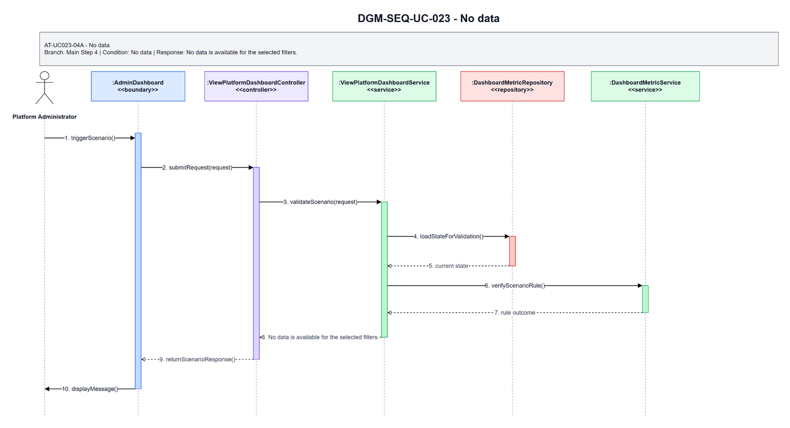

**Figure 3.23-3: Sequence Diagram of UC-023 View Platform Dashboard - AT-UC023-04A No data**

### Validation, Authorization, Transaction, and Error Handling Notes

| Area | Design |
|---|---|
| Validation | Validate required input, current entity status, date/amount/reference values, and SRS business rules before any state change. |
| Authorization | Allow only Platform Administrator according to the SRS actor, role, hotel-scope, or platform-scope precondition. |
| Transaction | Read-only query transaction; no persistent state is changed in the successful display flow. |
| Error Handling | AT-UC023-04A returns "No data is available for the selected filters.". |
| Privacy | Return only fields allowed for the current role and scope; staff roles must not receive unrelated customer, platform finance, or cross-hotel data. |

## Assumptions and Open Issues

- ASSUMP-UC023-001: Controller, service, repository, DTO, and entity class names are conceptual SDD design names because no source implementation was inspected.
- ASSUMP-UC023-002: Final API routes, database column names, and UI widget names may differ from these SDD class names but must preserve the traced SRS behavior.
- OQ-UC023-001: Confirm final implementation class/package names before treating the conceptual design as code-level documentation.

# 3.24 UC-024 - Expire Unpaid Booking

## 3.24.1 Design Purpose

This section describes the detailed design for **UC-024 Expire Unpaid Booking**. The use case covers Expire pending-payment bookings when payment timeout is reached. The design is based on the SRS/SDD only; class names and methods are conceptual design assumptions because no implementation codebase was inspected.

**Related SRS items:** FEAT-AUTO-NOTI, UC-024, NSF-002, ENT-013, ENT-023, BR-BOOK-006, BR-BOOK-007, BR-ROOM-002, BR-PAY-003, BR-PAY-005, MSG-BOOK-006, TR-024, AT-UC024-03A, AT-UC024-03B.

**Precondition:** Pending Payment booking exists; timeout configured.

**Trigger:** Payment timeout is reached.

**Post-condition:** POS-01: Expired Pending Payment bookings are marked Expired and reserved availability is released.

The flow must:

- Main step 1: System triggers expiration check.
- Main step 2: System identifies Pending Payment bookings past deadline.
- Main step 3: System atomically verifies booking is still Pending Payment, no successful payment exists, and expiration lock can be acquired.
- Main step 4: System marks eligible locked bookings Expired.
- Main step 5: System releases availability.
- Main step 6: System records notification event.
- Main step 7: System skips records that did not pass the atomic eligibility check.
- Enforce related business rules: BR-BOOK-006, BR-BOOK-007, BR-ROOM-002, BR-PAY-003, BR-PAY-005.
- Return a separate scenario response for each alternative/error flow: AT-UC024-03A, AT-UC024-03B.

## 3.24.2 Class Diagram

This part presents the class diagram for UC-024 Expire Unpaid Booking.

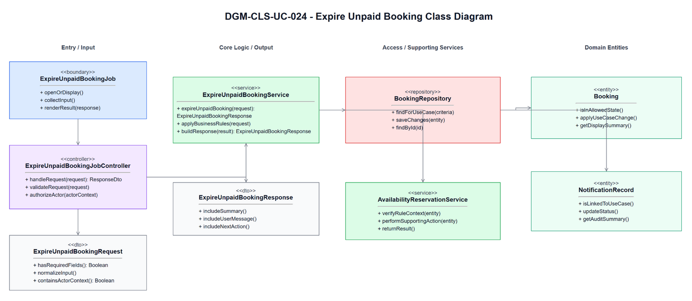

**Figure 3.24-1: Class Diagram of UC-024 Expire Unpaid Booking**

## 3.24.3 Class Specifications

This part explains the key methods shown in the class diagram. The classes are conceptual design assumptions unless source code is inspected.

### ExpireUnpaidBookingJob Class

**Description:** Boundary object for the user-visible or scheduled entry point of UC-024 Expire Unpaid Booking.

| No | Method | Description |
|---:|---|---|
| 1 | `openOrDisplay()` | Displays the use-case screen or activates the scheduled entry point described by the SRS. |
| 2 | `collectInput()` | Collects actor input or scheduler criteria before request submission. |
| 3 | `renderResult(response)` | Displays the result, validation message, or next action to the actor. |

### ExpireUnpaidBookingJobController Class

**Description:** API/application entry controller for UC-024 Expire Unpaid Booking.

| No | Method | Description |
|---:|---|---|
| 1 | `handleRequest(request)` | Receives the request from the boundary and delegates the business operation to the service. |
| 2 | `validateRequest(request)` | Checks required request shape before business rule execution. |
| 3 | `authorizeActor(actorContext)` | Verifies that the current actor may execute this use case and related hotel/platform scope. |

### ExpireUnpaidBookingRequest Class

**Description:** Request DTO carrying input for UC-024 Expire Unpaid Booking.

| No | Method | Description |
|---:|---|---|
| 1 | `hasRequiredFields()` | Returns whether mandatory fields from the SRS screen/use-case step are present. |
| 2 | `normalizeInput()` | Normalizes filter, status, note, amount, date, or reference input before service validation. |
| 3 | `containsActorContext()` | Confirms the request carries the authenticated actor or scheduler context needed for authorization. |

### ExpireUnpaidBookingService Class

**Description:** Application service that coordinates the main flow, business rules, persistence, and response creation for Expire Unpaid Booking.

| No | Method | Description |
|---:|---|---|
| 1 | `expireUnpaidBooking(request)` | Executes the UC-024 main flow and returns a response for the boundary. |
| 2 | `applyBusinessRules(request)` | Applies the related SRS business rules and state-transition constraints. |
| 3 | `buildResponse(result)` | Builds success, empty-state, or validation responses without exposing unauthorized data. |

### BookingRepository Class

**Description:** Repository abstraction for loading and saving data required by Expire Unpaid Booking.

| No | Method | Description |
|---:|---|---|
| 1 | `findForUseCase(criteria)` | Loads the entity state required for validation and display. |
| 2 | `findById(id)` | Retrieves a specific record within actor, hotel, or platform scope. |
| 3 | `saveChanges(entity)` | Persists allowed state changes when the use case modifies data. |

### AvailabilityReservationService Class

**Description:** Supporting service or integration used by UC-024 Expire Unpaid Booking.

| No | Method | Description |
|---:|---|---|
| 1 | `verifyRuleContext(entity)` | Checks specialized policy, authorization, calculation, notification, or external status context. |
| 2 | `performSupportingAction(entity)` | Performs notification, calculation, audit, or external reconciliation support when required. |
| 3 | `returnResult()` | Returns the supporting result to the application service for final response composition. |

### ExpireUnpaidBookingResponse Class

**Description:** Response DTO returned by UC-024 Expire Unpaid Booking.

| No | Method | Description |
|---:|---|---|
| 1 | `includeSummary()` | Adds the display or operation summary needed by the screen. |
| 2 | `includeUserMessage()` | Adds the user-facing success, empty-state, or validation message. |
| 3 | `includeNextAction()` | Adds the next available action when the SRS flow continues or returns for correction. |

### Booking Class

**Description:** Customer reservation for selected hotel and room/date range.

| No | Method | Description |
|---:|---|---|
| 1 | `isInAllowedState()` | Determines whether the entity state allows the requested use-case operation. |
| 2 | `applyUseCaseChange()` | Applies the state or data change permitted by the validated flow. |
| 3 | `getDisplaySummary()` | Provides safe summary data for the response or audit record. |

### NotificationRecord Class

**Description:** Notification event sent or recorded.

| No | Method | Description |
|---:|---|---|
| 1 | `isInAllowedState()` | Determines whether the entity state allows the requested use-case operation. |
| 2 | `applyUseCaseChange()` | Applies the state or data change permitted by the validated flow. |
| 3 | `getDisplaySummary()` | Provides safe summary data for the response or audit record. |

## 3.24.4 Sequence Diagram

This part presents the sequence diagrams for UC-024 Expire Unpaid Booking. The main-flow diagram shows only the successful scenario. Each alternative/error scenario has its own diagram.

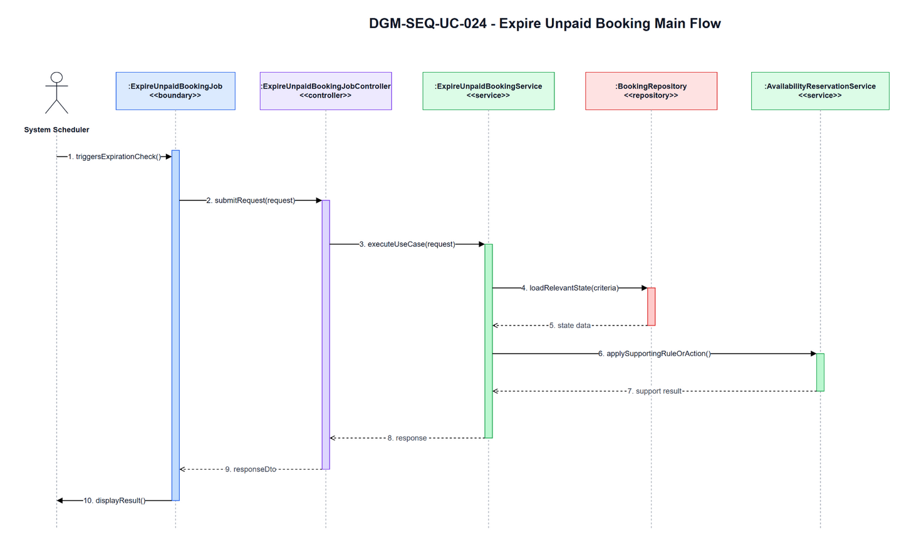

**Figure 3.24-2: Sequence Diagram of UC-024 Expire Unpaid Booking - Main Flow**

### AT-UC024-03A - Payment success already exists

- **Branch from Main Step:** 3
- **Condition:** Payment success already exists
- **Expected Response:** This pending payment booking has expired. Please create a new booking.

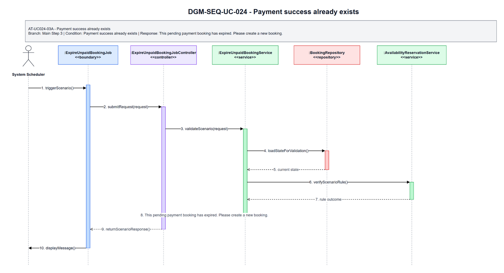

**Figure 3.24-3: Sequence Diagram of UC-024 Expire Unpaid Booking - AT-UC024-03A Payment success already exists**

### AT-UC024-03B - Booking status changed

- **Branch from Main Step:** 3
- **Condition:** Booking status changed
- **Expected Response:** This pending payment booking has expired. Please create a new booking.

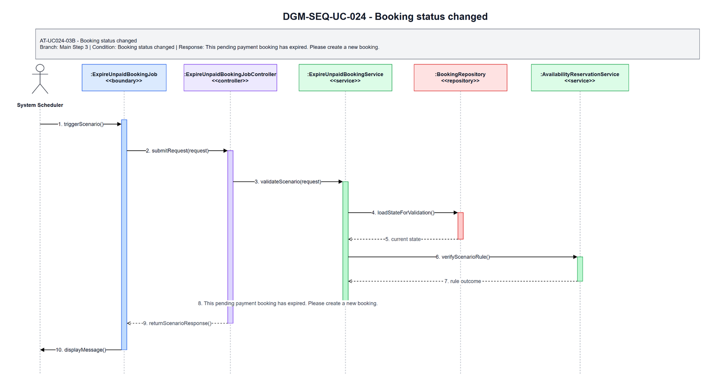

**Figure 3.24-4: Sequence Diagram of UC-024 Expire Unpaid Booking - AT-UC024-03B Booking status changed**

### Validation, Authorization, Transaction, and Error Handling Notes

| Area | Design |
|---|---|
| Validation | Validate required input, current entity status, date/amount/reference values, and SRS business rules before any state change. |
| Authorization | Allow only System Scheduler according to the SRS actor, role, hotel-scope, or platform-scope precondition. |
| Transaction | Use a single application transaction for validated state changes, persistence updates, audit records, and notification records where applicable. |
| Error Handling | AT-UC024-03A returns "This pending payment booking has expired. Please create a new booking."; AT-UC024-03B returns "This pending payment booking has expired. Please create a new booking.". |
| Privacy | Return only fields allowed for the current role and scope; staff roles must not receive unrelated customer, platform finance, or cross-hotel data. |

## Assumptions and Open Issues

- ASSUMP-UC024-001: Controller, service, repository, DTO, and entity class names are conceptual SDD design names because no source implementation was inspected.
- ASSUMP-UC024-002: Final API routes, database column names, and UI widget names may differ from these SDD class names but must preserve the traced SRS behavior.
- OQ-UC024-001: Confirm final implementation class/package names before treating the conceptual design as code-level documentation.

# 3.25 UC-025 - Manage Own Profile

## 3.25.1 Design Purpose

This section describes the detailed design for **UC-025 Manage Own Profile**. The use case covers View and update own basic profile where allowed. The design is based on the SRS/SDD only; class names and methods are conceptual design assumptions because no implementation codebase was inspected.

**Related SRS items:** FEAT-AUTH, UC-025, SCR-003, ENT-001, BR-AUTH-004, BR-STAFF-002, MSG-AUTH-003, MSG-AUTH-007, MSG-AUTH-009, TR-025, AT-UC025-04A, AT-UC025-01A.

**Precondition:** Actor authenticated.

**Trigger:** Actor opens User Profile.

**Post-condition:** POS-01: Actor own profile is updated after validation, or rejected with a clear reason.

The flow must:

- Main step 1: Actor opens User Profile Screen.
- Main step 2: System validates own-profile access and displays own profile fields with read-only role/assignment information.
- Main step 3: Actor updates editable profile information.
- Main step 4: System validates formats and uniqueness if changed.
- Main step 5: System records updated profile information.
- Main step 6: System displays update success.
- Enforce related business rules: BR-AUTH-004, BR-STAFF-002.
- Return a separate scenario response for each alternative/error flow: AT-UC025-04A, AT-UC025-01A.

## 3.25.2 Class Diagram

This part presents the class diagram for UC-025 Manage Own Profile.

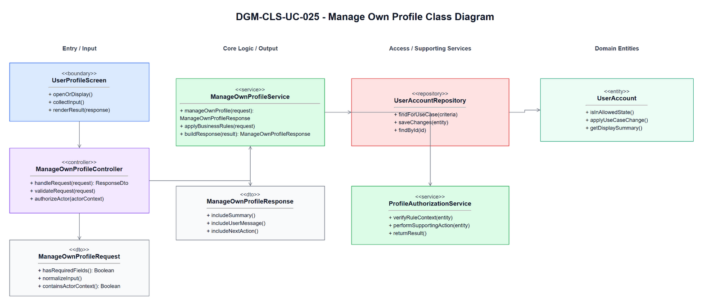

**Figure 3.25-1: Class Diagram of UC-025 Manage Own Profile**

## 3.25.3 Class Specifications

This part explains the key methods shown in the class diagram. The classes are conceptual design assumptions unless source code is inspected.

### UserProfileScreen Class

**Description:** Boundary object for the user-visible or scheduled entry point of UC-025 Manage Own Profile.

| No | Method | Description |
|---:|---|---|
| 1 | `openOrDisplay()` | Displays the use-case screen or activates the scheduled entry point described by the SRS. |
| 2 | `collectInput()` | Collects actor input or scheduler criteria before request submission. |
| 3 | `renderResult(response)` | Displays the result, validation message, or next action to the actor. |

### ManageOwnProfileController Class

**Description:** API/application entry controller for UC-025 Manage Own Profile.

| No | Method | Description |
|---:|---|---|
| 1 | `handleRequest(request)` | Receives the request from the boundary and delegates the business operation to the service. |
| 2 | `validateRequest(request)` | Checks required request shape before business rule execution. |
| 3 | `authorizeActor(actorContext)` | Verifies that the current actor may execute this use case and related hotel/platform scope. |

### ManageOwnProfileRequest Class

**Description:** Request DTO carrying input for UC-025 Manage Own Profile.

| No | Method | Description |
|---:|---|---|
| 1 | `hasRequiredFields()` | Returns whether mandatory fields from the SRS screen/use-case step are present. |
| 2 | `normalizeInput()` | Normalizes filter, status, note, amount, date, or reference input before service validation. |
| 3 | `containsActorContext()` | Confirms the request carries the authenticated actor or scheduler context needed for authorization. |

### ManageOwnProfileService Class

**Description:** Application service that coordinates the main flow, business rules, persistence, and response creation for Manage Own Profile.

| No | Method | Description |
|---:|---|---|
| 1 | `manageOwnProfile(request)` | Executes the UC-025 main flow and returns a response for the boundary. |
| 2 | `applyBusinessRules(request)` | Applies the related SRS business rules and state-transition constraints. |
| 3 | `buildResponse(result)` | Builds success, empty-state, or validation responses without exposing unauthorized data. |

### UserAccountRepository Class

**Description:** Repository abstraction for loading and saving data required by Manage Own Profile.

| No | Method | Description |
|---:|---|---|
| 1 | `findForUseCase(criteria)` | Loads the entity state required for validation and display. |
| 2 | `findById(id)` | Retrieves a specific record within actor, hotel, or platform scope. |
| 3 | `saveChanges(entity)` | Persists allowed state changes when the use case modifies data. |

### ProfileAuthorizationService Class

**Description:** Supporting service or integration used by UC-025 Manage Own Profile.

| No | Method | Description |
|---:|---|---|
| 1 | `verifyRuleContext(entity)` | Checks specialized policy, authorization, calculation, notification, or external status context. |
| 2 | `performSupportingAction(entity)` | Performs notification, calculation, audit, or external reconciliation support when required. |
| 3 | `returnResult()` | Returns the supporting result to the application service for final response composition. |

### ManageOwnProfileResponse Class

**Description:** Response DTO returned by UC-025 Manage Own Profile.

| No | Method | Description |
|---:|---|---|
| 1 | `includeSummary()` | Adds the display or operation summary needed by the screen. |
| 2 | `includeUserMessage()` | Adds the user-facing success, empty-state, or validation message. |
| 3 | `includeNextAction()` | Adds the next available action when the SRS flow continues or returns for correction. |

### UserAccount Class

**Description:** Registered account for Customer, Property Owner, Hotel Manager, Receptionist, Housekeeping Staff, Maintenance Staff, or Platform Administrator.

| No | Method | Description |
|---:|---|---|
| 1 | `isInAllowedState()` | Determines whether the entity state allows the requested use-case operation. |
| 2 | `applyUseCaseChange()` | Applies the state or data change permitted by the validated flow. |
| 3 | `getDisplaySummary()` | Provides safe summary data for the response or audit record. |

## 3.25.4 Sequence Diagram

This part presents the sequence diagrams for UC-025 Manage Own Profile. The main-flow diagram shows only the successful scenario. Each alternative/error scenario has its own diagram.

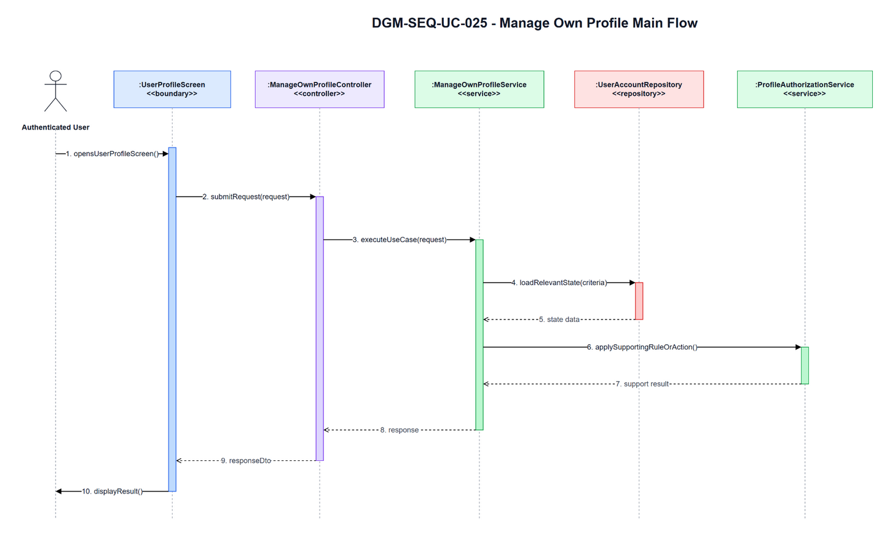

**Figure 3.25-2: Sequence Diagram of UC-025 Manage Own Profile - Main Flow**

### AT-UC025-04A - Duplicate email/phone

- **Branch from Main Step:** 4
- **Condition:** Duplicate email/phone
- **Expected Response:** Email or phone number is already in use.

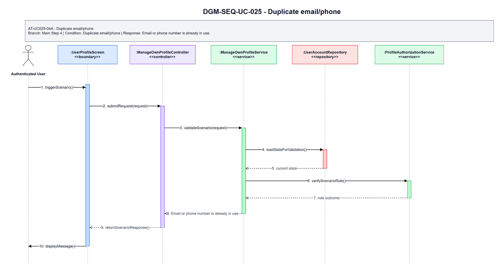

**Figure 3.25-3: Sequence Diagram of UC-025 Manage Own Profile - AT-UC025-04A Duplicate email/phone**

### AT-UC025-01A - Unauthorized profile access

- **Branch from Main Step:** 1
- **Condition:** Unauthorized profile access
- **Expected Response:** You are not authorized to perform this action.

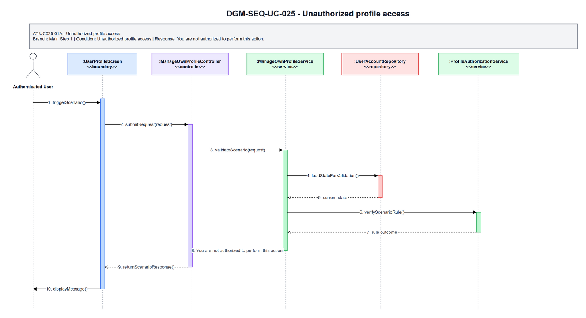

**Figure 3.25-4: Sequence Diagram of UC-025 Manage Own Profile - AT-UC025-01A Unauthorized profile access**

### Validation, Authorization, Transaction, and Error Handling Notes

| Area | Design |
|---|---|
| Validation | Validate required input, current entity status, date/amount/reference values, and SRS business rules before any state change. |
| Authorization | Allow only Customer, Property Owner, Hotel Manager, Receptionist, Housekeeping Staff, Maintenance Staff, Platform Administrator according to the SRS actor, role, hotel-scope, or platform-scope precondition. |
| Transaction | Use a single application transaction for validated state changes, persistence updates, audit records, and notification records where applicable. |
| Error Handling | AT-UC025-04A returns "Email or phone number is already in use."; AT-UC025-01A returns "You are not authorized to perform this action.". |
| Privacy | Return only fields allowed for the current role and scope; staff roles must not receive unrelated customer, platform finance, or cross-hotel data. |

## Assumptions and Open Issues

- ASSUMP-UC025-001: Controller, service, repository, DTO, and entity class names are conceptual SDD design names because no source implementation was inspected.
- ASSUMP-UC025-002: Final API routes, database column names, and UI widget names may differ from these SDD class names but must preserve the traced SRS behavior.
- OQ-UC025-001: Confirm final implementation class/package names before treating the conceptual design as code-level documentation.

# 3.26 UC-026 - Manage Hotel Staff Accounts

## 3.26.1 Design Purpose

This section describes the detailed design for **UC-026 Manage Hotel Staff Accounts**. The use case covers Invite, create, update, deactivate, and view staff accounts for assigned hotels. The design is based on the SRS/SDD only; class names and methods are conceptual design assumptions because no implementation codebase was inspected.

**Related SRS items:** FEAT-STAFF, UC-026, SCR-028, ENT-001, ENT-003, ENT-004, ENT-024, BR-STAFF-001, BR-STAFF-002, BR-AUTH-002, BR-AUDIT-001, MSG-STAFF-001, MSG-STAFF-004, MSG-AUTH-003, MSG-AUTH-007, TR-026, AT-UC026-05A, AT-UC026-02A, AT-UC026-05B.

**Precondition:** Actor authenticated; staff management authority can be validated for selected hotel scope.

**Trigger:** Actor opens Staff Management.

**Post-condition:** POS-01: Staff account and hotel assignment are created, updated, invited, or deactivated according to permission.

The flow must:

- Main step 1: Actor opens Staff Management for selected hotel scope.
- Main step 2: System validates actor staff-management authority for selected hotel scope before displaying staff data.
- Main step 3: System displays staff list, roles, assignment status, and actions allowed by actor authority.
- Main step 4: Actor creates, invites, updates, or deactivates staff account.
- Main step 5: System validates staff data, duplicate email/phone, hotel permission, role availability, and manager authority limits.
- Main step 6: System creates/updates staff account and assignment.
- Main step 7: System records audit and sends/records notification.
- Continue through the remaining SRS main-flow steps until the UC-026 post-condition is reached.
- Enforce related business rules: BR-STAFF-001, BR-STAFF-002, BR-AUTH-002, BR-AUDIT-001.
- Return a separate scenario response for each alternative/error flow: AT-UC026-05A, AT-UC026-02A, AT-UC026-05B.

## 3.26.2 Class Diagram

This part presents the class diagram for UC-026 Manage Hotel Staff Accounts.

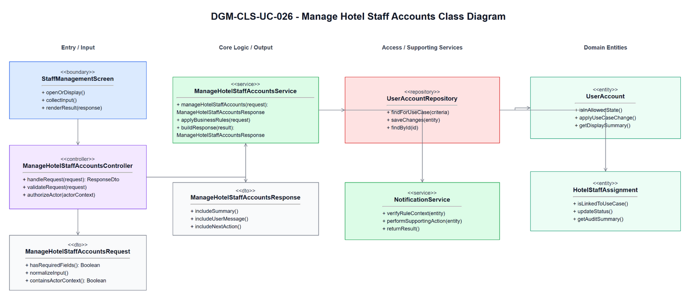

**Figure 3.26-1: Class Diagram of UC-026 Manage Hotel Staff Accounts**

## 3.26.3 Class Specifications

This part explains the key methods shown in the class diagram. The classes are conceptual design assumptions unless source code is inspected.

### StaffManagementScreen Class

**Description:** Boundary object for the user-visible or scheduled entry point of UC-026 Manage Hotel Staff Accounts.

| No | Method | Description |
|---:|---|---|
| 1 | `openOrDisplay()` | Displays the use-case screen or activates the scheduled entry point described by the SRS. |
| 2 | `collectInput()` | Collects actor input or scheduler criteria before request submission. |
| 3 | `renderResult(response)` | Displays the result, validation message, or next action to the actor. |

### ManageHotelStaffAccountsController Class

**Description:** API/application entry controller for UC-026 Manage Hotel Staff Accounts.

| No | Method | Description |
|---:|---|---|
| 1 | `handleRequest(request)` | Receives the request from the boundary and delegates the business operation to the service. |
| 2 | `validateRequest(request)` | Checks required request shape before business rule execution. |
| 3 | `authorizeActor(actorContext)` | Verifies that the current actor may execute this use case and related hotel/platform scope. |

### ManageHotelStaffAccountsRequest Class

**Description:** Request DTO carrying input for UC-026 Manage Hotel Staff Accounts.

| No | Method | Description |
|---:|---|---|
| 1 | `hasRequiredFields()` | Returns whether mandatory fields from the SRS screen/use-case step are present. |
| 2 | `normalizeInput()` | Normalizes filter, status, note, amount, date, or reference input before service validation. |
| 3 | `containsActorContext()` | Confirms the request carries the authenticated actor or scheduler context needed for authorization. |

### ManageHotelStaffAccountsService Class

**Description:** Application service that coordinates the main flow, business rules, persistence, and response creation for Manage Hotel Staff Accounts.

| No | Method | Description |
|---:|---|---|
| 1 | `manageHotelStaffAccounts(request)` | Executes the UC-026 main flow and returns a response for the boundary. |
| 2 | `applyBusinessRules(request)` | Applies the related SRS business rules and state-transition constraints. |
| 3 | `buildResponse(result)` | Builds success, empty-state, or validation responses without exposing unauthorized data. |

### UserAccountRepository Class

**Description:** Repository abstraction for loading and saving data required by Manage Hotel Staff Accounts.

| No | Method | Description |
|---:|---|---|
| 1 | `findForUseCase(criteria)` | Loads the entity state required for validation and display. |
| 2 | `findById(id)` | Retrieves a specific record within actor, hotel, or platform scope. |
| 3 | `saveChanges(entity)` | Persists allowed state changes when the use case modifies data. |

### NotificationService Class

**Description:** Supporting service or integration used by UC-026 Manage Hotel Staff Accounts.

| No | Method | Description |
|---:|---|---|
| 1 | `verifyRuleContext(entity)` | Checks specialized policy, authorization, calculation, notification, or external status context. |
| 2 | `performSupportingAction(entity)` | Performs notification, calculation, audit, or external reconciliation support when required. |
| 3 | `returnResult()` | Returns the supporting result to the application service for final response composition. |

### ManageHotelStaffAccountsResponse Class

**Description:** Response DTO returned by UC-026 Manage Hotel Staff Accounts.

| No | Method | Description |
|---:|---|---|
| 1 | `includeSummary()` | Adds the display or operation summary needed by the screen. |
| 2 | `includeUserMessage()` | Adds the user-facing success, empty-state, or validation message. |
| 3 | `includeNextAction()` | Adds the next available action when the SRS flow continues or returns for correction. |

### UserAccount Class

**Description:** Registered account for Customer, Property Owner, Hotel Manager, Receptionist, Housekeeping Staff, Maintenance Staff, or Platform Administrator.

| No | Method | Description |
|---:|---|---|
| 1 | `isInAllowedState()` | Determines whether the entity state allows the requested use-case operation. |
| 2 | `applyUseCaseChange()` | Applies the state or data change permitted by the validated flow. |
| 3 | `getDisplaySummary()` | Provides safe summary data for the response or audit record. |

### HotelStaffAssignment Class

**Description:** Mapping between a staff user, hotel, and hotel-scoped role.

| No | Method | Description |
|---:|---|---|
| 1 | `isInAllowedState()` | Determines whether the entity state allows the requested use-case operation. |
| 2 | `applyUseCaseChange()` | Applies the state or data change permitted by the validated flow. |
| 3 | `getDisplaySummary()` | Provides safe summary data for the response or audit record. |

## 3.26.4 Sequence Diagram

This part presents the sequence diagrams for UC-026 Manage Hotel Staff Accounts. The main-flow diagram shows only the successful scenario. Each alternative/error scenario has its own diagram.

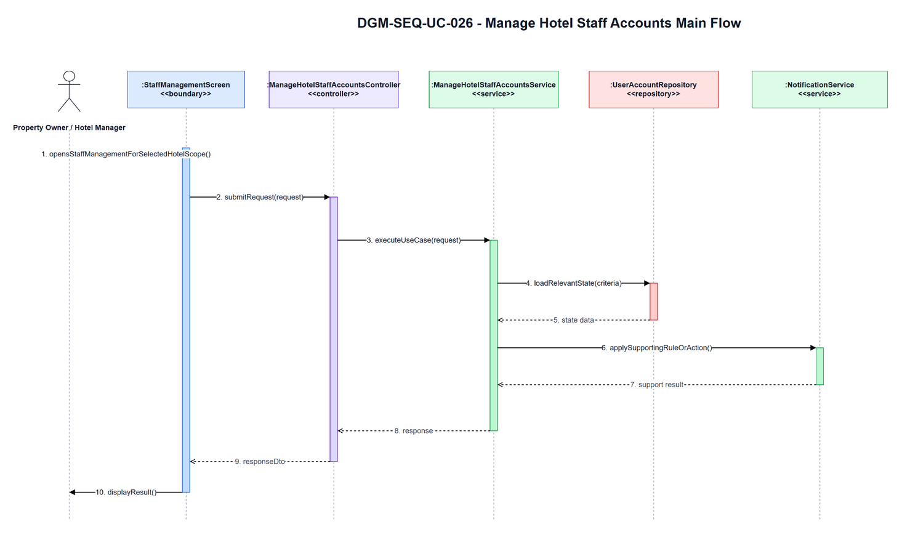

**Figure 3.26-2: Sequence Diagram of UC-026 Manage Hotel Staff Accounts - Main Flow**

### AT-UC026-05A - Duplicate staff email/phone

- **Branch from Main Step:** 5
- **Condition:** Duplicate staff email/phone
- **Expected Response:** Email or phone number is already in use.

**Figure 3.26-3: Sequence Diagram of UC-026 Manage Hotel Staff Accounts - AT-UC026-05A Duplicate staff email/phone**

### AT-UC026-02A - No permission

- **Branch from Main Step:** 2
- **Condition:** No permission
- **Expected Response:** You are not authorized to perform this action.

**Figure 3.26-4: Sequence Diagram of UC-026 Manage Hotel Staff Accounts - AT-UC026-02A No permission**

### AT-UC026-05B - Staff has open tasks

- **Branch from Main Step:** 5
- **Condition:** Staff has open tasks
- **Expected Response:** Please reassign or resolve open tasks before deactivating this staff account.

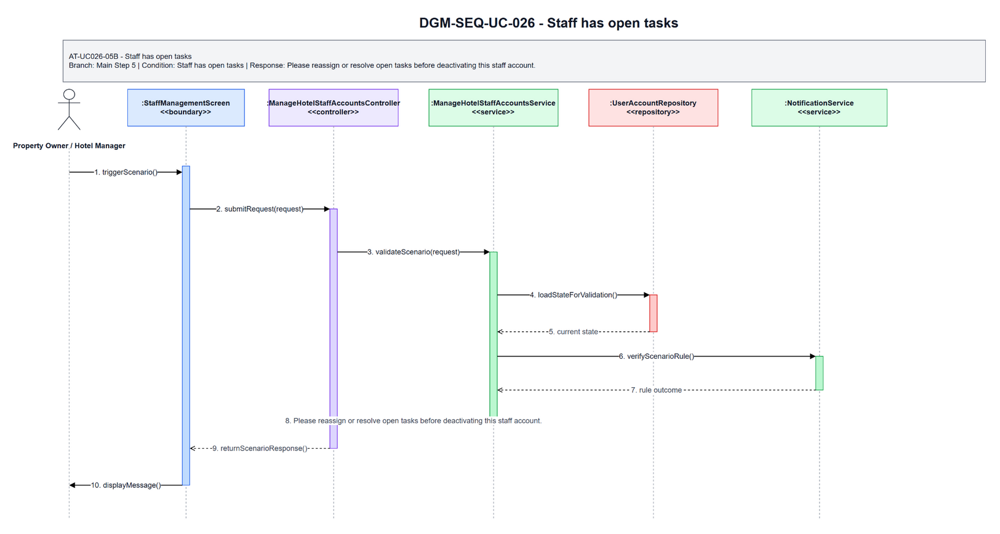

**Figure 3.26-5: Sequence Diagram of UC-026 Manage Hotel Staff Accounts - AT-UC026-05B Staff has open tasks**

### Validation, Authorization, Transaction, and Error Handling Notes

| Area | Design |
|---|---|
| Validation | Validate required input, current entity status, date/amount/reference values, and SRS business rules before any state change. |
| Authorization | Allow only Property Owner, Hotel Manager according to the SRS actor, role, hotel-scope, or platform-scope precondition. |
| Transaction | Use a single application transaction for validated state changes, persistence updates, audit records, and notification records where applicable. |
| Error Handling | AT-UC026-05A returns "Email or phone number is already in use."; AT-UC026-02A returns "You are not authorized to perform this action."; AT-UC026-05B returns "Please reassign or resolve open tasks before deactivating this staff account.". |
| Privacy | Return only fields allowed for the current role and scope; staff roles must not receive unrelated customer, platform finance, or cross-hotel data. |

## Assumptions and Open Issues

- ASSUMP-UC026-001: Controller, service, repository, DTO, and entity class names are conceptual SDD design names because no source implementation was inspected.
- ASSUMP-UC026-002: Final API routes, database column names, and UI widget names may differ from these SDD class names but must preserve the traced SRS behavior.
- OQ-UC026-001: Confirm final implementation class/package names before treating the conceptual design as code-level documentation.

# 3.27 UC-027 - Assign Staff Roles and Permissions

## 3.27.1 Design Purpose

This section describes the detailed design for **UC-027 Assign Staff Roles and Permissions**. The use case covers Assign hotel-scoped staff roles and permissions. The design is based on the SRS/SDD only; class names and methods are conceptual design assumptions because no implementation codebase was inspected.

**Related SRS items:** FEAT-STAFF, UC-027, SCR-029, ENT-002, ENT-003, ENT-024, BR-STAFF-001, BR-STAFF-002, BR-AUTH-002, BR-AUDIT-001, MSG-STAFF-002, MSG-STAFF-003, MSG-STAFF-005, TR-027, AT-UC027-05A, AT-UC027-05B.

**Precondition:** Actor authenticated; staff account exists; actor has role management permission.

**Trigger:** Actor opens Staff Role Assignment.

**Post-condition:** POS-01: Hotel-scoped staff role and permission assignment is updated and audited.

The flow must:

- Main step 1: Actor selects staff member.
- Main step 2: System validates actor authority over the selected staff member and hotel scope before displaying assignments.
- Main step 3: System displays current hotel assignments, role permissions, and only role options allowed by actor authority.
- Main step 4: Actor selects/changes staff role and hotel scope.
- Main step 5: System validates role, hotel assignment, and actor authority.
- Main step 6: System updates hotel-scoped staff role assignment.
- Main step 7: System records audit and displays success.
- Enforce related business rules: BR-STAFF-001, BR-STAFF-002, BR-AUTH-002, BR-AUDIT-001.
- Return a separate scenario response for each alternative/error flow: AT-UC027-05A, AT-UC027-05B.

## 3.27.2 Class Diagram

This part presents the class diagram for UC-027 Assign Staff Roles and Permissions.

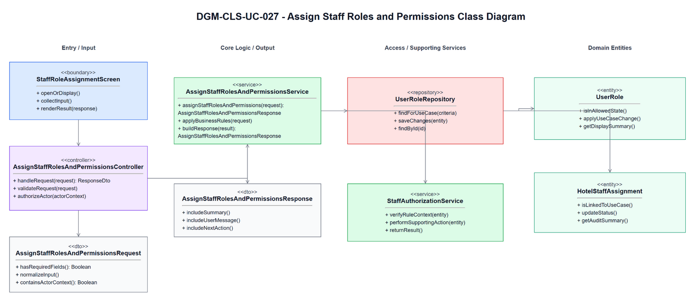

**Figure 3.27-1: Class Diagram of UC-027 Assign Staff Roles and Permissions**

## 3.27.3 Class Specifications

This part explains the key methods shown in the class diagram. The classes are conceptual design assumptions unless source code is inspected.

### StaffRoleAssignmentScreen Class

**Description:** Boundary object for the user-visible or scheduled entry point of UC-027 Assign Staff Roles and Permissions.

| No | Method | Description |
|---:|---|---|
| 1 | `openOrDisplay()` | Displays the use-case screen or activates the scheduled entry point described by the SRS. |
| 2 | `collectInput()` | Collects actor input or scheduler criteria before request submission. |
| 3 | `renderResult(response)` | Displays the result, validation message, or next action to the actor. |

### AssignStaffRolesAndPermissionsController Class

**Description:** API/application entry controller for UC-027 Assign Staff Roles and Permissions.

| No | Method | Description |
|---:|---|---|
| 1 | `handleRequest(request)` | Receives the request from the boundary and delegates the business operation to the service. |
| 2 | `validateRequest(request)` | Checks required request shape before business rule execution. |
| 3 | `authorizeActor(actorContext)` | Verifies that the current actor may execute this use case and related hotel/platform scope. |

### AssignStaffRolesAndPermissionsRequest Class

**Description:** Request DTO carrying input for UC-027 Assign Staff Roles and Permissions.

| No | Method | Description |
|---:|---|---|
| 1 | `hasRequiredFields()` | Returns whether mandatory fields from the SRS screen/use-case step are present. |
| 2 | `normalizeInput()` | Normalizes filter, status, note, amount, date, or reference input before service validation. |
| 3 | `containsActorContext()` | Confirms the request carries the authenticated actor or scheduler context needed for authorization. |

### AssignStaffRolesAndPermissionsService Class

**Description:** Application service that coordinates the main flow, business rules, persistence, and response creation for Assign Staff Roles and Permissions.

| No | Method | Description |
|---:|---|---|
| 1 | `assignStaffRolesAndPermissions(request)` | Executes the UC-027 main flow and returns a response for the boundary. |
| 2 | `applyBusinessRules(request)` | Applies the related SRS business rules and state-transition constraints. |
| 3 | `buildResponse(result)` | Builds success, empty-state, or validation responses without exposing unauthorized data. |

### UserRoleRepository Class

**Description:** Repository abstraction for loading and saving data required by Assign Staff Roles and Permissions.

| No | Method | Description |
|---:|---|---|
| 1 | `findForUseCase(criteria)` | Loads the entity state required for validation and display. |
| 2 | `findById(id)` | Retrieves a specific record within actor, hotel, or platform scope. |
| 3 | `saveChanges(entity)` | Persists allowed state changes when the use case modifies data. |

### StaffAuthorizationService Class

**Description:** Supporting service or integration used by UC-027 Assign Staff Roles and Permissions.

| No | Method | Description |
|---:|---|---|
| 1 | `verifyRuleContext(entity)` | Checks specialized policy, authorization, calculation, notification, or external status context. |
| 2 | `performSupportingAction(entity)` | Performs notification, calculation, audit, or external reconciliation support when required. |
| 3 | `returnResult()` | Returns the supporting result to the application service for final response composition. |

### AssignStaffRolesAndPermissionsResponse Class

**Description:** Response DTO returned by UC-027 Assign Staff Roles and Permissions.

| No | Method | Description |
|---:|---|---|
| 1 | `includeSummary()` | Adds the display or operation summary needed by the screen. |
| 2 | `includeUserMessage()` | Adds the user-facing success, empty-state, or validation message. |
| 3 | `includeNextAction()` | Adds the next available action when the SRS flow continues or returns for correction. |

### UserRole Class

**Description:** Role definition for platform or hotel-scoped access.

| No | Method | Description |
|---:|---|---|
| 1 | `isInAllowedState()` | Determines whether the entity state allows the requested use-case operation. |
| 2 | `applyUseCaseChange()` | Applies the state or data change permitted by the validated flow. |
| 3 | `getDisplaySummary()` | Provides safe summary data for the response or audit record. |

### HotelStaffAssignment Class

**Description:** Mapping between a staff user, hotel, and hotel-scoped role.

| No | Method | Description |
|---:|---|---|
| 1 | `isInAllowedState()` | Determines whether the entity state allows the requested use-case operation. |
| 2 | `applyUseCaseChange()` | Applies the state or data change permitted by the validated flow. |
| 3 | `getDisplaySummary()` | Provides safe summary data for the response or audit record. |

## 3.27.4 Sequence Diagram

This part presents the sequence diagrams for UC-027 Assign Staff Roles and Permissions. The main-flow diagram shows only the successful scenario. Each alternative/error scenario has its own diagram.

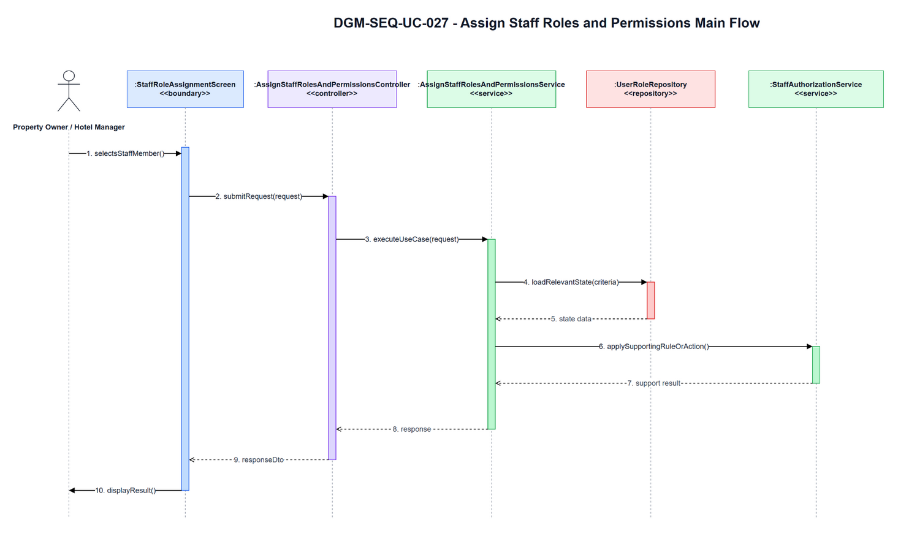

**Figure 3.27-2: Sequence Diagram of UC-027 Assign Staff Roles and Permissions - Main Flow**

### AT-UC027-05A - Invalid role

- **Branch from Main Step:** 5
- **Condition:** Invalid role
- **Expected Response:** Please select a valid staff role.

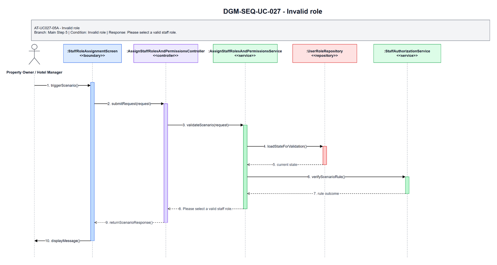

**Figure 3.27-3: Sequence Diagram of UC-027 Assign Staff Roles and Permissions - AT-UC027-05A Invalid role**

### AT-UC027-05B - Staff not assigned to hotel

- **Branch from Main Step:** 5
- **Condition:** Staff not assigned to hotel
- **Expected Response:** Staff must be assigned to at least one hotel before accessing staff functions.

**Figure 3.27-4: Sequence Diagram of UC-027 Assign Staff Roles and Permissions - AT-UC027-05B Staff not assigned to hotel**

### Validation, Authorization, Transaction, and Error Handling Notes

| Area | Design |
|---|---|
| Validation | Validate required input, current entity status, date/amount/reference values, and SRS business rules before any state change. |
| Authorization | Allow only Property Owner, Hotel Manager according to the SRS actor, role, hotel-scope, or platform-scope precondition. |
| Transaction | Use a single application transaction for validated state changes, persistence updates, audit records, and notification records where applicable. |
| Error Handling | AT-UC027-05A returns "Please select a valid staff role."; AT-UC027-05B returns "Staff must be assigned to at least one hotel before accessing staff functions.". |
| Privacy | Return only fields allowed for the current role and scope; staff roles must not receive unrelated customer, platform finance, or cross-hotel data. |

## Assumptions and Open Issues

- ASSUMP-UC027-001: Controller, service, repository, DTO, and entity class names are conceptual SDD design names because no source implementation was inspected.
- ASSUMP-UC027-002: Final API routes, database column names, and UI widget names may differ from these SDD class names but must preserve the traced SRS behavior.
- OQ-UC027-001: Confirm final implementation class/package names before treating the conceptual design as code-level documentation.

# 3.28 UC-028 - View Arrival and Departure List

## 3.28.1 Design Purpose

This section describes the detailed design for **UC-028 View Arrival and Departure List**. The use case covers View today/upcoming arrivals, departures, no-show candidates, and operational status. The design is based on the SRS/SDD only; class names and methods are conceptual design assumptions because no implementation codebase was inspected.

**Related SRS items:** FEAT-FRONTDESK, UC-028, SCR-022, SCR-023, ENT-013, BR-STAFF-002, BR-STAFF-003, BR-BOOK-009, MSG-FD-001, MSG-AUTH-007, TR-028, AT-UC028-03A, AT-UC028-02A.

**Precondition:** Actor authenticated; hotel assignment and front desk list visibility can be validated before list display.

**Trigger:** Actor opens Arrival/Departure List.

**Post-condition:** POS-01: Arrival/departure/in-house/no-show candidate list is displayed for assigned hotel scope.

The flow must:

- Main step 1: Actor opens Arrival/Departure List.
- Main step 2: System validates actor role, hotel assignment, and front desk list visibility scope.
- Main step 3: System displays hotel/date filters and lists for arrivals, in-house stays, departures, and no-show candidates.
- Main step 4: Actor filters by date, room type, status, or keyword.
- Main step 5: System refreshes list.
- Main step 6: Actor selects booking.
- Main step 7: System validates selected booking access and displays booking detail with allowed actions.
- Enforce related business rules: BR-STAFF-002, BR-STAFF-003, BR-BOOK-009.
- Return a separate scenario response for each alternative/error flow: AT-UC028-03A, AT-UC028-02A.

## 3.28.2 Class Diagram

This part presents the class diagram for UC-028 View Arrival and Departure List.

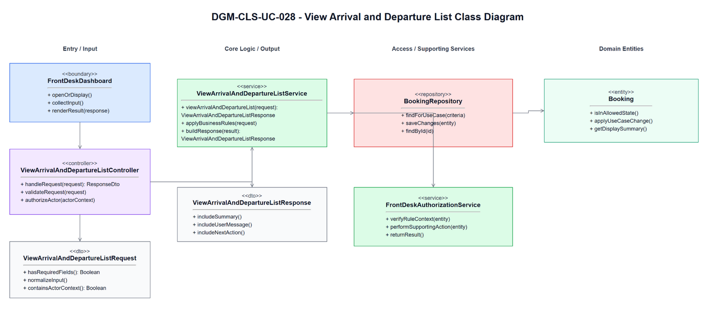

**Figure 3.28-1: Class Diagram of UC-028 View Arrival and Departure List**

## 3.28.3 Class Specifications

This part explains the key methods shown in the class diagram. The classes are conceptual design assumptions unless source code is inspected.

### FrontDeskDashboard Class

**Description:** Boundary object for the user-visible or scheduled entry point of UC-028 View Arrival and Departure List.

| No | Method | Description |
|---:|---|---|
| 1 | `openOrDisplay()` | Displays the use-case screen or activates the scheduled entry point described by the SRS. |
| 2 | `collectInput()` | Collects actor input or scheduler criteria before request submission. |
| 3 | `renderResult(response)` | Displays the result, validation message, or next action to the actor. |

### ViewArrivalAndDepartureListController Class

**Description:** API/application entry controller for UC-028 View Arrival and Departure List.

| No | Method | Description |
|---:|---|---|
| 1 | `handleRequest(request)` | Receives the request from the boundary and delegates the business operation to the service. |
| 2 | `validateRequest(request)` | Checks required request shape before business rule execution. |
| 3 | `authorizeActor(actorContext)` | Verifies that the current actor may execute this use case and related hotel/platform scope. |

### ViewArrivalAndDepartureListRequest Class

**Description:** Request DTO carrying input for UC-028 View Arrival and Departure List.

| No | Method | Description |
|---:|---|---|
| 1 | `hasRequiredFields()` | Returns whether mandatory fields from the SRS screen/use-case step are present. |
| 2 | `normalizeInput()` | Normalizes filter, status, note, amount, date, or reference input before service validation. |
| 3 | `containsActorContext()` | Confirms the request carries the authenticated actor or scheduler context needed for authorization. |

### ViewArrivalAndDepartureListService Class

**Description:** Application service that coordinates the main flow, business rules, persistence, and response creation for View Arrival and Departure List.

| No | Method | Description |
|---:|---|---|
| 1 | `viewArrivalAndDepartureList(request)` | Executes the UC-028 main flow and returns a response for the boundary. |
| 2 | `applyBusinessRules(request)` | Applies the related SRS business rules and state-transition constraints. |
| 3 | `buildResponse(result)` | Builds success, empty-state, or validation responses without exposing unauthorized data. |

### BookingRepository Class

**Description:** Repository abstraction for loading and saving data required by View Arrival and Departure List.

| No | Method | Description |
|---:|---|---|
| 1 | `findForUseCase(criteria)` | Loads the entity state required for validation and display. |
| 2 | `findById(id)` | Retrieves a specific record within actor, hotel, or platform scope. |
| 3 | `saveChanges(entity)` | Persists allowed state changes when the use case modifies data. |

### FrontDeskAuthorizationService Class

**Description:** Supporting service or integration used by UC-028 View Arrival and Departure List.

| No | Method | Description |
|---:|---|---|
| 1 | `verifyRuleContext(entity)` | Checks specialized policy, authorization, calculation, notification, or external status context. |
| 2 | `performSupportingAction(entity)` | Performs notification, calculation, audit, or external reconciliation support when required. |
| 3 | `returnResult()` | Returns the supporting result to the application service for final response composition. |

### ViewArrivalAndDepartureListResponse Class

**Description:** Response DTO returned by UC-028 View Arrival and Departure List.

| No | Method | Description |
|---:|---|---|
| 1 | `includeSummary()` | Adds the display or operation summary needed by the screen. |
| 2 | `includeUserMessage()` | Adds the user-facing success, empty-state, or validation message. |
| 3 | `includeNextAction()` | Adds the next available action when the SRS flow continues or returns for correction. |

### Booking Class

**Description:** Customer reservation for selected hotel and room/date range.

| No | Method | Description |
|---:|---|---|
| 1 | `isInAllowedState()` | Determines whether the entity state allows the requested use-case operation. |
| 2 | `applyUseCaseChange()` | Applies the state or data change permitted by the validated flow. |
| 3 | `getDisplaySummary()` | Provides safe summary data for the response or audit record. |

## 3.28.4 Sequence Diagram

This part presents the sequence diagrams for UC-028 View Arrival and Departure List. The main-flow diagram shows only the successful scenario. Each alternative/error scenario has its own diagram.

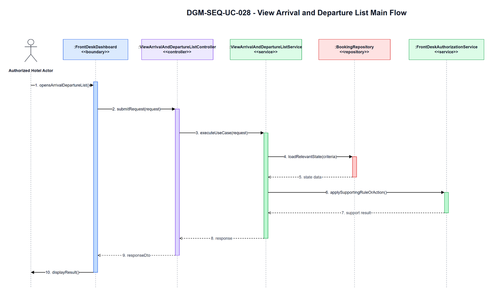

**Figure 3.28-2: Sequence Diagram of UC-028 View Arrival and Departure List - Main Flow**

### AT-UC028-03A - No arrivals/departures

- **Branch from Main Step:** 3
- **Condition:** No arrivals/departures
- **Expected Response:** No arrivals or departures match the selected filters.

**Figure 3.28-3: Sequence Diagram of UC-028 View Arrival and Departure List - AT-UC028-03A No arrivals/departures**

### AT-UC028-02A - Unauthorized hotel

- **Branch from Main Step:** 2
- **Condition:** Unauthorized hotel
- **Expected Response:** You are not authorized to perform this action.

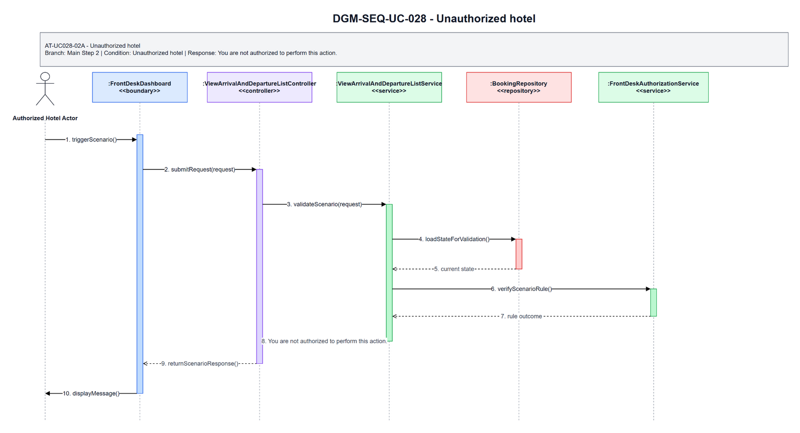

**Figure 3.28-4: Sequence Diagram of UC-028 View Arrival and Departure List - AT-UC028-02A Unauthorized hotel**

### Validation, Authorization, Transaction, and Error Handling Notes

| Area | Design |
|---|---|
| Validation | Validate required input, current entity status, date/amount/reference values, and SRS business rules before any state change. |
| Authorization | Allow only Receptionist, Hotel Manager, Property Owner according to the SRS actor, role, hotel-scope, or platform-scope precondition. |
| Transaction | Read-only query transaction; no persistent state is changed in the successful display flow. |
| Error Handling | AT-UC028-03A returns "No arrivals or departures match the selected filters."; AT-UC028-02A returns "You are not authorized to perform this action.". |
| Privacy | Return only fields allowed for the current role and scope; staff roles must not receive unrelated customer, platform finance, or cross-hotel data. |

## Assumptions and Open Issues

- ASSUMP-UC028-001: Controller, service, repository, DTO, and entity class names are conceptual SDD design names because no source implementation was inspected.
- ASSUMP-UC028-002: Final API routes, database column names, and UI widget names may differ from these SDD class names but must preserve the traced SRS behavior.
- OQ-UC028-001: Confirm final implementation class/package names before treating the conceptual design as code-level documentation.

# 3.29 UC-029 - Assign Physical Room

## 3.29.1 Design Purpose

This section describes the detailed design for **UC-029 Assign Physical Room**. The use case covers Assign or change physical room for a confirmed booking before or during check-in. The design is based on the SRS/SDD only; class names and methods are conceptual design assumptions because no implementation codebase was inspected.

**Related SRS items:** FEAT-FRONTDESK, UC-029, SCR-024, SCR-021, ENT-011, ENT-015, ENT-027, BR-ROOM-001, BR-ROOM-002, BR-STAY-001, BR-BOOK-009, BR-STAFF-002, BR-STAFF-003, BR-AUDIT-001, MSG-STAY-004, MSG-ROOM-007, MSG-ROOM-009, MSG-AUTH-007, TR-029, AT-UC029-05A, AT-UC029-05B, AT-UC029-05C, AT-UC029-02A.

**Precondition:** Actor authenticated; booking exists and assignment permission/status can be validated before room options are displayed.

**Trigger:** Actor selects Assign Room.

**Post-condition:** POS-01: Physical room assignment is recorded without overlap conflict.

The flow must:

- Main step 1: Actor opens booking detail or room assignment board.
- Main step 2: System validates actor role, booking hotel scope, booking status, and assignment permission before showing room options.
- Main step 3: System displays booking room requirement and available physical rooms.
- Main step 4: Actor selects/changes physical room.
- Main step 5: System validates room type match, status, overlap, and hotel assignment.
- Main step 6: System records room assignment.
- Main step 7: System displays success.
- Enforce related business rules: BR-ROOM-001, BR-ROOM-002, BR-STAY-001, BR-BOOK-009, BR-STAFF-002, BR-STAFF-003, BR-AUDIT-001.
- Return a separate scenario response for each alternative/error flow: AT-UC029-05A, AT-UC029-05B, AT-UC029-05C, AT-UC029-02A.

## 3.29.2 Class Diagram

This part presents the class diagram for UC-029 Assign Physical Room.

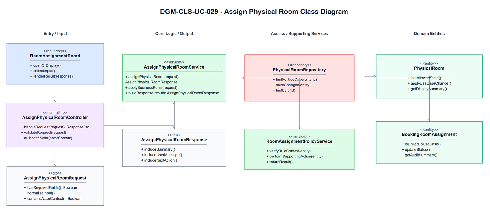

**Figure 3.29-1: Class Diagram of UC-029 Assign Physical Room**

## 3.29.3 Class Specifications

This part explains the key methods shown in the class diagram. The classes are conceptual design assumptions unless source code is inspected.

### RoomAssignmentBoard Class

**Description:** Boundary object for the user-visible or scheduled entry point of UC-029 Assign Physical Room.

| No | Method | Description |
|---:|---|---|
| 1 | `openOrDisplay()` | Displays the use-case screen or activates the scheduled entry point described by the SRS. |
| 2 | `collectInput()` | Collects actor input or scheduler criteria before request submission. |
| 3 | `renderResult(response)` | Displays the result, validation message, or next action to the actor. |

### AssignPhysicalRoomController Class

**Description:** API/application entry controller for UC-029 Assign Physical Room.

| No | Method | Description |
|---:|---|---|
| 1 | `handleRequest(request)` | Receives the request from the boundary and delegates the business operation to the service. |
| 2 | `validateRequest(request)` | Checks required request shape before business rule execution. |
| 3 | `authorizeActor(actorContext)` | Verifies that the current actor may execute this use case and related hotel/platform scope. |

### AssignPhysicalRoomRequest Class

**Description:** Request DTO carrying input for UC-029 Assign Physical Room.

| No | Method | Description |
|---:|---|---|
| 1 | `hasRequiredFields()` | Returns whether mandatory fields from the SRS screen/use-case step are present. |
| 2 | `normalizeInput()` | Normalizes filter, status, note, amount, date, or reference input before service validation. |
| 3 | `containsActorContext()` | Confirms the request carries the authenticated actor or scheduler context needed for authorization. |

### AssignPhysicalRoomService Class

**Description:** Application service that coordinates the main flow, business rules, persistence, and response creation for Assign Physical Room.

| No | Method | Description |
|---:|---|---|
| 1 | `assignPhysicalRoom(request)` | Executes the UC-029 main flow and returns a response for the boundary. |
| 2 | `applyBusinessRules(request)` | Applies the related SRS business rules and state-transition constraints. |
| 3 | `buildResponse(result)` | Builds success, empty-state, or validation responses without exposing unauthorized data. |

### PhysicalRoomRepository Class

**Description:** Repository abstraction for loading and saving data required by Assign Physical Room.

| No | Method | Description |
|---:|---|---|
| 1 | `findForUseCase(criteria)` | Loads the entity state required for validation and display. |
| 2 | `findById(id)` | Retrieves a specific record within actor, hotel, or platform scope. |
| 3 | `saveChanges(entity)` | Persists allowed state changes when the use case modifies data. |

### RoomAssignmentPolicyService Class

**Description:** Supporting service or integration used by UC-029 Assign Physical Room.

| No | Method | Description |
|---:|---|---|
| 1 | `verifyRuleContext(entity)` | Checks specialized policy, authorization, calculation, notification, or external status context. |
| 2 | `performSupportingAction(entity)` | Performs notification, calculation, audit, or external reconciliation support when required. |
| 3 | `returnResult()` | Returns the supporting result to the application service for final response composition. |

### AssignPhysicalRoomResponse Class

**Description:** Response DTO returned by UC-029 Assign Physical Room.

| No | Method | Description |
|---:|---|---|
| 1 | `includeSummary()` | Adds the display or operation summary needed by the screen. |
| 2 | `includeUserMessage()` | Adds the user-facing success, empty-state, or validation message. |
| 3 | `includeNextAction()` | Adds the next available action when the SRS flow continues or returns for correction. |

### PhysicalRoom Class

**Description:** Individual private hotel room under a room type.

| No | Method | Description |
|---:|---|---|
| 1 | `isInAllowedState()` | Determines whether the entity state allows the requested use-case operation. |
| 2 | `applyUseCaseChange()` | Applies the state or data change permitted by the validated flow. |
| 3 | `getDisplaySummary()` | Provides safe summary data for the response or audit record. |

### BookingRoomAssignment Class

**Description:** Physical room assignment for booking/stay.

| No | Method | Description |
|---:|---|---|
| 1 | `isInAllowedState()` | Determines whether the entity state allows the requested use-case operation. |
| 2 | `applyUseCaseChange()` | Applies the state or data change permitted by the validated flow. |
| 3 | `getDisplaySummary()` | Provides safe summary data for the response or audit record. |

## 3.29.4 Sequence Diagram

This part presents the sequence diagrams for UC-029 Assign Physical Room. The main-flow diagram shows only the successful scenario. Each alternative/error scenario has its own diagram.

**Figure 3.29-2: Sequence Diagram of UC-029 Assign Physical Room - Main Flow**

### AT-UC029-05A - Room unavailable

- **Branch from Main Step:** 5
- **Condition:** Room unavailable
- **Expected Response:** Selected physical room is not available for assignment.

**Figure 3.29-3: Sequence Diagram of UC-029 Assign Physical Room - AT-UC029-05A Room unavailable**

### AT-UC029-05B - Room type mismatch

- **Branch from Main Step:** 5
- **Condition:** Room type mismatch
- **Expected Response:** Selected physical room does not match the required room type.

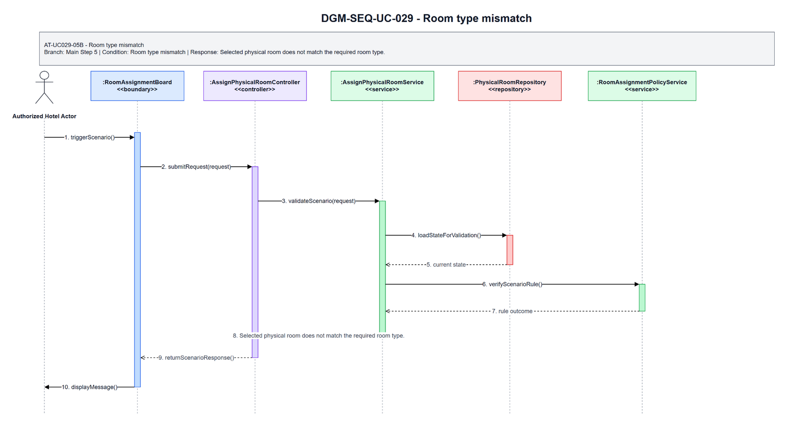

**Figure 3.29-4: Sequence Diagram of UC-029 Assign Physical Room - AT-UC029-05B Room type mismatch**

### AT-UC029-05C - Overlap

- **Branch from Main Step:** 5
- **Condition:** Overlap
- **Expected Response:** This physical room is already assigned to another active stay for the selected dates.

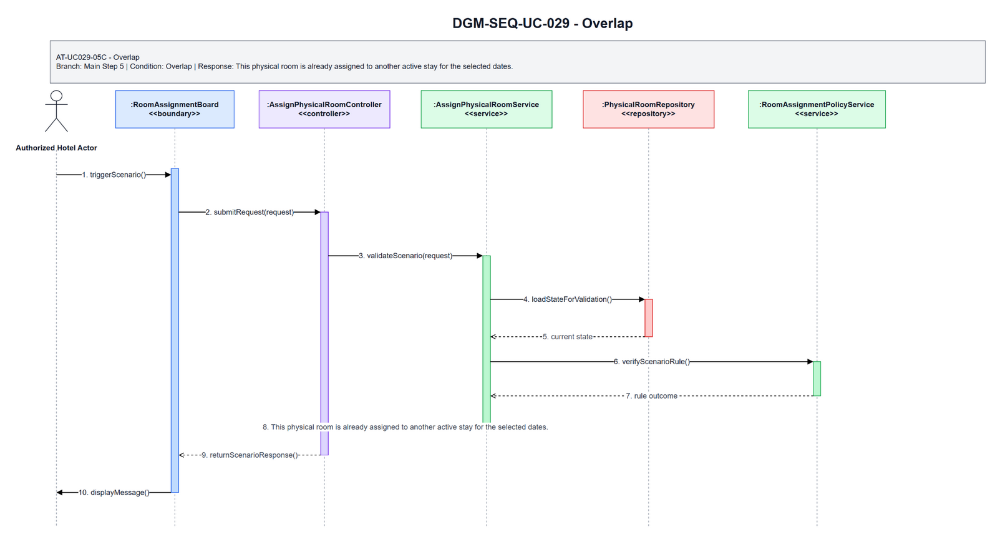

**Figure 3.29-5: Sequence Diagram of UC-029 Assign Physical Room - AT-UC029-05C Overlap**

### AT-UC029-02A - Unauthorized hotel, booking, or assignment action

- **Branch from Main Step:** 2
- **Condition:** Unauthorized hotel, booking, or assignment action
- **Expected Response:** You are not authorized to perform this action.

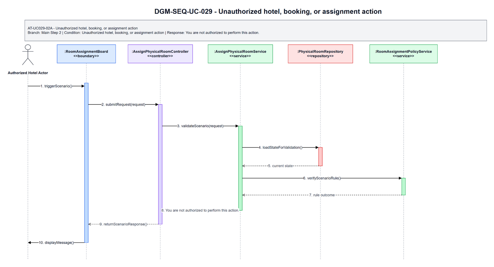

**Figure 3.29-6: Sequence Diagram of UC-029 Assign Physical Room - AT-UC029-02A Unauthorized hotel, booking, or assignment action**

### Validation, Authorization, Transaction, and Error Handling Notes

| Area | Design |
|---|---|
| Validation | Validate required input, current entity status, date/amount/reference values, and SRS business rules before any state change. |
| Authorization | Allow only Receptionist, Hotel Manager, Property Owner according to the SRS actor, role, hotel-scope, or platform-scope precondition. |
| Transaction | Use a single application transaction for validated state changes, persistence updates, audit records, and notification records where applicable. |
| Error Handling | AT-UC029-05A returns "Selected physical room is not available for assignment."; AT-UC029-05B returns "Selected physical room does not match the required room type."; AT-UC029-05C returns "This physical room is already assigned to another active stay for the selected dates."; AT-UC029-02A returns "You are not authorized to perform this action.". |
| Privacy | Return only fields allowed for the current role and scope; staff roles must not receive unrelated customer, platform finance, or cross-hotel data. |

## Assumptions and Open Issues

- ASSUMP-UC029-001: Controller, service, repository, DTO, and entity class names are conceptual SDD design names because no source implementation was inspected.
- ASSUMP-UC029-002: Final API routes, database column names, and UI widget names may differ from these SDD class names but must preserve the traced SRS behavior.
- OQ-UC029-001: Confirm final implementation class/package names before treating the conceptual design as code-level documentation.

# 3.30 UC-030 - Record Pay-at-Property Payment

## 3.30.1 Design Purpose

This section describes the detailed design for **UC-030 Record Pay-at-Property Payment**. The use case covers Record amount collected directly at hotel for Pay at Property booking. The design is based on the SRS/SDD only; class names and methods are conceptual design assumptions because no implementation codebase was inspected.

**Related SRS items:** FEAT-FRONTDESK, UC-030, SCR-026, ENT-017, ENT-019, ENT-024, BR-PAY-004, BR-PAY-006, BR-PAY-007, BR-FIN-003, BR-STAFF-003, BR-AUDIT-001, MSG-PAY-005, MSG-PAY-006, MSG-PAY-007, MSG-PAY-008, TR-030, AT-UC030-05A, AT-UC030-02A, AT-UC030-05B, AT-UC030-05C.

**Precondition:** Actor authenticated; booking exists for a hotel the actor owns or is assigned to.

**Trigger:** Actor selects Record Payment Collection.

**Post-condition:** POS-01: Pay-at-Property collection is recorded and hotel-visible balance/receipt is updated.

The flow must:

- Main step 1: Actor opens booking detail or checkout screen.
- Main step 2: System validates booking access and payment mode before displaying expected amount, prior collections, and balance.
- Main step 3: System displays expected amount, prior collections, and remaining balance.
- Main step 4: Actor enters amount, method, date, note/reference.
- Main step 5: System validates amount, required collection fields, remaining balance, and duplicate/concurrent collection guard.
- Main step 6: System atomically records collection and updates payment/collection status and invoice balance.
- Main step 7: System records audit and displays success.
- Enforce related business rules: BR-PAY-004, BR-PAY-006, BR-PAY-007, BR-FIN-003, BR-STAFF-003, BR-AUDIT-001.
- Return a separate scenario response for each alternative/error flow: AT-UC030-05A, AT-UC030-02A, AT-UC030-05B, AT-UC030-05C.

## 3.30.2 Class Diagram

This part presents the class diagram for UC-030 Record Pay-at-Property Payment.

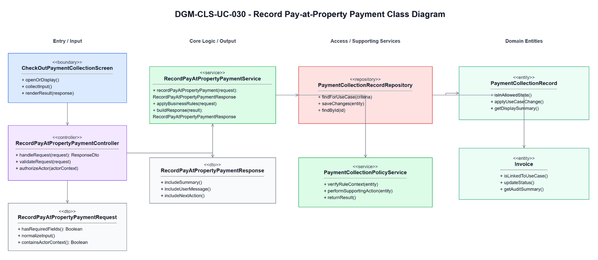

**Figure 3.30-1: Class Diagram of UC-030 Record Pay-at-Property Payment**

## 3.30.3 Class Specifications

This part explains the key methods shown in the class diagram. The classes are conceptual design assumptions unless source code is inspected.

### CheckOutPaymentCollectionScreen Class

**Description:** Boundary object for the user-visible or scheduled entry point of UC-030 Record Pay-at-Property Payment.

| No | Method | Description |
|---:|---|---|
| 1 | `openOrDisplay()` | Displays the use-case screen or activates the scheduled entry point described by the SRS. |
| 2 | `collectInput()` | Collects actor input or scheduler criteria before request submission. |
| 3 | `renderResult(response)` | Displays the result, validation message, or next action to the actor. |

### RecordPayAtPropertyPaymentController Class

**Description:** API/application entry controller for UC-030 Record Pay-at-Property Payment.

| No | Method | Description |
|---:|---|---|
| 1 | `handleRequest(request)` | Receives the request from the boundary and delegates the business operation to the service. |
| 2 | `validateRequest(request)` | Checks required request shape before business rule execution. |
| 3 | `authorizeActor(actorContext)` | Verifies that the current actor may execute this use case and related hotel/platform scope. |

### RecordPayAtPropertyPaymentRequest Class

**Description:** Request DTO carrying input for UC-030 Record Pay-at-Property Payment.

| No | Method | Description |
|---:|---|---|
| 1 | `hasRequiredFields()` | Returns whether mandatory fields from the SRS screen/use-case step are present. |
| 2 | `normalizeInput()` | Normalizes filter, status, note, amount, date, or reference input before service validation. |
| 3 | `containsActorContext()` | Confirms the request carries the authenticated actor or scheduler context needed for authorization. |

### RecordPayAtPropertyPaymentService Class

**Description:** Application service that coordinates the main flow, business rules, persistence, and response creation for Record Pay-at-Property Payment.

| No | Method | Description |
|---:|---|---|
| 1 | `recordPayAtPropertyPayment(request)` | Executes the UC-030 main flow and returns a response for the boundary. |
| 2 | `applyBusinessRules(request)` | Applies the related SRS business rules and state-transition constraints. |
| 3 | `buildResponse(result)` | Builds success, empty-state, or validation responses without exposing unauthorized data. |

### PaymentCollectionRecordRepository Class

**Description:** Repository abstraction for loading and saving data required by Record Pay-at-Property Payment.

| No | Method | Description |
|---:|---|---|
| 1 | `findForUseCase(criteria)` | Loads the entity state required for validation and display. |
| 2 | `findById(id)` | Retrieves a specific record within actor, hotel, or platform scope. |
| 3 | `saveChanges(entity)` | Persists allowed state changes when the use case modifies data. |

### PaymentCollectionPolicyService Class

**Description:** Supporting service or integration used by UC-030 Record Pay-at-Property Payment.

| No | Method | Description |
|---:|---|---|
| 1 | `verifyRuleContext(entity)` | Checks specialized policy, authorization, calculation, notification, or external status context. |
| 2 | `performSupportingAction(entity)` | Performs notification, calculation, audit, or external reconciliation support when required. |
| 3 | `returnResult()` | Returns the supporting result to the application service for final response composition. |

### RecordPayAtPropertyPaymentResponse Class

**Description:** Response DTO returned by UC-030 Record Pay-at-Property Payment.

| No | Method | Description |
|---:|---|---|
| 1 | `includeSummary()` | Adds the display or operation summary needed by the screen. |
| 2 | `includeUserMessage()` | Adds the user-facing success, empty-state, or validation message. |
| 3 | `includeNextAction()` | Adds the next available action when the SRS flow continues or returns for correction. |

### PaymentCollectionRecord Class

**Description:** Hotel-side collection record for Pay at Property booking.

| No | Method | Description |
|---:|---|---|
| 1 | `isInAllowedState()` | Determines whether the entity state allows the requested use-case operation. |
| 2 | `applyUseCaseChange()` | Applies the state or data change permitted by the validated flow. |
| 3 | `getDisplaySummary()` | Provides safe summary data for the response or audit record. |

### Invoice Class

**Description:** Basic invoice/folio for booking and checkout.

| No | Method | Description |
|---:|---|---|
| 1 | `isInAllowedState()` | Determines whether the entity state allows the requested use-case operation. |
| 2 | `applyUseCaseChange()` | Applies the state or data change permitted by the validated flow. |
| 3 | `getDisplaySummary()` | Provides safe summary data for the response or audit record. |

## 3.30.4 Sequence Diagram

This part presents the sequence diagrams for UC-030 Record Pay-at-Property Payment. The main-flow diagram shows only the successful scenario. Each alternative/error scenario has its own diagram.

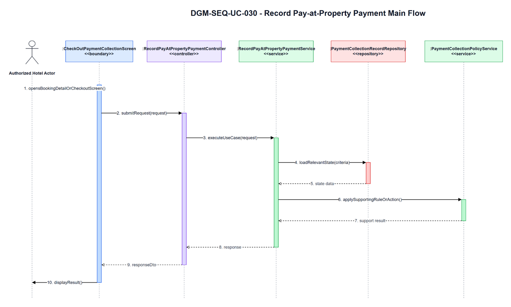

**Figure 3.30-2: Sequence Diagram of UC-030 Record Pay-at-Property Payment - Main Flow**

### AT-UC030-05A - Invalid amount

- **Branch from Main Step:** 5
- **Condition:** Invalid amount
- **Expected Response:** Please enter a valid collection amount.

**Figure 3.30-3: Sequence Diagram of UC-030 Record Pay-at-Property Payment - AT-UC030-05A Invalid amount**

### AT-UC030-02A - Wrong payment mode

- **Branch from Main Step:** 2
- **Condition:** Wrong payment mode
- **Expected Response:** This action is allowed only for Pay at Property bookings.

**Figure 3.30-4: Sequence Diagram of UC-030 Record Pay-at-Property Payment - AT-UC030-02A Wrong payment mode**

### AT-UC030-05B - Amount exceeds expected

- **Branch from Main Step:** 5
- **Condition:** Amount exceeds expected
- **Expected Response:** The collection amount cannot exceed the expected balance unless exception handling is allowed.

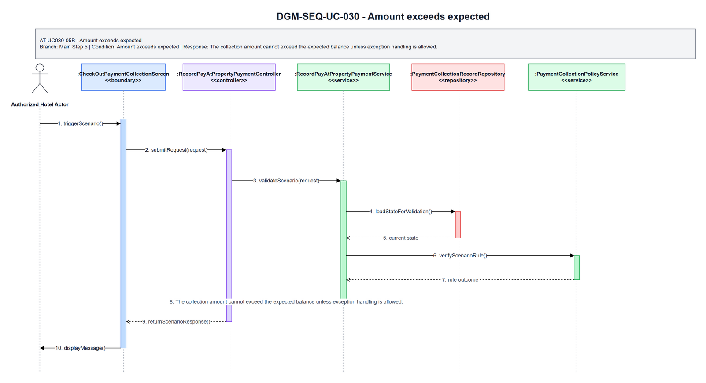

**Figure 3.30-5: Sequence Diagram of UC-030 Record Pay-at-Property Payment - AT-UC030-05B Amount exceeds expected**

### AT-UC030-05C - Duplicate or concurrent collection

- **Branch from Main Step:** 5
- **Condition:** Duplicate or concurrent collection
- **Expected Response:** Please enter a valid collection amount.

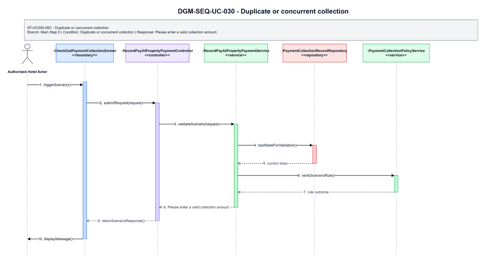

**Figure 3.30-6: Sequence Diagram of UC-030 Record Pay-at-Property Payment - AT-UC030-05C Duplicate or concurrent collection**

### Validation, Authorization, Transaction, and Error Handling Notes

| Area | Design |
|---|---|
| Validation | Validate required input, current entity status, date/amount/reference values, and SRS business rules before any state change. |
| Authorization | Allow only Receptionist, Hotel Manager, Property Owner according to the SRS actor, role, hotel-scope, or platform-scope precondition. |
| Transaction | Use a single application transaction for validated state changes, persistence updates, audit records, and notification records where applicable. |
| Error Handling | AT-UC030-05A returns "Please enter a valid collection amount."; AT-UC030-02A returns "This action is allowed only for Pay at Property bookings."; AT-UC030-05B returns "The collection amount cannot exceed the expected balance unless exception handling is allowed."; AT-UC030-05C returns "Please enter a valid collection amount.". |
| Privacy | Return only fields allowed for the current role and scope; staff roles must not receive unrelated customer, platform finance, or cross-hotel data. |

## Assumptions and Open Issues

- ASSUMP-UC030-001: Controller, service, repository, DTO, and entity class names are conceptual SDD design names because no source implementation was inspected.
- ASSUMP-UC030-002: Final API routes, database column names, and UI widget names may differ from these SDD class names but must preserve the traced SRS behavior.
- OQ-UC030-001: Confirm final implementation class/package names before treating the conceptual design as code-level documentation.

# 3.31 UC-031 - Create Walk-in Booking

## 3.31.1 Design Purpose

This section describes the detailed design for **UC-031 Create Walk-in Booking**. The use case covers Create booking for guest arriving directly at hotel if room is available. The design is based on the SRS/SDD only; class names and methods are conceptual design assumptions because no implementation codebase was inspected.

**Related SRS items:** FEAT-FRONTDESK, UC-031, SCR-027, ENT-013, ENT-014, ENT-015, BR-BOOK-001, BR-BOOK-002, BR-BOOK-003, BR-BOOK-013, BR-FD-001, BR-STAFF-003, MSG-BOOK-002, MSG-FD-002, MSG-FD-003, TR-031, AT-UC031-06A, AT-UC031-05A, AT-UC031-02A, AT-UC031-07A, AT-UC031-07B.

**Precondition:** Actor authenticated; walk-in booking enabled for owned or assigned hotel.

**Trigger:** Actor selects Create Walk-in Booking.

**Post-condition:** POS-01: Walk-in booking is created with booking source Walk-in if availability exists.

The flow must:

- Main step 1: Actor opens Walk-in Booking Screen.
- Main step 2: System validates actor role, hotel scope, walk-in enablement, and available payment modes before showing booking fields.
- Main step 3: System displays hotel, date, room type, guest information, price summary, and payment mode fields.
- Main step 4: Actor enters guest/stay information and selects payment mode.
- Main step 5: System validates date range, guest information, payment mode, and price.
- Main step 6: System atomically validates availability and reserves requested room type quantity for the date range.
- Main step 7: System branches by selected payment mode and creates booking with source Walk-in and correct initial status.
- Continue through the remaining SRS main-flow steps until the UC-031 post-condition is reached.
- Enforce related business rules: BR-BOOK-001, BR-BOOK-002, BR-BOOK-003, BR-BOOK-013, BR-FD-001, BR-STAFF-003.
- Return a separate scenario response for each alternative/error flow: AT-UC031-06A, AT-UC031-05A, AT-UC031-02A, AT-UC031-07A, AT-UC031-07B.

## 3.31.2 Class Diagram

This part presents the class diagram for UC-031 Create Walk-in Booking.

**Figure 3.31-1: Class Diagram of UC-031 Create Walk-in Booking**

## 3.31.3 Class Specifications

This part explains the key methods shown in the class diagram. The classes are conceptual design assumptions unless source code is inspected.

### WalkInBookingScreen Class

**Description:** Boundary object for the user-visible or scheduled entry point of UC-031 Create Walk-in Booking.

| No | Method | Description |
|---:|---|---|
| 1 | `openOrDisplay()` | Displays the use-case screen or activates the scheduled entry point described by the SRS. |
| 2 | `collectInput()` | Collects actor input or scheduler criteria before request submission. |
| 3 | `renderResult(response)` | Displays the result, validation message, or next action to the actor. |

### CreateWalkInBookingController Class

**Description:** API/application entry controller for UC-031 Create Walk-in Booking.

| No | Method | Description |
|---:|---|---|
| 1 | `handleRequest(request)` | Receives the request from the boundary and delegates the business operation to the service. |
| 2 | `validateRequest(request)` | Checks required request shape before business rule execution. |
| 3 | `authorizeActor(actorContext)` | Verifies that the current actor may execute this use case and related hotel/platform scope. |

### CreateWalkInBookingRequest Class

**Description:** Request DTO carrying input for UC-031 Create Walk-in Booking.

| No | Method | Description |
|---:|---|---|
| 1 | `hasRequiredFields()` | Returns whether mandatory fields from the SRS screen/use-case step are present. |
| 2 | `normalizeInput()` | Normalizes filter, status, note, amount, date, or reference input before service validation. |
| 3 | `containsActorContext()` | Confirms the request carries the authenticated actor or scheduler context needed for authorization. |

### CreateWalkInBookingService Class

**Description:** Application service that coordinates the main flow, business rules, persistence, and response creation for Create Walk-in Booking.

| No | Method | Description |
|---:|---|---|
| 1 | `createWalkInBooking(request)` | Executes the UC-031 main flow and returns a response for the boundary. |
| 2 | `applyBusinessRules(request)` | Applies the related SRS business rules and state-transition constraints. |
| 3 | `buildResponse(result)` | Builds success, empty-state, or validation responses without exposing unauthorized data. |

### BookingRepository Class

**Description:** Repository abstraction for loading and saving data required by Create Walk-in Booking.

| No | Method | Description |
|---:|---|---|
| 1 | `findForUseCase(criteria)` | Loads the entity state required for validation and display. |
| 2 | `findById(id)` | Retrieves a specific record within actor, hotel, or platform scope. |
| 3 | `saveChanges(entity)` | Persists allowed state changes when the use case modifies data. |

### AvailabilityReservationService Class

**Description:** Supporting service or integration used by UC-031 Create Walk-in Booking.

| No | Method | Description |
|---:|---|---|
| 1 | `verifyRuleContext(entity)` | Checks specialized policy, authorization, calculation, notification, or external status context. |
| 2 | `performSupportingAction(entity)` | Performs notification, calculation, audit, or external reconciliation support when required. |
| 3 | `returnResult()` | Returns the supporting result to the application service for final response composition. |

### CreateWalkInBookingResponse Class

**Description:** Response DTO returned by UC-031 Create Walk-in Booking.

| No | Method | Description |
|---:|---|---|
| 1 | `includeSummary()` | Adds the display or operation summary needed by the screen. |
| 2 | `includeUserMessage()` | Adds the user-facing success, empty-state, or validation message. |
| 3 | `includeNextAction()` | Adds the next available action when the SRS flow continues or returns for correction. |

### Booking Class

**Description:** Customer reservation for selected hotel and room/date range.

| No | Method | Description |
|---:|---|---|
| 1 | `isInAllowedState()` | Determines whether the entity state allows the requested use-case operation. |
| 2 | `applyUseCaseChange()` | Applies the state or data change permitted by the validated flow. |
| 3 | `getDisplaySummary()` | Provides safe summary data for the response or audit record. |

### BookingRoom Class

**Description:** Booking line item representing room type and quantity.

| No | Method | Description |
|---:|---|---|
| 1 | `isInAllowedState()` | Determines whether the entity state allows the requested use-case operation. |
| 2 | `applyUseCaseChange()` | Applies the state or data change permitted by the validated flow. |
| 3 | `getDisplaySummary()` | Provides safe summary data for the response or audit record. |

## 3.31.4 Sequence Diagram

This part presents the sequence diagrams for UC-031 Create Walk-in Booking. The main-flow diagram shows only the successful scenario. Each alternative/error scenario has its own diagram.

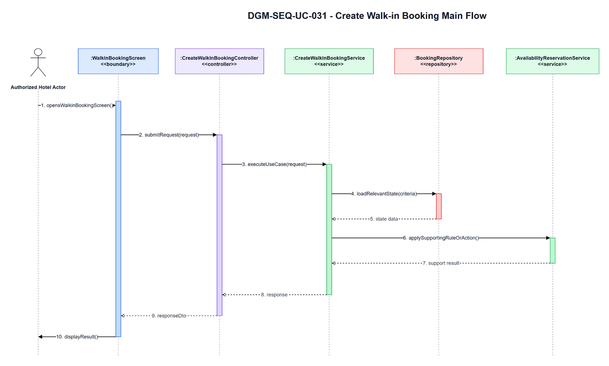

**Figure 3.31-2: Sequence Diagram of UC-031 Create Walk-in Booking - Main Flow**

### AT-UC031-06A - Room unavailable

- **Branch from Main Step:** 6
- **Condition:** Room unavailable
- **Expected Response:** The selected room is no longer available for the selected dates.

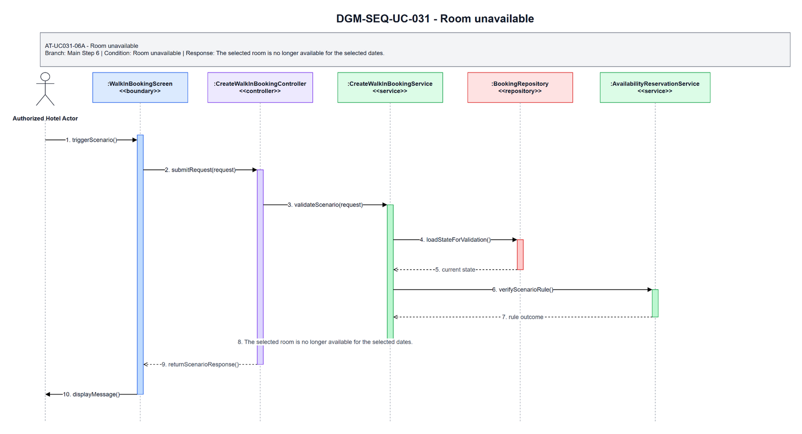

**Figure 3.31-3: Sequence Diagram of UC-031 Create Walk-in Booking - AT-UC031-06A Room unavailable**

### AT-UC031-05A - Missing guest contact

- **Branch from Main Step:** 5
- **Condition:** Missing guest contact
- **Expected Response:** Please enter required guest contact information.

**Figure 3.31-4: Sequence Diagram of UC-031 Create Walk-in Booking - AT-UC031-05A Missing guest contact**

### AT-UC031-02A - Walk-in disabled

- **Branch from Main Step:** 2
- **Condition:** Walk-in disabled
- **Expected Response:** Walk-in booking is not enabled for this hotel or role.

**Figure 3.31-5: Sequence Diagram of UC-031 Create Walk-in Booking - AT-UC031-02A Walk-in disabled**

### AT-UC031-07A - Platform Collect

- **Branch from Main Step:** 7
- **Condition:** Platform Collect
- **Expected Response:** The selected room is no longer available for the selected dates.

**Figure 3.31-6: Sequence Diagram of UC-031 Create Walk-in Booking - AT-UC031-07A Platform Collect**

### AT-UC031-07B - Pay at Property

- **Branch from Main Step:** 7
- **Condition:** Pay at Property
- **Expected Response:** The selected room is no longer available for the selected dates.

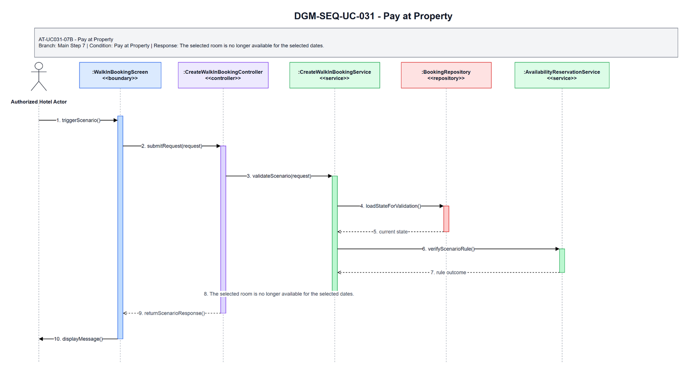

**Figure 3.31-7: Sequence Diagram of UC-031 Create Walk-in Booking - AT-UC031-07B Pay at Property**

### Validation, Authorization, Transaction, and Error Handling Notes

| Area | Design |
|---|---|
| Validation | Validate required input, current entity status, date/amount/reference values, and SRS business rules before any state change. |
| Authorization | Allow only Receptionist, Hotel Manager, Property Owner according to the SRS actor, role, hotel-scope, or platform-scope precondition. |
| Transaction | Use a single application transaction for validated state changes, persistence updates, audit records, and notification records where applicable. |
| Error Handling | AT-UC031-06A returns "The selected room is no longer available for the selected dates."; AT-UC031-05A returns "Please enter required guest contact information."; AT-UC031-02A returns "Walk-in booking is not enabled for this hotel or role."; AT-UC031-07A returns "The selected room is no longer available for the selected dates."; AT-UC031-07B returns "The selected room is no longer available for the selected dates.". |
| Privacy | Return only fields allowed for the current role and scope; staff roles must not receive unrelated customer, platform finance, or cross-hotel data. |

## Assumptions and Open Issues

- ASSUMP-UC031-001: Controller, service, repository, DTO, and entity class names are conceptual SDD design names because no source implementation was inspected.
- ASSUMP-UC031-002: Final API routes, database column names, and UI widget names may differ from these SDD class names but must preserve the traced SRS behavior.
- OQ-UC031-001: Confirm final implementation class/package names before treating the conceptual design as code-level documentation.

# 3.32 UC-032 - View Housekeeping Tasks

## 3.32.1 Design Purpose

This section describes the detailed design for **UC-032 View Housekeeping Tasks**. The use case covers View assigned or hotel-level housekeeping tasks by room, date, priority, and status. The design is based on the SRS/SDD only; class names and methods are conceptual design assumptions because no implementation codebase was inspected.

**Related SRS items:** FEAT-HOUSEKEEPING, UC-032, SCR-030, SCR-031, ENT-025, BR-HK-001, BR-HK-002, BR-STAFF-002, BR-STAFF-005, MSG-HK-001, MSG-AUTH-007, TR-032, AT-UC032-03A, AT-UC032-02A.

**Precondition:** Actor authenticated; hotel assignment and task visibility can be validated before list display.

**Trigger:** Actor opens Housekeeping Task List.

**Post-condition:** POS-01: Authorized housekeeping tasks are displayed.

The flow must:

- Main step 1: Actor opens Housekeeping Task List.
- Main step 2: System validates actor role, hotel assignment, and task visibility scope.
- Main step 3: System displays assigned tasks or hotel-level tasks according to role.
- Main step 4: Actor filters by room, date, status, priority, or task type.
- Main step 5: System refreshes list.
- Main step 6: Actor selects task.
- Main step 7: System validates selected task access and displays task detail with allowed actions.
- Enforce related business rules: BR-HK-001, BR-HK-002, BR-STAFF-002, BR-STAFF-005.
- Return a separate scenario response for each alternative/error flow: AT-UC032-03A, AT-UC032-02A.

## 3.32.2 Class Diagram

This part presents the class diagram for UC-032 View Housekeeping Tasks.

**Figure 3.32-1: Class Diagram of UC-032 View Housekeeping Tasks**

## 3.32.3 Class Specifications

This part explains the key methods shown in the class diagram. The classes are conceptual design assumptions unless source code is inspected.

### HousekeepingDashboard Class

**Description:** Boundary object for the user-visible or scheduled entry point of UC-032 View Housekeeping Tasks.

| No | Method | Description |
|---:|---|---|
| 1 | `openOrDisplay()` | Displays the use-case screen or activates the scheduled entry point described by the SRS. |
| 2 | `collectInput()` | Collects actor input or scheduler criteria before request submission. |
| 3 | `renderResult(response)` | Displays the result, validation message, or next action to the actor. |

### ViewHousekeepingTasksController Class

**Description:** API/application entry controller for UC-032 View Housekeeping Tasks.

| No | Method | Description |
|---:|---|---|
| 1 | `handleRequest(request)` | Receives the request from the boundary and delegates the business operation to the service. |
| 2 | `validateRequest(request)` | Checks required request shape before business rule execution. |
| 3 | `authorizeActor(actorContext)` | Verifies that the current actor may execute this use case and related hotel/platform scope. |

### ViewHousekeepingTasksRequest Class

**Description:** Request DTO carrying input for UC-032 View Housekeeping Tasks.

| No | Method | Description |
|---:|---|---|
| 1 | `hasRequiredFields()` | Returns whether mandatory fields from the SRS screen/use-case step are present. |
| 2 | `normalizeInput()` | Normalizes filter, status, note, amount, date, or reference input before service validation. |
| 3 | `containsActorContext()` | Confirms the request carries the authenticated actor or scheduler context needed for authorization. |

### ViewHousekeepingTasksService Class

**Description:** Application service that coordinates the main flow, business rules, persistence, and response creation for View Housekeeping Tasks.

| No | Method | Description |
|---:|---|---|
| 1 | `viewHousekeepingTasks(request)` | Executes the UC-032 main flow and returns a response for the boundary. |
| 2 | `applyBusinessRules(request)` | Applies the related SRS business rules and state-transition constraints. |
| 3 | `buildResponse(result)` | Builds success, empty-state, or validation responses without exposing unauthorized data. |

### HousekeepingTaskRepository Class

**Description:** Repository abstraction for loading and saving data required by View Housekeeping Tasks.

| No | Method | Description |
|---:|---|---|
| 1 | `findForUseCase(criteria)` | Loads the entity state required for validation and display. |
| 2 | `findById(id)` | Retrieves a specific record within actor, hotel, or platform scope. |
| 3 | `saveChanges(entity)` | Persists allowed state changes when the use case modifies data. |

### HousekeepingAuthorizationService Class

**Description:** Supporting service or integration used by UC-032 View Housekeeping Tasks.

| No | Method | Description |
|---:|---|---|
| 1 | `verifyRuleContext(entity)` | Checks specialized policy, authorization, calculation, notification, or external status context. |
| 2 | `performSupportingAction(entity)` | Performs notification, calculation, audit, or external reconciliation support when required. |
| 3 | `returnResult()` | Returns the supporting result to the application service for final response composition. |

### ViewHousekeepingTasksResponse Class

**Description:** Response DTO returned by UC-032 View Housekeeping Tasks.

| No | Method | Description |
|---:|---|---|
| 1 | `includeSummary()` | Adds the display or operation summary needed by the screen. |
| 2 | `includeUserMessage()` | Adds the user-facing success, empty-state, or validation message. |
| 3 | `includeNextAction()` | Adds the next available action when the SRS flow continues or returns for correction. |

### HousekeepingTask Class

**Description:** Cleaning or inspection task for a physical room.

| No | Method | Description |
|---:|---|---|
| 1 | `isInAllowedState()` | Determines whether the entity state allows the requested use-case operation. |
| 2 | `applyUseCaseChange()` | Applies the state or data change permitted by the validated flow. |
| 3 | `getDisplaySummary()` | Provides safe summary data for the response or audit record. |

## 3.32.4 Sequence Diagram

This part presents the sequence diagrams for UC-032 View Housekeeping Tasks. The main-flow diagram shows only the successful scenario. Each alternative/error scenario has its own diagram.

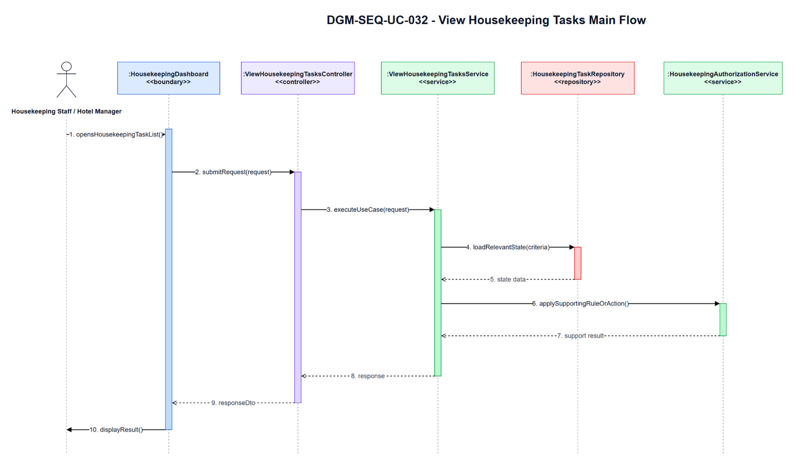

**Figure 3.32-2: Sequence Diagram of UC-032 View Housekeeping Tasks - Main Flow**

### AT-UC032-03A - No tasks

- **Branch from Main Step:** 3
- **Condition:** No tasks
- **Expected Response:** No housekeeping tasks match the selected filters.

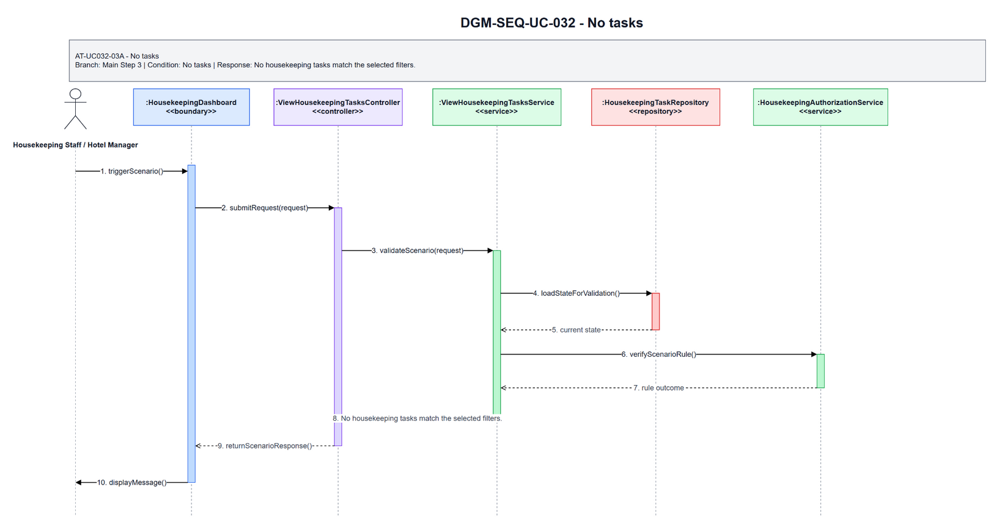

**Figure 3.32-3: Sequence Diagram of UC-032 View Housekeeping Tasks - AT-UC032-03A No tasks**

### AT-UC032-02A - Unauthorized hotel

- **Branch from Main Step:** 2
- **Condition:** Unauthorized hotel
- **Expected Response:** You are not authorized to perform this action.

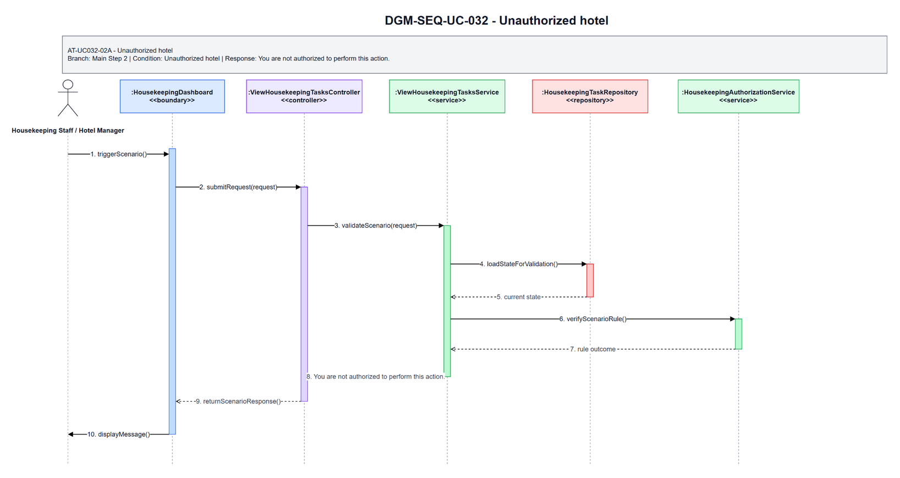

**Figure 3.32-4: Sequence Diagram of UC-032 View Housekeeping Tasks - AT-UC032-02A Unauthorized hotel**

### Validation, Authorization, Transaction, and Error Handling Notes

| Area | Design |
|---|---|
| Validation | Validate required input, current entity status, date/amount/reference values, and SRS business rules before any state change. |
| Authorization | Allow only Housekeeping Staff, Hotel Manager according to the SRS actor, role, hotel-scope, or platform-scope precondition. |
| Transaction | Read-only query transaction; no persistent state is changed in the successful display flow. |
| Error Handling | AT-UC032-03A returns "No housekeeping tasks match the selected filters."; AT-UC032-02A returns "You are not authorized to perform this action.". |
| Privacy | Return only fields allowed for the current role and scope; staff roles must not receive unrelated customer, platform finance, or cross-hotel data. |

## Assumptions and Open Issues

- ASSUMP-UC032-001: Controller, service, repository, DTO, and entity class names are conceptual SDD design names because no source implementation was inspected.
- ASSUMP-UC032-002: Final API routes, database column names, and UI widget names may differ from these SDD class names but must preserve the traced SRS behavior.
- OQ-UC032-001: Confirm final implementation class/package names before treating the conceptual design as code-level documentation.

# 3.33 UC-033 - Update Room Cleaning Status

## 3.33.1 Design Purpose

This section describes the detailed design for **UC-033 Update Room Cleaning Status**. The use case covers Update cleaning task and room cleaning status. The design is based on the SRS/SDD only; class names and methods are conceptual design assumptions because no implementation codebase was inspected.

**Related SRS items:** FEAT-HOUSEKEEPING, UC-033, SCR-032, SCR-035, ENT-025, ENT-027, BR-HK-001, BR-HK-002, BR-HK-003, BR-STAFF-002, BR-STAFF-005, BR-AUDIT-001, MSG-HK-002, MSG-HK-003, MSG-AUTH-007, TR-033, AT-UC033-05A, AT-UC033-04A, AT-UC033-07A, AT-UC033-02A.

**Precondition:** Actor authenticated; housekeeping task exists or room requires cleaning, and task access can be validated before detail display.

**Trigger:** Actor updates cleaning status.

**Post-condition:** POS-01: Housekeeping task and room cleaning status are updated according to allowed workflow.

The flow must:

- Main step 1: Actor opens housekeeping task detail.
- Main step 2: System validates actor role, hotel assignment, and selected task access before showing task details.
- Main step 3: System displays room, task status, checklist, notes, and allowed transitions.
- Main step 4: Actor selects new cleaning status and enters notes if required.
- Main step 5: System validates status transition and permission.
- Main step 6: System updates housekeeping task.
- Main step 7: System updates room status according to rule and records RoomStatusHistory.
- Continue through the remaining SRS main-flow steps until the UC-033 post-condition is reached.
- Enforce related business rules: BR-HK-001, BR-HK-002, BR-HK-003, BR-STAFF-002, BR-STAFF-005, BR-AUDIT-001.
- Return a separate scenario response for each alternative/error flow: AT-UC033-05A, AT-UC033-04A, AT-UC033-07A, AT-UC033-02A.

## 3.33.2 Class Diagram

This part presents the class diagram for UC-033 Update Room Cleaning Status.

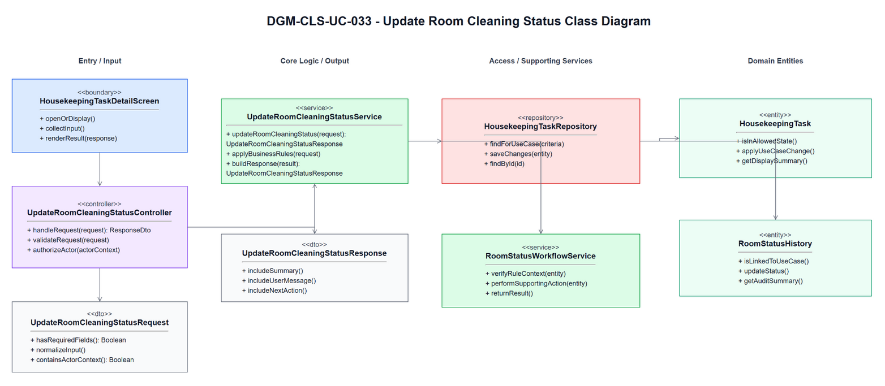

**Figure 3.33-1: Class Diagram of UC-033 Update Room Cleaning Status**

## 3.33.3 Class Specifications

This part explains the key methods shown in the class diagram. The classes are conceptual design assumptions unless source code is inspected.

### HousekeepingTaskDetailScreen Class

**Description:** Boundary object for the user-visible or scheduled entry point of UC-033 Update Room Cleaning Status.

| No | Method | Description |
|---:|---|---|
| 1 | `openOrDisplay()` | Displays the use-case screen or activates the scheduled entry point described by the SRS. |
| 2 | `collectInput()` | Collects actor input or scheduler criteria before request submission. |
| 3 | `renderResult(response)` | Displays the result, validation message, or next action to the actor. |

### UpdateRoomCleaningStatusController Class

**Description:** API/application entry controller for UC-033 Update Room Cleaning Status.

| No | Method | Description |
|---:|---|---|
| 1 | `handleRequest(request)` | Receives the request from the boundary and delegates the business operation to the service. |
| 2 | `validateRequest(request)` | Checks required request shape before business rule execution. |
| 3 | `authorizeActor(actorContext)` | Verifies that the current actor may execute this use case and related hotel/platform scope. |

### UpdateRoomCleaningStatusRequest Class

**Description:** Request DTO carrying input for UC-033 Update Room Cleaning Status.

| No | Method | Description |
|---:|---|---|
| 1 | `hasRequiredFields()` | Returns whether mandatory fields from the SRS screen/use-case step are present. |
| 2 | `normalizeInput()` | Normalizes filter, status, note, amount, date, or reference input before service validation. |
| 3 | `containsActorContext()` | Confirms the request carries the authenticated actor or scheduler context needed for authorization. |

### UpdateRoomCleaningStatusService Class

**Description:** Application service that coordinates the main flow, business rules, persistence, and response creation for Update Room Cleaning Status.

| No | Method | Description |
|---:|---|---|
| 1 | `updateRoomCleaningStatus(request)` | Executes the UC-033 main flow and returns a response for the boundary. |
| 2 | `applyBusinessRules(request)` | Applies the related SRS business rules and state-transition constraints. |
| 3 | `buildResponse(result)` | Builds success, empty-state, or validation responses without exposing unauthorized data. |

### HousekeepingTaskRepository Class

**Description:** Repository abstraction for loading and saving data required by Update Room Cleaning Status.

| No | Method | Description |
|---:|---|---|
| 1 | `findForUseCase(criteria)` | Loads the entity state required for validation and display. |
| 2 | `findById(id)` | Retrieves a specific record within actor, hotel, or platform scope. |
| 3 | `saveChanges(entity)` | Persists allowed state changes when the use case modifies data. |

### RoomStatusWorkflowService Class

**Description:** Supporting service or integration used by UC-033 Update Room Cleaning Status.

| No | Method | Description |
|---:|---|---|
| 1 | `verifyRuleContext(entity)` | Checks specialized policy, authorization, calculation, notification, or external status context. |
| 2 | `performSupportingAction(entity)` | Performs notification, calculation, audit, or external reconciliation support when required. |
| 3 | `returnResult()` | Returns the supporting result to the application service for final response composition. |

### UpdateRoomCleaningStatusResponse Class

**Description:** Response DTO returned by UC-033 Update Room Cleaning Status.

| No | Method | Description |
|---:|---|---|
| 1 | `includeSummary()` | Adds the display or operation summary needed by the screen. |
| 2 | `includeUserMessage()` | Adds the user-facing success, empty-state, or validation message. |
| 3 | `includeNextAction()` | Adds the next available action when the SRS flow continues or returns for correction. |

### HousekeepingTask Class

**Description:** Cleaning or inspection task for a physical room.

| No | Method | Description |
|---:|---|---|
| 1 | `isInAllowedState()` | Determines whether the entity state allows the requested use-case operation. |
| 2 | `applyUseCaseChange()` | Applies the state or data change permitted by the validated flow. |
| 3 | `getDisplaySummary()` | Provides safe summary data for the response or audit record. |

### RoomStatusHistory Class

**Description:** History of room operational status changes.

| No | Method | Description |
|---:|---|---|
| 1 | `isInAllowedState()` | Determines whether the entity state allows the requested use-case operation. |
| 2 | `applyUseCaseChange()` | Applies the state or data change permitted by the validated flow. |
| 3 | `getDisplaySummary()` | Provides safe summary data for the response or audit record. |

## 3.33.4 Sequence Diagram

This part presents the sequence diagrams for UC-033 Update Room Cleaning Status. The main-flow diagram shows only the successful scenario. Each alternative/error scenario has its own diagram.

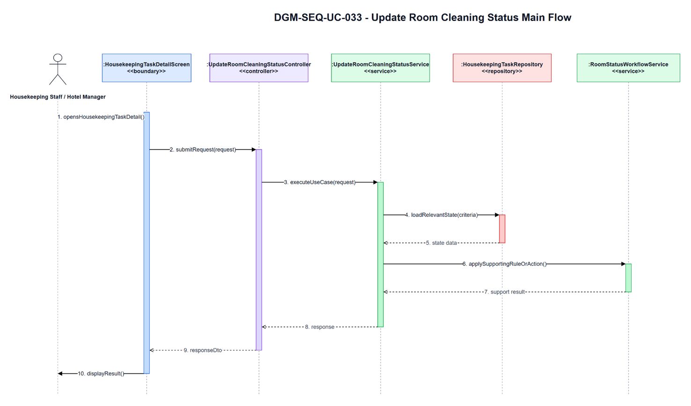

**Figure 3.33-2: Sequence Diagram of UC-033 Update Room Cleaning Status - Main Flow**

### AT-UC033-05A - Invalid transition

- **Branch from Main Step:** 5
- **Condition:** Invalid transition
- **Expected Response:** The selected cleaning status transition is not allowed.

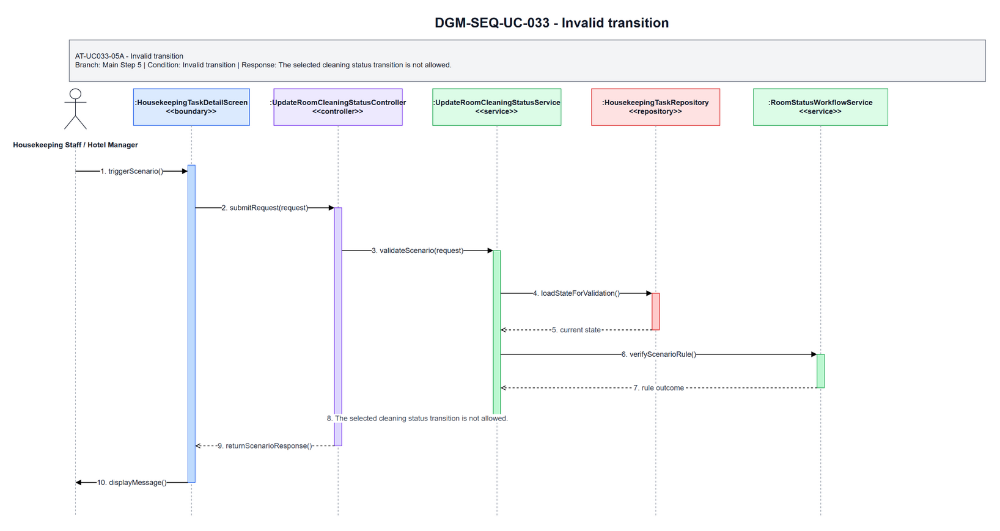

**Figure 3.33-3: Sequence Diagram of UC-033 Update Room Cleaning Status - AT-UC033-05A Invalid transition**

### AT-UC033-04A - Issue found

- **Branch from Main Step:** 4
- **Condition:** Issue found
- **Expected Response:** The selected cleaning status transition is not allowed.

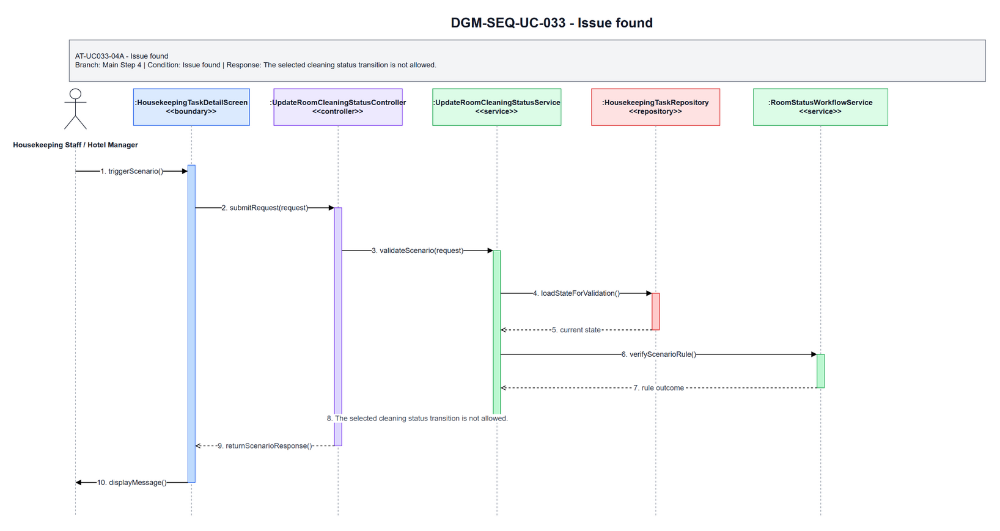

**Figure 3.33-4: Sequence Diagram of UC-033 Update Room Cleaning Status - AT-UC033-04A Issue found**

### AT-UC033-07A - Inspection required

- **Branch from Main Step:** 7
- **Condition:** Inspection required
- **Expected Response:** The selected cleaning status transition is not allowed.

**Figure 3.33-5: Sequence Diagram of UC-033 Update Room Cleaning Status - AT-UC033-07A Inspection required**

### AT-UC033-02A - Unauthorized hotel or task

- **Branch from Main Step:** 2
- **Condition:** Unauthorized hotel or task
- **Expected Response:** You are not authorized to perform this action.

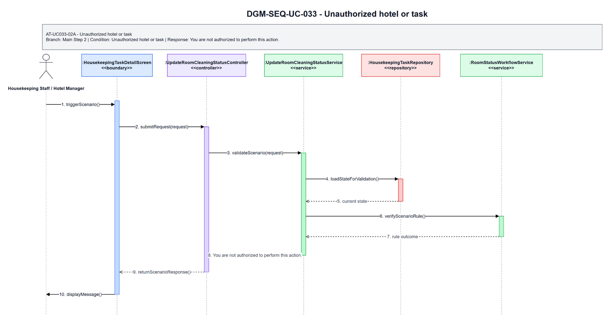

**Figure 3.33-6: Sequence Diagram of UC-033 Update Room Cleaning Status - AT-UC033-02A Unauthorized hotel or task**

### Validation, Authorization, Transaction, and Error Handling Notes

| Area | Design |
|---|---|
| Validation | Validate required input, current entity status, date/amount/reference values, and SRS business rules before any state change. |
| Authorization | Allow only Housekeeping Staff, Hotel Manager according to the SRS actor, role, hotel-scope, or platform-scope precondition. |
| Transaction | Use a single application transaction for validated state changes, persistence updates, audit records, and notification records where applicable. |
| Error Handling | AT-UC033-05A returns "The selected cleaning status transition is not allowed."; AT-UC033-04A returns "The selected cleaning status transition is not allowed."; AT-UC033-07A returns "The selected cleaning status transition is not allowed."; AT-UC033-02A returns "You are not authorized to perform this action.". |
| Privacy | Return only fields allowed for the current role and scope; staff roles must not receive unrelated customer, platform finance, or cross-hotel data. |

## Assumptions and Open Issues

- ASSUMP-UC033-001: Controller, service, repository, DTO, and entity class names are conceptual SDD design names because no source implementation was inspected.
- ASSUMP-UC033-002: Final API routes, database column names, and UI widget names may differ from these SDD class names but must preserve the traced SRS behavior.
- OQ-UC033-001: Confirm final implementation class/package names before treating the conceptual design as code-level documentation.

# 3.34 UC-034 - Report Room Issue

## 3.34.1 Design Purpose

This section describes the detailed design for **UC-034 Report Room Issue**. The use case covers Report room issue and create maintenance request. The design is based on the SRS/SDD only; class names and methods are conceptual design assumptions because no implementation codebase was inspected.

**Related SRS items:** FEAT-HOUSEKEEPING, FEAT-MAINTENANCE, UC-034, SCR-032, ENT-026, ENT-027, BR-MAINT-001, BR-MAINT-002, BR-HK-004, BR-STAFF-002, BR-STAFF-005, BR-AUDIT-001, MSG-MAINT-001, MSG-MAINT-002, MSG-AUTH-007, TR-034, AT-UC034-05A, AT-UC034-07A, AT-UC034-02A.

**Precondition:** Actor authenticated; room exists and hotel assignment can be validated before issue form display.

**Trigger:** Actor selects Report Issue.

**Post-condition:** POS-01: Maintenance request is created and room status is updated if issue severity requires blocking.

The flow must:

- Main step 1: Actor opens room issue report form.
- Main step 2: System validates actor role, hotel assignment, room access, and issue-report permission before showing room details.
- Main step 3: System displays room, issue type, severity, description, photo/note fields if enabled.
- Main step 4: Actor enters issue details and submits report.
- Main step 5: System validates required issue information and hotel assignment.
- Main step 6: System creates maintenance request.
- Main step 7: System updates room status to Maintenance or Out of Service if severity requires blocking and records RoomStatusHistory.
- Continue through the remaining SRS main-flow steps until the UC-034 post-condition is reached.
- Enforce related business rules: BR-MAINT-001, BR-MAINT-002, BR-HK-004, BR-STAFF-002, BR-STAFF-005, BR-AUDIT-001.
- Return a separate scenario response for each alternative/error flow: AT-UC034-05A, AT-UC034-07A, AT-UC034-02A.

## 3.34.2 Class Diagram

This part presents the class diagram for UC-034 Report Room Issue.

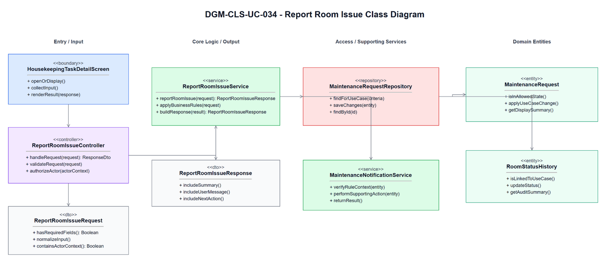

**Figure 3.34-1: Class Diagram of UC-034 Report Room Issue**

## 3.34.3 Class Specifications

This part explains the key methods shown in the class diagram. The classes are conceptual design assumptions unless source code is inspected.

### HousekeepingTaskDetailScreen Class

**Description:** Boundary object for the user-visible or scheduled entry point of UC-034 Report Room Issue.

| No | Method | Description |
|---:|---|---|
| 1 | `openOrDisplay()` | Displays the use-case screen or activates the scheduled entry point described by the SRS. |
| 2 | `collectInput()` | Collects actor input or scheduler criteria before request submission. |
| 3 | `renderResult(response)` | Displays the result, validation message, or next action to the actor. |

### ReportRoomIssueController Class

**Description:** API/application entry controller for UC-034 Report Room Issue.

| No | Method | Description |
|---:|---|---|
| 1 | `handleRequest(request)` | Receives the request from the boundary and delegates the business operation to the service. |
| 2 | `validateRequest(request)` | Checks required request shape before business rule execution. |
| 3 | `authorizeActor(actorContext)` | Verifies that the current actor may execute this use case and related hotel/platform scope. |

### ReportRoomIssueRequest Class

**Description:** Request DTO carrying input for UC-034 Report Room Issue.

| No | Method | Description |
|---:|---|---|
| 1 | `hasRequiredFields()` | Returns whether mandatory fields from the SRS screen/use-case step are present. |
| 2 | `normalizeInput()` | Normalizes filter, status, note, amount, date, or reference input before service validation. |
| 3 | `containsActorContext()` | Confirms the request carries the authenticated actor or scheduler context needed for authorization. |

### ReportRoomIssueService Class

**Description:** Application service that coordinates the main flow, business rules, persistence, and response creation for Report Room Issue.

| No | Method | Description |
|---:|---|---|
| 1 | `reportRoomIssue(request)` | Executes the UC-034 main flow and returns a response for the boundary. |
| 2 | `applyBusinessRules(request)` | Applies the related SRS business rules and state-transition constraints. |
| 3 | `buildResponse(result)` | Builds success, empty-state, or validation responses without exposing unauthorized data. |

### MaintenanceRequestRepository Class

**Description:** Repository abstraction for loading and saving data required by Report Room Issue.

| No | Method | Description |
|---:|---|---|
| 1 | `findForUseCase(criteria)` | Loads the entity state required for validation and display. |
| 2 | `findById(id)` | Retrieves a specific record within actor, hotel, or platform scope. |
| 3 | `saveChanges(entity)` | Persists allowed state changes when the use case modifies data. |

### MaintenanceNotificationService Class

**Description:** Supporting service or integration used by UC-034 Report Room Issue.

| No | Method | Description |
|---:|---|---|
| 1 | `verifyRuleContext(entity)` | Checks specialized policy, authorization, calculation, notification, or external status context. |
| 2 | `performSupportingAction(entity)` | Performs notification, calculation, audit, or external reconciliation support when required. |
| 3 | `returnResult()` | Returns the supporting result to the application service for final response composition. |

### ReportRoomIssueResponse Class

**Description:** Response DTO returned by UC-034 Report Room Issue.

| No | Method | Description |
|---:|---|---|
| 1 | `includeSummary()` | Adds the display or operation summary needed by the screen. |
| 2 | `includeUserMessage()` | Adds the user-facing success, empty-state, or validation message. |
| 3 | `includeNextAction()` | Adds the next available action when the SRS flow continues or returns for correction. |

### MaintenanceRequest Class

**Description:** Room maintenance issue/request.

| No | Method | Description |
|---:|---|---|
| 1 | `isInAllowedState()` | Determines whether the entity state allows the requested use-case operation. |
| 2 | `applyUseCaseChange()` | Applies the state or data change permitted by the validated flow. |
| 3 | `getDisplaySummary()` | Provides safe summary data for the response or audit record. |

### RoomStatusHistory Class

**Description:** History of room operational status changes.

| No | Method | Description |
|---:|---|---|
| 1 | `isInAllowedState()` | Determines whether the entity state allows the requested use-case operation. |
| 2 | `applyUseCaseChange()` | Applies the state or data change permitted by the validated flow. |
| 3 | `getDisplaySummary()` | Provides safe summary data for the response or audit record. |

## 3.34.4 Sequence Diagram

This part presents the sequence diagrams for UC-034 Report Room Issue. The main-flow diagram shows only the successful scenario. Each alternative/error scenario has its own diagram.

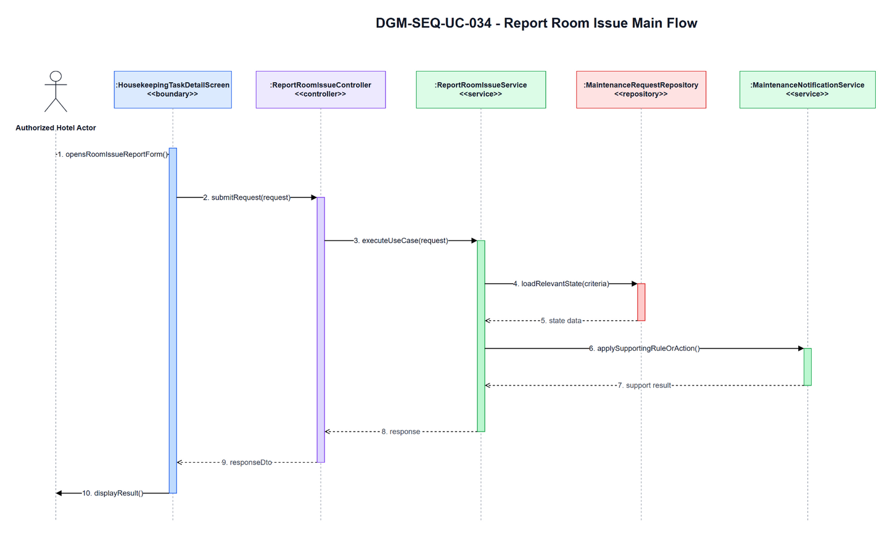

**Figure 3.34-2: Sequence Diagram of UC-034 Report Room Issue - Main Flow**

### AT-UC034-05A - Missing issue details

- **Branch from Main Step:** 5
- **Condition:** Missing issue details
- **Expected Response:** Please enter required room issue information.

**Figure 3.34-3: Sequence Diagram of UC-034 Report Room Issue - AT-UC034-05A Missing issue details**

### AT-UC034-07A - Low severity issue

- **Branch from Main Step:** 7
- **Condition:** Low severity issue
- **Expected Response:** Please enter required room issue information.

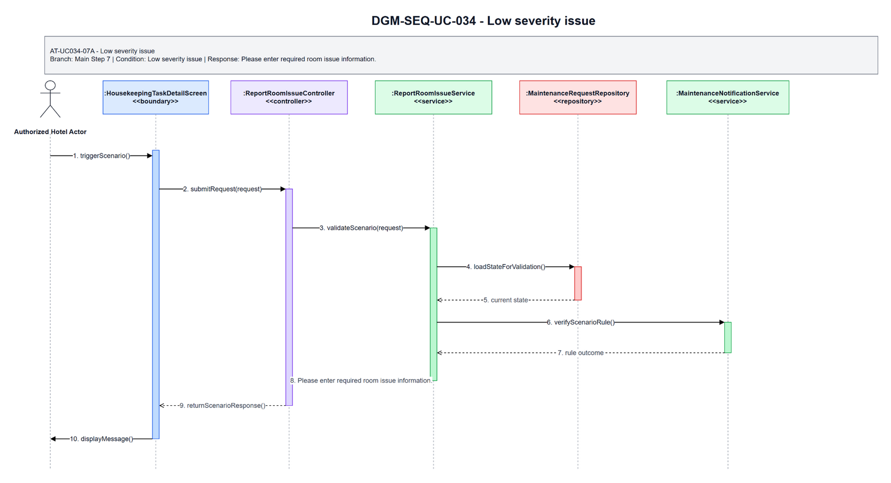

**Figure 3.34-4: Sequence Diagram of UC-034 Report Room Issue - AT-UC034-07A Low severity issue**

### AT-UC034-02A - Unauthorized hotel or room

- **Branch from Main Step:** 2
- **Condition:** Unauthorized hotel or room
- **Expected Response:** You are not authorized to perform this action.

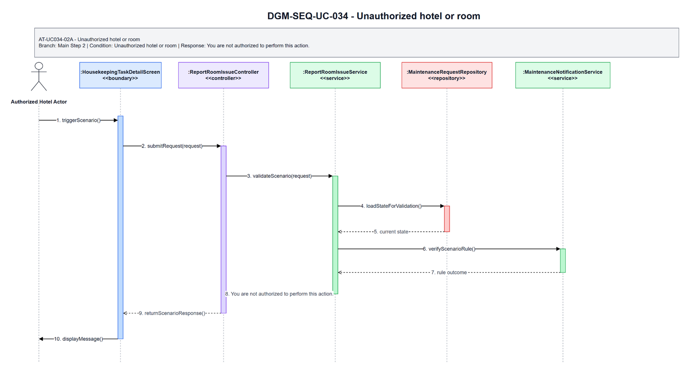

**Figure 3.34-5: Sequence Diagram of UC-034 Report Room Issue - AT-UC034-02A Unauthorized hotel or room**

### Validation, Authorization, Transaction, and Error Handling Notes

| Area | Design |
|---|---|
| Validation | Validate required input, current entity status, date/amount/reference values, and SRS business rules before any state change. |
| Authorization | Allow only Housekeeping Staff, Receptionist, Hotel Manager according to the SRS actor, role, hotel-scope, or platform-scope precondition. |
| Transaction | Use a single application transaction for validated state changes, persistence updates, audit records, and notification records where applicable. |
| Error Handling | AT-UC034-05A returns "Please enter required room issue information."; AT-UC034-07A returns "Please enter required room issue information."; AT-UC034-02A returns "You are not authorized to perform this action.". |
| Privacy | Return only fields allowed for the current role and scope; staff roles must not receive unrelated customer, platform finance, or cross-hotel data. |

## Assumptions and Open Issues

- ASSUMP-UC034-001: Controller, service, repository, DTO, and entity class names are conceptual SDD design names because no source implementation was inspected.
- ASSUMP-UC034-002: Final API routes, database column names, and UI widget names may differ from these SDD class names but must preserve the traced SRS behavior.
- OQ-UC034-001: Confirm final implementation class/package names before treating the conceptual design as code-level documentation.

# 3.35 UC-035 - View Maintenance Requests

## 3.35.1 Design Purpose

This section describes the detailed design for **UC-035 View Maintenance Requests**. The use case covers View open, assigned, and resolved maintenance requests for assigned hotels. The design is based on the SRS/SDD only; class names and methods are conceptual design assumptions because no implementation codebase was inspected.

**Related SRS items:** FEAT-MAINTENANCE, UC-035, SCR-033, ENT-026, BR-MAINT-001, BR-STAFF-002, BR-STAFF-006, MSG-MAINT-003, MSG-AUTH-007, TR-035, AT-UC035-03A, AT-UC035-02A.

**Precondition:** Actor authenticated; hotel assignment and maintenance visibility can be validated before list display.

**Trigger:** Actor opens Maintenance Request List.

**Post-condition:** POS-01: Authorized maintenance requests are displayed.

The flow must:

- Main step 1: Actor opens Maintenance Request List.
- Main step 2: System validates actor role, hotel assignment, and maintenance visibility scope.
- Main step 3: System displays requests by room, severity, status, assignee, and date.
- Main step 4: Actor filters or selects request.
- Main step 5: System validates selected request access and displays request detail with allowed actions.
- Enforce related business rules: BR-MAINT-001, BR-STAFF-002, BR-STAFF-006.
- Return a separate scenario response for each alternative/error flow: AT-UC035-03A, AT-UC035-02A.

## 3.35.2 Class Diagram

This part presents the class diagram for UC-035 View Maintenance Requests.

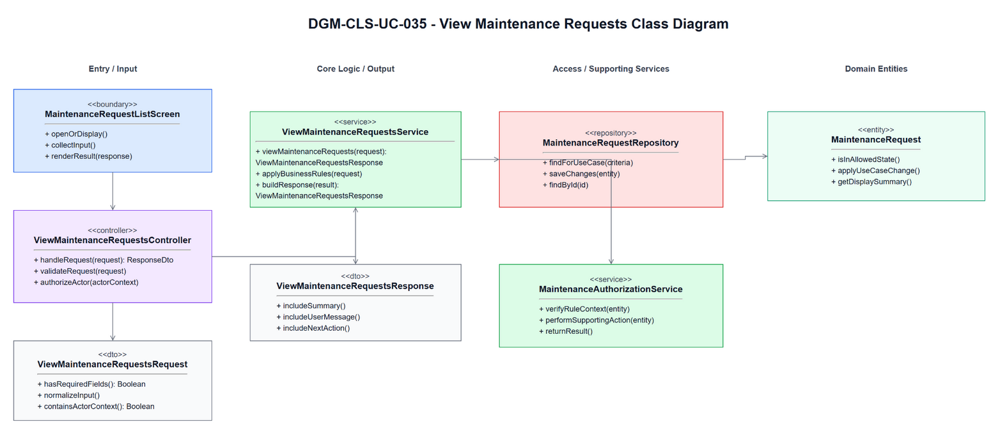

**Figure 3.35-1: Class Diagram of UC-035 View Maintenance Requests**

## 3.35.3 Class Specifications

This part explains the key methods shown in the class diagram. The classes are conceptual design assumptions unless source code is inspected.

### MaintenanceRequestListScreen Class

**Description:** Boundary object for the user-visible or scheduled entry point of UC-035 View Maintenance Requests.

| No | Method | Description |
|---:|---|---|
| 1 | `openOrDisplay()` | Displays the use-case screen or activates the scheduled entry point described by the SRS. |
| 2 | `collectInput()` | Collects actor input or scheduler criteria before request submission. |
| 3 | `renderResult(response)` | Displays the result, validation message, or next action to the actor. |

### ViewMaintenanceRequestsController Class

**Description:** API/application entry controller for UC-035 View Maintenance Requests.

| No | Method | Description |
|---:|---|---|
| 1 | `handleRequest(request)` | Receives the request from the boundary and delegates the business operation to the service. |
| 2 | `validateRequest(request)` | Checks required request shape before business rule execution. |
| 3 | `authorizeActor(actorContext)` | Verifies that the current actor may execute this use case and related hotel/platform scope. |

### ViewMaintenanceRequestsRequest Class

**Description:** Request DTO carrying input for UC-035 View Maintenance Requests.

| No | Method | Description |
|---:|---|---|
| 1 | `hasRequiredFields()` | Returns whether mandatory fields from the SRS screen/use-case step are present. |
| 2 | `normalizeInput()` | Normalizes filter, status, note, amount, date, or reference input before service validation. |
| 3 | `containsActorContext()` | Confirms the request carries the authenticated actor or scheduler context needed for authorization. |

### ViewMaintenanceRequestsService Class

**Description:** Application service that coordinates the main flow, business rules, persistence, and response creation for View Maintenance Requests.

| No | Method | Description |
|---:|---|---|
| 1 | `viewMaintenanceRequests(request)` | Executes the UC-035 main flow and returns a response for the boundary. |
| 2 | `applyBusinessRules(request)` | Applies the related SRS business rules and state-transition constraints. |
| 3 | `buildResponse(result)` | Builds success, empty-state, or validation responses without exposing unauthorized data. |

### MaintenanceRequestRepository Class

**Description:** Repository abstraction for loading and saving data required by View Maintenance Requests.

| No | Method | Description |
|---:|---|---|
| 1 | `findForUseCase(criteria)` | Loads the entity state required for validation and display. |
| 2 | `findById(id)` | Retrieves a specific record within actor, hotel, or platform scope. |
| 3 | `saveChanges(entity)` | Persists allowed state changes when the use case modifies data. |

### MaintenanceAuthorizationService Class

**Description:** Supporting service or integration used by UC-035 View Maintenance Requests.

| No | Method | Description |
|---:|---|---|
| 1 | `verifyRuleContext(entity)` | Checks specialized policy, authorization, calculation, notification, or external status context. |
| 2 | `performSupportingAction(entity)` | Performs notification, calculation, audit, or external reconciliation support when required. |
| 3 | `returnResult()` | Returns the supporting result to the application service for final response composition. |

### ViewMaintenanceRequestsResponse Class

**Description:** Response DTO returned by UC-035 View Maintenance Requests.

| No | Method | Description |
|---:|---|---|
| 1 | `includeSummary()` | Adds the display or operation summary needed by the screen. |
| 2 | `includeUserMessage()` | Adds the user-facing success, empty-state, or validation message. |
| 3 | `includeNextAction()` | Adds the next available action when the SRS flow continues or returns for correction. |

### MaintenanceRequest Class

**Description:** Room maintenance issue/request.

| No | Method | Description |
|---:|---|---|
| 1 | `isInAllowedState()` | Determines whether the entity state allows the requested use-case operation. |
| 2 | `applyUseCaseChange()` | Applies the state or data change permitted by the validated flow. |
| 3 | `getDisplaySummary()` | Provides safe summary data for the response or audit record. |

## 3.35.4 Sequence Diagram

This part presents the sequence diagrams for UC-035 View Maintenance Requests. The main-flow diagram shows only the successful scenario. Each alternative/error scenario has its own diagram.

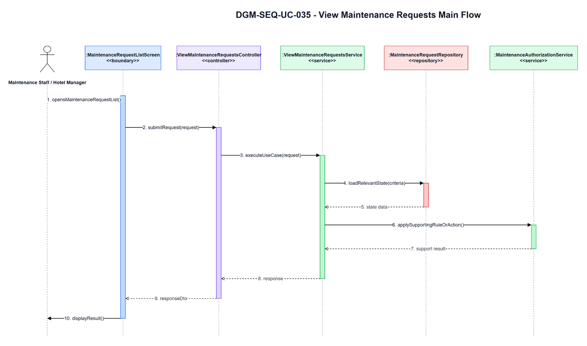

**Figure 3.35-2: Sequence Diagram of UC-035 View Maintenance Requests - Main Flow**

### AT-UC035-03A - No request

- **Branch from Main Step:** 3
- **Condition:** No request
- **Expected Response:** No maintenance requests match the selected filters.

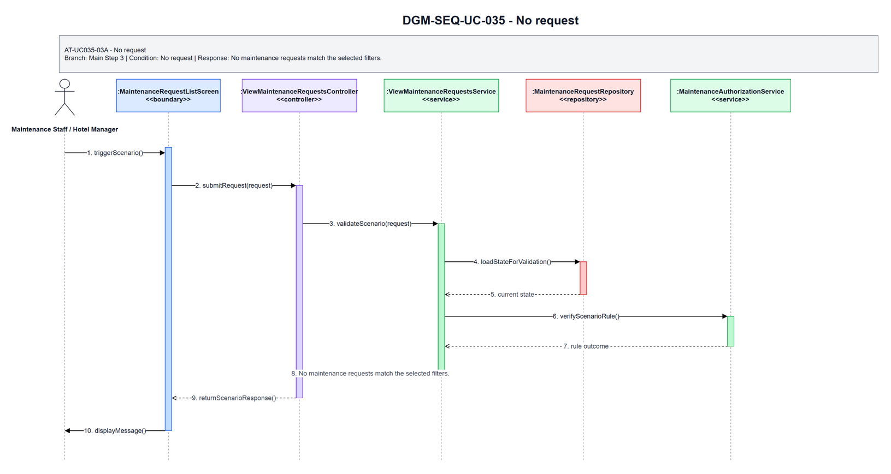

**Figure 3.35-3: Sequence Diagram of UC-035 View Maintenance Requests - AT-UC035-03A No request**

### AT-UC035-02A - Unauthorized hotel

- **Branch from Main Step:** 2
- **Condition:** Unauthorized hotel
- **Expected Response:** You are not authorized to perform this action.

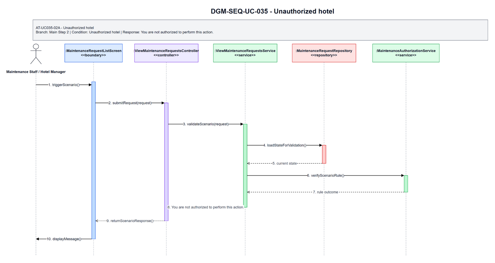

**Figure 3.35-4: Sequence Diagram of UC-035 View Maintenance Requests - AT-UC035-02A Unauthorized hotel**

### Validation, Authorization, Transaction, and Error Handling Notes

| Area | Design |
|---|---|
| Validation | Validate required input, current entity status, date/amount/reference values, and SRS business rules before any state change. |
| Authorization | Allow only Maintenance Staff, Hotel Manager according to the SRS actor, role, hotel-scope, or platform-scope precondition. |
| Transaction | Read-only query transaction; no persistent state is changed in the successful display flow. |
| Error Handling | AT-UC035-03A returns "No maintenance requests match the selected filters."; AT-UC035-02A returns "You are not authorized to perform this action.". |
| Privacy | Return only fields allowed for the current role and scope; staff roles must not receive unrelated customer, platform finance, or cross-hotel data. |

## Assumptions and Open Issues

- ASSUMP-UC035-001: Controller, service, repository, DTO, and entity class names are conceptual SDD design names because no source implementation was inspected.
- ASSUMP-UC035-002: Final API routes, database column names, and UI widget names may differ from these SDD class names but must preserve the traced SRS behavior.
- OQ-UC035-001: Confirm final implementation class/package names before treating the conceptual design as code-level documentation.

# 3.36 UC-036 - Update Maintenance Request

## 3.36.1 Design Purpose

This section describes the detailed design for **UC-036 Update Maintenance Request**. The use case covers Update diagnosis, work status, note, and completion result. The design is based on the SRS/SDD only; class names and methods are conceptual design assumptions because no implementation codebase was inspected.

**Related SRS items:** FEAT-MAINTENANCE, UC-036, SCR-034, ENT-026, ENT-024, BR-MAINT-001, BR-MAINT-002, BR-STAFF-002, BR-STAFF-006, BR-AUDIT-001, MSG-MAINT-004, MSG-MAINT-005, MSG-MAINT-006, MSG-AUTH-007, TR-036, AT-UC036-05A, AT-UC036-05B, AT-UC036-02A.

**Precondition:** Actor authenticated/assigned; maintenance request exists.

**Trigger:** Actor updates maintenance request detail.

**Post-condition:** POS-01: Maintenance request status, notes, or completion result is updated and audited.

The flow must:

- Main step 1: Actor opens maintenance request detail.
- Main step 2: System validates actor role, hotel assignment, and selected request access before showing request details.
- Main step 3: System displays room, issue information, current status, assignee, priority, notes, and allowed transitions.
- Main step 4: Actor updates diagnosis, status, note, assignee, or completion information.
- Main step 5: System validates status transition and permission.
- Main step 6: System updates maintenance request.
- Main step 7: System records audit and sends/records notification if required.
- Continue through the remaining SRS main-flow steps until the UC-036 post-condition is reached.
- Enforce related business rules: BR-MAINT-001, BR-MAINT-002, BR-STAFF-002, BR-STAFF-006, BR-AUDIT-001.
- Return a separate scenario response for each alternative/error flow: AT-UC036-05A, AT-UC036-05B, AT-UC036-02A.

## 3.36.2 Class Diagram

This part presents the class diagram for UC-036 Update Maintenance Request.

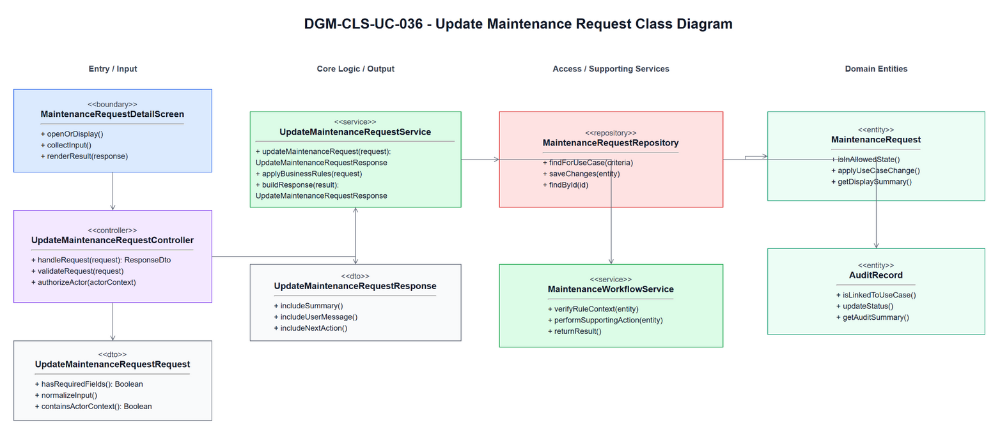

**Figure 3.36-1: Class Diagram of UC-036 Update Maintenance Request**

## 3.36.3 Class Specifications

This part explains the key methods shown in the class diagram. The classes are conceptual design assumptions unless source code is inspected.

### MaintenanceRequestDetailScreen Class

**Description:** Boundary object for the user-visible or scheduled entry point of UC-036 Update Maintenance Request.

| No | Method | Description |
|---:|---|---|
| 1 | `openOrDisplay()` | Displays the use-case screen or activates the scheduled entry point described by the SRS. |
| 2 | `collectInput()` | Collects actor input or scheduler criteria before request submission. |
| 3 | `renderResult(response)` | Displays the result, validation message, or next action to the actor. |

### UpdateMaintenanceRequestController Class

**Description:** API/application entry controller for UC-036 Update Maintenance Request.

| No | Method | Description |
|---:|---|---|
| 1 | `handleRequest(request)` | Receives the request from the boundary and delegates the business operation to the service. |
| 2 | `validateRequest(request)` | Checks required request shape before business rule execution. |
| 3 | `authorizeActor(actorContext)` | Verifies that the current actor may execute this use case and related hotel/platform scope. |

### UpdateMaintenanceRequestRequest Class

**Description:** Request DTO carrying input for UC-036 Update Maintenance Request.

| No | Method | Description |
|---:|---|---|
| 1 | `hasRequiredFields()` | Returns whether mandatory fields from the SRS screen/use-case step are present. |
| 2 | `normalizeInput()` | Normalizes filter, status, note, amount, date, or reference input before service validation. |
| 3 | `containsActorContext()` | Confirms the request carries the authenticated actor or scheduler context needed for authorization. |

### UpdateMaintenanceRequestService Class

**Description:** Application service that coordinates the main flow, business rules, persistence, and response creation for Update Maintenance Request.

| No | Method | Description |
|---:|---|---|
| 1 | `updateMaintenanceRequest(request)` | Executes the UC-036 main flow and returns a response for the boundary. |
| 2 | `applyBusinessRules(request)` | Applies the related SRS business rules and state-transition constraints. |
| 3 | `buildResponse(result)` | Builds success, empty-state, or validation responses without exposing unauthorized data. |

### MaintenanceRequestRepository Class

**Description:** Repository abstraction for loading and saving data required by Update Maintenance Request.

| No | Method | Description |
|---:|---|---|
| 1 | `findForUseCase(criteria)` | Loads the entity state required for validation and display. |
| 2 | `findById(id)` | Retrieves a specific record within actor, hotel, or platform scope. |
| 3 | `saveChanges(entity)` | Persists allowed state changes when the use case modifies data. |

### MaintenanceWorkflowService Class

**Description:** Supporting service or integration used by UC-036 Update Maintenance Request.

| No | Method | Description |
|---:|---|---|
| 1 | `verifyRuleContext(entity)` | Checks specialized policy, authorization, calculation, notification, or external status context. |
| 2 | `performSupportingAction(entity)` | Performs notification, calculation, audit, or external reconciliation support when required. |
| 3 | `returnResult()` | Returns the supporting result to the application service for final response composition. |

### UpdateMaintenanceRequestResponse Class

**Description:** Response DTO returned by UC-036 Update Maintenance Request.

| No | Method | Description |
|---:|---|---|
| 1 | `includeSummary()` | Adds the display or operation summary needed by the screen. |
| 2 | `includeUserMessage()` | Adds the user-facing success, empty-state, or validation message. |
| 3 | `includeNextAction()` | Adds the next available action when the SRS flow continues or returns for correction. |

### MaintenanceRequest Class

**Description:** Room maintenance issue/request.

| No | Method | Description |
|---:|---|---|
| 1 | `isInAllowedState()` | Determines whether the entity state allows the requested use-case operation. |
| 2 | `applyUseCaseChange()` | Applies the state or data change permitted by the validated flow. |
| 3 | `getDisplaySummary()` | Provides safe summary data for the response or audit record. |

### AuditRecord Class

**Description:** Administrative, financial, staff, booking, room, housekeeping, and maintenance action audit record.

| No | Method | Description |
|---:|---|---|
| 1 | `isInAllowedState()` | Determines whether the entity state allows the requested use-case operation. |
| 2 | `applyUseCaseChange()` | Applies the state or data change permitted by the validated flow. |
| 3 | `getDisplaySummary()` | Provides safe summary data for the response or audit record. |

## 3.36.4 Sequence Diagram

This part presents the sequence diagrams for UC-036 Update Maintenance Request. The main-flow diagram shows only the successful scenario. Each alternative/error scenario has its own diagram.

**Figure 3.36-2: Sequence Diagram of UC-036 Update Maintenance Request - Main Flow**

### AT-UC036-05A - Invalid transition

- **Branch from Main Step:** 5
- **Condition:** Invalid transition
- **Expected Response:** The selected maintenance status transition is not allowed.

**Figure 3.36-3: Sequence Diagram of UC-036 Update Maintenance Request - AT-UC036-05A Invalid transition**

### AT-UC036-05B - Missing completion note

- **Branch from Main Step:** 5
- **Condition:** Missing completion note
- **Expected Response:** Please enter a completion or resolution note.

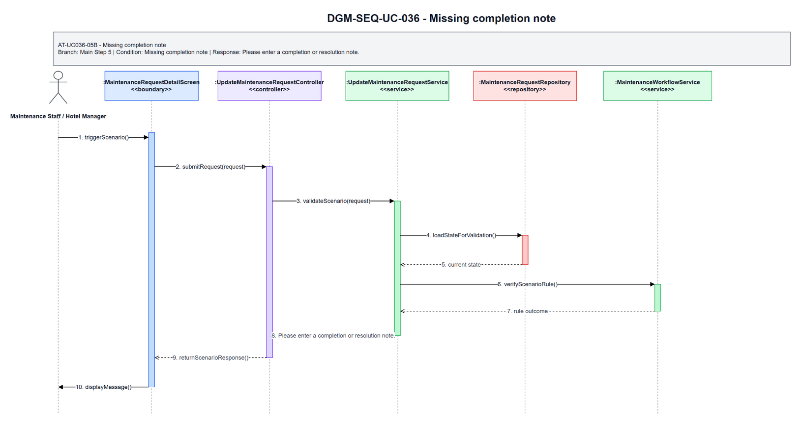

**Figure 3.36-4: Sequence Diagram of UC-036 Update Maintenance Request - AT-UC036-05B Missing completion note**

### AT-UC036-02A - Unauthorized hotel or request

- **Branch from Main Step:** 2
- **Condition:** Unauthorized hotel or request
- **Expected Response:** You are not authorized to perform this action.

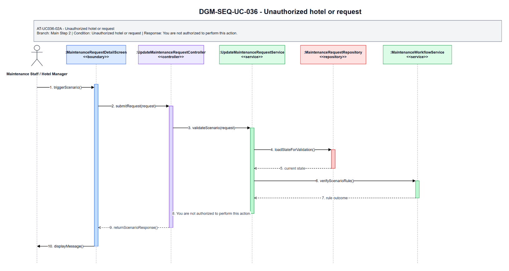

**Figure 3.36-5: Sequence Diagram of UC-036 Update Maintenance Request - AT-UC036-02A Unauthorized hotel or request**

### Validation, Authorization, Transaction, and Error Handling Notes

| Area | Design |
|---|---|
| Validation | Validate required input, current entity status, date/amount/reference values, and SRS business rules before any state change. |
| Authorization | Allow only Maintenance Staff, Hotel Manager according to the SRS actor, role, hotel-scope, or platform-scope precondition. |
| Transaction | Use a single application transaction for validated state changes, persistence updates, audit records, and notification records where applicable. |
| Error Handling | AT-UC036-05A returns "The selected maintenance status transition is not allowed."; AT-UC036-05B returns "Please enter a completion or resolution note."; AT-UC036-02A returns "You are not authorized to perform this action.". |
| Privacy | Return only fields allowed for the current role and scope; staff roles must not receive unrelated customer, platform finance, or cross-hotel data. |

## Assumptions and Open Issues

- ASSUMP-UC036-001: Controller, service, repository, DTO, and entity class names are conceptual SDD design names because no source implementation was inspected.
- ASSUMP-UC036-002: Final API routes, database column names, and UI widget names may differ from these SDD class names but must preserve the traced SRS behavior.
- OQ-UC036-001: Confirm final implementation class/package names before treating the conceptual design as code-level documentation.

# 3.37 UC-037 - Release Room from Maintenance

## 3.37.1 Design Purpose

This section describes the detailed design for **UC-037 Release Room from Maintenance**. The use case covers Mark maintenance completed and return room to cleaning/available path according to room status rule. The design is based on the SRS/SDD only; class names and methods are conceptual design assumptions because no implementation codebase was inspected.

**Related SRS items:** FEAT-MAINTENANCE, UC-037, SCR-034, SCR-035, ENT-026, ENT-025, ENT-027, BR-MAINT-002, BR-HK-002, BR-ROOM-006, BR-STAFF-002, BR-STAFF-006, BR-AUDIT-001, MSG-MAINT-007, MSG-MAINT-008, MSG-MAINT-009, MSG-AUTH-007, TR-037, AT-UC037-05A, AT-UC037-05B, AT-UC037-02A.

**Precondition:** Actor authenticated/assigned; maintenance request exists and may be ready for release.

**Trigger:** Actor selects Release Room.

**Post-condition:** POS-01: Room is released from maintenance to Dirty, Inspection Required, or Available according to policy, and follow-up housekeeping task is created if required.

The flow must:

- Main step 1: Actor opens completed maintenance request detail.
- Main step 2: System validates actor role, hotel assignment, request access, and room release permission before showing release options.
- Main step 3: System displays room status, completion information, and release options.
- Main step 4: Actor confirms release and selects next room status if required.
- Main step 5: System validates maintenance completion and permission.
- Main step 6: System updates maintenance request as Resolved if not already.
- Main step 7: System updates room status to Dirty, Inspection Required, or Available according to policy and records RoomStatusHistory.
- Continue through the remaining SRS main-flow steps until the UC-037 post-condition is reached.
- Enforce related business rules: BR-MAINT-002, BR-HK-002, BR-ROOM-006, BR-STAFF-002, BR-STAFF-006, BR-AUDIT-001.
- Return a separate scenario response for each alternative/error flow: AT-UC037-05A, AT-UC037-05B, AT-UC037-02A.

## 3.37.2 Class Diagram

This part presents the class diagram for UC-037 Release Room from Maintenance.

**Figure 3.37-1: Class Diagram of UC-037 Release Room from Maintenance**

## 3.37.3 Class Specifications

This part explains the key methods shown in the class diagram. The classes are conceptual design assumptions unless source code is inspected.

### MaintenanceRequestDetailScreen Class

**Description:** Boundary object for the user-visible or scheduled entry point of UC-037 Release Room from Maintenance.

| No | Method | Description |
|---:|---|---|
| 1 | `openOrDisplay()` | Displays the use-case screen or activates the scheduled entry point described by the SRS. |
| 2 | `collectInput()` | Collects actor input or scheduler criteria before request submission. |
| 3 | `renderResult(response)` | Displays the result, validation message, or next action to the actor. |

### ReleaseRoomFromMaintenanceController Class

**Description:** API/application entry controller for UC-037 Release Room from Maintenance.

| No | Method | Description |
|---:|---|---|
| 1 | `handleRequest(request)` | Receives the request from the boundary and delegates the business operation to the service. |
| 2 | `validateRequest(request)` | Checks required request shape before business rule execution. |
| 3 | `authorizeActor(actorContext)` | Verifies that the current actor may execute this use case and related hotel/platform scope. |

### ReleaseRoomFromMaintenanceRequest Class

**Description:** Request DTO carrying input for UC-037 Release Room from Maintenance.

| No | Method | Description |
|---:|---|---|
| 1 | `hasRequiredFields()` | Returns whether mandatory fields from the SRS screen/use-case step are present. |
| 2 | `normalizeInput()` | Normalizes filter, status, note, amount, date, or reference input before service validation. |
| 3 | `containsActorContext()` | Confirms the request carries the authenticated actor or scheduler context needed for authorization. |

### ReleaseRoomFromMaintenanceService Class

**Description:** Application service that coordinates the main flow, business rules, persistence, and response creation for Release Room from Maintenance.

| No | Method | Description |
|---:|---|---|
| 1 | `releaseRoomFromMaintenance(request)` | Executes the UC-037 main flow and returns a response for the boundary. |
| 2 | `applyBusinessRules(request)` | Applies the related SRS business rules and state-transition constraints. |
| 3 | `buildResponse(result)` | Builds success, empty-state, or validation responses without exposing unauthorized data. |

### MaintenanceRequestRepository Class

**Description:** Repository abstraction for loading and saving data required by Release Room from Maintenance.

| No | Method | Description |
|---:|---|---|
| 1 | `findForUseCase(criteria)` | Loads the entity state required for validation and display. |
| 2 | `findById(id)` | Retrieves a specific record within actor, hotel, or platform scope. |
| 3 | `saveChanges(entity)` | Persists allowed state changes when the use case modifies data. |

### RoomReleasePolicyService Class

**Description:** Supporting service or integration used by UC-037 Release Room from Maintenance.

| No | Method | Description |
|---:|---|---|
| 1 | `verifyRuleContext(entity)` | Checks specialized policy, authorization, calculation, notification, or external status context. |
| 2 | `performSupportingAction(entity)` | Performs notification, calculation, audit, or external reconciliation support when required. |
| 3 | `returnResult()` | Returns the supporting result to the application service for final response composition. |

### ReleaseRoomFromMaintenanceResponse Class

**Description:** Response DTO returned by UC-037 Release Room from Maintenance.

| No | Method | Description |
|---:|---|---|
| 1 | `includeSummary()` | Adds the display or operation summary needed by the screen. |
| 2 | `includeUserMessage()` | Adds the user-facing success, empty-state, or validation message. |
| 3 | `includeNextAction()` | Adds the next available action when the SRS flow continues or returns for correction. |

### MaintenanceRequest Class

**Description:** Room maintenance issue/request.

| No | Method | Description |
|---:|---|---|
| 1 | `isInAllowedState()` | Determines whether the entity state allows the requested use-case operation. |
| 2 | `applyUseCaseChange()` | Applies the state or data change permitted by the validated flow. |
| 3 | `getDisplaySummary()` | Provides safe summary data for the response or audit record. |

### HousekeepingTask Class

**Description:** Cleaning or inspection task for a physical room.

| No | Method | Description |
|---:|---|---|
| 1 | `isInAllowedState()` | Determines whether the entity state allows the requested use-case operation. |
| 2 | `applyUseCaseChange()` | Applies the state or data change permitted by the validated flow. |
| 3 | `getDisplaySummary()` | Provides safe summary data for the response or audit record. |

## 3.37.4 Sequence Diagram

This part presents the sequence diagrams for UC-037 Release Room from Maintenance. The main-flow diagram shows only the successful scenario. Each alternative/error scenario has its own diagram.

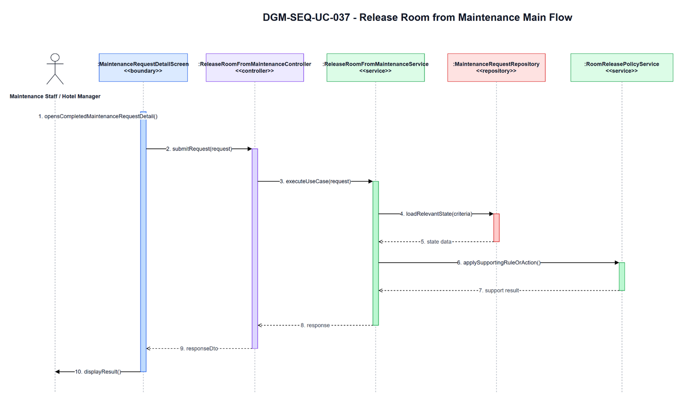

**Figure 3.37-2: Sequence Diagram of UC-037 Release Room from Maintenance - Main Flow**

### AT-UC037-05A - Maintenance not complete

- **Branch from Main Step:** 5
- **Condition:** Maintenance not complete
- **Expected Response:** Maintenance must be completed before the room can be released.

**Figure 3.37-3: Sequence Diagram of UC-037 Release Room from Maintenance - AT-UC037-05A Maintenance not complete**

### AT-UC037-05B - Manager approval required

- **Branch from Main Step:** 5
- **Condition:** Manager approval required
- **Expected Response:** Manager approval is required before releasing this room.

**Figure 3.37-4: Sequence Diagram of UC-037 Release Room from Maintenance - AT-UC037-05B Manager approval required**

### AT-UC037-02A - Unauthorized hotel, request, or room

- **Branch from Main Step:** 2
- **Condition:** Unauthorized hotel, request, or room
- **Expected Response:** You are not authorized to perform this action.

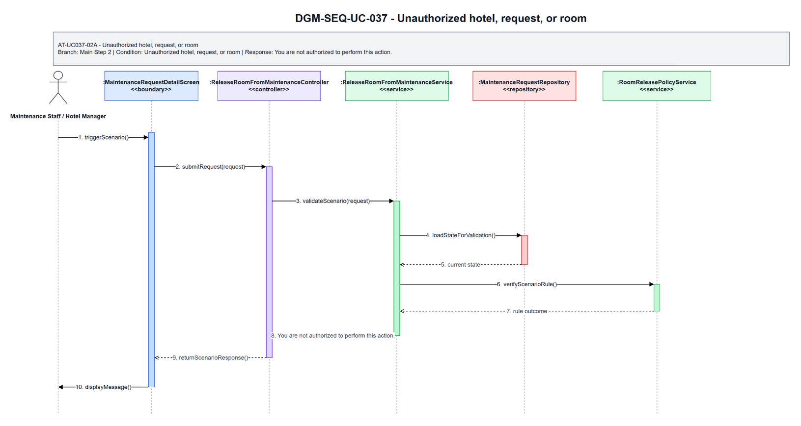

**Figure 3.37-5: Sequence Diagram of UC-037 Release Room from Maintenance - AT-UC037-02A Unauthorized hotel, request, or room**

### Validation, Authorization, Transaction, and Error Handling Notes

| Area | Design |
|---|---|
| Validation | Validate required input, current entity status, date/amount/reference values, and SRS business rules before any state change. |
| Authorization | Allow only Maintenance Staff, Hotel Manager according to the SRS actor, role, hotel-scope, or platform-scope precondition. |
| Transaction | Use a single application transaction for validated state changes, persistence updates, audit records, and notification records where applicable. |
| Error Handling | AT-UC037-05A returns "Maintenance must be completed before the room can be released."; AT-UC037-05B returns "Manager approval is required before releasing this room."; AT-UC037-02A returns "You are not authorized to perform this action.". |
| Privacy | Return only fields allowed for the current role and scope; staff roles must not receive unrelated customer, platform finance, or cross-hotel data. |

## Assumptions and Open Issues

- ASSUMP-UC037-001: Controller, service, repository, DTO, and entity class names are conceptual SDD design names because no source implementation was inspected.
- ASSUMP-UC037-002: Final API routes, database column names, and UI widget names may differ from these SDD class names but must preserve the traced SRS behavior.
- OQ-UC037-001: Confirm final implementation class/package names before treating the conceptual design as code-level documentation.
