# Software Design Document

## Document Control

| Item | Value |
|---|---|
| Document | Software Design Document |
| Project | Hotel Marketplace Management System |
| Version | 1.0 Draft |
| Date | 2026-07-03 |
| Source SRS | `hotel_management_system_srs_v1_2_staff_screen_mockup_ready.md` |
| Design Basis | SRS-only design draft; no codebase was inspected. |
| Detailed Design Scope | Section 3 is initialized with placeholders only. Full class specifications and sequence diagrams are deferred. |

## Source Map

| Source ID | Source Type | Path / Artifact | What it reveals | Confidence |
|---|---|---|---|---|
| SRC-001 | SRS | `hotel_management_system_srs_v1_2_staff_screen_mockup_ready.md` | Product scope, actors, use cases, screens, business rules, logical entities, NFRs, messages, and traceability. | High |
| SRC-002 | BA/SDD Rules | `srs_sdd_ba_rules.md` | Required SDD structure, diagram placeholder rules, traceability rules, and hallucination controls. | High |
| SRC-003 | User clarification | Current conversation | Commission default/range, availability design, identity document scope, and Hotel Manager staff authority. | High |

## Clarification Decisions Applied

| Decision ID | Decision | SDD Impact |
|---|---|---|
| DEC-001 | Commission rate defaults to 10%, allowed range 0%–30%. | Commission configuration validation and finance design. |
| DEC-002 | Availability uses hybrid design: public booking checks room type quantity/date; front desk assigns physical rooms later. | Booking, availability, physical room assignment, and database design. |
| DEC-003 | Check-in stores basic identity document fields only. | Guest stay/check-in privacy and validation design. |
| DEC-004 | Hotel Manager may fully manage staff within assigned hotel, but cannot grant Property Owner or Platform Administrator authority. | Staff authorization design. |

---

## I. Record of Changes

| Date | A/M/D | In Charge | Change Description |
|---|---|---|---|
| 2026-07-03 | A | Claude BA/SA Agent | Initial SDD draft created from SRS v1.2 and user clarifications. Detailed Design initialized as placeholders only. |

---

## II. Software Design Document

# 1. System Design

## 1.1 System Architecture

The Hotel Marketplace Management System is designed as a multi-tenant client-server application. The target operating environment from the SRS is Flutter for the mobile client, ASP.NET Core Web API for the backend, Clean Architecture for the backend design style, Microsoft SQL Server for persistence, payOS for online payment, and a mock or future notification provider for notification delivery.

Because no repository/codebase was provided for this draft, package names, class names, endpoint names, and table names are design proposals derived from the SRS. They must be revalidated against the actual implementation before final submission.

### 1.1.1 Architecture Style

| Design Area | Decision | Rationale | Related SRS Items |
|---|---|---|---|
| Overall style | Client-server with backend API and mobile client | Fits Flutter client + ASP.NET Core Web API operating environment. | NFR-COMP-001, NFR-SEC-001 |
| Backend layering | Clean Architecture | Separates API, application logic, domain rules, and infrastructure concerns. | SRS 1.4, NFR-MAINT-001 |
| Tenancy model | Hotel-scoped multi-tenant access | Property Owner and staff access must be restricted by owned/assigned hotel. | BR-OWNER-001, BR-STAFF-002, NFR-SEC-002 |
| Booking availability | Hybrid availability model | Marketplace booking reserves room type quantity/date; physical room assignment occurs before or during check-in. | UC-005, UC-013, UC-015, UC-029, DEC-002 |
| Payment | Dual payment mode | Platform Collect uses payOS; Pay at Property uses hotel-side collection records. | UC-006, UC-030, BR-PAY-004 |
| Notification | Event-based notification record with optional external delivery | MVP can record notifications even if external delivery is mocked. | NSF-003, BR-NOTI-001 |
| Finance operation | Manual refund, settlement, reconciliation marking | SRS confirms MVP manual finance operations by Platform Administrator. | UC-020, UC-021, UC-022 |

### 1.1.2 Main Components

| Component | Type | Responsibility | Communicates With | Related Requirements |
|---|---|---|---|---|
| Flutter Mobile Client | Client | Provides customer, owner, staff, and platform-admin user interface. | Backend API, payOS redirect/result page where applicable | UC-001 to UC-037 |
| Backend API | API Layer | Exposes authenticated and public endpoints, validates requests, maps DTOs, and returns responses. | Mobile Client, Application Services | NFR-SEC-001, NFR-USE-002 |
| Application Services | Application Layer | Coordinates use cases, authorization, transactions, notifications, and persistence operations. | Domain Model, Repositories, External Clients | UC-003 to UC-037 |
| Domain Model | Domain Layer | Represents core business concepts and rules for users, hotels, booking, payment, room operation, finance, housekeeping, and maintenance. | Application Services | BR-AUTH, BR-BOOK, BR-ROOM, BR-FIN, BR-HK, BR-MAINT |
| Infrastructure Persistence | Infrastructure Layer | Implements repositories and database access against SQL Server. | SQL Server Database | NFR-REL-001, NFR-AUD-001 |
| SQL Server Database | Database | Stores accounts, hotels, inventory, booking, finance, operations, notifications, and audit data. | Backend Infrastructure | ENT-001 to ENT-028 |
| payOS Client | External Integration | Creates payment instructions and receives/verifies payment result notifications. | payOS Payment Gateway, Payment Services | UC-006, NSF-001 |
| Notification Adapter | External/Mock Integration | Sends or records notification events. | Notification Service / Mock | NSF-003 |
| Scheduler Worker | Background Component | Runs time-based jobs such as unpaid booking expiration. | Application Services, Database | UC-024, NSF-002 |

### 1.1.3 Architecture Diagram Placeholder

Diagram source: [DGM-SDD-ARCH-001 - System Architecture](sdd_assets/diagram/dgm-sdd-arch-001-system-architecture.drawio)

## 1.2 Package Diagram

The following package design follows Clean Architecture. Names are proposed conceptual package names and must be aligned with the actual codebase when implementation exists.

| No | Package / Namespace | Description | Key Classes / Files | Depends On |
|---:|---|---|---|---|
| 01 | `Presentation.Api` | HTTP controllers, request/response contracts, authentication filters, and API configuration. | AuthController, BookingController, HotelController, StaffController, FinanceController | `Application` |
| 02 | `Application` | Use case services, command/query handlers, validators, DTOs, transaction orchestration, and authorization checks. | AuthService, BookingService, AvailabilityService, FrontDeskService, FinanceService | `Domain`, repository abstractions |
| 03 | `Domain` | Domain entities, value objects, enumerations, and business rule methods. | Booking, RoomType, PhysicalRoom, CommissionRecord, HousekeepingTask | None |
| 04 | `Infrastructure.Persistence` | SQL Server database context, repository implementations, migrations, and persistence configuration. | AppDbContext, BookingRepository, RoomRepository, PaymentRepository | `Application`, `Domain` |
| 05 | `Infrastructure.Payment` | payOS client, payment signature/notification verification, and gateway error mapping. | PayOsClient, PaymentWebhookVerifier | `Application` payment abstractions |
| 06 | `Infrastructure.Notification` | Notification adapter for mock or future real notification service. | NotificationDispatcher, MockNotificationProvider | `Application` notification abstractions |
| 07 | `Infrastructure.Scheduling` | Background jobs for unpaid booking expiration and reminder/notification triggers. | ExpireUnpaidBookingJob | `Application` services |
| 08 | `SharedKernel` | Common result types, exceptions, constants, date/time helpers, audit context, and cross-cutting contracts. | Result, DomainException, CurrentUserContext | Shared by backend packages |

### 1.2.1 Package Diagram Placeholder

Diagram source: [DGM-SDD-PKG-001 - Package Diagram](sdd_assets/diagram/dgm-sdd-pkg-001-package-diagram.drawio)

## 1.3 Cross-Cutting Design

### 1.3.1 Authentication and Authorization

| Concern | Design |
|---|---|
| Authentication | Protected functions require authenticated user session/token. Exact token/session mechanism is implementation-specific and must be confirmed from code. |
| Role authorization | User roles include Customer, Property Owner, Hotel Manager, Receptionist, Housekeeping Staff, Maintenance Staff, and Platform Administrator. |
| Hotel scope | Hotel-scoped staff access is checked through `HotelStaffAssignment` or equivalent assignment data. |
| Manager staff authority | Hotel Manager can manage staff within assigned hotel but cannot grant Property Owner or Platform Administrator authority. |
| Platform separation | Platform Administrator can perform platform approval and finance administration but does not automatically receive hotel operational authority unless explicitly modeled. |
| Privacy | Housekeeping and Maintenance roles receive minimum room/task data and no payment/refund/commission/settlement detail. |

### 1.3.2 Validation Strategy

| Validation Area | Enforced In | Examples |
|---|---|---|
| Request shape and mandatory fields | API/Application validators | Required account, hotel, room, booking, payment, and staff fields. |
| Domain/business rules | Domain/Application services | Date range, availability, room assignment overlap, status transitions, commission range. |
| Authorization/scope | Application authorization checks | Customer owns booking, staff assigned to hotel, manager permission. |
| Financial integrity | Application services and database constraints | Duplicate payment callback protection, commission snapshot, settlement eligibility. |

### 1.3.3 Transaction Strategy

| Use Case Area | Transaction Boundary | Consistency Requirement |
|---|---|---|
| Create Booking | Booking header, booking room, availability reservation, initial payment/commission state where applicable | No confirmed/pending booking without consistent availability reservation. |
| Payment Notification | Payment transaction, booking status, commission record, audit/notification | Duplicate notifications must not double-confirm or double-count. |
| Check-in | Booking status, room assignment, guest stay record, room status history, audit | Physical room cannot overlap active stay. |
| Check-out | Booking/stay status, invoice/folio, payment collection if required, room status, housekeeping task | Checkout creates cleaning path and preserves finance traceability. |
| Staff Assignment | Staff account/invitation, role assignment, audit | Staff cannot receive authority outside allowed role and hotel scope. |
| Refund/Settlement | Refund/settlement/commission status, admin note, audit | Manual finance actions are traceable and cannot bypass eligibility. |

# 2. Database Design

## 2.1 Database Overview

The SDD database design is derived from the SRS logical entities. It proposes SQL Server relational tables for implementation. Table and column names must be adjusted to match the actual codebase and migration style when available.

### 2.1.1 Data Design Principles

| Principle | Application |
|---|---|
| Multi-tenant hotel scope | Hotel-owned data includes `HotelId` and is filtered by ownership or staff assignment. |
| Historical traceability | Booking, payment, commission, settlement, room status, housekeeping, maintenance, and audit records preserve status history. |
| Finance separation | payOS online payments use payment transactions; Pay at Property uses hotel-side collection records. |
| Hybrid availability | Public booking uses room type quantity/date availability; physical rooms are assigned later and validated for overlap/status. |
| Sensitive data minimization | Identity document data is basic and limited to authorized front desk/manager/owner access. |
| Auditability | Protected operational and financial actions create audit records. |

## 2.2 Database Table Relationship

The database relationship design mirrors the SRS logical ERD:

- `UserAccounts` has many `HotelStaffAssignments`, `StaffInvitations`, `Bookings`, and audit actions.
- `HotelProperties` belongs to a Property Owner and has many room types, physical rooms, staff assignments, bookings, housekeeping tasks, maintenance requests, commissions, and settlements.
- `RoomTypes` has many `PhysicalRooms`, `RoomAvailabilities`, and `BookingRooms`.
- `Bookings` has one or more supporting records: booking room line, optional physical room assignments, payment transactions, collection records, refund record, invoice, commission record, notification records, and audit records.
- `PhysicalRooms` has status history, housekeeping tasks, maintenance requests, and booking assignments.
- Finance records connect booking, payment, commission, settlement header, and settlement items.

### 2.2.1 Database Relationship Diagram Placeholder

Diagram source: [DGM-SDD-DB-001 - Database Relationship Diagram](sdd_assets/diagram/dgm-sdd-db-001-database-relationship.drawio)

## 2.3 Table Descriptions

| No | Table | Description | Primary Key | Foreign Keys | Important Constraints | Related Entities |
|---:|---|---|---|---|---|---|
| 01 | `UserAccounts` | Stores registered users for all human roles. | `UserAccountId` | None | Unique email/phone where required; password not plain text; account status required. | ENT-001 |
| 02 | `UserRoles` | Stores role definitions. | `RoleId` | None | Role code unique; role scope identifies platform/hotel/customer scope. | ENT-002 |
| 03 | `UserAccountRoles` | Optional many-to-many mapping for global roles if implementation uses separate role mapping. | `UserAccountRoleId` | `UserAccountId`, `RoleId` | Prevent duplicate active role mapping. | ENT-001, ENT-002 |
| 04 | `HotelStaffAssignments` | Maps staff user to hotel and hotel-scoped role. | `StaffAssignmentId` | `UserAccountId`, `HotelId`, `RoleId`, `AssignedByUserAccountId` | Active assignment must reference allowed hotel-scoped role. | ENT-003 |
| 05 | `StaffInvitations` | Stores staff invitation/onboarding records. | `StaffInvitationId` | `HotelId`, `RoleId`, `InvitedByUserAccountId` | Invitation expiration and status required. | ENT-004 |
| 06 | `HotelProperties` | Stores hotel profile and approval/publication status. | `HotelId` | `OwnerUserAccountId` | Approval status and publication status required. | ENT-005 |
| 07 | `HotelImages` | Stores hotel gallery image references. | `HotelImageId` | `HotelId` | Display order; active/inactive image status. | ENT-006 |
| 08 | `Amenities` | Stores amenity master data. | `AmenityId` | None | Amenity name/type required. | ENT-007 |
| 09 | `HotelAmenities` | Maps hotels to amenities. | `HotelAmenityId` | `HotelId`, `AmenityId` | Prevent duplicate hotel-amenity pair. | ENT-008 |
| 10 | `CancellationPolicies` | Stores hotel-level cancellation policy. | `CancellationPolicyId` | `HotelId` | Free-cancel hours and refund percentage must be valid. | ENT-009 |
| 11 | `RoomTypes` | Stores private room types and base price. | `RoomTypeId` | `HotelId` | Capacity > 0; base price >= 0. | ENT-010 |
| 12 | `PhysicalRooms` | Stores individual private rooms. | `PhysicalRoomId` | `HotelId`, `RoomTypeId` | Room number unique within hotel; valid room status. | ENT-011 |
| 13 | `RoomAvailabilities` | Stores room type or physical-room date block/open records. | `AvailabilityId` | `HotelId`, `RoomTypeId`, nullable `PhysicalRoomId` | Date range valid; status required; supports hybrid availability. | ENT-012 |
| 14 | `Bookings` | Stores booking header and lifecycle status. | `BookingId` | `CustomerUserAccountId`, `HotelId` | Check-out > check-in; payment mode required; booking source required. | ENT-013 |
| 15 | `BookingRooms` | Stores room type line and quantity for booking. | `BookingRoomId` | `BookingId`, `RoomTypeId` | MVP contains exactly one room type line per booking; quantity > 0. | ENT-014 |
| 16 | `BookingRoomAssignments` | Stores physical room assignments. | `AssignmentId` | `BookingId`, `BookingRoomId`, `PhysicalRoomId` | No overlapping active assignment for same physical room. | ENT-015 |
| 17 | `PaymentTransactions` | Stores payOS online payment transaction data. | `PaymentTransactionId` | `BookingId` | Gateway reference unique when present; idempotent success handling. | ENT-016 |
| 18 | `PaymentCollectionRecords` | Stores Pay at Property collection records. | `PaymentCollectionId` | `BookingId`, `CollectedByUserAccountId` | Amount valid; collection status lifecycle required. | ENT-017 |
| 19 | `RefundRecords` | Stores refund eligibility, decision, and manual processing status. | `RefundRecordId` | `BookingId` | Approved amount cannot exceed paid amount. | ENT-018 |
| 20 | `Invoices` | Stores basic invoice/folio for checkout. | `InvoiceId` | `BookingId` | Amount fields non-negative; status required. | ENT-019 |
| 21 | `CommissionRecords` | Stores commission snapshot and amount for booking. | `CommissionRecordId` | `BookingId` | Commission rate snapshot must be 0%–30%; default 10% when not overridden. | ENT-020 |
| 22 | `SettlementRecords` | Stores manual settlement/collection header. | `SettlementRecordId` | `HotelId` | Settlement type and status required; admin note for exception. | ENT-021 |
| 23 | `SettlementItems` | Stores settlement line items linked to booking/commission/payment. | `SettlementItemId` | `SettlementRecordId`, nullable `BookingId`, nullable `CommissionRecordId`, nullable `PaymentTransactionId` | Item amount non-negative; item status required. | ENT-022 |
| 24 | `NotificationRecords` | Stores notification events and delivery/recording status. | `NotificationId` | nullable `RecipientUserAccountId` | Related entity type/id required for event traceability where applicable. | ENT-023 |
| 25 | `AuditRecords` | Stores protected action audit events. | `AuditRecordId` | `ActorUserAccountId` | Action type, target entity, timestamp, and summary required. | ENT-024 |
| 26 | `HousekeepingTasks` | Stores cleaning and inspection tasks. | `HousekeepingTaskId` | `HotelId`, `PhysicalRoomId`, nullable `BookingId`, nullable `AssignedToUserAccountId` | Task status lifecycle required. | ENT-025 |
| 27 | `MaintenanceRequests` | Stores room maintenance issues and resolution notes. | `MaintenanceRequestId` | `HotelId`, `PhysicalRoomId`, `ReportedByUserAccountId`, nullable `AssignedToUserAccountId` | Status, severity, and description required. | ENT-026 |
| 28 | `RoomStatusHistories` | Stores physical room status changes. | `RoomStatusHistoryId` | `PhysicalRoomId`, nullable `ChangedByUserAccountId` | Old/new status and timestamp required. | ENT-027 |
| 29 | `GuestStayRecords` | Stores operational check-in/check-out record. | `GuestStayRecordId` | `BookingId`, `CheckedInByUserAccountId`, nullable `CheckedOutByUserAccountId` | Includes basic identity document fields with restricted access. | ENT-028 |

## 2.4 Important Physical Constraints and Indexes

| Area | Proposed Constraint / Index | Reason |
|---|---|---|
| User account | Unique index on email and/or phone according to account policy. | Prevent duplicate login identity. |
| Staff assignment | Composite unique index on active `UserAccountId`, `HotelId`, `RoleId`. | Prevent duplicate staff role assignment. |
| Physical room | Unique index on `HotelId`, `RoomNumber`. | Enforce BR-ROOM-005. |
| Booking search | Index on `HotelId`, `CheckInDate`, `CheckOutDate`, `BookingStatus`. | Support availability and hotel booking list. |
| Availability | Index on `HotelId`, `RoomTypeId`, `StartDate`, `EndDate`, `AvailabilityStatus`. | Support room type/date availability checks. |
| Room assignment | Index on `PhysicalRoomId`, assignment date/status fields. | Detect overlapping active physical room assignment. |
| Payment | Unique index on payOS gateway reference. | Support idempotent payment result handling. |
| Commission | Unique or controlled one-active commission record per booking. | Prevent duplicate commission. |
| Audit | Index on `TargetEntityType`, `TargetEntityId`, `ActionTimestamp`. | Support audit trace review. |

# 3. Detailed Design

The following detailed design sections are integrated from the prepared SDD assets under `sdd_assets/`. The class names, method names, and interaction flows are conceptual design assumptions derived from the SRS because no implementation codebase was inspected. They must be revalidated against the final source code before implementation or final submission.

## 3.1 UC-001 - Search Hotels

#### 3.1.1 Design Purpose

This section describes the detailed design for **UC-001 Search Hotels**. The use case allows Guest and Customer actors to search approved hotels by destination, stay dates, guest count, and filters. The design is based on the SRS only; class names and methods are conceptual design assumptions and must be revalidated against the final codebase.

**Related SRS items:** FEAT-MKT, UC-001, SCR-004, SCR-005, ENT-005, ENT-007, ENT-008, ENT-010, ENT-011, ENT-012, BR-MKT-001, BR-BOOK-001, BR-ROOM-002, MSG-MKT-001, MSG-BOOK-001, TR-001, AT-UC001-04A, AT-UC001-05A.

The search flow must:

- Accept public search criteria from Guest or Customer.
- Validate destination, check-in date, check-out date, and guest count before querying.
- Return only approved and published hotels.
- Include only room types that can satisfy the selected date range and guest count.
- Use the hybrid availability decision: marketplace search checks room type quantity/date; physical room assignment is deferred to front desk check-in flow.

#### 3.1.2 Class Diagram

This part presents the class diagram for the Search Hotels use case.

**Figure 3.1-1: Class Diagram of UC-001 Search Hotels**

#### 3.1.3 Class Specifications

This part explains the key methods shown in the class diagram. The classes are conceptual design assumptions because no implementation codebase was inspected.

### MarketplaceController Class

**Description:** API entry point for public marketplace search requests.

| No | Method | Description |
|---:|---|---|
| 1 | `searchHotels(request)` | Receives search criteria from the client, coordinates request validation, calls search service, and returns `HotelSearchResponse`. |
| 2 | `validateSearchRequest(request)` | Checks required search fields, date range, guest count, and filter input before service execution. |

### HotelSearchRequest Class

**Description:** Request DTO carrying user search criteria from the search screen to the backend.

| No | Method | Description |
|---:|---|---|
| 1 | `hasValidDateRange()` | Verifies that check-in date and check-out date are present and that check-out date is after check-in date. |
| 2 | `hasValidGuestCount()` | Verifies that guest count is positive and can be used for capacity matching. |

### HotelSearchService Class

**Description:** Application service that coordinates approved hotel lookup, availability checking, filter application, and response creation.

| No | Method | Description |
|---:|---|---|
| 1 | `searchApprovedHotels(request)` | Executes the main UC-001 search flow by finding approved hotels, checking room type availability, applying filters, and returning search results. |
| 2 | `applyFilters(hotels, request)` | Applies optional user filters to candidate hotels and available room types. |
| 3 | `buildSearchResponse(results)` | Converts matched hotels and room availability summaries into `HotelSearchResponse`. |

### AvailabilityQueryService Class

**Description:** Service that determines whether room types have enough availability for the requested date range and guest count.

| No | Method | Description |
|---:|---|---|
| 1 | `findAvailableRoomTypes(hotelIds, dateRange, guestCount)` | Finds room types for the candidate hotels that satisfy guest capacity and availability over the requested stay dates. |
| 2 | `countAvailableQuantity(roomTypeId, dateRange)` | Calculates available quantity for a room type and date range under the hybrid availability model. |

### HotelSearchResponse Class

**Description:** Response DTO returned to the client with hotel search results and metadata.

| No | Method | Description |
|---:|---|---|
| 1 | `includeResultSummary()` | Adds total count and applied criteria summary for the search result display. |

### HotelRepository Class

**Description:** Repository for retrieving marketplace-visible hotel property data.

| No | Method | Description |
|---:|---|---|
| 1 | `findApprovedPublishedByDestination(destination)` | Finds hotels that match the requested destination and are approved and published for public display. |
| 2 | `findWithAmenitiesAndPolicies(hotelIds)` | Loads hotel details needed for result cards, including amenities and cancellation policy summary when required by UI. |

### RoomTypeRepository Class

**Description:** Repository for retrieving active room types that may satisfy the requested guest count.

| No | Method | Description |
|---:|---|---|
| 1 | `findActiveRoomTypes(hotelIds)` | Retrieves active room types for candidate hotels. |
| 2 | `findRoomTypesMatchingCapacity(guestCount)` | Finds room types whose adult/child capacity can satisfy the requested guest count. |

### RoomAvailabilityRepository Class

**Description:** Repository for retrieving availability records for candidate room types and date ranges.

| No | Method | Description |
|---:|---|---|
| 1 | `findAvailabilityByRoomTypes(roomTypeIds, dateRange)` | Loads availability or block records that overlap the requested date range. |
| 2 | `countBlockedQuantity(roomTypeId, dateRange)` | Counts unavailable room quantity caused by block records or availability restrictions. |

### HotelProperty Class

**Description:** Domain entity representing a hotel listed on the marketplace.

| No | Method | Description |
|---:|---|---|
| 1 | `isApprovedAndPublished()` | Returns whether the hotel can be shown publicly based on approval and publication status. |

### RoomType Class

**Description:** Domain entity representing a private room type offered by a hotel.

| No | Method | Description |
|---:|---|---|
| 1 | `canFitGuestCount(guestCount)` | Checks whether the room type capacity can satisfy the requested guest count. |
| 2 | `isActive()` | Returns whether the room type can be sold or displayed in marketplace search. |

### RoomAvailability Class

**Description:** Domain entity representing availability or block status for a room type or physical room over a date range.

| No | Method | Description |
|---:|---|---|
| 1 | `overlaps(dateRange)` | Checks whether the availability record overlaps the requested stay dates. |
| 2 | `isAvailable()` | Returns whether the availability record allows the room type to be considered available. |

#### 3.1.4 Sequence Diagram

This part presents the sequence diagrams for UC-001 Search Hotels. The main-flow diagram shows only the successful scenario. Each alternative/error scenario has its own diagram.

**Figure 3.1-2: Sequence Diagram of UC-001 Search Hotels - Main Flow**

### AT-UC001-04A - Invalid Date Range

- **Branch from Main Step:** 4
- **Condition:** Invalid date range.
- **Expected Response:** Check-out date must be later than check-in date.

**Figure 3.1-3: Sequence Diagram of UC-001 Search Hotels - AT-UC001-04A Invalid Date Range**

### AT-UC001-05A - No Matching Hotels

- **Branch from Main Step:** 5
- **Condition:** No matching hotels.
- **Expected Response:** No hotels match your search criteria. Please adjust your search.

**Figure 3.1-4: Sequence Diagram of UC-001 Search Hotels - AT-UC001-05A No Matching Hotels**

### Validation, Authorization, Transaction, and Error Handling Notes

| Area | Design |
|---|---|
| Validation | Validate date range, guest count, destination/filter values, and pagination/sorting parameters if present. Check-in date must be before check-out date. Guest count must be positive. |
| Authorization | UC-001 is public. Guest and Customer can search. The API must not expose management-only fields or unpublished hotel data. |
| Transaction | Search is read-only and does not create booking, payment, or room assignment records. No write transaction is required. |
| Availability Consistency | Use room type/date availability for marketplace search. Physical room assignment is outside this use case and belongs to front desk/check-in design. |
| Error Handling | Return validation errors for invalid criteria, empty results for no matches, and safe generic error responses for unexpected repository/service failures. |
| Privacy | Do not expose owner/staff private data, internal notes, audit records, or unpublished hotel configuration in the public search response. |

## Assumptions and Open Issues

- Exact API route, DTO field names, and repository names are conceptual because no codebase was inspected.
- The SRS confirms search by destination, dates, guest count, and filters, but does not define all filter fields; later detailed design should align filter fields with UI mockups and final database schema.
- Alternative/error sequence flows are separated from the main flow to keep diagrams readable and avoid inaccurate combined-fragment rendering.

# 3.2 UC-002 - View Hotel Detail

## 3.2.1 Design Purpose

This section describes the detailed design for **UC-002 View Hotel Detail**. The use case allows Guest and Customer actors to open a marketplace hotel listing and view approved hotel detail, images, amenities, cancellation policy, room types, base prices, and availability information. The design is based on the SRS only; class names and methods are conceptual design assumptions and must be revalidated against the final codebase.

**Related SRS items:** FEAT-MKT, UC-002, SCR-006, ENT-005, ENT-006, ENT-007, ENT-008, ENT-009, ENT-010, ENT-011, ENT-012, BR-MKT-001, BR-AUTH-001, BR-ROOM-002, MSG-MKT-002, MSG-AUTH-002, TR-002, AT-UC002-02A, AT-UC002-05A.

The hotel detail flow must:

- Load only approved, active, and publicly available hotel properties.
- Display hotel profile, gallery images, amenities, cancellation policy summary, and contact information.
- Display room types with capacity, base price, and selected-date availability when dates are provided.
- Allow an authenticated Customer to choose an available room type and continue to booking.
- Guide a Guest to login or registration before booking.
- Avoid creating booking data during hotel detail browsing.

## 3.2.2 Class Diagram

This part presents the class diagram for the use case.

**Figure 3.2-1: Class Diagram of UC-002 View Hotel Detail**

## 3.2.3 Class Specifications

This part explains the key methods shown in the class diagram. The classes are conceptual design assumptions because no implementation codebase was inspected.

### HotelDetailController Class

**Description:** API entry point for hotel detail page requests and room selection handoff.

| No | Method | Description |
|---:|---|---|
| 1 | `getHotelDetail(request)` | Receives hotel detail request from SCR-006, validates hotel/date input, calls `HotelDetailService`, and returns `HotelDetailResponse`. |
| 2 | `selectRoomType(request)` | Receives the selected room type from SCR-006 and either prepares booking handoff for Customer or returns login guidance for Guest. |
| 3 | `validateDetailRequest(request)` | Checks that hotel identifier is present and that optional selected dates are usable before service execution. |

### HotelDetailRequest Class

**Description:** Request DTO carrying selected hotel, optional stay dates, guest count, and actor session context.

| No | Method | Description |
|---:|---|---|
| 1 | `hasHotelId()` | Confirms that the requested hotel identifier is present. |
| 2 | `hasDateRange()` | Indicates whether check-in/check-out dates were provided for availability display. |
| 3 | `hasValidDateRange()` | Verifies that provided check-out date is later than check-in date before availability is calculated. |

### RoomSelectionRequest Class

**Description:** Request DTO carrying the room type selection made on the hotel detail screen.

| No | Method | Description |
|---:|---|---|
| 1 | `isCustomerSession()` | Determines whether the actor is an authenticated Customer who may proceed to booking. |
| 2 | `hasSelectedRoomType()` | Confirms that a room type was selected before booking handoff. |

### HotelDetailService Class

**Description:** Application service that coordinates public hotel detail lookup, related content loading, availability display, and response creation.

| No | Method | Description |
|---:|---|---|
| 1 | `getPublicHotelDetail(request)` | Executes the main UC-002 detail flow by loading the public hotel, gallery, amenities, policy, room types, and availability summary. |
| 2 | `ensureHotelIsPublic(hotel)` | Enforces BR-MKT-001 before any hotel detail is displayed. |
| 3 | `buildDetailResponse(hotel, rooms, availability)` | Converts domain data into `HotelDetailResponse` for SCR-006. |
| 4 | `prepareBookingHandoff(selection)` | Creates a booking-start response for an authenticated Customer without creating booking records inside UC-002. |

### AvailabilityQueryService Class

**Description:** Service that calculates selected-date room type availability for marketplace display.

| No | Method | Description |
|---:|---|---|
| 1 | `summarizeAvailability(roomTypeIds, dateRange)` | Builds availability summaries for displayed room types when selected stay dates are available. |
| 2 | `countAvailableQuantity(roomTypeId, dateRange)` | Calculates available quantity for a room type while excluding room statuses described by BR-ROOM-002. |
| 3 | `isRoomTypeAvailable(roomTypeId, dateRange)` | Returns whether a room type can be selected for booking for the selected dates. |

### HotelDetailResponse Class

**Description:** Response DTO returned to the client with hotel detail content and room availability display data.

| No | Method | Description |
|---:|---|---|
| 1 | `includeHotelProfile()` | Adds hotel name, address, description, contact summary, and public metadata. |
| 2 | `includeGalleryAndAmenities()` | Adds ordered hotel images and amenities for SCR-006 display. |
| 3 | `includeRoomTypeSummaries()` | Adds room type capacity, base price, facilities, and selected-date availability summary. |
| 4 | `includeCancellationPolicy()` | Adds hotel cancellation policy summary when available for booking context. |

### HotelContentSummary Class

**Description:** Conceptual display aggregate that summarizes hotel gallery, amenities, and cancellation policy content for the class diagram without expanding every content entity.

| No | Method | Description |
|---:|---|---|
| 1 | `hasDisplayableImages()` | Returns whether the hotel has active gallery images that can be shown on SCR-006. |
| 2 | `hasActiveAmenities()` | Returns whether the hotel has active amenities associated with the detail view. |
| 3 | `hasActivePolicy()` | Returns whether a cancellation policy summary is available for the detail view. |

### HotelRepository Class

**Description:** Repository for retrieving marketplace-visible hotel property data.

| No | Method | Description |
|---:|---|---|
| 1 | `findPublicHotelById(hotelId)` | Finds a hotel by identifier only when it is approved, active, and publicly available. |
| 2 | `findHotelContactSummary(hotelId)` | Loads public contact information shown on the hotel detail screen. |

### HotelContentRepository Class

**Description:** Repository for retrieving gallery images, amenities, and cancellation policy content for a hotel.

| No | Method | Description |
|---:|---|---|
| 1 | `findActiveImages(hotelId)` | Loads ordered active images for the hotel gallery. |
| 2 | `findActiveAmenities(hotelId)` | Loads active amenities associated with the hotel. |
| 3 | `findActiveCancellationPolicy(hotelId)` | Loads the active hotel-level cancellation policy summary used for booking context. |

### RoomTypeRepository Class

**Description:** Repository for retrieving room types displayed on the hotel detail screen.

| No | Method | Description |
|---:|---|---|
| 1 | `findActiveRoomTypesByHotel(hotelId)` | Retrieves active private room types for the selected hotel. |
| 2 | `findRoomTypeByHotel(roomTypeId, hotelId)` | Confirms that a selected room type belongs to the current hotel before booking handoff. |

### RoomAvailabilityRepository Class

**Description:** Repository for retrieving availability records for room types and date ranges.

| No | Method | Description |
|---:|---|---|
| 1 | `findAvailabilityByRoomTypes(roomTypeIds, dateRange)` | Loads availability or block records that overlap the selected stay dates. |
| 2 | `countBlockedQuantity(roomTypeId, dateRange)` | Counts unavailable room quantity caused by block records or unavailable operational room statuses. |

### HotelProperty Class

**Description:** Domain entity representing a hotel listed on the marketplace.

| No | Method | Description |
|---:|---|---|
| 1 | `isApprovedActiveAndPublic()` | Returns whether the hotel can be displayed on marketplace search and detail pages under BR-MKT-001. |

### RoomType Class

**Description:** Domain entity representing a private room type displayed for a hotel.

| No | Method | Description |
|---:|---|---|
| 1 | `isActive()` | Returns whether the room type can be displayed and selected in the marketplace. |
| 2 | `canFitGuestCount(guestCount)` | Checks whether the room type capacity can satisfy the guest count when such criteria are provided. |

### RoomAvailability Class

**Description:** Domain entity representing availability or block status for a room type or physical room over a date range.

| No | Method | Description |
|---:|---|---|
| 1 | `overlaps(dateRange)` | Checks whether the availability record overlaps the requested stay dates. |
| 2 | `isAvailable()` | Returns whether the availability record allows the room type to be considered available. |

## 3.2.4 Sequence Diagram

This part presents the sequence diagrams for UC-002 View Hotel Detail. The main-flow diagram shows only the successful scenario. Each alternative/error scenario has its own diagram.

**Figure 3.2-2: Sequence Diagram of UC-002 View Hotel Detail - Main Flow**

### AT-UC002-02A - Hotel No Longer Available

- **Branch from Main Step:** 2
- **Condition:** Hotel no longer available.
- **Expected Response:** This hotel is no longer available for public booking.

**Figure 3.2-3: Sequence Diagram of UC-002 View Hotel Detail - AT-UC002-02A Hotel No Longer Available**

### AT-UC002-05A - Guest Selects Booking

- **Branch from Main Step:** 5
- **Condition:** Guest selects booking.
- **Expected Response:** Please log in or register before creating a booking.

**Figure 3.2-4: Sequence Diagram of UC-002 View Hotel Detail - AT-UC002-05A Guest Selects Booking**

### Validation, Authorization, Transaction, and Error Handling Notes

| Area | Design |
|---|---|
| Validation | Validate hotel identifier, optional check-in/check-out date range, guest count when present, and selected room type before booking handoff. Date-range validation is applied only when dates are provided for availability display. |
| Authorization | Viewing hotel detail is public for Guest and Customer, but BR-MKT-001 restricts output to approved, active, and publicly available hotels. Booking continuation requires authenticated Customer status under BR-AUTH-001. |
| Transaction | UC-002 is read-only for hotel detail browsing. Selecting a room type only prepares a booking handoff and must not create booking, payment, assignment, or invoice records. |
| Availability Consistency | Availability is shown at room type/date level for marketplace browsing. Physical room assignment remains outside UC-002 and belongs to later booking/front desk flows. |
| Error Handling | If the hotel is no longer public, return MSG-MKT-002 and guide the actor back to search. If a Guest selects booking, return MSG-AUTH-002 and guide the actor to login/register before booking. If a selected room type is unavailable, later booking flow must handle MSG-BOOK-002. |
| Privacy | Do not expose owner/staff private data, unpublished hotel configuration, internal notes, audit records, or non-public operational room details on SCR-006. |

## Assumptions and Open Issues

- ASSUMP-UC002-001: Exact API route, DTO field names, repository names, and method signatures are conceptual because no implementation codebase was inspected.
- ASSUMP-UC002-002: `CancellationPolicy` is included in the detail design because SCR-006 displays a cancellation policy summary, even though ENT-009 is primarily listed under booking/customer booking management features.
- ASSUMP-UC002-003: Room availability displayed on the hotel detail screen is a read-only room type availability summary; physical room assignment is deferred to booking/front desk designs.
- ASSUMP-UC002-004: `HotelContentSummary` summarizes `HotelImage`, `Amenity`, `HotelAmenity`, and `CancellationPolicy` in the class diagram to keep the diagram readable while preserving SRS traceability.
- OQ-UC002-001: The SRS does not specify whether SCR-006 should display room types without selected dates as “date required” or as base information without availability quantity.

# 3.3 UC-003 - Register Account

## 3.3.1 Design Purpose

This section describes the detailed design for **UC-003 Register Account**. The use case covers register a Customer or Property Owner account. The design is based on the SRS/SDD only; class names and methods are conceptual design assumptions because no implementation codebase was inspected.

**Related SRS items:** FEAT-AUTH, UC-003, SCR-001, ENT-001, ENT-002, BR-AUTH-001, BR-AUTH-002, BR-AUTH-003, MSG-AUTH-003, MSG-AUTH-004, MSG-AUTH-005, TR-003, AT-UC003-04A, AT-UC003-04B.

**Precondition:** Guest is not authenticated.

**Trigger:** Guest selects Register.

**Post-condition:** POS-01: A Customer or Property Owner account is created after valid registration, or registration is rejected with a clear reason.

The flow must:

- Main step 1: Guest opens Register Screen.
- Main step 2: System displays account type, full name, email, phone, password, confirmation, and terms fields.
- Main step 3: Guest enters required information.
- Main step 4: System validates mandatory fields, format, password confirmation, and uniqueness.
- Main step 5: System creates account with selected role.
- Main step 6: System sends or records registration notification.
- Main step 7: System displays registration success message.
- Enforce related business rules: BR-AUTH-001, BR-AUTH-002, BR-AUTH-003.
- Return a separate scenario response for each alternative/error flow: AT-UC003-04A, AT-UC003-04B.

## 3.3.2 Class Diagram

This part presents the class diagram for UC-003 Register Account.

**Figure 3.3-1: Class Diagram of UC-003 Register Account**

## 3.3.3 Class Specifications

This part explains the key methods shown in the class diagram. The classes are conceptual design assumptions unless source code is inspected.

### RegisterScreen Class

**Description:** Boundary object for the user-visible entry point of UC-003 Register Account.

| No | Method | Description |
|---:|---|---|
| 1 | `openOrDisplay()` | Displays the use-case screen or user-visible entry state described by the SRS. |
| 2 | `collectInput()` | Collects actor input before request submission. |
| 3 | `renderResult(response)` | Displays the result, validation message, or next action to the actor. |

### RegistrationController Class

**Description:** API/application entry controller for UC-003 Register Account.

| No | Method | Description |
|---:|---|---|
| 1 | `handleRequest(request)` | Receives the request from the boundary and delegates the business operation to the service. |
| 2 | `validateRequest(request)` | Checks required request shape before business rule execution. |
| 3 | `authorizeActor(actorContext)` | Verifies that the current actor may execute this use case within role or hotel scope. |

### RegisterAccountRequest Class

**Description:** Request DTO carrying input for UC-003 Register Account.

| No | Method | Description |
|---:|---|---|
| 1 | `hasRequiredFields()` | Returns whether mandatory fields from the SRS screen/use-case step are present. |
| 2 | `normalizeInput()` | Normalizes filter, status, note, amount, date, or reference input before service validation. |
| 3 | `containsActorContext()` | Confirms the request carries the authenticated actor or guest context needed for authorization. |

### RegistrationService Class

**Description:** Application service that coordinates the main flow, business rules, persistence, and response creation for Register Account.

| No | Method | Description |
|---:|---|---|
| 1 | `registeraccount(request)` | Executes the UC-003 main flow and returns a response for the boundary. |
| 2 | `applyBusinessRules(request)` | Applies the related SRS business rules and state-transition constraints. |
| 3 | `buildResponse(result)` | Builds success, empty-state, or validation responses without exposing unauthorized data. |

### UserAccountRepository Class

**Description:** Repository abstraction for loading and saving data required by Register Account.

| No | Method | Description |
|---:|---|---|
| 1 | `findForUseCase(criteria)` | Loads the entity state required for validation and display. |
| 2 | `findById(id)` | Retrieves a specific record within actor, hotel, or platform scope. |
| 3 | `saveChanges(entity)` | Persists allowed state changes when the use case modifies data. |

### PasswordPolicyService Class

**Description:** Supporting service or integration used by UC-003 Register Account.

| No | Method | Description |
|---:|---|---|
| 1 | `verifyRuleContext(entity)` | Checks specialized policy, authorization, calculation, notification, or external status context. |
| 2 | `performSupportingAction(entity)` | Performs notification, calculation, audit, or external reconciliation support when required. |
| 3 | `returnResult()` | Returns the supporting result to the application service for final response composition. |

### RegisterAccountResponse Class

**Description:** Response DTO returned by UC-003 Register Account.

| No | Method | Description |
|---:|---|---|
| 1 | `includeSummary()` | Adds the display or operation summary needed by the screen. |
| 2 | `includeUserMessage()` | Adds the user-facing success, empty-state, or validation message. |
| 3 | `includeNextAction()` | Adds the next available action when the SRS flow continues or returns for correction. |

### UserAccount Class

**Description:** Primary domain entity affected or displayed by UC-003 Register Account.

| No | Method | Description |
|---:|---|---|
| 1 | `isInAllowedState()` | Determines whether the entity state allows the requested use-case operation. |
| 2 | `applyUseCaseChange()` | Applies the state or data change permitted by the validated flow. |
| 3 | `getDisplaySummary()` | Provides safe summary data for the response or audit record. |

### UserRole Class

**Description:** Supporting domain entity affected or displayed by UC-003 Register Account.

| No | Method | Description |
|---:|---|---|
| 1 | `isLinkedToUseCase()` | Determines whether the entity is related to the current use-case operation. |
| 2 | `updateStatus()` | Updates status or lifecycle information when the validated flow requires it. |
| 3 | `getAuditSummary()` | Provides auditable summary data for protected state changes. |

## 3.3.4 Sequence Diagram

This part presents the sequence diagrams for UC-003 Register Account. The main-flow diagram shows only the successful scenario. Each alternative/error scenario has its own diagram.

**Figure 3.3-2: Sequence Diagram of UC-003 Register Account - Main Flow**

### AT-UC003-04A - Duplicate email phone

- **Branch from Main Step:** 4
- **Condition:** Duplicate email/phone
- **Expected Response:** Email or phone number is already in use.

**Figure 3.3-3: Sequence Diagram of UC-003 Register Account - AT-UC003-04A Duplicate email phone**

### AT-UC003-04B - Invalid data

- **Branch from Main Step:** 4
- **Condition:** Invalid data
- **Expected Response:** Please complete all required account information.

**Figure 3.3-4: Sequence Diagram of UC-003 Register Account - AT-UC003-04B Invalid data**

### Validation, Authorization, Transaction, and Error Handling Notes

| Area | Design |
|---|---|
| Validation | Validate required input, current entity status, date/amount/reference values, and SRS business rules before any state change. |
| Authorization | Allow only the SRS actor scope for Guest; enforce role, ownership, hotel-scope, or platform-scope preconditions before protected data is displayed or changed. |
| Transaction | Use a single application transaction for validated state changes, persistence updates, audit records, and notification records where applicable. Read-only flows do not create domain records. |
| Error Handling | AT-UC003-04A returns "Email or phone number is already in use."; AT-UC003-04B returns "Please complete all required account information.". |
| Privacy | Return only fields allowed for the current role and scope; staff roles must not receive unrelated customer, platform finance, or cross-hotel data. |

## Assumptions and Open Issues

- ASSUMP-UC003-001: Controller, service, repository, DTO, and entity class names are conceptual SDD design names because no source implementation was inspected.
- ASSUMP-UC003-002: Final API routes, database column names, and UI widget names may differ from these SDD class names but must preserve the traced SRS behavior.
- OQ-UC003-001: Confirm final implementation class/package names before treating the conceptual design as code-level documentation.

# 3.4 UC-004 - Login

## 3.4.1 Design Purpose

This section describes the detailed design for **UC-004 Login**. The use case covers authenticate user and access role-specific functions. The design is based on the SRS/SDD only; class names and methods are conceptual design assumptions because no implementation codebase was inspected.

**Related SRS items:** FEAT-AUTH, UC-004, SCR-002, ENT-001, ENT-002, ENT-003, BR-AUTH-002, BR-AUTH-003, BR-STAFF-002, MSG-AUTH-001, MSG-AUTH-006, MSG-AUTH-008, TR-004, AT-UC004-04A, AT-UC004-04B, AT-UC004-06A.

**Precondition:** Actor has an account that can be validated.

**Trigger:** Actor submits login credentials.

**Post-condition:** POS-01: The actor is authenticated and routed to the role-specific landing area.

The flow must:

- Main step 1: Actor opens Login Screen.
- Main step 2: System displays email/phone and password fields.
- Main step 3: Actor enters credentials and submits login.
- Main step 4: System validates credentials and account status.
- Main step 5: System authenticates actor.
- Main step 6: System displays appropriate landing screen according to role and hotel assignment.
- Enforce related business rules: BR-AUTH-002, BR-AUTH-003, BR-STAFF-002.
- Return a separate scenario response for each alternative/error flow: AT-UC004-04A, AT-UC004-04B, AT-UC004-06A.

## 3.4.2 Class Diagram

This part presents the class diagram for UC-004 Login.

**Figure 3.4-1: Class Diagram of UC-004 Login**

## 3.4.3 Class Specifications

This part explains the key methods shown in the class diagram. The classes are conceptual design assumptions unless source code is inspected.

### LoginScreen Class

**Description:** Boundary object for the user-visible entry point of UC-004 Login.

| No | Method | Description |
|---:|---|---|
| 1 | `openOrDisplay()` | Displays the use-case screen or user-visible entry state described by the SRS. |
| 2 | `collectInput()` | Collects actor input before request submission. |
| 3 | `renderResult(response)` | Displays the result, validation message, or next action to the actor. |

### AuthController Class

**Description:** API/application entry controller for UC-004 Login.

| No | Method | Description |
|---:|---|---|
| 1 | `handleRequest(request)` | Receives the request from the boundary and delegates the business operation to the service. |
| 2 | `validateRequest(request)` | Checks required request shape before business rule execution. |
| 3 | `authorizeActor(actorContext)` | Verifies that the current actor may execute this use case within role or hotel scope. |

### LoginRequest Class

**Description:** Request DTO carrying input for UC-004 Login.

| No | Method | Description |
|---:|---|---|
| 1 | `hasRequiredFields()` | Returns whether mandatory fields from the SRS screen/use-case step are present. |
| 2 | `normalizeInput()` | Normalizes filter, status, note, amount, date, or reference input before service validation. |
| 3 | `containsActorContext()` | Confirms the request carries the authenticated actor or guest context needed for authorization. |

### AuthService Class

**Description:** Application service that coordinates the main flow, business rules, persistence, and response creation for Login.

| No | Method | Description |
|---:|---|---|
| 1 | `login(request)` | Executes the UC-004 main flow and returns a response for the boundary. |
| 2 | `applyBusinessRules(request)` | Applies the related SRS business rules and state-transition constraints. |
| 3 | `buildResponse(result)` | Builds success, empty-state, or validation responses without exposing unauthorized data. |

### UserAccountRepository Class

**Description:** Repository abstraction for loading and saving data required by Login.

| No | Method | Description |
|---:|---|---|
| 1 | `findForUseCase(criteria)` | Loads the entity state required for validation and display. |
| 2 | `findById(id)` | Retrieves a specific record within actor, hotel, or platform scope. |
| 3 | `saveChanges(entity)` | Persists allowed state changes when the use case modifies data. |

### StaffAssignmentService Class

**Description:** Supporting service or integration used by UC-004 Login.

| No | Method | Description |
|---:|---|---|
| 1 | `verifyRuleContext(entity)` | Checks specialized policy, authorization, calculation, notification, or external status context. |
| 2 | `performSupportingAction(entity)` | Performs notification, calculation, audit, or external reconciliation support when required. |
| 3 | `returnResult()` | Returns the supporting result to the application service for final response composition. |

### LoginResponse Class

**Description:** Response DTO returned by UC-004 Login.

| No | Method | Description |
|---:|---|---|
| 1 | `includeSummary()` | Adds the display or operation summary needed by the screen. |
| 2 | `includeUserMessage()` | Adds the user-facing success, empty-state, or validation message. |
| 3 | `includeNextAction()` | Adds the next available action when the SRS flow continues or returns for correction. |

### UserAccount Class

**Description:** Primary domain entity affected or displayed by UC-004 Login.

| No | Method | Description |
|---:|---|---|
| 1 | `isInAllowedState()` | Determines whether the entity state allows the requested use-case operation. |
| 2 | `applyUseCaseChange()` | Applies the state or data change permitted by the validated flow. |
| 3 | `getDisplaySummary()` | Provides safe summary data for the response or audit record. |

### HotelStaffAssignment Class

**Description:** Supporting domain entity affected or displayed by UC-004 Login.

| No | Method | Description |
|---:|---|---|
| 1 | `isLinkedToUseCase()` | Determines whether the entity is related to the current use-case operation. |
| 2 | `updateStatus()` | Updates status or lifecycle information when the validated flow requires it. |
| 3 | `getAuditSummary()` | Provides auditable summary data for protected state changes. |

## 3.4.4 Sequence Diagram

This part presents the sequence diagrams for UC-004 Login. The main-flow diagram shows only the successful scenario. Each alternative/error scenario has its own diagram.

**Figure 3.4-2: Sequence Diagram of UC-004 Login - Main Flow**

### AT-UC004-04A - Invalid credentials

- **Branch from Main Step:** 4
- **Condition:** Invalid credentials
- **Expected Response:** Incorrect username or password. Please check again.

**Figure 3.4-3: Sequence Diagram of UC-004 Login - AT-UC004-04A Invalid credentials**

### AT-UC004-04B - Inactive blocked account

- **Branch from Main Step:** 4
- **Condition:** Inactive/blocked account
- **Expected Response:** This account is inactive or blocked. Please contact support.

**Figure 3.4-4: Sequence Diagram of UC-004 Login - AT-UC004-04B Inactive blocked account**

### AT-UC004-06A - No active hotel assignment

- **Branch from Main Step:** 6
- **Condition:** Staff has no active hotel assignment
- **Expected Response:** Your staff account has no active hotel assignment. Please contact your hotel administrator.

**Figure 3.4-5: Sequence Diagram of UC-004 Login - AT-UC004-06A No active hotel assignment**

### Validation, Authorization, Transaction, and Error Handling Notes

| Area | Design |
|---|---|
| Validation | Validate required input, current entity status, date/amount/reference values, and SRS business rules before any state change. |
| Authorization | Allow only the SRS actor scope for Registered User; enforce role, ownership, hotel-scope, or platform-scope preconditions before protected data is displayed or changed. |
| Transaction | Use a single application transaction for validated state changes, persistence updates, audit records, and notification records where applicable. Read-only flows do not create domain records. |
| Error Handling | AT-UC004-04A returns "Incorrect username or password. Please check again."; AT-UC004-04B returns "This account is inactive or blocked. Please contact support."; AT-UC004-06A returns "Your staff account has no active hotel assignment. Please contact your hotel administrator.". |
| Privacy | Return only fields allowed for the current role and scope; staff roles must not receive unrelated customer, platform finance, or cross-hotel data. |

## Assumptions and Open Issues

- ASSUMP-UC004-001: Controller, service, repository, DTO, and entity class names are conceptual SDD design names because no source implementation was inspected.
- ASSUMP-UC004-002: Final API routes, database column names, and UI widget names may differ from these SDD class names but must preserve the traced SRS behavior.
- OQ-UC004-001: Confirm final implementation class/package names before treating the conceptual design as code-level documentation.

# 3.5 UC-005 - Create Booking

## 3.5.1 Design Purpose

This section describes the detailed design for **UC-005 Create Booking**. The use case covers create an instant booking after availability validation. The design is based on the SRS/SDD only; class names and methods are conceptual design assumptions because no implementation codebase was inspected.

**Related SRS items:** FEAT-CUST-BOOK, UC-005, SCR-007, SCR-008, ENT-009, ENT-010, ENT-012, ENT-013, ENT-014, ENT-020, BR-AUTH-001, BR-BOOK-001, BR-BOOK-005, BR-BOOK-011, BR-BOOK-012, BR-BOOK-013, BR-FIN-001, BR-FIN-003, MSG-BOOK-001, MSG-BOOK-002, MSG-BOOK-003, MSG-PAY-004, TR-005, AT-UC005-04A, AT-UC005-05A, AT-UC005-06A, AT-UC005-06B.

**Precondition:** Customer is authenticated; hotel approved/active; selected room type active.

**Trigger:** Customer submits booking information.

**Post-condition:** POS-01: A booking is created for one room type with quantity; availability is reserved according to payment mode; booking amount uses room price only.

The flow must:

- Main step 1: Customer selects approved hotel and available private room type.
- Main step 2: System displays Booking Form with dates, guest count, room quantity, guest contact, price summary, policy, and payment modes.
- Main step 3: Customer enters booking information and selects payment mode.
- Main step 4: System validates booking information, dates, guest count, quantity, and payment mode.
- Main step 5: System atomically validates availability and reserves requested room type quantity for the date range.
- Main step 6: System creates the booking with the correct initial status.
- Main step 7: System captures commission rate snapshot.
- Main step 8: System sends or records booking notification.
- Main step 9: Customer views booking confirmation or payment instruction.
- Enforce related business rules: BR-AUTH-001, BR-BOOK-001, BR-BOOK-005, BR-BOOK-011, BR-BOOK-012, BR-BOOK-013, BR-FIN-001, BR-FIN-003.
- Return a separate scenario response for each alternative/error flow: AT-UC005-04A, AT-UC005-05A, AT-UC005-06A, AT-UC005-06B.

## 3.5.2 Class Diagram

This part presents the class diagram for UC-005 Create Booking.

**Figure 3.5-1: Class Diagram of UC-005 Create Booking**

## 3.5.3 Class Specifications

This part explains the key methods shown in the class diagram. The classes are conceptual design assumptions unless source code is inspected.

### BookingFormScreen Class

**Description:** Boundary object for the user-visible entry point of UC-005 Create Booking.

| No | Method | Description |
|---:|---|---|
| 1 | `openOrDisplay()` | Displays the use-case screen or user-visible entry state described by the SRS. |
| 2 | `collectInput()` | Collects actor input before request submission. |
| 3 | `renderResult(response)` | Displays the result, validation message, or next action to the actor. |

### BookingController Class

**Description:** API/application entry controller for UC-005 Create Booking.

| No | Method | Description |
|---:|---|---|
| 1 | `handleRequest(request)` | Receives the request from the boundary and delegates the business operation to the service. |
| 2 | `validateRequest(request)` | Checks required request shape before business rule execution. |
| 3 | `authorizeActor(actorContext)` | Verifies that the current actor may execute this use case within role or hotel scope. |

### CreateBookingRequest Class

**Description:** Request DTO carrying input for UC-005 Create Booking.

| No | Method | Description |
|---:|---|---|
| 1 | `hasRequiredFields()` | Returns whether mandatory fields from the SRS screen/use-case step are present. |
| 2 | `normalizeInput()` | Normalizes filter, status, note, amount, date, or reference input before service validation. |
| 3 | `containsActorContext()` | Confirms the request carries the authenticated actor or guest context needed for authorization. |

### CreateBookingService Class

**Description:** Application service that coordinates the main flow, business rules, persistence, and response creation for Create Booking.

| No | Method | Description |
|---:|---|---|
| 1 | `createbooking(request)` | Executes the UC-005 main flow and returns a response for the boundary. |
| 2 | `applyBusinessRules(request)` | Applies the related SRS business rules and state-transition constraints. |
| 3 | `buildResponse(result)` | Builds success, empty-state, or validation responses without exposing unauthorized data. |

### BookingRepository Class

**Description:** Repository abstraction for loading and saving data required by Create Booking.

| No | Method | Description |
|---:|---|---|
| 1 | `findForUseCase(criteria)` | Loads the entity state required for validation and display. |
| 2 | `findById(id)` | Retrieves a specific record within actor, hotel, or platform scope. |
| 3 | `saveChanges(entity)` | Persists allowed state changes when the use case modifies data. |

### AvailabilityReservationService Class

**Description:** Supporting service or integration used by UC-005 Create Booking.

| No | Method | Description |
|---:|---|---|
| 1 | `verifyRuleContext(entity)` | Checks specialized policy, authorization, calculation, notification, or external status context. |
| 2 | `performSupportingAction(entity)` | Performs notification, calculation, audit, or external reconciliation support when required. |
| 3 | `returnResult()` | Returns the supporting result to the application service for final response composition. |

### CreateBookingResponse Class

**Description:** Response DTO returned by UC-005 Create Booking.

| No | Method | Description |
|---:|---|---|
| 1 | `includeSummary()` | Adds the display or operation summary needed by the screen. |
| 2 | `includeUserMessage()` | Adds the user-facing success, empty-state, or validation message. |
| 3 | `includeNextAction()` | Adds the next available action when the SRS flow continues or returns for correction. |

### Booking Class

**Description:** Primary domain entity affected or displayed by UC-005 Create Booking.

| No | Method | Description |
|---:|---|---|
| 1 | `isInAllowedState()` | Determines whether the entity state allows the requested use-case operation. |
| 2 | `applyUseCaseChange()` | Applies the state or data change permitted by the validated flow. |
| 3 | `getDisplaySummary()` | Provides safe summary data for the response or audit record. |

### BookingRoom Class

**Description:** Supporting domain entity affected or displayed by UC-005 Create Booking.

| No | Method | Description |
|---:|---|---|
| 1 | `isLinkedToUseCase()` | Determines whether the entity is related to the current use-case operation. |
| 2 | `updateStatus()` | Updates status or lifecycle information when the validated flow requires it. |
| 3 | `getAuditSummary()` | Provides auditable summary data for protected state changes. |

## 3.5.4 Sequence Diagram

This part presents the sequence diagrams for UC-005 Create Booking. The main-flow diagram shows only the successful scenario. Each alternative/error scenario has its own diagram.

**Figure 3.5-2: Sequence Diagram of UC-005 Create Booking - Main Flow**

### AT-UC005-04A - Invalid booking info

- **Branch from Main Step:** 4
- **Condition:** Invalid booking info
- **Expected Response:** Check-out date must be later than check-in date.

**Figure 3.5-3: Sequence Diagram of UC-005 Create Booking - AT-UC005-04A Invalid booking info**

### AT-UC005-05A - Room unavailable

- **Branch from Main Step:** 5
- **Condition:** Room unavailable
- **Expected Response:** The selected room is no longer available for the selected dates.

**Figure 3.5-4: Sequence Diagram of UC-005 Create Booking - AT-UC005-05A Room unavailable**

### AT-UC005-06A - Platform collect

- **Branch from Main Step:** 6
- **Condition:** Platform Collect
- **Expected Response:** Booking is pending payment and payment instruction is displayed.

**Figure 3.5-5: Sequence Diagram of UC-005 Create Booking - AT-UC005-06A Platform collect**

### AT-UC005-06B - Pay at property

- **Branch from Main Step:** 6
- **Condition:** Pay at Property
- **Expected Response:** Booking is confirmed. Please pay at the property according to hotel policy.

**Figure 3.5-6: Sequence Diagram of UC-005 Create Booking - AT-UC005-06B Pay at property**

### Validation, Authorization, Transaction, and Error Handling Notes

| Area | Design |
|---|---|
| Validation | Validate required input, current entity status, date/amount/reference values, and SRS business rules before any state change. |
| Authorization | Allow only the SRS actor scope for Customer; enforce role, ownership, hotel-scope, or platform-scope preconditions before protected data is displayed or changed. |
| Transaction | Use a single application transaction for validated state changes, persistence updates, audit records, and notification records where applicable. Read-only flows do not create domain records. |
| Error Handling | AT-UC005-04A returns "Check-out date must be later than check-in date."; AT-UC005-05A returns "The selected room is no longer available for the selected dates."; AT-UC005-06A returns "Booking is pending payment and payment instruction is displayed."; AT-UC005-06B returns "Booking is confirmed. Please pay at the property according to hotel policy.". |
| Privacy | Return only fields allowed for the current role and scope; staff roles must not receive unrelated customer, platform finance, or cross-hotel data. |

## Assumptions and Open Issues

- ASSUMP-UC005-001: Controller, service, repository, DTO, and entity class names are conceptual SDD design names because no source implementation was inspected.
- ASSUMP-UC005-002: Final API routes, database column names, and UI widget names may differ from these SDD class names but must preserve the traced SRS behavior.
- OQ-UC005-001: Confirm final implementation class/package names before treating the conceptual design as code-level documentation.

# 3.6 UC-006 - Pay Online

## 3.6.1 Design Purpose

This section describes the detailed design for **UC-006 Pay Online**. The use case covers pay booking amount through payOS for Platform Collect bookings. The design is based on the SRS/SDD only; class names and methods are conceptual design assumptions because no implementation codebase was inspected.

**Related SRS items:** FEAT-CUST-BOOK, UC-006, SCR-008, SCR-011, SCR-012, NSF-001, ENT-013, ENT-016, ENT-020, BR-PAY-001, BR-PAY-003, BR-PAY-005, BR-BOOK-006, BR-BOOK-007, BR-FIN-001, BR-FIN-002, MSG-PAY-001, MSG-PAY-002, MSG-PAY-003, MSG-BOOK-006, TR-006, AT-UC006-08A, AT-UC006-08B, AT-UC006-02A, AT-UC006-08C.

**Precondition:** Customer is authenticated; a Pending Payment booking exists and belongs to the Customer.

**Trigger:** Customer proceeds to online payment.

**Post-condition:** POS-01: Payment status and booking status are updated according to payOS result or timeout.

The flow must:

- Main step 1: Customer selects payment for Pending Payment booking.
- Main step 2: System validates ownership, Pending Payment status, and payment deadline.
- Main step 3: System displays payment summary and deadline.
- Main step 4: Customer confirms online payment.
- Main step 5: System presents payOS payment instruction/redirection.
- Main step 6: Customer completes payment through payOS.
- Main step 7: payOS Payment Gateway returns or sends payment result.
- Main step 8: System idempotently records payment result.
- Main step 9: System updates payment to Paid and booking to Confirmed.
- Main step 10: System calculates commission and hotel payable.
- Main step 11: System displays payment result and sends or records notification.
- Enforce related business rules: BR-PAY-001, BR-PAY-003, BR-PAY-005, BR-BOOK-006, BR-BOOK-007, BR-FIN-001, BR-FIN-002.
- Return a separate scenario response for each alternative/error flow: AT-UC006-08A, AT-UC006-08B, AT-UC006-02A, AT-UC006-08C.

## 3.6.2 Class Diagram

This part presents the class diagram for UC-006 Pay Online.

**Figure 3.6-1: Class Diagram of UC-006 Pay Online**

## 3.6.3 Class Specifications

This part explains the key methods shown in the class diagram. The classes are conceptual design assumptions unless source code is inspected.

### PaymentInstructionScreen Class

**Description:** Boundary object for the user-visible entry point of UC-006 Pay Online.

| No | Method | Description |
|---:|---|---|
| 1 | `openOrDisplay()` | Displays the use-case screen or user-visible entry state described by the SRS. |
| 2 | `collectInput()` | Collects actor input before request submission. |
| 3 | `renderResult(response)` | Displays the result, validation message, or next action to the actor. |

### PaymentController Class

**Description:** API/application entry controller for UC-006 Pay Online.

| No | Method | Description |
|---:|---|---|
| 1 | `handleRequest(request)` | Receives the request from the boundary and delegates the business operation to the service. |
| 2 | `validateRequest(request)` | Checks required request shape before business rule execution. |
| 3 | `authorizeActor(actorContext)` | Verifies that the current actor may execute this use case within role or hotel scope. |

### PayOnlineRequest Class

**Description:** Request DTO carrying input for UC-006 Pay Online.

| No | Method | Description |
|---:|---|---|
| 1 | `hasRequiredFields()` | Returns whether mandatory fields from the SRS screen/use-case step are present. |
| 2 | `normalizeInput()` | Normalizes filter, status, note, amount, date, or reference input before service validation. |
| 3 | `containsActorContext()` | Confirms the request carries the authenticated actor or guest context needed for authorization. |

### PaymentService Class

**Description:** Application service that coordinates the main flow, business rules, persistence, and response creation for Pay Online.

| No | Method | Description |
|---:|---|---|
| 1 | `payonline(request)` | Executes the UC-006 main flow and returns a response for the boundary. |
| 2 | `applyBusinessRules(request)` | Applies the related SRS business rules and state-transition constraints. |
| 3 | `buildResponse(result)` | Builds success, empty-state, or validation responses without exposing unauthorized data. |

### PaymentTransactionRepository Class

**Description:** Repository abstraction for loading and saving data required by Pay Online.

| No | Method | Description |
|---:|---|---|
| 1 | `findForUseCase(criteria)` | Loads the entity state required for validation and display. |
| 2 | `findById(id)` | Retrieves a specific record within actor, hotel, or platform scope. |
| 3 | `saveChanges(entity)` | Persists allowed state changes when the use case modifies data. |

### PayOSClient Class

**Description:** Supporting service or integration used by UC-006 Pay Online.

| No | Method | Description |
|---:|---|---|
| 1 | `verifyRuleContext(entity)` | Checks specialized policy, authorization, calculation, notification, or external status context. |
| 2 | `performSupportingAction(entity)` | Performs notification, calculation, audit, or external reconciliation support when required. |
| 3 | `returnResult()` | Returns the supporting result to the application service for final response composition. |

### PayOnlineResponse Class

**Description:** Response DTO returned by UC-006 Pay Online.

| No | Method | Description |
|---:|---|---|
| 1 | `includeSummary()` | Adds the display or operation summary needed by the screen. |
| 2 | `includeUserMessage()` | Adds the user-facing success, empty-state, or validation message. |
| 3 | `includeNextAction()` | Adds the next available action when the SRS flow continues or returns for correction. |

### Booking Class

**Description:** Primary domain entity affected or displayed by UC-006 Pay Online.

| No | Method | Description |
|---:|---|---|
| 1 | `isInAllowedState()` | Determines whether the entity state allows the requested use-case operation. |
| 2 | `applyUseCaseChange()` | Applies the state or data change permitted by the validated flow. |
| 3 | `getDisplaySummary()` | Provides safe summary data for the response or audit record. |

### PaymentTransaction Class

**Description:** Supporting domain entity affected or displayed by UC-006 Pay Online.

| No | Method | Description |
|---:|---|---|
| 1 | `isLinkedToUseCase()` | Determines whether the entity is related to the current use-case operation. |
| 2 | `updateStatus()` | Updates status or lifecycle information when the validated flow requires it. |
| 3 | `getAuditSummary()` | Provides auditable summary data for protected state changes. |

## 3.6.4 Sequence Diagram

This part presents the sequence diagrams for UC-006 Pay Online. The main-flow diagram shows only the successful scenario. Each alternative/error scenario has its own diagram.

**Figure 3.6-2: Sequence Diagram of UC-006 Pay Online - Main Flow**

### AT-UC006-08A - Payment failed cancelled

- **Branch from Main Step:** 8
- **Condition:** Payment failed/cancelled
- **Expected Response:** Payment was not completed. You may retry before the booking expires.

**Figure 3.6-3: Sequence Diagram of UC-006 Pay Online - AT-UC006-08A Payment failed cancelled**

### AT-UC006-08B - Delayed result

- **Branch from Main Step:** 8
- **Condition:** Delayed result
- **Expected Response:** Payment result is being processed. The booking will update when the result is confirmed.

**Figure 3.6-4: Sequence Diagram of UC-006 Pay Online - AT-UC006-08B Delayed result**

### AT-UC006-02A - Booking expired

- **Branch from Main Step:** 2
- **Condition:** Booking expired
- **Expected Response:** This pending payment booking has expired. Please create a new booking.

**Figure 3.6-5: Sequence Diagram of UC-006 Pay Online - AT-UC006-02A Booking expired**

### AT-UC006-08C - Duplicate or late callback

- **Branch from Main Step:** 8
- **Condition:** Duplicate or late callback
- **Expected Response:** Provider event is recorded for audit only and no duplicate confirmation is created.

**Figure 3.6-6: Sequence Diagram of UC-006 Pay Online - AT-UC006-08C Duplicate or late callback**

### Validation, Authorization, Transaction, and Error Handling Notes

| Area | Design |
|---|---|
| Validation | Validate required input, current entity status, date/amount/reference values, and SRS business rules before any state change. |
| Authorization | Allow only the SRS actor scope for Customer; enforce role, ownership, hotel-scope, or platform-scope preconditions before protected data is displayed or changed. |
| Transaction | Use a single application transaction for validated state changes, persistence updates, audit records, and notification records where applicable. Read-only flows do not create domain records. |
| Error Handling | AT-UC006-08A returns "Payment was not completed. You may retry before the booking expires."; AT-UC006-08B returns "Payment result is being processed. The booking will update when the result is confirmed."; AT-UC006-02A returns "This pending payment booking has expired. Please create a new booking."; AT-UC006-08C returns "Provider event is recorded for audit only and no duplicate confirmation is created.". |
| Privacy | Return only fields allowed for the current role and scope; staff roles must not receive unrelated customer, platform finance, or cross-hotel data. |

## Assumptions and Open Issues

- ASSUMP-UC006-001: Controller, service, repository, DTO, and entity class names are conceptual SDD design names because no source implementation was inspected.
- ASSUMP-UC006-002: Final API routes, database column names, and UI widget names may differ from these SDD class names but must preserve the traced SRS behavior.
- OQ-UC006-001: Confirm final implementation class/package names before treating the conceptual design as code-level documentation.

# 3.7 UC-007 - Cancel Booking

## 3.7.1 Design Purpose

This section describes the detailed design for **UC-007 Cancel Booking**. The use case covers cancel own booking according to policy and initiate refund status if applicable. The design is based on the SRS/SDD only; class names and methods are conceptual design assumptions because no implementation codebase was inspected.

**Related SRS items:** FEAT-CUST-MYBOOK, UC-007, SCR-010, SCR-013, ENT-013, ENT-018, BR-BOOK-008, BR-REF-001, BR-REF-002, BR-REF-003, BR-FIN-002, MSG-BOOK-005, MSG-BOOK-007, MSG-REF-002, TR-007, AT-UC007-04A, AT-UC007-06A, AT-UC007-06B.

**Precondition:** Customer authenticated; booking exists and belongs to customer.

**Trigger:** Customer selects Cancel Booking.

**Post-condition:** POS-01: Eligible booking is cancelled; reserved availability is released; refund status is recorded if applicable.

The flow must:

- Main step 1: Customer opens own Booking Detail.
- Main step 2: System displays booking status, policy, refund eligibility, and cancel action if allowed.
- Main step 3: Customer selects Cancel Booking and enters reason if required.
- Main step 4: System validates ownership, status, and policy.
- Main step 5: System cancels booking and releases reserved availability if applicable.
- Main step 6: System determines refund eligibility.
- Main step 7: System creates or updates RefundRecord if review is required.
- Main step 8: System sends or records cancellation notification.
- Main step 9: System displays cancellation result and refund status.
- Enforce related business rules: BR-BOOK-008, BR-REF-001, BR-REF-002, BR-REF-003, BR-FIN-002.
- Return a separate scenario response for each alternative/error flow: AT-UC007-04A, AT-UC007-06A, AT-UC007-06B.

## 3.7.2 Class Diagram

This part presents the class diagram for UC-007 Cancel Booking.

**Figure 3.7-1: Class Diagram of UC-007 Cancel Booking**

## 3.7.3 Class Specifications

This part explains the key methods shown in the class diagram. The classes are conceptual design assumptions unless source code is inspected.

### CustomerBookingDetailScreen Class

**Description:** Boundary object for the user-visible entry point of UC-007 Cancel Booking.

| No | Method | Description |
|---:|---|---|
| 1 | `openOrDisplay()` | Displays the use-case screen or user-visible entry state described by the SRS. |
| 2 | `collectInput()` | Collects actor input before request submission. |
| 3 | `renderResult(response)` | Displays the result, validation message, or next action to the actor. |

### CancelBookingController Class

**Description:** API/application entry controller for UC-007 Cancel Booking.

| No | Method | Description |
|---:|---|---|
| 1 | `handleRequest(request)` | Receives the request from the boundary and delegates the business operation to the service. |
| 2 | `validateRequest(request)` | Checks required request shape before business rule execution. |
| 3 | `authorizeActor(actorContext)` | Verifies that the current actor may execute this use case within role or hotel scope. |

### CancelBookingRequest Class

**Description:** Request DTO carrying input for UC-007 Cancel Booking.

| No | Method | Description |
|---:|---|---|
| 1 | `hasRequiredFields()` | Returns whether mandatory fields from the SRS screen/use-case step are present. |
| 2 | `normalizeInput()` | Normalizes filter, status, note, amount, date, or reference input before service validation. |
| 3 | `containsActorContext()` | Confirms the request carries the authenticated actor or guest context needed for authorization. |

### CancelBookingService Class

**Description:** Application service that coordinates the main flow, business rules, persistence, and response creation for Cancel Booking.

| No | Method | Description |
|---:|---|---|
| 1 | `cancelbooking(request)` | Executes the UC-007 main flow and returns a response for the boundary. |
| 2 | `applyBusinessRules(request)` | Applies the related SRS business rules and state-transition constraints. |
| 3 | `buildResponse(result)` | Builds success, empty-state, or validation responses without exposing unauthorized data. |

### BookingRepository Class

**Description:** Repository abstraction for loading and saving data required by Cancel Booking.

| No | Method | Description |
|---:|---|---|
| 1 | `findForUseCase(criteria)` | Loads the entity state required for validation and display. |
| 2 | `findById(id)` | Retrieves a specific record within actor, hotel, or platform scope. |
| 3 | `saveChanges(entity)` | Persists allowed state changes when the use case modifies data. |

### RefundPolicyService Class

**Description:** Supporting service or integration used by UC-007 Cancel Booking.

| No | Method | Description |
|---:|---|---|
| 1 | `verifyRuleContext(entity)` | Checks specialized policy, authorization, calculation, notification, or external status context. |
| 2 | `performSupportingAction(entity)` | Performs notification, calculation, audit, or external reconciliation support when required. |
| 3 | `returnResult()` | Returns the supporting result to the application service for final response composition. |

### CancelBookingResponse Class

**Description:** Response DTO returned by UC-007 Cancel Booking.

| No | Method | Description |
|---:|---|---|
| 1 | `includeSummary()` | Adds the display or operation summary needed by the screen. |
| 2 | `includeUserMessage()` | Adds the user-facing success, empty-state, or validation message. |
| 3 | `includeNextAction()` | Adds the next available action when the SRS flow continues or returns for correction. |

### Booking Class

**Description:** Primary domain entity affected or displayed by UC-007 Cancel Booking.

| No | Method | Description |
|---:|---|---|
| 1 | `isInAllowedState()` | Determines whether the entity state allows the requested use-case operation. |
| 2 | `applyUseCaseChange()` | Applies the state or data change permitted by the validated flow. |
| 3 | `getDisplaySummary()` | Provides safe summary data for the response or audit record. |

### RefundRecord Class

**Description:** Supporting domain entity affected or displayed by UC-007 Cancel Booking.

| No | Method | Description |
|---:|---|---|
| 1 | `isLinkedToUseCase()` | Determines whether the entity is related to the current use-case operation. |
| 2 | `updateStatus()` | Updates status or lifecycle information when the validated flow requires it. |
| 3 | `getAuditSummary()` | Provides auditable summary data for protected state changes. |

## 3.7.4 Sequence Diagram

This part presents the sequence diagrams for UC-007 Cancel Booking. The main-flow diagram shows only the successful scenario. Each alternative/error scenario has its own diagram.

**Figure 3.7-2: Sequence Diagram of UC-007 Cancel Booking - Main Flow**

### AT-UC007-04A - Cancellation not allowed

- **Branch from Main Step:** 4
- **Condition:** Cancellation not allowed
- **Expected Response:** This booking cannot be cancelled according to its current status or policy.

**Figure 3.7-3: Sequence Diagram of UC-007 Cancel Booking - AT-UC007-04A Cancellation not allowed**

### AT-UC007-06A - Refund not required

- **Branch from Main Step:** 6
- **Condition:** Refund not required
- **Expected Response:** Refund is marked Not Required and cancellation continues.

**Figure 3.7-4: Sequence Diagram of UC-007 Cancel Booking - AT-UC007-06A Refund not required**

### AT-UC007-06B - Refund review required

- **Branch from Main Step:** 6
- **Condition:** Refund review required
- **Expected Response:** Refund request is under review by the platform.

**Figure 3.7-5: Sequence Diagram of UC-007 Cancel Booking - AT-UC007-06B Refund review required**

### Validation, Authorization, Transaction, and Error Handling Notes

| Area | Design |
|---|---|
| Validation | Validate required input, current entity status, date/amount/reference values, and SRS business rules before any state change. |
| Authorization | Allow only the SRS actor scope for Customer; enforce role, ownership, hotel-scope, or platform-scope preconditions before protected data is displayed or changed. |
| Transaction | Use a single application transaction for validated state changes, persistence updates, audit records, and notification records where applicable. Read-only flows do not create domain records. |
| Error Handling | AT-UC007-04A returns "This booking cannot be cancelled according to its current status or policy."; AT-UC007-06A returns "Refund is marked Not Required and cancellation continues."; AT-UC007-06B returns "Refund request is under review by the platform.". |
| Privacy | Return only fields allowed for the current role and scope; staff roles must not receive unrelated customer, platform finance, or cross-hotel data. |

## Assumptions and Open Issues

- ASSUMP-UC007-001: Controller, service, repository, DTO, and entity class names are conceptual SDD design names because no source implementation was inspected.
- ASSUMP-UC007-002: Final API routes, database column names, and UI widget names may differ from these SDD class names but must preserve the traced SRS behavior.
- OQ-UC007-001: Confirm final implementation class/package names before treating the conceptual design as code-level documentation.

# 3.8 UC-008 - View My Bookings

## 3.8.1 Design Purpose

This section describes the detailed design for **UC-008 View My Bookings**. The use case covers view customer booking list, status, payment status, and booking detail. The design is based on the SRS/SDD only; class names and methods are conceptual design assumptions because no implementation codebase was inspected.

**Related SRS items:** FEAT-CUST-MYBOOK, UC-008, SCR-009, SCR-010, ENT-013, BR-BOOK-008, MSG-BOOK-008, TR-008, AT-UC008-02A.

**Precondition:** Customer is authenticated.

**Trigger:** Customer opens My Bookings.

**Post-condition:** POS-01: Customer sees own booking list/detail only.

The flow must:

- Main step 1: Customer opens My Bookings Screen.
- Main step 2: System displays own booking list with booking code, hotel, dates, booking status, payment status, and main actions.
- Main step 3: Customer filters or selects booking.
- Main step 4: System displays booking detail including room, guest count, payment mode, price, refund status, and allowed actions.
- Enforce related business rules: BR-BOOK-008.
- Return a separate scenario response for each alternative/error flow: AT-UC008-02A.

## 3.8.2 Class Diagram

This part presents the class diagram for UC-008 View My Bookings.

**Figure 3.8-1: Class Diagram of UC-008 View My Bookings**

## 3.8.3 Class Specifications

This part explains the key methods shown in the class diagram. The classes are conceptual design assumptions unless source code is inspected.

### MyBookingsScreen Class

**Description:** Boundary object for the user-visible entry point of UC-008 View My Bookings.

| No | Method | Description |
|---:|---|---|
| 1 | `openOrDisplay()` | Displays the use-case screen or user-visible entry state described by the SRS. |
| 2 | `collectInput()` | Collects actor input before request submission. |
| 3 | `renderResult(response)` | Displays the result, validation message, or next action to the actor. |

### MyBookingsController Class

**Description:** API/application entry controller for UC-008 View My Bookings.

| No | Method | Description |
|---:|---|---|
| 1 | `handleRequest(request)` | Receives the request from the boundary and delegates the business operation to the service. |
| 2 | `validateRequest(request)` | Checks required request shape before business rule execution. |
| 3 | `authorizeActor(actorContext)` | Verifies that the current actor may execute this use case within role or hotel scope. |

### ViewMyBookingsRequest Class

**Description:** Request DTO carrying input for UC-008 View My Bookings.

| No | Method | Description |
|---:|---|---|
| 1 | `hasRequiredFields()` | Returns whether mandatory fields from the SRS screen/use-case step are present. |
| 2 | `normalizeInput()` | Normalizes filter, status, note, amount, date, or reference input before service validation. |
| 3 | `containsActorContext()` | Confirms the request carries the authenticated actor or guest context needed for authorization. |

### MyBookingsService Class

**Description:** Application service that coordinates the main flow, business rules, persistence, and response creation for View My Bookings.

| No | Method | Description |
|---:|---|---|
| 1 | `viewmybookings(request)` | Executes the UC-008 main flow and returns a response for the boundary. |
| 2 | `applyBusinessRules(request)` | Applies the related SRS business rules and state-transition constraints. |
| 3 | `buildResponse(result)` | Builds success, empty-state, or validation responses without exposing unauthorized data. |

### BookingRepository Class

**Description:** Repository abstraction for loading and saving data required by View My Bookings.

| No | Method | Description |
|---:|---|---|
| 1 | `findForUseCase(criteria)` | Loads the entity state required for validation and display. |
| 2 | `findById(id)` | Retrieves a specific record within actor, hotel, or platform scope. |
| 3 | `saveChanges(entity)` | Persists allowed state changes when the use case modifies data. |

### CustomerAuthorizationService Class

**Description:** Supporting service or integration used by UC-008 View My Bookings.

| No | Method | Description |
|---:|---|---|
| 1 | `verifyRuleContext(entity)` | Checks specialized policy, authorization, calculation, notification, or external status context. |
| 2 | `performSupportingAction(entity)` | Performs notification, calculation, audit, or external reconciliation support when required. |
| 3 | `returnResult()` | Returns the supporting result to the application service for final response composition. |

### ViewMyBookingsResponse Class

**Description:** Response DTO returned by UC-008 View My Bookings.

| No | Method | Description |
|---:|---|---|
| 1 | `includeSummary()` | Adds the display or operation summary needed by the screen. |
| 2 | `includeUserMessage()` | Adds the user-facing success, empty-state, or validation message. |
| 3 | `includeNextAction()` | Adds the next available action when the SRS flow continues or returns for correction. |

### Booking Class

**Description:** Primary domain entity affected or displayed by UC-008 View My Bookings.

| No | Method | Description |
|---:|---|---|
| 1 | `isInAllowedState()` | Determines whether the entity state allows the requested use-case operation. |
| 2 | `applyUseCaseChange()` | Applies the state or data change permitted by the validated flow. |
| 3 | `getDisplaySummary()` | Provides safe summary data for the response or audit record. |

### RefundRecord Class

**Description:** Supporting domain entity affected or displayed by UC-008 View My Bookings.

| No | Method | Description |
|---:|---|---|
| 1 | `isLinkedToUseCase()` | Determines whether the entity is related to the current use-case operation. |
| 2 | `updateStatus()` | Updates status or lifecycle information when the validated flow requires it. |
| 3 | `getAuditSummary()` | Provides auditable summary data for protected state changes. |

## 3.8.4 Sequence Diagram

This part presents the sequence diagrams for UC-008 View My Bookings. The main-flow diagram shows only the successful scenario. Each alternative/error scenario has its own diagram.

**Figure 3.8-2: Sequence Diagram of UC-008 View My Bookings - Main Flow**

### AT-UC008-02A - No bookings

- **Branch from Main Step:** 2
- **Condition:** No bookings
- **Expected Response:** You do not have any bookings yet.

**Figure 3.8-3: Sequence Diagram of UC-008 View My Bookings - AT-UC008-02A No bookings**

### Validation, Authorization, Transaction, and Error Handling Notes

| Area | Design |
|---|---|
| Validation | Validate required input, current entity status, date/amount/reference values, and SRS business rules before any state change. |
| Authorization | Allow only the SRS actor scope for Customer; enforce role, ownership, hotel-scope, or platform-scope preconditions before protected data is displayed or changed. |
| Transaction | Use a single application transaction for validated state changes, persistence updates, audit records, and notification records where applicable. Read-only flows do not create domain records. |
| Error Handling | AT-UC008-02A returns "You do not have any bookings yet.". |
| Privacy | Return only fields allowed for the current role and scope; staff roles must not receive unrelated customer, platform finance, or cross-hotel data. |

## Assumptions and Open Issues

- ASSUMP-UC008-001: Controller, service, repository, DTO, and entity class names are conceptual SDD design names because no source implementation was inspected.
- ASSUMP-UC008-002: Final API routes, database column names, and UI widget names may differ from these SDD class names but must preserve the traced SRS behavior.
- OQ-UC008-001: Confirm final implementation class/package names before treating the conceptual design as code-level documentation.

# 3.9 UC-009 - Register Hotel Property

## 3.9.1 Design Purpose

This section describes the detailed design for **UC-009 Register Hotel Property**. The use case covers create a hotel profile and submit it for platform approval. The design is based on the SRS/SDD only; class names and methods are conceptual design assumptions because no implementation codebase was inspected.

**Related SRS items:** FEAT-HOTEL-SETUP, UC-009, SCR-015, ENT-005, ENT-006, ENT-007, ENT-008, ENT-009, BR-MKT-001, BR-OWNER-001, MSG-OWNER-001, MSG-OWNER-003, MSG-OWNER-005, TR-009, AT-UC009-04A, AT-UC009-04B.

**Precondition:** Property Owner is authenticated.

**Trigger:** Property Owner selects Register Hotel Property.

**Post-condition:** POS-01: Hotel profile is created with Pending Approval status and submitted to platform review.

The flow must:

- Main step 1: Property Owner opens Hotel Registration Screen.
- Main step 2: System displays hotel profile, address, contact, images, amenities, and policy fields.
- Main step 3: Property Owner enters hotel information and uploads required content.
- Main step 4: System validates mandatory fields and format.
- Main step 5: System creates hotel profile with Pending Approval status.
- Main step 6: System notifies or records notification for Platform Administrator.
- Main step 7: System displays submission success message.
- Enforce related business rules: BR-MKT-001, BR-OWNER-001.
- Return a separate scenario response for each alternative/error flow: AT-UC009-04A, AT-UC009-04B.

## 3.9.2 Class Diagram

This part presents the class diagram for UC-009 Register Hotel Property.

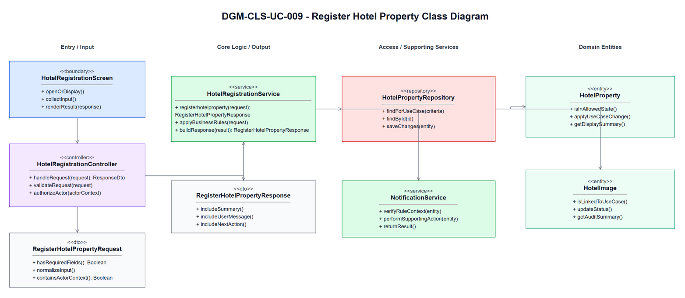

**Figure 3.9-1: Class Diagram of UC-009 Register Hotel Property**

## 3.9.3 Class Specifications

This part explains the key methods shown in the class diagram. The classes are conceptual design assumptions unless source code is inspected.

### HotelRegistrationScreen Class

**Description:** Boundary object for the user-visible entry point of UC-009 Register Hotel Property.

| No | Method | Description |
|---:|---|---|
| 1 | `openOrDisplay()` | Displays the use-case screen or user-visible entry state described by the SRS. |
| 2 | `collectInput()` | Collects actor input before request submission. |
| 3 | `renderResult(response)` | Displays the result, validation message, or next action to the actor. |

### HotelRegistrationController Class

**Description:** API/application entry controller for UC-009 Register Hotel Property.

| No | Method | Description |
|---:|---|---|
| 1 | `handleRequest(request)` | Receives the request from the boundary and delegates the business operation to the service. |
| 2 | `validateRequest(request)` | Checks required request shape before business rule execution. |
| 3 | `authorizeActor(actorContext)` | Verifies that the current actor may execute this use case within role or hotel scope. |

### RegisterHotelPropertyRequest Class

**Description:** Request DTO carrying input for UC-009 Register Hotel Property.

| No | Method | Description |
|---:|---|---|
| 1 | `hasRequiredFields()` | Returns whether mandatory fields from the SRS screen/use-case step are present. |
| 2 | `normalizeInput()` | Normalizes filter, status, note, amount, date, or reference input before service validation. |
| 3 | `containsActorContext()` | Confirms the request carries the authenticated actor or guest context needed for authorization. |

### HotelRegistrationService Class

**Description:** Application service that coordinates the main flow, business rules, persistence, and response creation for Register Hotel Property.

| No | Method | Description |
|---:|---|---|
| 1 | `registerhotelproperty(request)` | Executes the UC-009 main flow and returns a response for the boundary. |
| 2 | `applyBusinessRules(request)` | Applies the related SRS business rules and state-transition constraints. |
| 3 | `buildResponse(result)` | Builds success, empty-state, or validation responses without exposing unauthorized data. |

### HotelPropertyRepository Class

**Description:** Repository abstraction for loading and saving data required by Register Hotel Property.

| No | Method | Description |
|---:|---|---|
| 1 | `findForUseCase(criteria)` | Loads the entity state required for validation and display. |
| 2 | `findById(id)` | Retrieves a specific record within actor, hotel, or platform scope. |
| 3 | `saveChanges(entity)` | Persists allowed state changes when the use case modifies data. |

### NotificationService Class

**Description:** Supporting service or integration used by UC-009 Register Hotel Property.

| No | Method | Description |
|---:|---|---|
| 1 | `verifyRuleContext(entity)` | Checks specialized policy, authorization, calculation, notification, or external status context. |
| 2 | `performSupportingAction(entity)` | Performs notification, calculation, audit, or external reconciliation support when required. |
| 3 | `returnResult()` | Returns the supporting result to the application service for final response composition. |

### RegisterHotelPropertyResponse Class

**Description:** Response DTO returned by UC-009 Register Hotel Property.

| No | Method | Description |
|---:|---|---|
| 1 | `includeSummary()` | Adds the display or operation summary needed by the screen. |
| 2 | `includeUserMessage()` | Adds the user-facing success, empty-state, or validation message. |
| 3 | `includeNextAction()` | Adds the next available action when the SRS flow continues or returns for correction. |

### HotelProperty Class

**Description:** Primary domain entity affected or displayed by UC-009 Register Hotel Property.

| No | Method | Description |
|---:|---|---|
| 1 | `isInAllowedState()` | Determines whether the entity state allows the requested use-case operation. |
| 2 | `applyUseCaseChange()` | Applies the state or data change permitted by the validated flow. |
| 3 | `getDisplaySummary()` | Provides safe summary data for the response or audit record. |

### HotelImage Class

**Description:** Supporting domain entity affected or displayed by UC-009 Register Hotel Property.

| No | Method | Description |
|---:|---|---|
| 1 | `isLinkedToUseCase()` | Determines whether the entity is related to the current use-case operation. |
| 2 | `updateStatus()` | Updates status or lifecycle information when the validated flow requires it. |
| 3 | `getAuditSummary()` | Provides auditable summary data for protected state changes. |

## 3.9.4 Sequence Diagram

This part presents the sequence diagrams for UC-009 Register Hotel Property. The main-flow diagram shows only the successful scenario. Each alternative/error scenario has its own diagram.

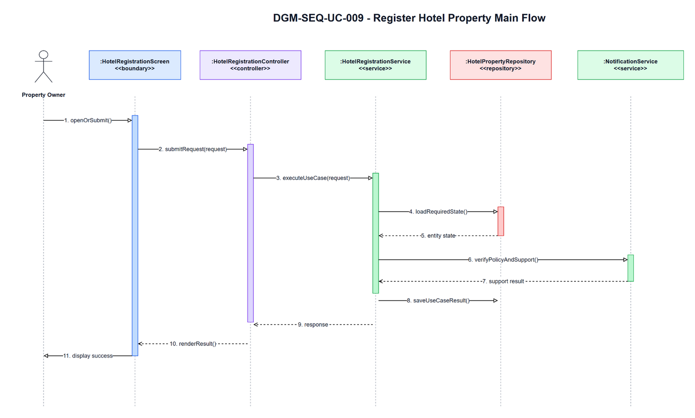

**Figure 3.9-2: Sequence Diagram of UC-009 Register Hotel Property - Main Flow**

### AT-UC009-04A - Missing required fields

- **Branch from Main Step:** 4
- **Condition:** Missing required fields
- **Expected Response:** Please complete required hotel property information.

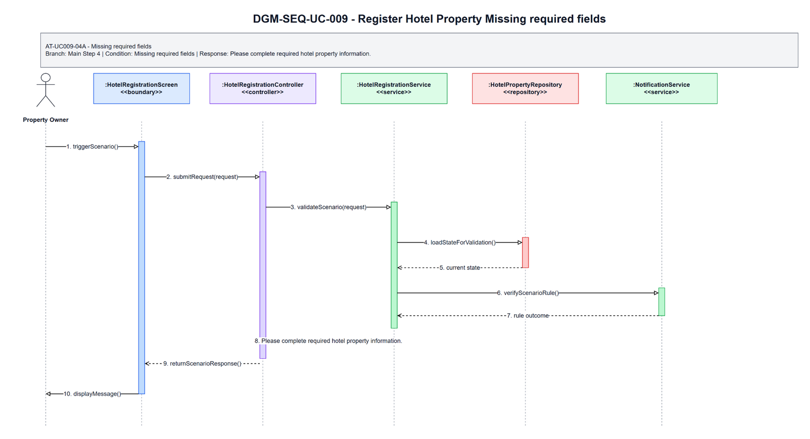

**Figure 3.9-3: Sequence Diagram of UC-009 Register Hotel Property - AT-UC009-04A Missing required fields**

### AT-UC009-04B - Invalid image

- **Branch from Main Step:** 4
- **Condition:** Invalid image
- **Expected Response:** Please upload a valid image file.

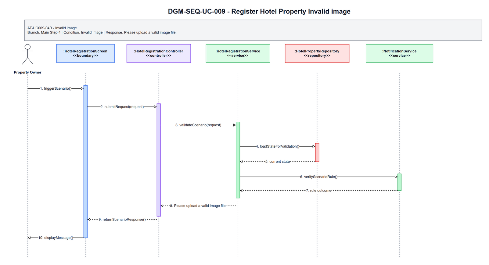

**Figure 3.9-4: Sequence Diagram of UC-009 Register Hotel Property - AT-UC009-04B Invalid image**

### Validation, Authorization, Transaction, and Error Handling Notes

| Area | Design |
|---|---|
| Validation | Validate required input, current entity status, date/amount/reference values, and SRS business rules before any state change. |
| Authorization | Allow only the SRS actor scope for Property Owner; enforce role, ownership, hotel-scope, or platform-scope preconditions before protected data is displayed or changed. |
| Transaction | Use a single application transaction for validated state changes, persistence updates, audit records, and notification records where applicable. Read-only flows do not create domain records. |
| Error Handling | AT-UC009-04A returns "Please complete required hotel property information."; AT-UC009-04B returns "Please upload a valid image file.". |
| Privacy | Return only fields allowed for the current role and scope; staff roles must not receive unrelated customer, platform finance, or cross-hotel data. |

## Assumptions and Open Issues

- ASSUMP-UC009-001: Controller, service, repository, DTO, and entity class names are conceptual SDD design names because no source implementation was inspected.
- ASSUMP-UC009-002: Final API routes, database column names, and UI widget names may differ from these SDD class names but must preserve the traced SRS behavior.
- OQ-UC009-001: Confirm final implementation class/package names before treating the conceptual design as code-level documentation.

# 3.10 UC-010 - Manage Hotel Profile

## 3.10.1 Design Purpose

This section describes the detailed design for **UC-010 Manage Hotel Profile**. The use case covers update owned or assigned hotel information, images, amenities, and policies. The design is based on the SRS/SDD only; class names and methods are conceptual design assumptions because no implementation codebase was inspected.

**Related SRS items:** FEAT-HOTEL-SETUP, UC-010, SCR-016, ENT-005, ENT-006, ENT-007, ENT-008, ENT-009, BR-OWNER-001, BR-STAFF-002, BR-MKT-001, MSG-OWNER-002, MSG-OWNER-004, MSG-OWNER-006, TR-010, AT-UC010-01A, AT-UC010-05A.

**Precondition:** Actor authenticated; selected hotel access can be validated before hotel profile data is displayed.

**Trigger:** Actor opens Hotel Profile Management.

**Post-condition:** POS-01: Hotel profile, images, amenities, or policy information is updated according to permission and approval rules.

The flow must:

- Main step 1: Actor selects owned or assigned hotel.
- Main step 2: System validates selected hotel access and displays hotel profile and approval/publication status.
- Main step 3: Actor updates editable hotel information, images, amenities, or policies.
- Main step 4: System validates updates.
- Main step 5: System records changes.
- Main step 6: System displays success message.
- Enforce related business rules: BR-OWNER-001, BR-STAFF-002, BR-MKT-001.
- Return a separate scenario response for each alternative/error flow: AT-UC010-01A, AT-UC010-05A.

## 3.10.2 Class Diagram

This part presents the class diagram for UC-010 Manage Hotel Profile.

**Figure 3.10-1: Class Diagram of UC-010 Manage Hotel Profile**

## 3.10.3 Class Specifications

This part explains the key methods shown in the class diagram. The classes are conceptual design assumptions unless source code is inspected.

### HotelProfileManagementScreen Class

**Description:** Boundary object for the user-visible entry point of UC-010 Manage Hotel Profile.

| No | Method | Description |
|---:|---|---|
| 1 | `openOrDisplay()` | Displays the use-case screen or user-visible entry state described by the SRS. |
| 2 | `collectInput()` | Collects actor input before request submission. |
| 3 | `renderResult(response)` | Displays the result, validation message, or next action to the actor. |

### HotelProfileController Class

**Description:** API/application entry controller for UC-010 Manage Hotel Profile.

| No | Method | Description |
|---:|---|---|
| 1 | `handleRequest(request)` | Receives the request from the boundary and delegates the business operation to the service. |
| 2 | `validateRequest(request)` | Checks required request shape before business rule execution. |
| 3 | `authorizeActor(actorContext)` | Verifies that the current actor may execute this use case within role or hotel scope. |

### ManageHotelProfileRequest Class

**Description:** Request DTO carrying input for UC-010 Manage Hotel Profile.

| No | Method | Description |
|---:|---|---|
| 1 | `hasRequiredFields()` | Returns whether mandatory fields from the SRS screen/use-case step are present. |
| 2 | `normalizeInput()` | Normalizes filter, status, note, amount, date, or reference input before service validation. |
| 3 | `containsActorContext()` | Confirms the request carries the authenticated actor or guest context needed for authorization. |

### HotelProfileService Class

**Description:** Application service that coordinates the main flow, business rules, persistence, and response creation for Manage Hotel Profile.

| No | Method | Description |
|---:|---|---|
| 1 | `managehotelprofile(request)` | Executes the UC-010 main flow and returns a response for the boundary. |
| 2 | `applyBusinessRules(request)` | Applies the related SRS business rules and state-transition constraints. |
| 3 | `buildResponse(result)` | Builds success, empty-state, or validation responses without exposing unauthorized data. |

### HotelPropertyRepository Class

**Description:** Repository abstraction for loading and saving data required by Manage Hotel Profile.

| No | Method | Description |
|---:|---|---|
| 1 | `findForUseCase(criteria)` | Loads the entity state required for validation and display. |
| 2 | `findById(id)` | Retrieves a specific record within actor, hotel, or platform scope. |
| 3 | `saveChanges(entity)` | Persists allowed state changes when the use case modifies data. |

### HotelAuthorizationService Class

**Description:** Supporting service or integration used by UC-010 Manage Hotel Profile.

| No | Method | Description |
|---:|---|---|
| 1 | `verifyRuleContext(entity)` | Checks specialized policy, authorization, calculation, notification, or external status context. |
| 2 | `performSupportingAction(entity)` | Performs notification, calculation, audit, or external reconciliation support when required. |
| 3 | `returnResult()` | Returns the supporting result to the application service for final response composition. |

### ManageHotelProfileResponse Class

**Description:** Response DTO returned by UC-010 Manage Hotel Profile.

| No | Method | Description |
|---:|---|---|
| 1 | `includeSummary()` | Adds the display or operation summary needed by the screen. |
| 2 | `includeUserMessage()` | Adds the user-facing success, empty-state, or validation message. |
| 3 | `includeNextAction()` | Adds the next available action when the SRS flow continues or returns for correction. |

### HotelProperty Class

**Description:** Primary domain entity affected or displayed by UC-010 Manage Hotel Profile.

| No | Method | Description |
|---:|---|---|
| 1 | `isInAllowedState()` | Determines whether the entity state allows the requested use-case operation. |
| 2 | `applyUseCaseChange()` | Applies the state or data change permitted by the validated flow. |
| 3 | `getDisplaySummary()` | Provides safe summary data for the response or audit record. |

### CancellationPolicy Class

**Description:** Supporting domain entity affected or displayed by UC-010 Manage Hotel Profile.

| No | Method | Description |
|---:|---|---|
| 1 | `isLinkedToUseCase()` | Determines whether the entity is related to the current use-case operation. |
| 2 | `updateStatus()` | Updates status or lifecycle information when the validated flow requires it. |
| 3 | `getAuditSummary()` | Provides auditable summary data for protected state changes. |

## 3.10.4 Sequence Diagram

This part presents the sequence diagrams for UC-010 Manage Hotel Profile. The main-flow diagram shows only the successful scenario. Each alternative/error scenario has its own diagram.

**Figure 3.10-2: Sequence Diagram of UC-010 Manage Hotel Profile - Main Flow**

### AT-UC010-01A - Unauthorized hotel

- **Branch from Main Step:** 1
- **Condition:** Unauthorized hotel
- **Expected Response:** You can access only hotels that you own or are assigned to.

**Figure 3.10-3: Sequence Diagram of UC-010 Manage Hotel Profile - AT-UC010-01A Unauthorized hotel**

### AT-UC010-05A - Sensitive change requires review

- **Branch from Main Step:** 5
- **Condition:** Sensitive change requires review
- **Expected Response:** This change may require platform review before publication.

**Figure 3.10-4: Sequence Diagram of UC-010 Manage Hotel Profile - AT-UC010-05A Sensitive change requires review**

### Validation, Authorization, Transaction, and Error Handling Notes

| Area | Design |
|---|---|
| Validation | Validate required input, current entity status, date/amount/reference values, and SRS business rules before any state change. |
| Authorization | Allow only the SRS actor scope for Property Owner / Hotel Manager; enforce role, ownership, hotel-scope, or platform-scope preconditions before protected data is displayed or changed. |
| Transaction | Use a single application transaction for validated state changes, persistence updates, audit records, and notification records where applicable. Read-only flows do not create domain records. |
| Error Handling | AT-UC010-01A returns "You can access only hotels that you own or are assigned to."; AT-UC010-05A returns "This change may require platform review before publication.". |
| Privacy | Return only fields allowed for the current role and scope; staff roles must not receive unrelated customer, platform finance, or cross-hotel data. |

## Assumptions and Open Issues

- ASSUMP-UC010-001: Controller, service, repository, DTO, and entity class names are conceptual SDD design names because no source implementation was inspected.
- ASSUMP-UC010-002: Final API routes, database column names, and UI widget names may differ from these SDD class names but must preserve the traced SRS behavior.
- OQ-UC010-001: Confirm final implementation class/package names before treating the conceptual design as code-level documentation.

# 3.11 UC-011 - Manage Room Type

## 3.11.1 Design Purpose

This section describes the detailed design for **UC-011 Manage Room Type**. The use case covers create and update private room types, base price, capacity, and facilities. The design is based on the SRS/SDD only; class names and methods are conceptual design assumptions because no implementation codebase was inspected.

**Related SRS items:** FEAT-ROOM-INV, UC-011, SCR-017, ENT-010, BR-ROOM-003, BR-ROOM-004, BR-OWNER-001, BR-STAFF-002, MSG-ROOM-001, MSG-ROOM-002, MSG-ROOM-005, TR-011, AT-UC011-04A, AT-UC011-04B.

**Precondition:** Actor authenticated; hotel owned or assigned.

**Trigger:** Actor opens Room Type Management.

**Post-condition:** POS-01: Room type information is created or updated for an owned/assigned hotel.

The flow must:

- Main step 1: Actor selects hotel and opens Room Type Management.
- Main step 2: System displays room types and actions.
- Main step 3: Actor creates or updates room type information.
- Main step 4: System validates name, capacity, base price, and status.
- Main step 5: System records room type.
- Main step 6: System displays success message.
- Enforce related business rules: BR-ROOM-003, BR-ROOM-004, BR-OWNER-001, BR-STAFF-002.
- Return a separate scenario response for each alternative/error flow: AT-UC011-04A, AT-UC011-04B.

## 3.11.2 Class Diagram

This part presents the class diagram for UC-011 Manage Room Type.

**Figure 3.11-1: Class Diagram of UC-011 Manage Room Type**

## 3.11.3 Class Specifications

This part explains the key methods shown in the class diagram. The classes are conceptual design assumptions unless source code is inspected.

### RoomTypeManagementScreen Class

**Description:** Boundary object for the user-visible entry point of UC-011 Manage Room Type.

| No | Method | Description |
|---:|---|---|
| 1 | `openOrDisplay()` | Displays the use-case screen or user-visible entry state described by the SRS. |
| 2 | `collectInput()` | Collects actor input before request submission. |
| 3 | `renderResult(response)` | Displays the result, validation message, or next action to the actor. |

### RoomTypeController Class

**Description:** API/application entry controller for UC-011 Manage Room Type.

| No | Method | Description |
|---:|---|---|
| 1 | `handleRequest(request)` | Receives the request from the boundary and delegates the business operation to the service. |
| 2 | `validateRequest(request)` | Checks required request shape before business rule execution. |
| 3 | `authorizeActor(actorContext)` | Verifies that the current actor may execute this use case within role or hotel scope. |

### ManageRoomTypeRequest Class

**Description:** Request DTO carrying input for UC-011 Manage Room Type.

| No | Method | Description |
|---:|---|---|
| 1 | `hasRequiredFields()` | Returns whether mandatory fields from the SRS screen/use-case step are present. |
| 2 | `normalizeInput()` | Normalizes filter, status, note, amount, date, or reference input before service validation. |
| 3 | `containsActorContext()` | Confirms the request carries the authenticated actor or guest context needed for authorization. |

### RoomTypeService Class

**Description:** Application service that coordinates the main flow, business rules, persistence, and response creation for Manage Room Type.

| No | Method | Description |
|---:|---|---|
| 1 | `manageroomtype(request)` | Executes the UC-011 main flow and returns a response for the boundary. |
| 2 | `applyBusinessRules(request)` | Applies the related SRS business rules and state-transition constraints. |
| 3 | `buildResponse(result)` | Builds success, empty-state, or validation responses without exposing unauthorized data. |

### RoomTypeRepository Class

**Description:** Repository abstraction for loading and saving data required by Manage Room Type.

| No | Method | Description |
|---:|---|---|
| 1 | `findForUseCase(criteria)` | Loads the entity state required for validation and display. |
| 2 | `findById(id)` | Retrieves a specific record within actor, hotel, or platform scope. |
| 3 | `saveChanges(entity)` | Persists allowed state changes when the use case modifies data. |

### HotelAuthorizationService Class

**Description:** Supporting service or integration used by UC-011 Manage Room Type.

| No | Method | Description |
|---:|---|---|
| 1 | `verifyRuleContext(entity)` | Checks specialized policy, authorization, calculation, notification, or external status context. |
| 2 | `performSupportingAction(entity)` | Performs notification, calculation, audit, or external reconciliation support when required. |
| 3 | `returnResult()` | Returns the supporting result to the application service for final response composition. |

### ManageRoomTypeResponse Class

**Description:** Response DTO returned by UC-011 Manage Room Type.

| No | Method | Description |
|---:|---|---|
| 1 | `includeSummary()` | Adds the display or operation summary needed by the screen. |
| 2 | `includeUserMessage()` | Adds the user-facing success, empty-state, or validation message. |
| 3 | `includeNextAction()` | Adds the next available action when the SRS flow continues or returns for correction. |

### RoomType Class

**Description:** Primary domain entity affected or displayed by UC-011 Manage Room Type.

| No | Method | Description |
|---:|---|---|
| 1 | `isInAllowedState()` | Determines whether the entity state allows the requested use-case operation. |
| 2 | `applyUseCaseChange()` | Applies the state or data change permitted by the validated flow. |
| 3 | `getDisplaySummary()` | Provides safe summary data for the response or audit record. |

### RoomAvailability Class

**Description:** Supporting domain entity affected or displayed by UC-011 Manage Room Type.

| No | Method | Description |
|---:|---|---|
| 1 | `isLinkedToUseCase()` | Determines whether the entity is related to the current use-case operation. |
| 2 | `updateStatus()` | Updates status or lifecycle information when the validated flow requires it. |
| 3 | `getAuditSummary()` | Provides auditable summary data for protected state changes. |

## 3.11.4 Sequence Diagram

This part presents the sequence diagrams for UC-011 Manage Room Type. The main-flow diagram shows only the successful scenario. Each alternative/error scenario has its own diagram.

**Figure 3.11-2: Sequence Diagram of UC-011 Manage Room Type - Main Flow**

### AT-UC011-04A - Invalid room type

- **Branch from Main Step:** 4
- **Condition:** Invalid room type
- **Expected Response:** Please check room type name, capacity, price, and status.

**Figure 3.11-3: Sequence Diagram of UC-011 Manage Room Type - AT-UC011-04A Invalid room type**

### AT-UC011-04B - Deactivation conflict

- **Branch from Main Step:** 4
- **Condition:** Deactivation conflict
- **Expected Response:** This room type cannot be deactivated because active future bookings exist.

**Figure 3.11-4: Sequence Diagram of UC-011 Manage Room Type - AT-UC011-04B Deactivation conflict**

### Validation, Authorization, Transaction, and Error Handling Notes

| Area | Design |
|---|---|
| Validation | Validate required input, current entity status, date/amount/reference values, and SRS business rules before any state change. |
| Authorization | Allow only the SRS actor scope for Property Owner / Hotel Manager; enforce role, ownership, hotel-scope, or platform-scope preconditions before protected data is displayed or changed. |
| Transaction | Use a single application transaction for validated state changes, persistence updates, audit records, and notification records where applicable. Read-only flows do not create domain records. |
| Error Handling | AT-UC011-04A returns "Please check room type name, capacity, price, and status."; AT-UC011-04B returns "This room type cannot be deactivated because active future bookings exist.". |
| Privacy | Return only fields allowed for the current role and scope; staff roles must not receive unrelated customer, platform finance, or cross-hotel data. |

## Assumptions and Open Issues

- ASSUMP-UC011-001: Controller, service, repository, DTO, and entity class names are conceptual SDD design names because no source implementation was inspected.
- ASSUMP-UC011-002: Final API routes, database column names, and UI widget names may differ from these SDD class names but must preserve the traced SRS behavior.
- OQ-UC011-001: Confirm final implementation class/package names before treating the conceptual design as code-level documentation.

# 3.12 UC-012 - Manage Physical Room

## 3.12.1 Design Purpose

This section describes the detailed design for **UC-012 Manage Physical Room**. The use case covers create and update individual private rooms under room types. The design is based on the SRS/SDD only; class names and methods are conceptual design assumptions because no implementation codebase was inspected.

**Related SRS items:** FEAT-ROOM-INV, UC-012, SCR-018, ENT-011, ENT-027, BR-ROOM-001, BR-ROOM-005, BR-ROOM-006, BR-OWNER-001, BR-STAFF-002, MSG-ROOM-003, MSG-ROOM-004, MSG-ROOM-006, MSG-AUTH-007, TR-012, AT-UC012-05A, AT-UC012-05B, AT-UC012-02A.

**Precondition:** Actor authenticated; hotel/room type owned or assigned.

**Trigger:** Actor opens Physical Room Management.

**Post-condition:** POS-01: Physical room information is created or updated for an owned/assigned hotel.

The flow must:

- Main step 1: Actor selects hotel and room type.
- Main step 2: System validates actor permission for the selected hotel and room type before displaying room data.
- Main step 3: System displays physical rooms, lifecycle status, and allowed actions.
- Main step 4: Actor creates or updates room number/name, floor, notes, or requests an allowed lifecycle action.
- Main step 5: System validates duplicate room number, room data, lifecycle transition, and active booking conflicts.
- Main step 6: System records physical room changes and RoomStatusHistory when lifecycle status changes.
- Main step 7: System displays success message.
- Enforce related business rules: BR-ROOM-001, BR-ROOM-005, BR-ROOM-006, BR-OWNER-001, BR-STAFF-002.
- Return a separate scenario response for each alternative/error flow: AT-UC012-05A, AT-UC012-05B, AT-UC012-02A.

## 3.12.2 Class Diagram

This part presents the class diagram for UC-012 Manage Physical Room.

**Figure 3.12-1: Class Diagram of UC-012 Manage Physical Room**

## 3.12.3 Class Specifications

This part explains the key methods shown in the class diagram. The classes are conceptual design assumptions unless source code is inspected.

### PhysicalRoomManagementScreen Class

**Description:** Boundary object for the user-visible entry point of UC-012 Manage Physical Room.

| No | Method | Description |
|---:|---|---|
| 1 | `openOrDisplay()` | Displays the use-case screen or user-visible entry state described by the SRS. |
| 2 | `collectInput()` | Collects actor input before request submission. |
| 3 | `renderResult(response)` | Displays the result, validation message, or next action to the actor. |

### PhysicalRoomController Class

**Description:** API/application entry controller for UC-012 Manage Physical Room.

| No | Method | Description |
|---:|---|---|
| 1 | `handleRequest(request)` | Receives the request from the boundary and delegates the business operation to the service. |
| 2 | `validateRequest(request)` | Checks required request shape before business rule execution. |
| 3 | `authorizeActor(actorContext)` | Verifies that the current actor may execute this use case within role or hotel scope. |

### ManagePhysicalRoomRequest Class

**Description:** Request DTO carrying input for UC-012 Manage Physical Room.

| No | Method | Description |
|---:|---|---|
| 1 | `hasRequiredFields()` | Returns whether mandatory fields from the SRS screen/use-case step are present. |
| 2 | `normalizeInput()` | Normalizes filter, status, note, amount, date, or reference input before service validation. |
| 3 | `containsActorContext()` | Confirms the request carries the authenticated actor or guest context needed for authorization. |

### PhysicalRoomService Class

**Description:** Application service that coordinates the main flow, business rules, persistence, and response creation for Manage Physical Room.

| No | Method | Description |
|---:|---|---|
| 1 | `managephysicalroom(request)` | Executes the UC-012 main flow and returns a response for the boundary. |
| 2 | `applyBusinessRules(request)` | Applies the related SRS business rules and state-transition constraints. |
| 3 | `buildResponse(result)` | Builds success, empty-state, or validation responses without exposing unauthorized data. |

### PhysicalRoomRepository Class

**Description:** Repository abstraction for loading and saving data required by Manage Physical Room.

| No | Method | Description |
|---:|---|---|
| 1 | `findForUseCase(criteria)` | Loads the entity state required for validation and display. |
| 2 | `findById(id)` | Retrieves a specific record within actor, hotel, or platform scope. |
| 3 | `saveChanges(entity)` | Persists allowed state changes when the use case modifies data. |

### RoomStatusWorkflowService Class

**Description:** Supporting service or integration used by UC-012 Manage Physical Room.

| No | Method | Description |
|---:|---|---|
| 1 | `verifyRuleContext(entity)` | Checks specialized policy, authorization, calculation, notification, or external status context. |
| 2 | `performSupportingAction(entity)` | Performs notification, calculation, audit, or external reconciliation support when required. |
| 3 | `returnResult()` | Returns the supporting result to the application service for final response composition. |

### ManagePhysicalRoomResponse Class

**Description:** Response DTO returned by UC-012 Manage Physical Room.

| No | Method | Description |
|---:|---|---|
| 1 | `includeSummary()` | Adds the display or operation summary needed by the screen. |
| 2 | `includeUserMessage()` | Adds the user-facing success, empty-state, or validation message. |
| 3 | `includeNextAction()` | Adds the next available action when the SRS flow continues or returns for correction. |

### PhysicalRoom Class

**Description:** Primary domain entity affected or displayed by UC-012 Manage Physical Room.

| No | Method | Description |
|---:|---|---|
| 1 | `isInAllowedState()` | Determines whether the entity state allows the requested use-case operation. |
| 2 | `applyUseCaseChange()` | Applies the state or data change permitted by the validated flow. |
| 3 | `getDisplaySummary()` | Provides safe summary data for the response or audit record. |

### RoomStatusHistory Class

**Description:** Supporting domain entity affected or displayed by UC-012 Manage Physical Room.

| No | Method | Description |
|---:|---|---|
| 1 | `isLinkedToUseCase()` | Determines whether the entity is related to the current use-case operation. |
| 2 | `updateStatus()` | Updates status or lifecycle information when the validated flow requires it. |
| 3 | `getAuditSummary()` | Provides auditable summary data for protected state changes. |

## 3.12.4 Sequence Diagram

This part presents the sequence diagrams for UC-012 Manage Physical Room. The main-flow diagram shows only the successful scenario. Each alternative/error scenario has its own diagram.

**Figure 3.12-2: Sequence Diagram of UC-012 Manage Physical Room - Main Flow**

### AT-UC012-05A - Duplicate room number

- **Branch from Main Step:** 5
- **Condition:** Duplicate room number
- **Expected Response:** Room number must be unique within the hotel.

**Figure 3.12-3: Sequence Diagram of UC-012 Manage Physical Room - AT-UC012-05A Duplicate room number**

### AT-UC012-05B - Inactivate occupied room

- **Branch from Main Step:** 5
- **Condition:** Inactivate occupied room
- **Expected Response:** This room cannot be inactivated because it is currently occupied.

**Figure 3.12-4: Sequence Diagram of UC-012 Manage Physical Room - AT-UC012-05B Inactivate occupied room**

### AT-UC012-02A - Unauthorized hotel or room type

- **Branch from Main Step:** 2
- **Condition:** Unauthorized hotel or room type
- **Expected Response:** You are not authorized to perform this action.

**Figure 3.12-5: Sequence Diagram of UC-012 Manage Physical Room - AT-UC012-02A Unauthorized hotel or room type**

### Validation, Authorization, Transaction, and Error Handling Notes

| Area | Design |
|---|---|
| Validation | Validate required input, current entity status, date/amount/reference values, and SRS business rules before any state change. |
| Authorization | Allow only the SRS actor scope for Property Owner / Hotel Manager; enforce role, ownership, hotel-scope, or platform-scope preconditions before protected data is displayed or changed. |
| Transaction | Use a single application transaction for validated state changes, persistence updates, audit records, and notification records where applicable. Read-only flows do not create domain records. |
| Error Handling | AT-UC012-05A returns "Room number must be unique within the hotel."; AT-UC012-05B returns "This room cannot be inactivated because it is currently occupied."; AT-UC012-02A returns "You are not authorized to perform this action.". |
| Privacy | Return only fields allowed for the current role and scope; staff roles must not receive unrelated customer, platform finance, or cross-hotel data. |

## Assumptions and Open Issues

- ASSUMP-UC012-001: Controller, service, repository, DTO, and entity class names are conceptual SDD design names because no source implementation was inspected.
- ASSUMP-UC012-002: Final API routes, database column names, and UI widget names may differ from these SDD class names but must preserve the traced SRS behavior.
- OQ-UC012-001: Confirm final implementation class/package names before treating the conceptual design as code-level documentation.

# 3.13 UC-013 - Manage Room Availability

## 3.13.1 Design Purpose

This section describes the detailed design for **UC-013 Manage Room Availability**. The use case covers open, close, block, or unblock room availability by date range, according to role permissions. The design is based on the SRS/SDD only; class names and methods are conceptual design assumptions because no implementation codebase was inspected.

**Related SRS items:** FEAT-ROOM-INV, UC-013, SCR-019, SCR-035, ENT-012, ENT-027, BR-BOOK-001, BR-ROOM-002, BR-AVAIL-001, BR-AVAIL-002, BR-STAFF-003, MSG-BOOK-001, MSG-AVAIL-001, MSG-AVAIL-002, MSG-AUTH-007, TR-013, AT-UC013-06A, AT-UC013-06B, AT-UC013-02A, AT-UC013-06C.

**Precondition:** Actor authenticated and permitted for hotel.

**Trigger:** Actor opens Availability Calendar.

**Post-condition:** POS-01: Availability or block record is updated and marketplace availability is refreshed accordingly.

The flow must:

- Main step 1: Actor opens Availability Calendar.
- Main step 2: System validates actor hotel scope and allowed availability actions before displaying availability data.
- Main step 3: System displays room type availability, physical room status, existing bookings, and blocked dates within permitted scope.
- Main step 4: Actor selects room/date range.
- Main step 5: Actor chooses open/close/block/unblock and enters reason if required.
- Main step 6: System validates date range, required reason, permission, and conflicts.
- Main step 7: System records change.
- Main step 8: System updates marketplace availability display.
- Enforce related business rules: BR-BOOK-001, BR-ROOM-002, BR-AVAIL-001, BR-AVAIL-002, BR-STAFF-003.
- Return a separate scenario response for each alternative/error flow: AT-UC013-06A, AT-UC013-06B, AT-UC013-02A, AT-UC013-06C.

## 3.13.2 Class Diagram

This part presents the class diagram for UC-013 Manage Room Availability.

**Figure 3.13-1: Class Diagram of UC-013 Manage Room Availability**

## 3.13.3 Class Specifications

This part explains the key methods shown in the class diagram. The classes are conceptual design assumptions unless source code is inspected.

### AvailabilityCalendarScreen Class

**Description:** Boundary object for the user-visible entry point of UC-013 Manage Room Availability.

| No | Method | Description |
|---:|---|---|
| 1 | `openOrDisplay()` | Displays the use-case screen or user-visible entry state described by the SRS. |
| 2 | `collectInput()` | Collects actor input before request submission. |
| 3 | `renderResult(response)` | Displays the result, validation message, or next action to the actor. |

### RoomAvailabilityController Class

**Description:** API/application entry controller for UC-013 Manage Room Availability.

| No | Method | Description |
|---:|---|---|
| 1 | `handleRequest(request)` | Receives the request from the boundary and delegates the business operation to the service. |
| 2 | `validateRequest(request)` | Checks required request shape before business rule execution. |
| 3 | `authorizeActor(actorContext)` | Verifies that the current actor may execute this use case within role or hotel scope. |

### ManageRoomAvailabilityRequest Class

**Description:** Request DTO carrying input for UC-013 Manage Room Availability.

| No | Method | Description |
|---:|---|---|
| 1 | `hasRequiredFields()` | Returns whether mandatory fields from the SRS screen/use-case step are present. |
| 2 | `normalizeInput()` | Normalizes filter, status, note, amount, date, or reference input before service validation. |
| 3 | `containsActorContext()` | Confirms the request carries the authenticated actor or guest context needed for authorization. |

### RoomAvailabilityService Class

**Description:** Application service that coordinates the main flow, business rules, persistence, and response creation for Manage Room Availability.

| No | Method | Description |
|---:|---|---|
| 1 | `manageroomavailability(request)` | Executes the UC-013 main flow and returns a response for the boundary. |
| 2 | `applyBusinessRules(request)` | Applies the related SRS business rules and state-transition constraints. |
| 3 | `buildResponse(result)` | Builds success, empty-state, or validation responses without exposing unauthorized data. |

### RoomAvailabilityRepository Class

**Description:** Repository abstraction for loading and saving data required by Manage Room Availability.

| No | Method | Description |
|---:|---|---|
| 1 | `findForUseCase(criteria)` | Loads the entity state required for validation and display. |
| 2 | `findById(id)` | Retrieves a specific record within actor, hotel, or platform scope. |
| 3 | `saveChanges(entity)` | Persists allowed state changes when the use case modifies data. |

### HotelAuthorizationService Class

**Description:** Supporting service or integration used by UC-013 Manage Room Availability.

| No | Method | Description |
|---:|---|---|
| 1 | `verifyRuleContext(entity)` | Checks specialized policy, authorization, calculation, notification, or external status context. |
| 2 | `performSupportingAction(entity)` | Performs notification, calculation, audit, or external reconciliation support when required. |
| 3 | `returnResult()` | Returns the supporting result to the application service for final response composition. |

### ManageRoomAvailabilityResponse Class

**Description:** Response DTO returned by UC-013 Manage Room Availability.

| No | Method | Description |
|---:|---|---|
| 1 | `includeSummary()` | Adds the display or operation summary needed by the screen. |
| 2 | `includeUserMessage()` | Adds the user-facing success, empty-state, or validation message. |
| 3 | `includeNextAction()` | Adds the next available action when the SRS flow continues or returns for correction. |

### RoomAvailability Class

**Description:** Primary domain entity affected or displayed by UC-013 Manage Room Availability.

| No | Method | Description |
|---:|---|---|
| 1 | `isInAllowedState()` | Determines whether the entity state allows the requested use-case operation. |
| 2 | `applyUseCaseChange()` | Applies the state or data change permitted by the validated flow. |
| 3 | `getDisplaySummary()` | Provides safe summary data for the response or audit record. |

### PhysicalRoom Class

**Description:** Supporting domain entity affected or displayed by UC-013 Manage Room Availability.

| No | Method | Description |
|---:|---|---|
| 1 | `isLinkedToUseCase()` | Determines whether the entity is related to the current use-case operation. |
| 2 | `updateStatus()` | Updates status or lifecycle information when the validated flow requires it. |
| 3 | `getAuditSummary()` | Provides auditable summary data for protected state changes. |

## 3.13.4 Sequence Diagram

This part presents the sequence diagrams for UC-013 Manage Room Availability. The main-flow diagram shows only the successful scenario. Each alternative/error scenario has its own diagram.

**Figure 3.13-2: Sequence Diagram of UC-013 Manage Room Availability - Main Flow**

### AT-UC013-06A - Invalid date

- **Branch from Main Step:** 6
- **Condition:** Invalid date
- **Expected Response:** Check-out date must be later than check-in date.

**Figure 3.13-3: Sequence Diagram of UC-013 Manage Room Availability - AT-UC013-06A Invalid date**

### AT-UC013-06B - Conflict with active booking

- **Branch from Main Step:** 6
- **Condition:** Conflict with active booking
- **Expected Response:** Availability change conflicts with active booking or assignment.

**Figure 3.13-4: Sequence Diagram of UC-013 Manage Room Availability - AT-UC013-06B Conflict with active booking**

### AT-UC013-02A - Receptionist attempts restricted change

- **Branch from Main Step:** 2
- **Condition:** Receptionist attempts restricted change
- **Expected Response:** You are not authorized to perform this action.

**Figure 3.13-5: Sequence Diagram of UC-013 Manage Room Availability - AT-UC013-02A Receptionist attempts restricted change**

### AT-UC013-06C - Missing required reason

- **Branch from Main Step:** 6
- **Condition:** Missing required reason
- **Expected Response:** Please enter a required reason for this availability change.

**Figure 3.13-6: Sequence Diagram of UC-013 Manage Room Availability - AT-UC013-06C Missing required reason**

### Validation, Authorization, Transaction, and Error Handling Notes

| Area | Design |
|---|---|
| Validation | Validate required input, current entity status, date/amount/reference values, and SRS business rules before any state change. |
| Authorization | Allow only the SRS actor scope for Property Owner / Hotel Manager / Receptionist; enforce role, ownership, hotel-scope, or platform-scope preconditions before protected data is displayed or changed. |
| Transaction | Use a single application transaction for validated state changes, persistence updates, audit records, and notification records where applicable. Read-only flows do not create domain records. |
| Error Handling | AT-UC013-06A returns "Check-out date must be later than check-in date."; AT-UC013-06B returns "Availability change conflicts with active booking or assignment."; AT-UC013-02A returns "You are not authorized to perform this action."; AT-UC013-06C returns "Please enter a required reason for this availability change.". |
| Privacy | Return only fields allowed for the current role and scope; staff roles must not receive unrelated customer, platform finance, or cross-hotel data. |

## Assumptions and Open Issues

- ASSUMP-UC013-001: Controller, service, repository, DTO, and entity class names are conceptual SDD design names because no source implementation was inspected.
- ASSUMP-UC013-002: Final API routes, database column names, and UI widget names may differ from these SDD class names but must preserve the traced SRS behavior.
- OQ-UC013-001: Confirm final implementation class/package names before treating the conceptual design as code-level documentation.

# 3.14 UC-014 - View Hotel Bookings

## 3.14.1 Design Purpose

This section describes the detailed design for **UC-014 View Hotel Bookings**. The use case covers view bookings for owned or assigned hotels. The design is based on the SRS/SDD only; class names and methods are conceptual design assumptions because no implementation codebase was inspected.

**Related SRS items:** FEAT-FRONTDESK, UC-014, SCR-020, SCR-021, ENT-013, BR-BOOK-009, BR-OWNER-001, BR-STAFF-002, BR-STAFF-003, MSG-BOOK-009, MSG-OWNER-002, TR-014, AT-UC014-02A, AT-UC014-04A.

**Precondition:** Actor authenticated and has hotel access.

**Trigger:** Actor opens Hotel Booking List.

**Post-condition:** POS-01: Hotel-scoped booking list or booking detail is displayed according to actor permission.

The flow must:

- Main step 1: Actor opens Hotel Booking List.
- Main step 2: System validates actor role and hotel access, then displays hotel selector, filters, and booking list for permitted hotels.
- Main step 3: Actor applies filters or selects booking.
- Main step 4: System displays booking detail and actions allowed for actor role.
- Main step 5: Actor chooses next operational action if needed.
- Enforce related business rules: BR-BOOK-009, BR-OWNER-001, BR-STAFF-002, BR-STAFF-003.
- Return a separate scenario response for each alternative/error flow: AT-UC014-02A, AT-UC014-04A.

## 3.14.2 Class Diagram

This part presents the class diagram for UC-014 View Hotel Bookings.

**Figure 3.14-1: Class Diagram of UC-014 View Hotel Bookings**

## 3.14.3 Class Specifications

This part explains the key methods shown in the class diagram. The classes are conceptual design assumptions unless source code is inspected.

### HotelBookingListScreen Class

**Description:** Boundary object for the user-visible entry point of UC-014 View Hotel Bookings.

| No | Method | Description |
|---:|---|---|
| 1 | `openOrDisplay()` | Displays the use-case screen or user-visible entry state described by the SRS. |
| 2 | `collectInput()` | Collects actor input before request submission. |
| 3 | `renderResult(response)` | Displays the result, validation message, or next action to the actor. |

### HotelBookingController Class

**Description:** API/application entry controller for UC-014 View Hotel Bookings.

| No | Method | Description |
|---:|---|---|
| 1 | `handleRequest(request)` | Receives the request from the boundary and delegates the business operation to the service. |
| 2 | `validateRequest(request)` | Checks required request shape before business rule execution. |
| 3 | `authorizeActor(actorContext)` | Verifies that the current actor may execute this use case within role or hotel scope. |

### ViewHotelBookingsRequest Class

**Description:** Request DTO carrying input for UC-014 View Hotel Bookings.

| No | Method | Description |
|---:|---|---|
| 1 | `hasRequiredFields()` | Returns whether mandatory fields from the SRS screen/use-case step are present. |
| 2 | `normalizeInput()` | Normalizes filter, status, note, amount, date, or reference input before service validation. |
| 3 | `containsActorContext()` | Confirms the request carries the authenticated actor or guest context needed for authorization. |

### HotelBookingQueryService Class

**Description:** Application service that coordinates the main flow, business rules, persistence, and response creation for View Hotel Bookings.

| No | Method | Description |
|---:|---|---|
| 1 | `viewhotelbookings(request)` | Executes the UC-014 main flow and returns a response for the boundary. |
| 2 | `applyBusinessRules(request)` | Applies the related SRS business rules and state-transition constraints. |
| 3 | `buildResponse(result)` | Builds success, empty-state, or validation responses without exposing unauthorized data. |

### BookingRepository Class

**Description:** Repository abstraction for loading and saving data required by View Hotel Bookings.

| No | Method | Description |
|---:|---|---|
| 1 | `findForUseCase(criteria)` | Loads the entity state required for validation and display. |
| 2 | `findById(id)` | Retrieves a specific record within actor, hotel, or platform scope. |
| 3 | `saveChanges(entity)` | Persists allowed state changes when the use case modifies data. |

### HotelAuthorizationService Class

**Description:** Supporting service or integration used by UC-014 View Hotel Bookings.

| No | Method | Description |
|---:|---|---|
| 1 | `verifyRuleContext(entity)` | Checks specialized policy, authorization, calculation, notification, or external status context. |
| 2 | `performSupportingAction(entity)` | Performs notification, calculation, audit, or external reconciliation support when required. |
| 3 | `returnResult()` | Returns the supporting result to the application service for final response composition. |

### ViewHotelBookingsResponse Class

**Description:** Response DTO returned by UC-014 View Hotel Bookings.

| No | Method | Description |
|---:|---|---|
| 1 | `includeSummary()` | Adds the display or operation summary needed by the screen. |
| 2 | `includeUserMessage()` | Adds the user-facing success, empty-state, or validation message. |
| 3 | `includeNextAction()` | Adds the next available action when the SRS flow continues or returns for correction. |

### Booking Class

**Description:** Primary domain entity affected or displayed by UC-014 View Hotel Bookings.

| No | Method | Description |
|---:|---|---|
| 1 | `isInAllowedState()` | Determines whether the entity state allows the requested use-case operation. |
| 2 | `applyUseCaseChange()` | Applies the state or data change permitted by the validated flow. |
| 3 | `getDisplaySummary()` | Provides safe summary data for the response or audit record. |

### BookingRoom Class

**Description:** Supporting domain entity affected or displayed by UC-014 View Hotel Bookings.

| No | Method | Description |
|---:|---|---|
| 1 | `isLinkedToUseCase()` | Determines whether the entity is related to the current use-case operation. |
| 2 | `updateStatus()` | Updates status or lifecycle information when the validated flow requires it. |
| 3 | `getAuditSummary()` | Provides auditable summary data for protected state changes. |

## 3.14.4 Sequence Diagram

This part presents the sequence diagrams for UC-014 View Hotel Bookings. The main-flow diagram shows only the successful scenario. Each alternative/error scenario has its own diagram.

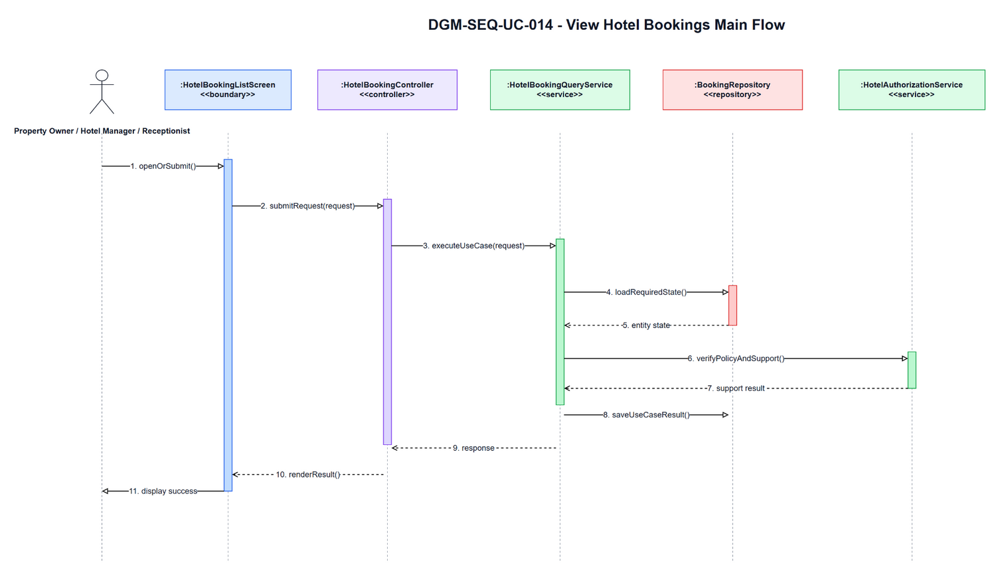

**Figure 3.14-2: Sequence Diagram of UC-014 View Hotel Bookings - Main Flow**

### AT-UC014-02A - No bookings

- **Branch from Main Step:** 2
- **Condition:** No bookings
- **Expected Response:** No bookings match the selected hotel filters.

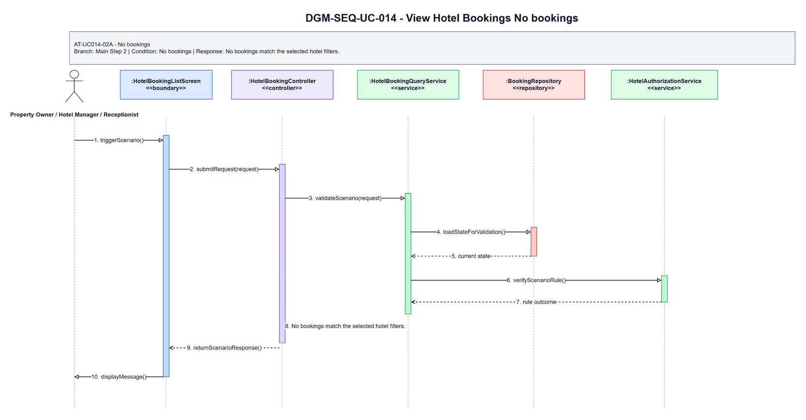

**Figure 3.14-3: Sequence Diagram of UC-014 View Hotel Bookings - AT-UC014-02A No bookings**

### AT-UC014-04A - Unauthorized booking access

- **Branch from Main Step:** 4
- **Condition:** Unauthorized booking access
- **Expected Response:** You can access only hotels that you own or are assigned to.

**Figure 3.14-4: Sequence Diagram of UC-014 View Hotel Bookings - AT-UC014-04A Unauthorized booking access**

### Validation, Authorization, Transaction, and Error Handling Notes

| Area | Design |
|---|---|
| Validation | Validate required input, current entity status, date/amount/reference values, and SRS business rules before any state change. |
| Authorization | Allow only the SRS actor scope for Property Owner / Hotel Manager / Receptionist; enforce role, ownership, hotel-scope, or platform-scope preconditions before protected data is displayed or changed. |
| Transaction | Use a single application transaction for validated state changes, persistence updates, audit records, and notification records where applicable. Read-only flows do not create domain records. |
| Error Handling | AT-UC014-02A returns "No bookings match the selected hotel filters."; AT-UC014-04A returns "You can access only hotels that you own or are assigned to.". |
| Privacy | Return only fields allowed for the current role and scope; staff roles must not receive unrelated customer, platform finance, or cross-hotel data. |

## Assumptions and Open Issues

- ASSUMP-UC014-001: Controller, service, repository, DTO, and entity class names are conceptual SDD design names because no source implementation was inspected.
- ASSUMP-UC014-002: Final API routes, database column names, and UI widget names may differ from these SDD class names but must preserve the traced SRS behavior.
- OQ-UC014-001: Confirm final implementation class/package names before treating the conceptual design as code-level documentation.

# 3.15 UC-015 - Check In Customer

## 3.15.1 Design Purpose

This section describes the detailed design for **UC-015 Check In Customer**. The use case covers verify confirmed booking, assign physical room if needed, and mark check-in. The design is based on the SRS/SDD only; class names and methods are conceptual design assumptions because no implementation codebase was inspected.

**Related SRS items:** FEAT-FRONTDESK, UC-015, SCR-021, SCR-024, SCR-025, ENT-013, ENT-015, ENT-028, BR-STAY-001, BR-ROOM-001, BR-STAFF-002, BR-STAFF-003, BR-STAY-005, BR-AUDIT-001, MSG-STAY-001, MSG-STAY-003, MSG-STAY-004, MSG-AUTH-007, TR-015, AT-UC015-05A, AT-UC015-05B, AT-UC015-02A, AT-UC015-05C.

**Precondition:** Actor authenticated; booking exists and hotel scope can be validated before check-in details are displayed.

**Trigger:** Actor selects Check In.

**Post-condition:** POS-01: Booking status becomes Checked In; identity document information is recorded if required; physical room becomes Occupied.

The flow must:

- Main step 1: Actor opens booking detail for check-in.
- Main step 2: System validates actor hotel scope before displaying check-in data.
- Main step 3: System displays booking, guest information, stay dates, room type, booked quantity, and assigned or available physical rooms.
- Main step 4: Actor verifies guest arrival, enters required identity information, and selects or validates one physical room per booked quantity.
- Main step 5: System validates booking status, date eligibility, identity fields, room count, and room availability.
- Main step 6: System assigns any missing physical rooms if valid and records assignment history.
- Main step 7: System updates booking to Checked In and assigned rooms to Occupied atomically.
- Main step 8: System records audit and sends or records notification.
- Main step 9: System displays check-in success.
- Enforce related business rules: BR-STAY-001, BR-ROOM-001, BR-STAFF-002, BR-STAFF-003, BR-STAY-005, BR-AUDIT-001.
- Return a separate scenario response for each alternative/error flow: AT-UC015-05A, AT-UC015-05B, AT-UC015-02A, AT-UC015-05C.

## 3.15.2 Class Diagram

This part presents the class diagram for UC-015 Check In Customer.

**Figure 3.15-1: Class Diagram of UC-015 Check In Customer**

## 3.15.3 Class Specifications

This part explains the key methods shown in the class diagram. The classes are conceptual design assumptions unless source code is inspected.

### CheckInScreen Class

**Description:** Boundary object for the user-visible entry point of UC-015 Check In Customer.

| No | Method | Description |
|---:|---|---|
| 1 | `openOrDisplay()` | Displays the use-case screen or user-visible entry state described by the SRS. |
| 2 | `collectInput()` | Collects actor input before request submission. |
| 3 | `renderResult(response)` | Displays the result, validation message, or next action to the actor. |

### CheckInController Class

**Description:** API/application entry controller for UC-015 Check In Customer.

| No | Method | Description |
|---:|---|---|
| 1 | `handleRequest(request)` | Receives the request from the boundary and delegates the business operation to the service. |
| 2 | `validateRequest(request)` | Checks required request shape before business rule execution. |
| 3 | `authorizeActor(actorContext)` | Verifies that the current actor may execute this use case within role or hotel scope. |

### CheckInCustomerRequest Class

**Description:** Request DTO carrying input for UC-015 Check In Customer.

| No | Method | Description |
|---:|---|---|
| 1 | `hasRequiredFields()` | Returns whether mandatory fields from the SRS screen/use-case step are present. |
| 2 | `normalizeInput()` | Normalizes filter, status, note, amount, date, or reference input before service validation. |
| 3 | `containsActorContext()` | Confirms the request carries the authenticated actor or guest context needed for authorization. |

### CheckInService Class

**Description:** Application service that coordinates the main flow, business rules, persistence, and response creation for Check In Customer.

| No | Method | Description |
|---:|---|---|
| 1 | `checkincustomer(request)` | Executes the UC-015 main flow and returns a response for the boundary. |
| 2 | `applyBusinessRules(request)` | Applies the related SRS business rules and state-transition constraints. |
| 3 | `buildResponse(result)` | Builds success, empty-state, or validation responses without exposing unauthorized data. |

### BookingRepository Class

**Description:** Repository abstraction for loading and saving data required by Check In Customer.

| No | Method | Description |
|---:|---|---|
| 1 | `findForUseCase(criteria)` | Loads the entity state required for validation and display. |
| 2 | `findById(id)` | Retrieves a specific record within actor, hotel, or platform scope. |
| 3 | `saveChanges(entity)` | Persists allowed state changes when the use case modifies data. |

### RoomAssignmentService Class

**Description:** Supporting service or integration used by UC-015 Check In Customer.

| No | Method | Description |
|---:|---|---|
| 1 | `verifyRuleContext(entity)` | Checks specialized policy, authorization, calculation, notification, or external status context. |
| 2 | `performSupportingAction(entity)` | Performs notification, calculation, audit, or external reconciliation support when required. |
| 3 | `returnResult()` | Returns the supporting result to the application service for final response composition. |

### CheckInCustomerResponse Class

**Description:** Response DTO returned by UC-015 Check In Customer.

| No | Method | Description |
|---:|---|---|
| 1 | `includeSummary()` | Adds the display or operation summary needed by the screen. |
| 2 | `includeUserMessage()` | Adds the user-facing success, empty-state, or validation message. |
| 3 | `includeNextAction()` | Adds the next available action when the SRS flow continues or returns for correction. |

### Booking Class

**Description:** Primary domain entity affected or displayed by UC-015 Check In Customer.

| No | Method | Description |
|---:|---|---|
| 1 | `isInAllowedState()` | Determines whether the entity state allows the requested use-case operation. |
| 2 | `applyUseCaseChange()` | Applies the state or data change permitted by the validated flow. |
| 3 | `getDisplaySummary()` | Provides safe summary data for the response or audit record. |

### BookingRoomAssignment Class

**Description:** Supporting domain entity affected or displayed by UC-015 Check In Customer.

| No | Method | Description |
|---:|---|---|
| 1 | `isLinkedToUseCase()` | Determines whether the entity is related to the current use-case operation. |
| 2 | `updateStatus()` | Updates status or lifecycle information when the validated flow requires it. |
| 3 | `getAuditSummary()` | Provides auditable summary data for protected state changes. |

## 3.15.4 Sequence Diagram

This part presents the sequence diagrams for UC-015 Check In Customer. The main-flow diagram shows only the successful scenario. Each alternative/error scenario has its own diagram.

**Figure 3.15-2: Sequence Diagram of UC-015 Check In Customer - Main Flow**

### AT-UC015-05A - Not confirmed

- **Branch from Main Step:** 5
- **Condition:** Not Confirmed
- **Expected Response:** Only confirmed bookings can be checked in.

**Figure 3.15-3: Sequence Diagram of UC-015 Check In Customer - AT-UC015-05A Not confirmed**

### AT-UC015-05B - No available room

- **Branch from Main Step:** 5
- **Condition:** No available room
- **Expected Response:** Selected physical room is not available for assignment.

**Figure 3.15-4: Sequence Diagram of UC-015 Check In Customer - AT-UC015-05B No available room**

### AT-UC015-02A - Receptionist not assigned

- **Branch from Main Step:** 2
- **Condition:** Receptionist not assigned
- **Expected Response:** You are not authorized to perform this action.

**Figure 3.15-5: Sequence Diagram of UC-015 Check In Customer - AT-UC015-02A Receptionist not assigned**

### AT-UC015-05C - Missing or invalid identity information

- **Branch from Main Step:** 5
- **Condition:** Missing or invalid identity information
- **Expected Response:** Please enter valid identity information before check-in.

**Figure 3.15-6: Sequence Diagram of UC-015 Check In Customer - AT-UC015-05C Missing or invalid identity information**

### Validation, Authorization, Transaction, and Error Handling Notes

| Area | Design |
|---|---|
| Validation | Validate required input, current entity status, date/amount/reference values, and SRS business rules before any state change. |
| Authorization | Allow only the SRS actor scope for Receptionist / Hotel Manager / Property Owner; enforce role, ownership, hotel-scope, or platform-scope preconditions before protected data is displayed or changed. |
| Transaction | Use a single application transaction for validated state changes, persistence updates, audit records, and notification records where applicable. Read-only flows do not create domain records. |
| Error Handling | AT-UC015-05A returns "Only confirmed bookings can be checked in."; AT-UC015-05B returns "Selected physical room is not available for assignment."; AT-UC015-02A returns "You are not authorized to perform this action."; AT-UC015-05C returns "Please enter valid identity information before check-in.". |
| Privacy | Return only fields allowed for the current role and scope; staff roles must not receive unrelated customer, platform finance, or cross-hotel data. |

## Assumptions and Open Issues

- ASSUMP-UC015-001: Controller, service, repository, DTO, and entity class names are conceptual SDD design names because no source implementation was inspected.
- ASSUMP-UC015-002: Final API routes, database column names, and UI widget names may differ from these SDD class names but must preserve the traced SRS behavior.
- OQ-UC015-001: Confirm final implementation class/package names before treating the conceptual design as code-level documentation.

# 3.16 UC-016 - Check Out Customer

## 3.16.1 Design Purpose

This section describes the detailed design for **UC-016 Check Out Customer**. The use case covers finalize stay, confirm pay-at-property collection if needed, generate basic invoice/folio, and release room to housekeeping. The design is based on the SRS/SDD only; class names and methods are conceptual design assumptions because no implementation codebase was inspected.

**Related SRS items:** FEAT-FRONTDESK, UC-016, SCR-021, SCR-026, NSF-008, ENT-019, ENT-025, ENT-027, ENT-028, BR-STAY-002, BR-STAY-003, BR-STAY-006, BR-HK-001, BR-FIN-002, BR-FIN-003, BR-AUDIT-001, BR-FIN-006, MSG-STAY-002, MSG-STAY-005, MSG-STAY-009, MSG-ROOM-008, TR-016, AT-UC016-05A, AT-UC016-05B, AT-UC016-06A.

**Precondition:** Actor authenticated; checked-in booking exists for a hotel the actor owns or is assigned to.

**Trigger:** Actor selects Check Out.

**Post-condition:** POS-01: Booking status becomes Checked Out; customer receipt is available; room becomes Dirty/cleaning-required; housekeeping task is created.

The flow must:

- Main step 1: Actor opens checked-in booking detail.
- Main step 2: System validates actor hotel scope and booking access before displaying checkout data.
- Main step 3: System displays stay summary, payment mode/status, room charge, hotel-visible balance, and receipt preview without platform commission details.
- Main step 4: Actor reviews checkout information and confirms checkout.
- Main step 5: System validates booking status, payment collection requirement, outstanding balance, and room lifecycle readiness.
- Main step 6: System atomically finalizes staff-visible folio/receipt, updates booking to Checked Out, changes assigned rooms to Dirty, and creates housekeeping tasks.
- Main step 7: System records audit and sends or records notification.
- Main step 8: System displays checkout success.
- Enforce related business rules: BR-STAY-002, BR-STAY-003, BR-STAY-006, BR-HK-001, BR-FIN-002, BR-FIN-003, BR-AUDIT-001, BR-FIN-006.
- Return a separate scenario response for each alternative/error flow: AT-UC016-05A, AT-UC016-05B, AT-UC016-06A.

## 3.16.2 Class Diagram

This part presents the class diagram for UC-016 Check Out Customer.

**Figure 3.16-1: Class Diagram of UC-016 Check Out Customer**

## 3.16.3 Class Specifications

This part explains the key methods shown in the class diagram. The classes are conceptual design assumptions unless source code is inspected.

### CheckOutScreen Class

**Description:** Boundary object for the user-visible entry point of UC-016 Check Out Customer.

| No | Method | Description |
|---:|---|---|
| 1 | `openOrDisplay()` | Displays the use-case screen or user-visible entry state described by the SRS. |
| 2 | `collectInput()` | Collects actor input before request submission. |
| 3 | `renderResult(response)` | Displays the result, validation message, or next action to the actor. |

### CheckOutController Class

**Description:** API/application entry controller for UC-016 Check Out Customer.

| No | Method | Description |
|---:|---|---|
| 1 | `handleRequest(request)` | Receives the request from the boundary and delegates the business operation to the service. |
| 2 | `validateRequest(request)` | Checks required request shape before business rule execution. |
| 3 | `authorizeActor(actorContext)` | Verifies that the current actor may execute this use case within role or hotel scope. |

### CheckOutCustomerRequest Class

**Description:** Request DTO carrying input for UC-016 Check Out Customer.

| No | Method | Description |
|---:|---|---|
| 1 | `hasRequiredFields()` | Returns whether mandatory fields from the SRS screen/use-case step are present. |
| 2 | `normalizeInput()` | Normalizes filter, status, note, amount, date, or reference input before service validation. |
| 3 | `containsActorContext()` | Confirms the request carries the authenticated actor or guest context needed for authorization. |

### CheckOutService Class

**Description:** Application service that coordinates the main flow, business rules, persistence, and response creation for Check Out Customer.

| No | Method | Description |
|---:|---|---|
| 1 | `checkoutcustomer(request)` | Executes the UC-016 main flow and returns a response for the boundary. |
| 2 | `applyBusinessRules(request)` | Applies the related SRS business rules and state-transition constraints. |
| 3 | `buildResponse(result)` | Builds success, empty-state, or validation responses without exposing unauthorized data. |

### BookingRepository Class

**Description:** Repository abstraction for loading and saving data required by Check Out Customer.

| No | Method | Description |
|---:|---|---|
| 1 | `findForUseCase(criteria)` | Loads the entity state required for validation and display. |
| 2 | `findById(id)` | Retrieves a specific record within actor, hotel, or platform scope. |
| 3 | `saveChanges(entity)` | Persists allowed state changes when the use case modifies data. |

### HousekeepingTaskService Class

**Description:** Supporting service or integration used by UC-016 Check Out Customer.

| No | Method | Description |
|---:|---|---|
| 1 | `verifyRuleContext(entity)` | Checks specialized policy, authorization, calculation, notification, or external status context. |
| 2 | `performSupportingAction(entity)` | Performs notification, calculation, audit, or external reconciliation support when required. |
| 3 | `returnResult()` | Returns the supporting result to the application service for final response composition. |

### CheckOutCustomerResponse Class

**Description:** Response DTO returned by UC-016 Check Out Customer.

| No | Method | Description |
|---:|---|---|
| 1 | `includeSummary()` | Adds the display or operation summary needed by the screen. |
| 2 | `includeUserMessage()` | Adds the user-facing success, empty-state, or validation message. |
| 3 | `includeNextAction()` | Adds the next available action when the SRS flow continues or returns for correction. |

### Booking Class

**Description:** Primary domain entity affected or displayed by UC-016 Check Out Customer.

| No | Method | Description |
|---:|---|---|
| 1 | `isInAllowedState()` | Determines whether the entity state allows the requested use-case operation. |
| 2 | `applyUseCaseChange()` | Applies the state or data change permitted by the validated flow. |
| 3 | `getDisplaySummary()` | Provides safe summary data for the response or audit record. |

### Invoice Class

**Description:** Supporting domain entity affected or displayed by UC-016 Check Out Customer.

| No | Method | Description |
|---:|---|---|
| 1 | `isLinkedToUseCase()` | Determines whether the entity is related to the current use-case operation. |
| 2 | `updateStatus()` | Updates status or lifecycle information when the validated flow requires it. |
| 3 | `getAuditSummary()` | Provides auditable summary data for protected state changes. |

## 3.16.4 Sequence Diagram

This part presents the sequence diagrams for UC-016 Check Out Customer. The main-flow diagram shows only the successful scenario. Each alternative/error scenario has its own diagram.

**Figure 3.16-2: Sequence Diagram of UC-016 Check Out Customer - Main Flow**

### AT-UC016-05A - Booking not checked in

- **Branch from Main Step:** 5
- **Condition:** Booking not Checked In
- **Expected Response:** Only checked-in bookings can be checked out.

**Figure 3.16-3: Sequence Diagram of UC-016 Check Out Customer - AT-UC016-05A Booking not checked in**

### AT-UC016-05B - Pay at property balance not recorded

- **Branch from Main Step:** 5
- **Condition:** Pay-at-property balance not recorded
- **Expected Response:** Please confirm payment collection before checkout.

**Figure 3.16-4: Sequence Diagram of UC-016 Check Out Customer - AT-UC016-05B Pay at property balance not recorded**

### AT-UC016-06A - Room release failed

- **Branch from Main Step:** 6
- **Condition:** Room release failed
- **Expected Response:** The selected room status transition is not allowed.

**Figure 3.16-5: Sequence Diagram of UC-016 Check Out Customer - AT-UC016-06A Room release failed**

### Validation, Authorization, Transaction, and Error Handling Notes

| Area | Design |
|---|---|
| Validation | Validate required input, current entity status, date/amount/reference values, and SRS business rules before any state change. |
| Authorization | Allow only the SRS actor scope for Receptionist / Hotel Manager / Property Owner; enforce role, ownership, hotel-scope, or platform-scope preconditions before protected data is displayed or changed. |
| Transaction | Use a single application transaction for validated state changes, persistence updates, audit records, and notification records where applicable. Read-only flows do not create domain records. |
| Error Handling | AT-UC016-05A returns "Only checked-in bookings can be checked out."; AT-UC016-05B returns "Please confirm payment collection before checkout."; AT-UC016-06A returns "The selected room status transition is not allowed.". |
| Privacy | Return only fields allowed for the current role and scope; staff roles must not receive unrelated customer, platform finance, or cross-hotel data. |

## Assumptions and Open Issues

- ASSUMP-UC016-001: Controller, service, repository, DTO, and entity class names are conceptual SDD design names because no source implementation was inspected.
- ASSUMP-UC016-002: Final API routes, database column names, and UI widget names may differ from these SDD class names but must preserve the traced SRS behavior.
- OQ-UC016-001: Confirm final implementation class/package names before treating the conceptual design as code-level documentation.

# 3.17 UC-017 - Mark No-show

## 3.17.1 Design Purpose

This section describes the detailed design for **UC-017 Mark No-show**. The use case covers mark confirmed booking as no-show when customer does not arrive within allowed operational window. The design is based on the SRS/SDD only; class names and methods are conceptual design assumptions because no implementation codebase was inspected.

**Related SRS items:** FEAT-FRONTDESK, UC-017, SCR-021, SCR-023, ENT-013, ENT-028, BR-STAY-004, BR-BOOK-009, BR-FIN-004, BR-STAY-007, BR-STAFF-002, BR-STAFF-003, MSG-STAY-006, MSG-STAY-007, MSG-STAY-008, MSG-AUTH-007, TR-017, AT-UC017-05A, AT-UC017-05B, AT-UC017-05C, AT-UC017-02A.

**Precondition:** Actor authenticated; booking exists for a hotel the actor owns or is assigned to.

**Trigger:** Actor selects Mark No-show.

**Post-condition:** POS-01: Booking status becomes No-show and financial traceability is preserved.

The flow must:

- Main step 1: Actor opens booking detail or no-show candidate action.
- Main step 2: System validates actor role, hotel scope, and booking access before showing no-show details.
- Main step 3: System displays no-show eligibility, policy summary, and reason field.
- Main step 4: Actor selects Mark No-show and enters reason.
- Main step 5: System validates booking status, no-show eligibility, and required reason.
- Main step 6: System updates booking to No-show.
- Main step 7: System releases reserved availability, releases any pre-assigned physical room, and keeps finance records according to policy.
- Main step 8: System records audit and sends or records notification.
- Main step 9: System displays no-show success.
- Enforce related business rules: BR-STAY-004, BR-BOOK-009, BR-FIN-004, BR-STAY-007, BR-STAFF-002, BR-STAFF-003.
- Return a separate scenario response for each alternative/error flow: AT-UC017-05A, AT-UC017-05B, AT-UC017-05C, AT-UC017-02A.

## 3.17.2 Class Diagram

This part presents the class diagram for UC-017 Mark No-show.

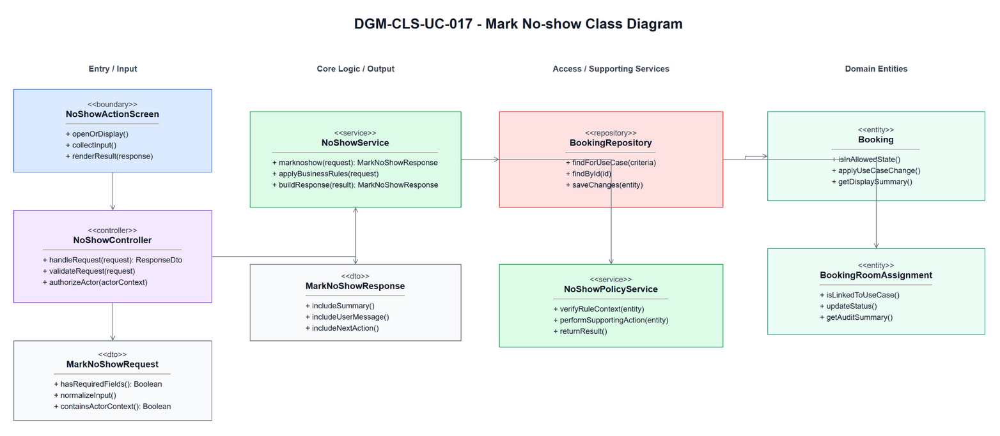

**Figure 3.17-1: Class Diagram of UC-017 Mark No-show**

## 3.17.3 Class Specifications

This part explains the key methods shown in the class diagram. The classes are conceptual design assumptions unless source code is inspected.

### NoShowActionScreen Class

**Description:** Boundary object for the user-visible entry point of UC-017 Mark No-show.

| No | Method | Description |
|---:|---|---|
| 1 | `openOrDisplay()` | Displays the use-case screen or user-visible entry state described by the SRS. |
| 2 | `collectInput()` | Collects actor input before request submission. |
| 3 | `renderResult(response)` | Displays the result, validation message, or next action to the actor. |

### NoShowController Class

**Description:** API/application entry controller for UC-017 Mark No-show.

| No | Method | Description |
|---:|---|---|
| 1 | `handleRequest(request)` | Receives the request from the boundary and delegates the business operation to the service. |
| 2 | `validateRequest(request)` | Checks required request shape before business rule execution. |
| 3 | `authorizeActor(actorContext)` | Verifies that the current actor may execute this use case within role or hotel scope. |

### MarkNoShowRequest Class

**Description:** Request DTO carrying input for UC-017 Mark No-show.

| No | Method | Description |
|---:|---|---|
| 1 | `hasRequiredFields()` | Returns whether mandatory fields from the SRS screen/use-case step are present. |
| 2 | `normalizeInput()` | Normalizes filter, status, note, amount, date, or reference input before service validation. |
| 3 | `containsActorContext()` | Confirms the request carries the authenticated actor or guest context needed for authorization. |

### NoShowService Class

**Description:** Application service that coordinates the main flow, business rules, persistence, and response creation for Mark No-show.

| No | Method | Description |
|---:|---|---|
| 1 | `marknoshow(request)` | Executes the UC-017 main flow and returns a response for the boundary. |
| 2 | `applyBusinessRules(request)` | Applies the related SRS business rules and state-transition constraints. |
| 3 | `buildResponse(result)` | Builds success, empty-state, or validation responses without exposing unauthorized data. |

### BookingRepository Class

**Description:** Repository abstraction for loading and saving data required by Mark No-show.

| No | Method | Description |
|---:|---|---|
| 1 | `findForUseCase(criteria)` | Loads the entity state required for validation and display. |
| 2 | `findById(id)` | Retrieves a specific record within actor, hotel, or platform scope. |
| 3 | `saveChanges(entity)` | Persists allowed state changes when the use case modifies data. |

### NoShowPolicyService Class

**Description:** Supporting service or integration used by UC-017 Mark No-show.

| No | Method | Description |
|---:|---|---|
| 1 | `verifyRuleContext(entity)` | Checks specialized policy, authorization, calculation, notification, or external status context. |
| 2 | `performSupportingAction(entity)` | Performs notification, calculation, audit, or external reconciliation support when required. |
| 3 | `returnResult()` | Returns the supporting result to the application service for final response composition. |

### MarkNoShowResponse Class

**Description:** Response DTO returned by UC-017 Mark No-show.

| No | Method | Description |
|---:|---|---|
| 1 | `includeSummary()` | Adds the display or operation summary needed by the screen. |
| 2 | `includeUserMessage()` | Adds the user-facing success, empty-state, or validation message. |
| 3 | `includeNextAction()` | Adds the next available action when the SRS flow continues or returns for correction. |

### Booking Class

**Description:** Primary domain entity affected or displayed by UC-017 Mark No-show.

| No | Method | Description |
|---:|---|---|
| 1 | `isInAllowedState()` | Determines whether the entity state allows the requested use-case operation. |
| 2 | `applyUseCaseChange()` | Applies the state or data change permitted by the validated flow. |
| 3 | `getDisplaySummary()` | Provides safe summary data for the response or audit record. |

### BookingRoomAssignment Class

**Description:** Supporting domain entity affected or displayed by UC-017 Mark No-show.

| No | Method | Description |
|---:|---|---|
| 1 | `isLinkedToUseCase()` | Determines whether the entity is related to the current use-case operation. |
| 2 | `updateStatus()` | Updates status or lifecycle information when the validated flow requires it. |
| 3 | `getAuditSummary()` | Provides auditable summary data for protected state changes. |

## 3.17.4 Sequence Diagram

This part presents the sequence diagrams for UC-017 Mark No-show. The main-flow diagram shows only the successful scenario. Each alternative/error scenario has its own diagram.

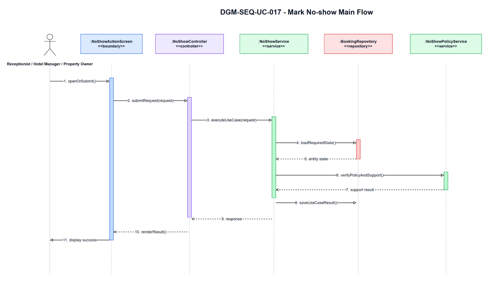

**Figure 3.17-2: Sequence Diagram of UC-017 Mark No-show - Main Flow**

### AT-UC017-05A - Too early

- **Branch from Main Step:** 5
- **Condition:** Too early
- **Expected Response:** This booking is not eligible to be marked as no-show yet.

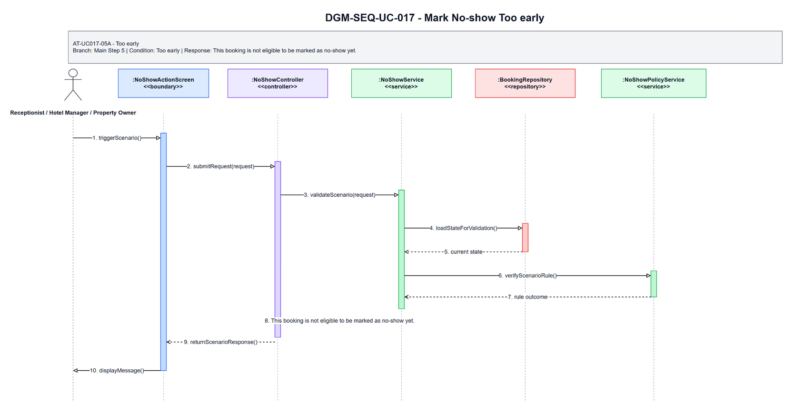

**Figure 3.17-3: Sequence Diagram of UC-017 Mark No-show - AT-UC017-05A Too early**

### AT-UC017-05B - Invalid booking status

- **Branch from Main Step:** 5
- **Condition:** Invalid booking status
- **Expected Response:** This action is not allowed for the current booking status.

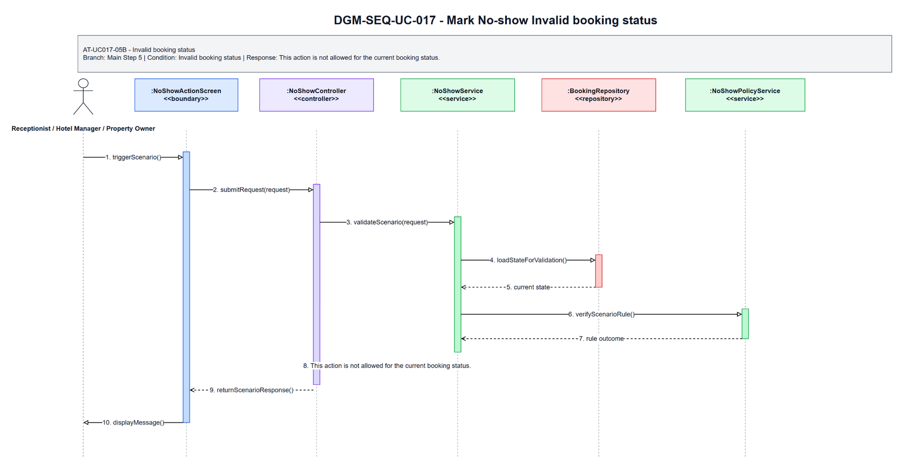

**Figure 3.17-4: Sequence Diagram of UC-017 Mark No-show - AT-UC017-05B Invalid booking status**

### AT-UC017-05C - Missing no-show reason

- **Branch from Main Step:** 5
- **Condition:** Missing no-show reason
- **Expected Response:** Please enter a no-show reason before marking this booking.

**Figure 3.17-5: Sequence Diagram of UC-017 Mark No-show - AT-UC017-05C Missing no-show reason**

### AT-UC017-02A - Unauthorized hotel or booking

- **Branch from Main Step:** 2
- **Condition:** Unauthorized hotel or booking
- **Expected Response:** You are not authorized to perform this action.

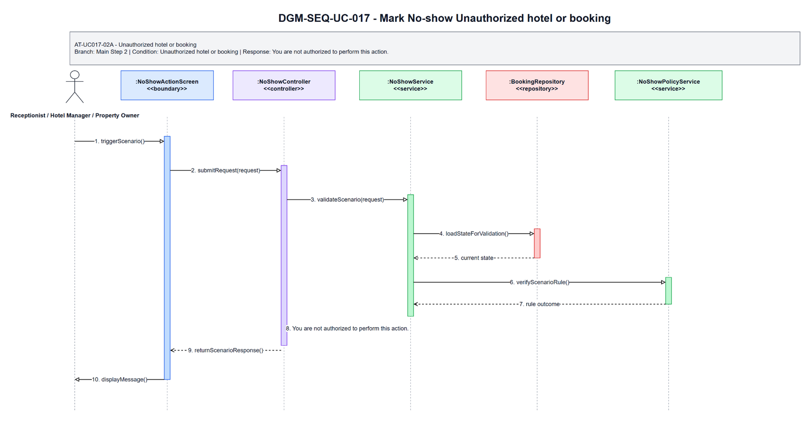

**Figure 3.17-6: Sequence Diagram of UC-017 Mark No-show - AT-UC017-02A Unauthorized hotel or booking**

### Validation, Authorization, Transaction, and Error Handling Notes

| Area | Design |
|---|---|
| Validation | Validate required input, current entity status, date/amount/reference values, and SRS business rules before any state change. |
| Authorization | Allow only the SRS actor scope for Receptionist / Hotel Manager / Property Owner; enforce role, ownership, hotel-scope, or platform-scope preconditions before protected data is displayed or changed. |
| Transaction | Use a single application transaction for validated state changes, persistence updates, audit records, and notification records where applicable. Read-only flows do not create domain records. |
| Error Handling | AT-UC017-05A returns "This booking is not eligible to be marked as no-show yet."; AT-UC017-05B returns "This action is not allowed for the current booking status."; AT-UC017-05C returns "Please enter a no-show reason before marking this booking."; AT-UC017-02A returns "You are not authorized to perform this action.". |
| Privacy | Return only fields allowed for the current role and scope; staff roles must not receive unrelated customer, platform finance, or cross-hotel data. |

## Assumptions and Open Issues

- ASSUMP-UC017-001: Controller, service, repository, DTO, and entity class names are conceptual SDD design names because no source implementation was inspected.
- ASSUMP-UC017-002: Final API routes, database column names, and UI widget names may differ from these SDD class names but must preserve the traced SRS behavior.
- OQ-UC017-001: Confirm final implementation class/package names before treating the conceptual design as code-level documentation.

# 3.18 UC-018 - Approve Hotel Property

## 3.18.1 Design Purpose

This section describes the detailed design for **UC-018 Approve Hotel Property**. The use case covers Approve or reject submitted hotel properties. The design is based on the SRS/SDD only; class names and methods are conceptual design assumptions because no implementation codebase was inspected.

**Related SRS items:** FEAT-ADMIN-APPROVAL, UC-018, SCR-037, ENT-005, ENT-024, BR-MKT-001, BR-ADMIN-001, BR-AUDIT-001, MSG-ADMIN-001, MSG-ADMIN-003, MSG-ADMIN-004, TR-018, AT-UC018-06A, AT-UC018-06B.

**Precondition:** Platform Administrator authenticated; hotel submission exists.

**Trigger:** Admin opens Hotel Approval.

**Post-condition:** POS-01: Hotel approval status is updated and marketplace visibility follows the new approval state.

The flow must:

- Main step 1: Platform Administrator admin opens Hotel Approval Screen.
- Main step 2: System displays pending hotel submissions.
- Main step 3: Platform Administrator admin selects a hotel.
- Main step 4: System displays submitted hotel data, images, amenities, policies, owner info, and review notes.
- Main step 5: Platform Administrator admin approves/rejects and enters reason if required.
- Main step 6: System validates decision.
- Main step 7: System updates status and records audit.
- Continue through the remaining SRS main-flow steps until the UC-018 post-condition is reached.
- Enforce related business rules: BR-MKT-001, BR-ADMIN-001, BR-AUDIT-001.
- Return a separate scenario response for each alternative/error flow: AT-UC018-06A, AT-UC018-06B.

## 3.18.2 Class Diagram

This part presents the class diagram for UC-018 Approve Hotel Property.

**Figure 3.18-1: Class Diagram of UC-018 Approve Hotel Property**

## 3.18.3 Class Specifications

This part explains the key methods shown in the class diagram. The classes are conceptual design assumptions unless source code is inspected.

### HotelApprovalScreen Class

**Description:** Boundary object for the user-visible or scheduled entry point of UC-018 Approve Hotel Property.

| No | Method | Description |
|---:|---|---|
| 1 | `openOrDisplay()` | Displays the use-case screen or activates the scheduled entry point described by the SRS. |
| 2 | `collectInput()` | Collects actor input or scheduler criteria before request submission. |
| 3 | `renderResult(response)` | Displays the result, validation message, or next action to the actor. |

### ApproveHotelPropertyController Class

**Description:** API/application entry controller for UC-018 Approve Hotel Property.

| No | Method | Description |
|---:|---|---|
| 1 | `handleRequest(request)` | Receives the request from the boundary and delegates the business operation to the service. |
| 2 | `validateRequest(request)` | Checks required request shape before business rule execution. |
| 3 | `authorizeActor(actorContext)` | Verifies that the current actor may execute this use case and related hotel/platform scope. |

### ApproveHotelPropertyRequest Class

**Description:** Request DTO carrying input for UC-018 Approve Hotel Property.

| No | Method | Description |
|---:|---|---|
| 1 | `hasRequiredFields()` | Returns whether mandatory fields from the SRS screen/use-case step are present. |
| 2 | `normalizeInput()` | Normalizes filter, status, note, amount, date, or reference input before service validation. |
| 3 | `containsActorContext()` | Confirms the request carries the authenticated actor or scheduler context needed for authorization. |

### ApproveHotelPropertyService Class

**Description:** Application service that coordinates the main flow, business rules, persistence, and response creation for Approve Hotel Property.

| No | Method | Description |
|---:|---|---|
| 1 | `approveHotelProperty(request)` | Executes the UC-018 main flow and returns a response for the boundary. |
| 2 | `applyBusinessRules(request)` | Applies the related SRS business rules and state-transition constraints. |
| 3 | `buildResponse(result)` | Builds success, empty-state, or validation responses without exposing unauthorized data. |

### HotelPropertyRepository Class

**Description:** Repository abstraction for loading and saving data required by Approve Hotel Property.

| No | Method | Description |
|---:|---|---|
| 1 | `findForUseCase(criteria)` | Loads the entity state required for validation and display. |
| 2 | `findById(id)` | Retrieves a specific record within actor, hotel, or platform scope. |
| 3 | `saveChanges(entity)` | Persists allowed state changes when the use case modifies data. |

### NotificationService Class

**Description:** Supporting service or integration used by UC-018 Approve Hotel Property.

| No | Method | Description |
|---:|---|---|
| 1 | `verifyRuleContext(entity)` | Checks specialized policy, authorization, calculation, notification, or external status context. |
| 2 | `performSupportingAction(entity)` | Performs notification, calculation, audit, or external reconciliation support when required. |
| 3 | `returnResult()` | Returns the supporting result to the application service for final response composition. |

### ApproveHotelPropertyResponse Class

**Description:** Response DTO returned by UC-018 Approve Hotel Property.

| No | Method | Description |
|---:|---|---|
| 1 | `includeSummary()` | Adds the display or operation summary needed by the screen. |
| 2 | `includeUserMessage()` | Adds the user-facing success, empty-state, or validation message. |
| 3 | `includeNextAction()` | Adds the next available action when the SRS flow continues or returns for correction. |

### HotelProperty Class

**Description:** Hotel listed and managed on the platform.

| No | Method | Description |
|---:|---|---|
| 1 | `isInAllowedState()` | Determines whether the entity state allows the requested use-case operation. |
| 2 | `applyUseCaseChange()` | Applies the state or data change permitted by the validated flow. |
| 3 | `getDisplaySummary()` | Provides safe summary data for the response or audit record. |

### AuditRecord Class

**Description:** Administrative, financial, staff, booking, room, housekeeping, and maintenance action audit record.

| No | Method | Description |
|---:|---|---|
| 1 | `isInAllowedState()` | Determines whether the entity state allows the requested use-case operation. |
| 2 | `applyUseCaseChange()` | Applies the state or data change permitted by the validated flow. |
| 3 | `getDisplaySummary()` | Provides safe summary data for the response or audit record. |

## 3.18.4 Sequence Diagram

This part presents the sequence diagrams for UC-018 Approve Hotel Property. The main-flow diagram shows only the successful scenario. Each alternative/error scenario has its own diagram.

**Figure 3.18-2: Sequence Diagram of UC-018 Approve Hotel Property - Main Flow**

### AT-UC018-06A - Missing rejection reason

- **Branch from Main Step:** 6
- **Condition:** Missing rejection reason
- **Expected Response:** Please enter a rejection reason.

**Figure 3.18-3: Sequence Diagram of UC-018 Approve Hotel Property - AT-UC018-06A Missing rejection reason**

### AT-UC018-06B - Already reviewed

- **Branch from Main Step:** 6
- **Condition:** Already reviewed
- **Expected Response:** This hotel submission has already been reviewed. Please refresh the page.

**Figure 3.18-4: Sequence Diagram of UC-018 Approve Hotel Property - AT-UC018-06B Already reviewed**

### Validation, Authorization, Transaction, and Error Handling Notes

| Area | Design |
|---|---|
| Validation | Validate required input, current entity status, date/amount/reference values, and SRS business rules before any state change. |
| Authorization | Allow only Platform Administrator according to the SRS actor, role, hotel-scope, or platform-scope precondition. |
| Transaction | Use a single application transaction for validated state changes, persistence updates, audit records, and notification records where applicable. |
| Error Handling | AT-UC018-06A returns "Please enter a rejection reason."; AT-UC018-06B returns "This hotel submission has already been reviewed. Please refresh the page.". |
| Privacy | Return only fields allowed for the current role and scope; staff roles must not receive unrelated customer, platform finance, or cross-hotel data. |

## Assumptions and Open Issues

- ASSUMP-UC018-001: Controller, service, repository, DTO, and entity class names are conceptual SDD design names because no source implementation was inspected.
- ASSUMP-UC018-002: Final API routes, database column names, and UI widget names may differ from these SDD class names but must preserve the traced SRS behavior.
- OQ-UC018-001: Confirm final implementation class/package names before treating the conceptual design as code-level documentation.

# 3.19 UC-019 - Manage Commission Rate

## 3.19.1 Design Purpose

This section describes the detailed design for **UC-019 Manage Commission Rate**. The use case covers Set commission rate per approved hotel. The design is based on the SRS/SDD only; class names and methods are conceptual design assumptions because no implementation codebase was inspected.

**Related SRS items:** FEAT-ADMIN-FINANCE, UC-019, SCR-038, ENT-020, BR-FIN-001, BR-ADMIN-002, BR-AUDIT-001, MSG-FIN-002, MSG-ADMIN-002, MSG-ADMIN-005, TR-019, AT-UC019-04A, AT-UC019-04B.

**Precondition:** Platform Administrator authenticated; hotel exists.

**Trigger:** Admin opens Commission Management.

**Post-condition:** POS-01: Commission rate is saved for future booking snapshots.

The flow must:

- Main step 1: Platform Administrator admin opens Commission Management.
- Main step 2: System displays hotels and current rates.
- Main step 3: Platform Administrator admin selects hotel and enters new rate/note/effective date.
- Main step 4: System validates rate range and effective date.
- Main step 5: System records rate for future bookings.
- Main step 6: System preserves existing booking snapshots.
- Main step 7: System records audit and displays success.
- Enforce related business rules: BR-FIN-001, BR-ADMIN-002, BR-AUDIT-001.
- Return a separate scenario response for each alternative/error flow: AT-UC019-04A, AT-UC019-04B.

## 3.19.2 Class Diagram

This part presents the class diagram for UC-019 Manage Commission Rate.

**Figure 3.19-1: Class Diagram of UC-019 Manage Commission Rate**

## 3.19.3 Class Specifications

This part explains the key methods shown in the class diagram. The classes are conceptual design assumptions unless source code is inspected.

### CommissionManagementScreen Class

**Description:** Boundary object for the user-visible or scheduled entry point of UC-019 Manage Commission Rate.

| No | Method | Description |
|---:|---|---|
| 1 | `openOrDisplay()` | Displays the use-case screen or activates the scheduled entry point described by the SRS. |
| 2 | `collectInput()` | Collects actor input or scheduler criteria before request submission. |
| 3 | `renderResult(response)` | Displays the result, validation message, or next action to the actor. |

### ManageCommissionRateController Class

**Description:** API/application entry controller for UC-019 Manage Commission Rate.

| No | Method | Description |
|---:|---|---|
| 1 | `handleRequest(request)` | Receives the request from the boundary and delegates the business operation to the service. |
| 2 | `validateRequest(request)` | Checks required request shape before business rule execution. |
| 3 | `authorizeActor(actorContext)` | Verifies that the current actor may execute this use case and related hotel/platform scope. |

### ManageCommissionRateRequest Class

**Description:** Request DTO carrying input for UC-019 Manage Commission Rate.

| No | Method | Description |
|---:|---|---|
| 1 | `hasRequiredFields()` | Returns whether mandatory fields from the SRS screen/use-case step are present. |
| 2 | `normalizeInput()` | Normalizes filter, status, note, amount, date, or reference input before service validation. |
| 3 | `containsActorContext()` | Confirms the request carries the authenticated actor or scheduler context needed for authorization. |

### ManageCommissionRateService Class

**Description:** Application service that coordinates the main flow, business rules, persistence, and response creation for Manage Commission Rate.

| No | Method | Description |
|---:|---|---|
| 1 | `manageCommissionRate(request)` | Executes the UC-019 main flow and returns a response for the boundary. |
| 2 | `applyBusinessRules(request)` | Applies the related SRS business rules and state-transition constraints. |
| 3 | `buildResponse(result)` | Builds success, empty-state, or validation responses without exposing unauthorized data. |

### CommissionRecordRepository Class

**Description:** Repository abstraction for loading and saving data required by Manage Commission Rate.

| No | Method | Description |
|---:|---|---|
| 1 | `findForUseCase(criteria)` | Loads the entity state required for validation and display. |
| 2 | `findById(id)` | Retrieves a specific record within actor, hotel, or platform scope. |
| 3 | `saveChanges(entity)` | Persists allowed state changes when the use case modifies data. |

### CommissionPolicyService Class

**Description:** Supporting service or integration used by UC-019 Manage Commission Rate.

| No | Method | Description |
|---:|---|---|
| 1 | `verifyRuleContext(entity)` | Checks specialized policy, authorization, calculation, notification, or external status context. |
| 2 | `performSupportingAction(entity)` | Performs notification, calculation, audit, or external reconciliation support when required. |
| 3 | `returnResult()` | Returns the supporting result to the application service for final response composition. |

### ManageCommissionRateResponse Class

**Description:** Response DTO returned by UC-019 Manage Commission Rate.

| No | Method | Description |
|---:|---|---|
| 1 | `includeSummary()` | Adds the display or operation summary needed by the screen. |
| 2 | `includeUserMessage()` | Adds the user-facing success, empty-state, or validation message. |
| 3 | `includeNextAction()` | Adds the next available action when the SRS flow continues or returns for correction. |

### CommissionRecord Class

**Description:** Platform commission calculated for a booking.

| No | Method | Description |
|---:|---|---|
| 1 | `isInAllowedState()` | Determines whether the entity state allows the requested use-case operation. |
| 2 | `applyUseCaseChange()` | Applies the state or data change permitted by the validated flow. |
| 3 | `getDisplaySummary()` | Provides safe summary data for the response or audit record. |

## 3.19.4 Sequence Diagram

This part presents the sequence diagrams for UC-019 Manage Commission Rate. The main-flow diagram shows only the successful scenario. Each alternative/error scenario has its own diagram.

**Figure 3.19-2: Sequence Diagram of UC-019 Manage Commission Rate - Main Flow**

### AT-UC019-04A - Invalid rate

- **Branch from Main Step:** 4
- **Condition:** Invalid rate
- **Expected Response:** Please enter a valid commission rate.

**Figure 3.19-3: Sequence Diagram of UC-019 Manage Commission Rate - AT-UC019-04A Invalid rate**

### AT-UC019-04B - Hotel not approved

- **Branch from Main Step:** 4
- **Condition:** Hotel not approved
- **Expected Response:** Commission rate can be configured only for an approved hotel.

**Figure 3.19-4: Sequence Diagram of UC-019 Manage Commission Rate - AT-UC019-04B Hotel not approved**

### Validation, Authorization, Transaction, and Error Handling Notes

| Area | Design |
|---|---|
| Validation | Validate required input, current entity status, date/amount/reference values, and SRS business rules before any state change. |
| Authorization | Allow only Platform Administrator according to the SRS actor, role, hotel-scope, or platform-scope precondition. |
| Transaction | Use a single application transaction for validated state changes, persistence updates, audit records, and notification records where applicable. |
| Error Handling | AT-UC019-04A returns "Please enter a valid commission rate."; AT-UC019-04B returns "Commission rate can be configured only for an approved hotel.". |
| Privacy | Return only fields allowed for the current role and scope; staff roles must not receive unrelated customer, platform finance, or cross-hotel data. |

## Assumptions and Open Issues

- ASSUMP-UC019-001: Controller, service, repository, DTO, and entity class names are conceptual SDD design names because no source implementation was inspected.
- ASSUMP-UC019-002: Final API routes, database column names, and UI widget names may differ from these SDD class names but must preserve the traced SRS behavior.
- OQ-UC019-001: Confirm final implementation class/package names before treating the conceptual design as code-level documentation.

# 3.20 UC-020 - Reconcile Payment

## 3.20.1 Design Purpose

This section describes the detailed design for **UC-020 Reconcile Payment**. The use case covers Review payment transaction status and mark reconciliation result. The design is based on the SRS/SDD only; class names and methods are conceptual design assumptions because no implementation codebase was inspected.

**Related SRS items:** FEAT-ADMIN-FINANCE, UC-020, SCR-039, NSF-001, ENT-016, ENT-024, BR-PAY-003, BR-FIN-002, BR-ADMIN-003, BR-AUDIT-001, MSG-FIN-003, MSG-FIN-004, TR-020, AT-UC020-06A, AT-UC020-06B.

**Precondition:** Platform Administrator authenticated; payment transaction exists.

**Trigger:** Admin opens Payment Reconciliation.

**Post-condition:** POS-01: Payment transaction reconciliation status is updated and audit is recorded.

The flow must:

- Main step 1: Platform Administrator admin opens Payment Reconciliation.
- Main step 2: System displays transactions with filters.
- Main step 3: Platform Administrator admin selects transaction.
- Main step 4: System displays payment, booking, provider reference, amount, and reconciliation status.
- Main step 5: Platform Administrator admin marks Reconciled or Exception and enters note if required.
- Main step 6: System validates decision, required note, current reconciliation state, and duplicate/concurrent update guard.
- Main step 7: System records reconciliation status and audit if the transaction is still eligible for update.
- Continue through the remaining SRS main-flow steps until the UC-020 post-condition is reached.
- Enforce related business rules: BR-PAY-003, BR-FIN-002, BR-ADMIN-003, BR-AUDIT-001.
- Return a separate scenario response for each alternative/error flow: AT-UC020-06A, AT-UC020-06B.

## 3.20.2 Class Diagram

This part presents the class diagram for UC-020 Reconcile Payment.

**Figure 3.20-1: Class Diagram of UC-020 Reconcile Payment**

## 3.20.3 Class Specifications

This part explains the key methods shown in the class diagram. The classes are conceptual design assumptions unless source code is inspected.

### PaymentReconciliationScreen Class

**Description:** Boundary object for the user-visible or scheduled entry point of UC-020 Reconcile Payment.

| No | Method | Description |
|---:|---|---|
| 1 | `openOrDisplay()` | Displays the use-case screen or activates the scheduled entry point described by the SRS. |
| 2 | `collectInput()` | Collects actor input or scheduler criteria before request submission. |
| 3 | `renderResult(response)` | Displays the result, validation message, or next action to the actor. |

### ReconcilePaymentController Class

**Description:** API/application entry controller for UC-020 Reconcile Payment.

| No | Method | Description |
|---:|---|---|
| 1 | `handleRequest(request)` | Receives the request from the boundary and delegates the business operation to the service. |
| 2 | `validateRequest(request)` | Checks required request shape before business rule execution. |
| 3 | `authorizeActor(actorContext)` | Verifies that the current actor may execute this use case and related hotel/platform scope. |

### ReconcilePaymentRequest Class

**Description:** Request DTO carrying input for UC-020 Reconcile Payment.

| No | Method | Description |
|---:|---|---|
| 1 | `hasRequiredFields()` | Returns whether mandatory fields from the SRS screen/use-case step are present. |
| 2 | `normalizeInput()` | Normalizes filter, status, note, amount, date, or reference input before service validation. |
| 3 | `containsActorContext()` | Confirms the request carries the authenticated actor or scheduler context needed for authorization. |

### ReconcilePaymentService Class

**Description:** Application service that coordinates the main flow, business rules, persistence, and response creation for Reconcile Payment.

| No | Method | Description |
|---:|---|---|
| 1 | `reconcilePayment(request)` | Executes the UC-020 main flow and returns a response for the boundary. |
| 2 | `applyBusinessRules(request)` | Applies the related SRS business rules and state-transition constraints. |
| 3 | `buildResponse(result)` | Builds success, empty-state, or validation responses without exposing unauthorized data. |

### PaymentTransactionRepository Class

**Description:** Repository abstraction for loading and saving data required by Reconcile Payment.

| No | Method | Description |
|---:|---|---|
| 1 | `findForUseCase(criteria)` | Loads the entity state required for validation and display. |
| 2 | `findById(id)` | Retrieves a specific record within actor, hotel, or platform scope. |
| 3 | `saveChanges(entity)` | Persists allowed state changes when the use case modifies data. |

### PayOsReconciliationClient Class

**Description:** Supporting service or integration used by UC-020 Reconcile Payment.

| No | Method | Description |
|---:|---|---|
| 1 | `verifyRuleContext(entity)` | Checks specialized policy, authorization, calculation, notification, or external status context. |
| 2 | `performSupportingAction(entity)` | Performs notification, calculation, audit, or external reconciliation support when required. |
| 3 | `returnResult()` | Returns the supporting result to the application service for final response composition. |

### ReconcilePaymentResponse Class

**Description:** Response DTO returned by UC-020 Reconcile Payment.

| No | Method | Description |
|---:|---|---|
| 1 | `includeSummary()` | Adds the display or operation summary needed by the screen. |
| 2 | `includeUserMessage()` | Adds the user-facing success, empty-state, or validation message. |
| 3 | `includeNextAction()` | Adds the next available action when the SRS flow continues or returns for correction. |

### PaymentTransaction Class

**Description:** Online payment transaction for Platform Collect booking.

| No | Method | Description |
|---:|---|---|
| 1 | `isInAllowedState()` | Determines whether the entity state allows the requested use-case operation. |
| 2 | `applyUseCaseChange()` | Applies the state or data change permitted by the validated flow. |
| 3 | `getDisplaySummary()` | Provides safe summary data for the response or audit record. |

### AuditRecord Class

**Description:** Administrative, financial, staff, booking, room, housekeeping, and maintenance action audit record.

| No | Method | Description |
|---:|---|---|
| 1 | `isInAllowedState()` | Determines whether the entity state allows the requested use-case operation. |
| 2 | `applyUseCaseChange()` | Applies the state or data change permitted by the validated flow. |
| 3 | `getDisplaySummary()` | Provides safe summary data for the response or audit record. |

## 3.20.4 Sequence Diagram

This part presents the sequence diagrams for UC-020 Reconcile Payment. The main-flow diagram shows only the successful scenario. Each alternative/error scenario has its own diagram.

**Figure 3.20-2: Sequence Diagram of UC-020 Reconcile Payment - Main Flow**

### AT-UC020-06A - Amount/status mismatch

- **Branch from Main Step:** 6
- **Condition:** Amount/status mismatch
- **Expected Response:** Payment reconciliation status has been updated successfully.

**Figure 3.20-3: Sequence Diagram of UC-020 Reconcile Payment - AT-UC020-06A Amount/status mismatch**

### AT-UC020-06B - Duplicate reconciliation action or already reconciled transaction

- **Branch from Main Step:** 6
- **Condition:** Duplicate reconciliation action or already reconciled transaction
- **Expected Response:** Payment reconciliation status has been updated successfully.

**Figure 3.20-4: Sequence Diagram of UC-020 Reconcile Payment - AT-UC020-06B Duplicate reconciliation action or already reconciled transaction**

### Validation, Authorization, Transaction, and Error Handling Notes

| Area | Design |
|---|---|
| Validation | Validate required input, current entity status, date/amount/reference values, and SRS business rules before any state change. |
| Authorization | Allow only Platform Administrator according to the SRS actor, role, hotel-scope, or platform-scope precondition. |
| Transaction | Use a single application transaction for validated state changes, persistence updates, audit records, and notification records where applicable. |
| Error Handling | AT-UC020-06A returns "Payment reconciliation status has been updated successfully."; AT-UC020-06B returns "Payment reconciliation status has been updated successfully.". |
| Privacy | Return only fields allowed for the current role and scope; staff roles must not receive unrelated customer, platform finance, or cross-hotel data. |

## Assumptions and Open Issues

- ASSUMP-UC020-001: Controller, service, repository, DTO, and entity class names are conceptual SDD design names because no source implementation was inspected.
- ASSUMP-UC020-002: Final API routes, database column names, and UI widget names may differ from these SDD class names but must preserve the traced SRS behavior.
- OQ-UC020-001: Confirm final implementation class/package names before treating the conceptual design as code-level documentation.

# 3.21 UC-021 - Process Refund Status

## 3.21.1 Design Purpose

This section describes the detailed design for **UC-021 Process Refund Status**. The use case covers Record manual refund decision and refund status. The design is based on the SRS/SDD only; class names and methods are conceptual design assumptions because no implementation codebase was inspected.

**Related SRS items:** FEAT-ADMIN-FINANCE, UC-021, SCR-040, ENT-018, ENT-024, BR-REF-001, BR-REF-002, BR-FIN-002, BR-AUDIT-001, MSG-REF-001, MSG-REF-003, MSG-REF-004, TR-021, AT-UC021-06A, AT-UC021-06B.

**Precondition:** Platform Administrator authenticated; RefundRecord exists.

**Trigger:** Admin opens Refund Management.

**Post-condition:** POS-01: Refund status is updated and customer-visible refund status changes accordingly.

The flow must:

- Main step 1: Platform Administrator admin opens Refund Management.
- Main step 2: System displays refund request list.
- Main step 3: Platform Administrator admin selects refund.
- Main step 4: System displays booking, payment, policy, paid amount, requested amount, and current refund status.
- Main step 5: Platform Administrator admin approves/rejects/marks processed and enters amount/note if required.
- Main step 6: System validates amount and transition.
- Main step 7: System updates refund status and records audit.
- Continue through the remaining SRS main-flow steps until the UC-021 post-condition is reached.
- Enforce related business rules: BR-REF-001, BR-REF-002, BR-FIN-002, BR-AUDIT-001.
- Return a separate scenario response for each alternative/error flow: AT-UC021-06A, AT-UC021-06B.

## 3.21.2 Class Diagram

This part presents the class diagram for UC-021 Process Refund Status.

**Figure 3.21-1: Class Diagram of UC-021 Process Refund Status**

## 3.21.3 Class Specifications

This part explains the key methods shown in the class diagram. The classes are conceptual design assumptions unless source code is inspected.

### RefundManagementScreen Class

**Description:** Boundary object for the user-visible or scheduled entry point of UC-021 Process Refund Status.

| No | Method | Description |
|---:|---|---|
| 1 | `openOrDisplay()` | Displays the use-case screen or activates the scheduled entry point described by the SRS. |
| 2 | `collectInput()` | Collects actor input or scheduler criteria before request submission. |
| 3 | `renderResult(response)` | Displays the result, validation message, or next action to the actor. |

### ProcessRefundStatusController Class

**Description:** API/application entry controller for UC-021 Process Refund Status.

| No | Method | Description |
|---:|---|---|
| 1 | `handleRequest(request)` | Receives the request from the boundary and delegates the business operation to the service. |
| 2 | `validateRequest(request)` | Checks required request shape before business rule execution. |
| 3 | `authorizeActor(actorContext)` | Verifies that the current actor may execute this use case and related hotel/platform scope. |

### ProcessRefundStatusRequest Class

**Description:** Request DTO carrying input for UC-021 Process Refund Status.

| No | Method | Description |
|---:|---|---|
| 1 | `hasRequiredFields()` | Returns whether mandatory fields from the SRS screen/use-case step are present. |
| 2 | `normalizeInput()` | Normalizes filter, status, note, amount, date, or reference input before service validation. |
| 3 | `containsActorContext()` | Confirms the request carries the authenticated actor or scheduler context needed for authorization. |

### ProcessRefundStatusService Class

**Description:** Application service that coordinates the main flow, business rules, persistence, and response creation for Process Refund Status.

| No | Method | Description |
|---:|---|---|
| 1 | `processRefundStatus(request)` | Executes the UC-021 main flow and returns a response for the boundary. |
| 2 | `applyBusinessRules(request)` | Applies the related SRS business rules and state-transition constraints. |
| 3 | `buildResponse(result)` | Builds success, empty-state, or validation responses without exposing unauthorized data. |

### RefundRecordRepository Class

**Description:** Repository abstraction for loading and saving data required by Process Refund Status.

| No | Method | Description |
|---:|---|---|
| 1 | `findForUseCase(criteria)` | Loads the entity state required for validation and display. |
| 2 | `findById(id)` | Retrieves a specific record within actor, hotel, or platform scope. |
| 3 | `saveChanges(entity)` | Persists allowed state changes when the use case modifies data. |

### NotificationService Class

**Description:** Supporting service or integration used by UC-021 Process Refund Status.

| No | Method | Description |
|---:|---|---|
| 1 | `verifyRuleContext(entity)` | Checks specialized policy, authorization, calculation, notification, or external status context. |
| 2 | `performSupportingAction(entity)` | Performs notification, calculation, audit, or external reconciliation support when required. |
| 3 | `returnResult()` | Returns the supporting result to the application service for final response composition. |

### ProcessRefundStatusResponse Class

**Description:** Response DTO returned by UC-021 Process Refund Status.

| No | Method | Description |
|---:|---|---|
| 1 | `includeSummary()` | Adds the display or operation summary needed by the screen. |
| 2 | `includeUserMessage()` | Adds the user-facing success, empty-state, or validation message. |
| 3 | `includeNextAction()` | Adds the next available action when the SRS flow continues or returns for correction. |

### RefundRecord Class

**Description:** Refund eligibility, decision, and manual processing status.

| No | Method | Description |
|---:|---|---|
| 1 | `isInAllowedState()` | Determines whether the entity state allows the requested use-case operation. |
| 2 | `applyUseCaseChange()` | Applies the state or data change permitted by the validated flow. |
| 3 | `getDisplaySummary()` | Provides safe summary data for the response or audit record. |

### AuditRecord Class

**Description:** Administrative, financial, staff, booking, room, housekeeping, and maintenance action audit record.

| No | Method | Description |
|---:|---|---|
| 1 | `isInAllowedState()` | Determines whether the entity state allows the requested use-case operation. |
| 2 | `applyUseCaseChange()` | Applies the state or data change permitted by the validated flow. |
| 3 | `getDisplaySummary()` | Provides safe summary data for the response or audit record. |

## 3.21.4 Sequence Diagram

This part presents the sequence diagrams for UC-021 Process Refund Status. The main-flow diagram shows only the successful scenario. Each alternative/error scenario has its own diagram.

**Figure 3.21-2: Sequence Diagram of UC-021 Process Refund Status - Main Flow**

### AT-UC021-06A - Invalid transition

- **Branch from Main Step:** 6
- **Condition:** Invalid transition
- **Expected Response:** The selected refund status transition is not allowed.

**Figure 3.21-3: Sequence Diagram of UC-021 Process Refund Status - AT-UC021-06A Invalid transition**

### AT-UC021-06B - Amount exceeds paid amount

- **Branch from Main Step:** 6
- **Condition:** Amount exceeds paid amount
- **Expected Response:** Refund amount cannot exceed the paid amount.

**Figure 3.21-4: Sequence Diagram of UC-021 Process Refund Status - AT-UC021-06B Amount exceeds paid amount**

### Validation, Authorization, Transaction, and Error Handling Notes

| Area | Design |
|---|---|
| Validation | Validate required input, current entity status, date/amount/reference values, and SRS business rules before any state change. |
| Authorization | Allow only Platform Administrator according to the SRS actor, role, hotel-scope, or platform-scope precondition. |
| Transaction | Use a single application transaction for validated state changes, persistence updates, audit records, and notification records where applicable. |
| Error Handling | AT-UC021-06A returns "The selected refund status transition is not allowed."; AT-UC021-06B returns "Refund amount cannot exceed the paid amount.". |
| Privacy | Return only fields allowed for the current role and scope; staff roles must not receive unrelated customer, platform finance, or cross-hotel data. |

## Assumptions and Open Issues

- ASSUMP-UC021-001: Controller, service, repository, DTO, and entity class names are conceptual SDD design names because no source implementation was inspected.
- ASSUMP-UC021-002: Final API routes, database column names, and UI widget names may differ from these SDD class names but must preserve the traced SRS behavior.
- OQ-UC021-001: Confirm final implementation class/package names before treating the conceptual design as code-level documentation.

# 3.22 UC-022 - Mark Settlement

## 3.22.1 Design Purpose

This section describes the detailed design for **UC-022 Mark Settlement**. The use case covers Mark hotel payable settlement or commission collection as completed. The design is based on the SRS/SDD only; class names and methods are conceptual design assumptions because no implementation codebase was inspected.

**Related SRS items:** FEAT-ADMIN-FINANCE, UC-022, SCR-041, ENT-021, ENT-022, ENT-024, BR-FIN-002, BR-FIN-003, BR-FIN-005, BR-FIN-007, BR-AUDIT-001, MSG-FIN-001, MSG-FIN-005, MSG-FIN-006, MSG-FIN-007, TR-022, AT-UC022-07A, AT-UC022-07B, AT-UC022-07C, AT-UC022-07D.

**Precondition:** Platform Administrator authenticated; settlement or commission candidate records exist.

**Trigger:** Admin opens Settlement Management.

**Post-condition:** POS-01: Settlement or commission collection status is updated and notification/audit is recorded.

The flow must:

- Main step 1: Platform Administrator admin opens Settlement Management.
- Main step 2: System calculates eligibility by Settlement Type: Hotel Settlement uses Platform Collect reconciliation/refund/stay status, while Commission Collection uses CommissionRecord and Pay-at-Property collection/receivable status without requiring payOS reconciliation.
- Main step 3: System displays eligible hotel settlement records and eligible commission collection records only.
- Main step 4: Platform Administrator admin selects record/batch.
- Main step 5: System displays expected amount, settlement type, related items, hotel, applicable reconciliation/refund/commission/collection state, exception state, and current settlement status.
- Main step 6: Platform Administrator admin enters settlement date, amount, reference, and note.
- Main step 7: System validates selected settlement type eligibility, amount, required reference/date, applicable unresolved refund/reconciliation/commission/collection state, and exception state.
- Continue through the remaining SRS main-flow steps until the UC-022 post-condition is reached.
- Enforce related business rules: BR-FIN-002, BR-FIN-003, BR-FIN-005, BR-FIN-007, BR-AUDIT-001.
- Return a separate scenario response for each alternative/error flow: AT-UC022-07A, AT-UC022-07B, AT-UC022-07C, AT-UC022-07D.

## 3.22.2 Class Diagram

This part presents the class diagram for UC-022 Mark Settlement.

**Figure 3.22-1: Class Diagram of UC-022 Mark Settlement**

## 3.22.3 Class Specifications

This part explains the key methods shown in the class diagram. The classes are conceptual design assumptions unless source code is inspected.

### SettlementManagementScreen Class

**Description:** Boundary object for the user-visible or scheduled entry point of UC-022 Mark Settlement.

| No | Method | Description |
|---:|---|---|
| 1 | `openOrDisplay()` | Displays the use-case screen or activates the scheduled entry point described by the SRS. |
| 2 | `collectInput()` | Collects actor input or scheduler criteria before request submission. |
| 3 | `renderResult(response)` | Displays the result, validation message, or next action to the actor. |

### MarkSettlementController Class

**Description:** API/application entry controller for UC-022 Mark Settlement.

| No | Method | Description |
|---:|---|---|
| 1 | `handleRequest(request)` | Receives the request from the boundary and delegates the business operation to the service. |
| 2 | `validateRequest(request)` | Checks required request shape before business rule execution. |
| 3 | `authorizeActor(actorContext)` | Verifies that the current actor may execute this use case and related hotel/platform scope. |

### MarkSettlementRequest Class

**Description:** Request DTO carrying input for UC-022 Mark Settlement.

| No | Method | Description |
|---:|---|---|
| 1 | `hasRequiredFields()` | Returns whether mandatory fields from the SRS screen/use-case step are present. |
| 2 | `normalizeInput()` | Normalizes filter, status, note, amount, date, or reference input before service validation. |
| 3 | `containsActorContext()` | Confirms the request carries the authenticated actor or scheduler context needed for authorization. |

### MarkSettlementService Class

**Description:** Application service that coordinates the main flow, business rules, persistence, and response creation for Mark Settlement.

| No | Method | Description |
|---:|---|---|
| 1 | `markSettlement(request)` | Executes the UC-022 main flow and returns a response for the boundary. |
| 2 | `applyBusinessRules(request)` | Applies the related SRS business rules and state-transition constraints. |
| 3 | `buildResponse(result)` | Builds success, empty-state, or validation responses without exposing unauthorized data. |

### SettlementRecordRepository Class

**Description:** Repository abstraction for loading and saving data required by Mark Settlement.

| No | Method | Description |
|---:|---|---|
| 1 | `findForUseCase(criteria)` | Loads the entity state required for validation and display. |
| 2 | `findById(id)` | Retrieves a specific record within actor, hotel, or platform scope. |
| 3 | `saveChanges(entity)` | Persists allowed state changes when the use case modifies data. |

### SettlementEligibilityService Class

**Description:** Supporting service or integration used by UC-022 Mark Settlement.

| No | Method | Description |
|---:|---|---|
| 1 | `verifyRuleContext(entity)` | Checks specialized policy, authorization, calculation, notification, or external status context. |
| 2 | `performSupportingAction(entity)` | Performs notification, calculation, audit, or external reconciliation support when required. |
| 3 | `returnResult()` | Returns the supporting result to the application service for final response composition. |

### MarkSettlementResponse Class

**Description:** Response DTO returned by UC-022 Mark Settlement.

| No | Method | Description |
|---:|---|---|
| 1 | `includeSummary()` | Adds the display or operation summary needed by the screen. |
| 2 | `includeUserMessage()` | Adds the user-facing success, empty-state, or validation message. |
| 3 | `includeNextAction()` | Adds the next available action when the SRS flow continues or returns for correction. |

### SettlementRecord Class

**Description:** Manual hotel settlement or commission collection header.

| No | Method | Description |
|---:|---|---|
| 1 | `isInAllowedState()` | Determines whether the entity state allows the requested use-case operation. |
| 2 | `applyUseCaseChange()` | Applies the state or data change permitted by the validated flow. |
| 3 | `getDisplaySummary()` | Provides safe summary data for the response or audit record. |

### SettlementItem Class

**Description:** Line item linking settlement to booking/commission/payment records.

| No | Method | Description |
|---:|---|---|
| 1 | `isInAllowedState()` | Determines whether the entity state allows the requested use-case operation. |
| 2 | `applyUseCaseChange()` | Applies the state or data change permitted by the validated flow. |
| 3 | `getDisplaySummary()` | Provides safe summary data for the response or audit record. |

## 3.22.4 Sequence Diagram

This part presents the sequence diagrams for UC-022 Mark Settlement. The main-flow diagram shows only the successful scenario. Each alternative/error scenario has its own diagram.

**Figure 3.22-2: Sequence Diagram of UC-022 Mark Settlement - Main Flow**

### AT-UC022-07A - Ineligible record

- **Branch from Main Step:** 7
- **Condition:** Ineligible record
- **Expected Response:** This record is not eligible for settlement or collection.

**Figure 3.22-3: Sequence Diagram of UC-022 Mark Settlement - AT-UC022-07A Ineligible record**

### AT-UC022-07B - Amount mismatch

- **Branch from Main Step:** 7
- **Condition:** Amount mismatch
- **Expected Response:** The entered amount does not match the expected amount.

**Figure 3.22-4: Sequence Diagram of UC-022 Mark Settlement - AT-UC022-07B Amount mismatch**

### AT-UC022-07C - Missing settlement date or reference

- **Branch from Main Step:** 7
- **Condition:** Missing settlement date or reference
- **Expected Response:** Please enter the settlement or collection date.

**Figure 3.22-5: Sequence Diagram of UC-022 Mark Settlement - AT-UC022-07C Missing settlement date or reference**

### AT-UC022-07D - Unresolved required prerequisite or finance exception

- **Branch from Main Step:** 7
- **Condition:** Unresolved required prerequisite or finance exception
- **Expected Response:** This record is not eligible for settlement or collection.

**Figure 3.22-6: Sequence Diagram of UC-022 Mark Settlement - AT-UC022-07D Unresolved required prerequisite or finance exception**

### Validation, Authorization, Transaction, and Error Handling Notes

| Area | Design |
|---|---|
| Validation | Validate required input, current entity status, date/amount/reference values, and SRS business rules before any state change. |
| Authorization | Allow only Platform Administrator according to the SRS actor, role, hotel-scope, or platform-scope precondition. |
| Transaction | Use a single application transaction for validated state changes, persistence updates, audit records, and notification records where applicable. |
| Error Handling | AT-UC022-07A returns "This record is not eligible for settlement or collection."; AT-UC022-07B returns "The entered amount does not match the expected amount."; AT-UC022-07C returns "Please enter the settlement or collection date."; AT-UC022-07D returns "This record is not eligible for settlement or collection.". |
| Privacy | Return only fields allowed for the current role and scope; staff roles must not receive unrelated customer, platform finance, or cross-hotel data. |

## Assumptions and Open Issues

- ASSUMP-UC022-001: Controller, service, repository, DTO, and entity class names are conceptual SDD design names because no source implementation was inspected.
- ASSUMP-UC022-002: Final API routes, database column names, and UI widget names may differ from these SDD class names but must preserve the traced SRS behavior.
- OQ-UC022-001: Confirm final implementation class/package names before treating the conceptual design as code-level documentation.

# 3.23 UC-023 - View Platform Dashboard

## 3.23.1 Design Purpose

This section describes the detailed design for **UC-023 View Platform Dashboard**. The use case covers View platform booking, revenue, commission, payment, refund, and settlement metrics. The design is based on the SRS/SDD only; class names and methods are conceptual design assumptions because no implementation codebase was inspected.

**Related SRS items:** FEAT-ADMIN-REPORT, UC-023, SCR-036, NSF-007, ENT-013, ENT-016, ENT-020, ENT-022, BR-ADMIN-004, MSG-RPT-001, TR-023, AT-UC023-04A.

**Precondition:** Platform Administrator authenticated.

**Trigger:** Admin opens Dashboard.

**Post-condition:** POS-01: Platform dashboard metrics are displayed for the selected filters.

The flow must:

- Main step 1: Platform Administrator admin opens dashboard.
- Main step 2: System displays date/hotel filters and metrics for bookings, revenue, commission, refund, settlement, and hotel approval.
- Main step 3: Platform Administrator admin applies filters.
- Main step 4: System refreshes metrics.
- Main step 5: Platform Administrator admin navigates to details if needed.
- Enforce related business rules: BR-ADMIN-004.
- Return a separate scenario response for each alternative/error flow: AT-UC023-04A.

## 3.23.2 Class Diagram

This part presents the class diagram for UC-023 View Platform Dashboard.

**Figure 3.23-1: Class Diagram of UC-023 View Platform Dashboard**

## 3.23.3 Class Specifications

This part explains the key methods shown in the class diagram. The classes are conceptual design assumptions unless source code is inspected.

### AdminDashboard Class

**Description:** Boundary object for the user-visible or scheduled entry point of UC-023 View Platform Dashboard.

| No | Method | Description |
|---:|---|---|
| 1 | `openOrDisplay()` | Displays the use-case screen or activates the scheduled entry point described by the SRS. |
| 2 | `collectInput()` | Collects actor input or scheduler criteria before request submission. |
| 3 | `renderResult(response)` | Displays the result, validation message, or next action to the actor. |

### ViewPlatformDashboardController Class

**Description:** API/application entry controller for UC-023 View Platform Dashboard.

| No | Method | Description |
|---:|---|---|
| 1 | `handleRequest(request)` | Receives the request from the boundary and delegates the business operation to the service. |
| 2 | `validateRequest(request)` | Checks required request shape before business rule execution. |
| 3 | `authorizeActor(actorContext)` | Verifies that the current actor may execute this use case and related hotel/platform scope. |

### ViewPlatformDashboardRequest Class

**Description:** Request DTO carrying input for UC-023 View Platform Dashboard.

| No | Method | Description |
|---:|---|---|
| 1 | `hasRequiredFields()` | Returns whether mandatory fields from the SRS screen/use-case step are present. |
| 2 | `normalizeInput()` | Normalizes filter, status, note, amount, date, or reference input before service validation. |
| 3 | `containsActorContext()` | Confirms the request carries the authenticated actor or scheduler context needed for authorization. |

### ViewPlatformDashboardService Class

**Description:** Application service that coordinates the main flow, business rules, persistence, and response creation for View Platform Dashboard.

| No | Method | Description |
|---:|---|---|
| 1 | `viewPlatformDashboard(request)` | Executes the UC-023 main flow and returns a response for the boundary. |
| 2 | `applyBusinessRules(request)` | Applies the related SRS business rules and state-transition constraints. |
| 3 | `buildResponse(result)` | Builds success, empty-state, or validation responses without exposing unauthorized data. |

### DashboardMetricRepository Class

**Description:** Repository abstraction for loading and saving data required by View Platform Dashboard.

| No | Method | Description |
|---:|---|---|
| 1 | `findForUseCase(criteria)` | Loads the entity state required for validation and display. |
| 2 | `findById(id)` | Retrieves a specific record within actor, hotel, or platform scope. |
| 3 | `saveChanges(entity)` | Persists allowed state changes when the use case modifies data. |

### DashboardMetricService Class

**Description:** Supporting service or integration used by UC-023 View Platform Dashboard.

| No | Method | Description |
|---:|---|---|
| 1 | `verifyRuleContext(entity)` | Checks specialized policy, authorization, calculation, notification, or external status context. |
| 2 | `performSupportingAction(entity)` | Performs notification, calculation, audit, or external reconciliation support when required. |
| 3 | `returnResult()` | Returns the supporting result to the application service for final response composition. |

### ViewPlatformDashboardResponse Class

**Description:** Response DTO returned by UC-023 View Platform Dashboard.

| No | Method | Description |
|---:|---|---|
| 1 | `includeSummary()` | Adds the display or operation summary needed by the screen. |
| 2 | `includeUserMessage()` | Adds the user-facing success, empty-state, or validation message. |
| 3 | `includeNextAction()` | Adds the next available action when the SRS flow continues or returns for correction. |

### Booking Class

**Description:** Customer reservation for selected hotel and room/date range.

| No | Method | Description |
|---:|---|---|
| 1 | `isInAllowedState()` | Determines whether the entity state allows the requested use-case operation. |
| 2 | `applyUseCaseChange()` | Applies the state or data change permitted by the validated flow. |
| 3 | `getDisplaySummary()` | Provides safe summary data for the response or audit record. |

### PaymentTransaction Class

**Description:** Online payment transaction for Platform Collect booking.

| No | Method | Description |
|---:|---|---|
| 1 | `isInAllowedState()` | Determines whether the entity state allows the requested use-case operation. |
| 2 | `applyUseCaseChange()` | Applies the state or data change permitted by the validated flow. |
| 3 | `getDisplaySummary()` | Provides safe summary data for the response or audit record. |

## 3.23.4 Sequence Diagram

This part presents the sequence diagrams for UC-023 View Platform Dashboard. The main-flow diagram shows only the successful scenario. Each alternative/error scenario has its own diagram.

**Figure 3.23-2: Sequence Diagram of UC-023 View Platform Dashboard - Main Flow**

### AT-UC023-04A - No data

- **Branch from Main Step:** 4
- **Condition:** No data
- **Expected Response:** No data is available for the selected filters.

**Figure 3.23-3: Sequence Diagram of UC-023 View Platform Dashboard - AT-UC023-04A No data**

### Validation, Authorization, Transaction, and Error Handling Notes

| Area | Design |
|---|---|
| Validation | Validate required input, current entity status, date/amount/reference values, and SRS business rules before any state change. |
| Authorization | Allow only Platform Administrator according to the SRS actor, role, hotel-scope, or platform-scope precondition. |
| Transaction | Read-only query transaction; no persistent state is changed in the successful display flow. |
| Error Handling | AT-UC023-04A returns "No data is available for the selected filters.". |
| Privacy | Return only fields allowed for the current role and scope; staff roles must not receive unrelated customer, platform finance, or cross-hotel data. |

## Assumptions and Open Issues

- ASSUMP-UC023-001: Controller, service, repository, DTO, and entity class names are conceptual SDD design names because no source implementation was inspected.
- ASSUMP-UC023-002: Final API routes, database column names, and UI widget names may differ from these SDD class names but must preserve the traced SRS behavior.
- OQ-UC023-001: Confirm final implementation class/package names before treating the conceptual design as code-level documentation.

# 3.24 UC-024 - Expire Unpaid Booking

## 3.24.1 Design Purpose

This section describes the detailed design for **UC-024 Expire Unpaid Booking**. The use case covers Expire pending-payment bookings when payment timeout is reached. The design is based on the SRS/SDD only; class names and methods are conceptual design assumptions because no implementation codebase was inspected.

**Related SRS items:** FEAT-AUTO-NOTI, UC-024, NSF-002, ENT-013, ENT-023, BR-BOOK-006, BR-BOOK-007, BR-ROOM-002, BR-PAY-003, BR-PAY-005, MSG-BOOK-006, TR-024, AT-UC024-03A, AT-UC024-03B.

**Precondition:** Pending Payment booking exists; timeout configured.

**Trigger:** Payment timeout is reached.

**Post-condition:** POS-01: Expired Pending Payment bookings are marked Expired and reserved availability is released.

The flow must:

- Main step 1: System triggers expiration check.
- Main step 2: System identifies Pending Payment bookings past deadline.
- Main step 3: System atomically verifies booking is still Pending Payment, no successful payment exists, and expiration lock can be acquired.
- Main step 4: System marks eligible locked bookings Expired.
- Main step 5: System releases availability.
- Main step 6: System records notification event.
- Main step 7: System skips records that did not pass the atomic eligibility check.
- Enforce related business rules: BR-BOOK-006, BR-BOOK-007, BR-ROOM-002, BR-PAY-003, BR-PAY-005.
- Return a separate scenario response for each alternative/error flow: AT-UC024-03A, AT-UC024-03B.

## 3.24.2 Class Diagram

This part presents the class diagram for UC-024 Expire Unpaid Booking.

**Figure 3.24-1: Class Diagram of UC-024 Expire Unpaid Booking**

## 3.24.3 Class Specifications

This part explains the key methods shown in the class diagram. The classes are conceptual design assumptions unless source code is inspected.

### ExpireUnpaidBookingJob Class

**Description:** Boundary object for the user-visible or scheduled entry point of UC-024 Expire Unpaid Booking.

| No | Method | Description |
|---:|---|---|
| 1 | `openOrDisplay()` | Displays the use-case screen or activates the scheduled entry point described by the SRS. |
| 2 | `collectInput()` | Collects actor input or scheduler criteria before request submission. |
| 3 | `renderResult(response)` | Displays the result, validation message, or next action to the actor. |

### ExpireUnpaidBookingJobController Class

**Description:** API/application entry controller for UC-024 Expire Unpaid Booking.

| No | Method | Description |
|---:|---|---|
| 1 | `handleRequest(request)` | Receives the request from the boundary and delegates the business operation to the service. |
| 2 | `validateRequest(request)` | Checks required request shape before business rule execution. |
| 3 | `authorizeActor(actorContext)` | Verifies that the current actor may execute this use case and related hotel/platform scope. |

### ExpireUnpaidBookingRequest Class

**Description:** Request DTO carrying input for UC-024 Expire Unpaid Booking.

| No | Method | Description |
|---:|---|---|
| 1 | `hasRequiredFields()` | Returns whether mandatory fields from the SRS screen/use-case step are present. |
| 2 | `normalizeInput()` | Normalizes filter, status, note, amount, date, or reference input before service validation. |
| 3 | `containsActorContext()` | Confirms the request carries the authenticated actor or scheduler context needed for authorization. |

### ExpireUnpaidBookingService Class

**Description:** Application service that coordinates the main flow, business rules, persistence, and response creation for Expire Unpaid Booking.

| No | Method | Description |
|---:|---|---|
| 1 | `expireUnpaidBooking(request)` | Executes the UC-024 main flow and returns a response for the boundary. |
| 2 | `applyBusinessRules(request)` | Applies the related SRS business rules and state-transition constraints. |
| 3 | `buildResponse(result)` | Builds success, empty-state, or validation responses without exposing unauthorized data. |

### BookingRepository Class

**Description:** Repository abstraction for loading and saving data required by Expire Unpaid Booking.

| No | Method | Description |
|---:|---|---|
| 1 | `findForUseCase(criteria)` | Loads the entity state required for validation and display. |
| 2 | `findById(id)` | Retrieves a specific record within actor, hotel, or platform scope. |
| 3 | `saveChanges(entity)` | Persists allowed state changes when the use case modifies data. |

### AvailabilityReservationService Class

**Description:** Supporting service or integration used by UC-024 Expire Unpaid Booking.

| No | Method | Description |
|---:|---|---|
| 1 | `verifyRuleContext(entity)` | Checks specialized policy, authorization, calculation, notification, or external status context. |
| 2 | `performSupportingAction(entity)` | Performs notification, calculation, audit, or external reconciliation support when required. |
| 3 | `returnResult()` | Returns the supporting result to the application service for final response composition. |

### ExpireUnpaidBookingResponse Class

**Description:** Response DTO returned by UC-024 Expire Unpaid Booking.

| No | Method | Description |
|---:|---|---|
| 1 | `includeSummary()` | Adds the display or operation summary needed by the screen. |
| 2 | `includeUserMessage()` | Adds the user-facing success, empty-state, or validation message. |
| 3 | `includeNextAction()` | Adds the next available action when the SRS flow continues or returns for correction. |

### Booking Class

**Description:** Customer reservation for selected hotel and room/date range.

| No | Method | Description |
|---:|---|---|
| 1 | `isInAllowedState()` | Determines whether the entity state allows the requested use-case operation. |
| 2 | `applyUseCaseChange()` | Applies the state or data change permitted by the validated flow. |
| 3 | `getDisplaySummary()` | Provides safe summary data for the response or audit record. |

### NotificationRecord Class

**Description:** Notification event sent or recorded.

| No | Method | Description |
|---:|---|---|
| 1 | `isInAllowedState()` | Determines whether the entity state allows the requested use-case operation. |
| 2 | `applyUseCaseChange()` | Applies the state or data change permitted by the validated flow. |
| 3 | `getDisplaySummary()` | Provides safe summary data for the response or audit record. |

## 3.24.4 Sequence Diagram

This part presents the sequence diagrams for UC-024 Expire Unpaid Booking. The main-flow diagram shows only the successful scenario. Each alternative/error scenario has its own diagram.

**Figure 3.24-2: Sequence Diagram of UC-024 Expire Unpaid Booking - Main Flow**

### AT-UC024-03A - Payment success already exists

- **Branch from Main Step:** 3
- **Condition:** Payment success already exists
- **Expected Response:** This pending payment booking has expired. Please create a new booking.

**Figure 3.24-3: Sequence Diagram of UC-024 Expire Unpaid Booking - AT-UC024-03A Payment success already exists**

### AT-UC024-03B - Booking status changed

- **Branch from Main Step:** 3
- **Condition:** Booking status changed
- **Expected Response:** This pending payment booking has expired. Please create a new booking.

**Figure 3.24-4: Sequence Diagram of UC-024 Expire Unpaid Booking - AT-UC024-03B Booking status changed**

### Validation, Authorization, Transaction, and Error Handling Notes

| Area | Design |
|---|---|
| Validation | Validate required input, current entity status, date/amount/reference values, and SRS business rules before any state change. |
| Authorization | Allow only System Scheduler according to the SRS actor, role, hotel-scope, or platform-scope precondition. |
| Transaction | Use a single application transaction for validated state changes, persistence updates, audit records, and notification records where applicable. |
| Error Handling | AT-UC024-03A returns "This pending payment booking has expired. Please create a new booking."; AT-UC024-03B returns "This pending payment booking has expired. Please create a new booking.". |
| Privacy | Return only fields allowed for the current role and scope; staff roles must not receive unrelated customer, platform finance, or cross-hotel data. |

## Assumptions and Open Issues

- ASSUMP-UC024-001: Controller, service, repository, DTO, and entity class names are conceptual SDD design names because no source implementation was inspected.
- ASSUMP-UC024-002: Final API routes, database column names, and UI widget names may differ from these SDD class names but must preserve the traced SRS behavior.
- OQ-UC024-001: Confirm final implementation class/package names before treating the conceptual design as code-level documentation.

# 3.25 UC-025 - Manage Own Profile

## 3.25.1 Design Purpose

This section describes the detailed design for **UC-025 Manage Own Profile**. The use case covers View and update own basic profile where allowed. The design is based on the SRS/SDD only; class names and methods are conceptual design assumptions because no implementation codebase was inspected.

**Related SRS items:** FEAT-AUTH, UC-025, SCR-003, ENT-001, BR-AUTH-004, BR-STAFF-002, MSG-AUTH-003, MSG-AUTH-007, MSG-AUTH-009, TR-025, AT-UC025-04A, AT-UC025-01A.

**Precondition:** Actor authenticated.

**Trigger:** Actor opens User Profile.

**Post-condition:** POS-01: Actor own profile is updated after validation, or rejected with a clear reason.

The flow must:

- Main step 1: Actor opens User Profile Screen.
- Main step 2: System validates own-profile access and displays own profile fields with read-only role/assignment information.
- Main step 3: Actor updates editable profile information.
- Main step 4: System validates formats and uniqueness if changed.
- Main step 5: System records updated profile information.
- Main step 6: System displays update success.
- Enforce related business rules: BR-AUTH-004, BR-STAFF-002.
- Return a separate scenario response for each alternative/error flow: AT-UC025-04A, AT-UC025-01A.

## 3.25.2 Class Diagram

This part presents the class diagram for UC-025 Manage Own Profile.

**Figure 3.25-1: Class Diagram of UC-025 Manage Own Profile**

## 3.25.3 Class Specifications

This part explains the key methods shown in the class diagram. The classes are conceptual design assumptions unless source code is inspected.

### UserProfileScreen Class

**Description:** Boundary object for the user-visible or scheduled entry point of UC-025 Manage Own Profile.

| No | Method | Description |
|---:|---|---|
| 1 | `openOrDisplay()` | Displays the use-case screen or activates the scheduled entry point described by the SRS. |
| 2 | `collectInput()` | Collects actor input or scheduler criteria before request submission. |
| 3 | `renderResult(response)` | Displays the result, validation message, or next action to the actor. |

### ManageOwnProfileController Class

**Description:** API/application entry controller for UC-025 Manage Own Profile.

| No | Method | Description |
|---:|---|---|
| 1 | `handleRequest(request)` | Receives the request from the boundary and delegates the business operation to the service. |
| 2 | `validateRequest(request)` | Checks required request shape before business rule execution. |
| 3 | `authorizeActor(actorContext)` | Verifies that the current actor may execute this use case and related hotel/platform scope. |

### ManageOwnProfileRequest Class

**Description:** Request DTO carrying input for UC-025 Manage Own Profile.

| No | Method | Description |
|---:|---|---|
| 1 | `hasRequiredFields()` | Returns whether mandatory fields from the SRS screen/use-case step are present. |
| 2 | `normalizeInput()` | Normalizes filter, status, note, amount, date, or reference input before service validation. |
| 3 | `containsActorContext()` | Confirms the request carries the authenticated actor or scheduler context needed for authorization. |

### ManageOwnProfileService Class

**Description:** Application service that coordinates the main flow, business rules, persistence, and response creation for Manage Own Profile.

| No | Method | Description |
|---:|---|---|
| 1 | `manageOwnProfile(request)` | Executes the UC-025 main flow and returns a response for the boundary. |
| 2 | `applyBusinessRules(request)` | Applies the related SRS business rules and state-transition constraints. |
| 3 | `buildResponse(result)` | Builds success, empty-state, or validation responses without exposing unauthorized data. |

### UserAccountRepository Class

**Description:** Repository abstraction for loading and saving data required by Manage Own Profile.

| No | Method | Description |
|---:|---|---|
| 1 | `findForUseCase(criteria)` | Loads the entity state required for validation and display. |
| 2 | `findById(id)` | Retrieves a specific record within actor, hotel, or platform scope. |
| 3 | `saveChanges(entity)` | Persists allowed state changes when the use case modifies data. |

### ProfileAuthorizationService Class

**Description:** Supporting service or integration used by UC-025 Manage Own Profile.

| No | Method | Description |
|---:|---|---|
| 1 | `verifyRuleContext(entity)` | Checks specialized policy, authorization, calculation, notification, or external status context. |
| 2 | `performSupportingAction(entity)` | Performs notification, calculation, audit, or external reconciliation support when required. |
| 3 | `returnResult()` | Returns the supporting result to the application service for final response composition. |

### ManageOwnProfileResponse Class

**Description:** Response DTO returned by UC-025 Manage Own Profile.

| No | Method | Description |
|---:|---|---|
| 1 | `includeSummary()` | Adds the display or operation summary needed by the screen. |
| 2 | `includeUserMessage()` | Adds the user-facing success, empty-state, or validation message. |
| 3 | `includeNextAction()` | Adds the next available action when the SRS flow continues or returns for correction. |

### UserAccount Class

**Description:** Registered account for Customer, Property Owner, Hotel Manager, Receptionist, Housekeeping Staff, Maintenance Staff, or Platform Administrator.

| No | Method | Description |
|---:|---|---|
| 1 | `isInAllowedState()` | Determines whether the entity state allows the requested use-case operation. |
| 2 | `applyUseCaseChange()` | Applies the state or data change permitted by the validated flow. |
| 3 | `getDisplaySummary()` | Provides safe summary data for the response or audit record. |

## 3.25.4 Sequence Diagram

This part presents the sequence diagrams for UC-025 Manage Own Profile. The main-flow diagram shows only the successful scenario. Each alternative/error scenario has its own diagram.

**Figure 3.25-2: Sequence Diagram of UC-025 Manage Own Profile - Main Flow**

### AT-UC025-04A - Duplicate email/phone

- **Branch from Main Step:** 4
- **Condition:** Duplicate email/phone
- **Expected Response:** Email or phone number is already in use.

**Figure 3.25-3: Sequence Diagram of UC-025 Manage Own Profile - AT-UC025-04A Duplicate email/phone**

### AT-UC025-01A - Unauthorized profile access

- **Branch from Main Step:** 1
- **Condition:** Unauthorized profile access
- **Expected Response:** You are not authorized to perform this action.

**Figure 3.25-4: Sequence Diagram of UC-025 Manage Own Profile - AT-UC025-01A Unauthorized profile access**

### Validation, Authorization, Transaction, and Error Handling Notes

| Area | Design |
|---|---|
| Validation | Validate required input, current entity status, date/amount/reference values, and SRS business rules before any state change. |
| Authorization | Allow only Customer, Property Owner, Hotel Manager, Receptionist, Housekeeping Staff, Maintenance Staff, Platform Administrator according to the SRS actor, role, hotel-scope, or platform-scope precondition. |
| Transaction | Use a single application transaction for validated state changes, persistence updates, audit records, and notification records where applicable. |
| Error Handling | AT-UC025-04A returns "Email or phone number is already in use."; AT-UC025-01A returns "You are not authorized to perform this action.". |
| Privacy | Return only fields allowed for the current role and scope; staff roles must not receive unrelated customer, platform finance, or cross-hotel data. |

## Assumptions and Open Issues

- ASSUMP-UC025-001: Controller, service, repository, DTO, and entity class names are conceptual SDD design names because no source implementation was inspected.
- ASSUMP-UC025-002: Final API routes, database column names, and UI widget names may differ from these SDD class names but must preserve the traced SRS behavior.
- OQ-UC025-001: Confirm final implementation class/package names before treating the conceptual design as code-level documentation.

# 3.26 UC-026 - Manage Hotel Staff Accounts

## 3.26.1 Design Purpose

This section describes the detailed design for **UC-026 Manage Hotel Staff Accounts**. The use case covers Invite, create, update, deactivate, and view staff accounts for assigned hotels. The design is based on the SRS/SDD only; class names and methods are conceptual design assumptions because no implementation codebase was inspected.

**Related SRS items:** FEAT-STAFF, UC-026, SCR-028, ENT-001, ENT-003, ENT-004, ENT-024, BR-STAFF-001, BR-STAFF-002, BR-AUTH-002, BR-AUDIT-001, MSG-STAFF-001, MSG-STAFF-004, MSG-AUTH-003, MSG-AUTH-007, TR-026, AT-UC026-05A, AT-UC026-02A, AT-UC026-05B.

**Precondition:** Actor authenticated; staff management authority can be validated for selected hotel scope.

**Trigger:** Actor opens Staff Management.

**Post-condition:** POS-01: Staff account and hotel assignment are created, updated, invited, or deactivated according to permission.

The flow must:

- Main step 1: Actor opens Staff Management for selected hotel scope.
- Main step 2: System validates actor staff-management authority for selected hotel scope before displaying staff data.
- Main step 3: System displays staff list, roles, assignment status, and actions allowed by actor authority.
- Main step 4: Actor creates, invites, updates, or deactivates staff account.
- Main step 5: System validates staff data, duplicate email/phone, hotel permission, role availability, and manager authority limits.
- Main step 6: System creates/updates staff account and assignment.
- Main step 7: System records audit and sends/records notification.
- Continue through the remaining SRS main-flow steps until the UC-026 post-condition is reached.
- Enforce related business rules: BR-STAFF-001, BR-STAFF-002, BR-AUTH-002, BR-AUDIT-001.
- Return a separate scenario response for each alternative/error flow: AT-UC026-05A, AT-UC026-02A, AT-UC026-05B.

## 3.26.2 Class Diagram

This part presents the class diagram for UC-026 Manage Hotel Staff Accounts.

**Figure 3.26-1: Class Diagram of UC-026 Manage Hotel Staff Accounts**

## 3.26.3 Class Specifications

This part explains the key methods shown in the class diagram. The classes are conceptual design assumptions unless source code is inspected.

### StaffManagementScreen Class

**Description:** Boundary object for the user-visible or scheduled entry point of UC-026 Manage Hotel Staff Accounts.

| No | Method | Description |
|---:|---|---|
| 1 | `openOrDisplay()` | Displays the use-case screen or activates the scheduled entry point described by the SRS. |
| 2 | `collectInput()` | Collects actor input or scheduler criteria before request submission. |
| 3 | `renderResult(response)` | Displays the result, validation message, or next action to the actor. |

### ManageHotelStaffAccountsController Class

**Description:** API/application entry controller for UC-026 Manage Hotel Staff Accounts.

| No | Method | Description |
|---:|---|---|
| 1 | `handleRequest(request)` | Receives the request from the boundary and delegates the business operation to the service. |
| 2 | `validateRequest(request)` | Checks required request shape before business rule execution. |
| 3 | `authorizeActor(actorContext)` | Verifies that the current actor may execute this use case and related hotel/platform scope. |

### ManageHotelStaffAccountsRequest Class

**Description:** Request DTO carrying input for UC-026 Manage Hotel Staff Accounts.

| No | Method | Description |
|---:|---|---|
| 1 | `hasRequiredFields()` | Returns whether mandatory fields from the SRS screen/use-case step are present. |
| 2 | `normalizeInput()` | Normalizes filter, status, note, amount, date, or reference input before service validation. |
| 3 | `containsActorContext()` | Confirms the request carries the authenticated actor or scheduler context needed for authorization. |

### ManageHotelStaffAccountsService Class

**Description:** Application service that coordinates the main flow, business rules, persistence, and response creation for Manage Hotel Staff Accounts.

| No | Method | Description |
|---:|---|---|
| 1 | `manageHotelStaffAccounts(request)` | Executes the UC-026 main flow and returns a response for the boundary. |
| 2 | `applyBusinessRules(request)` | Applies the related SRS business rules and state-transition constraints. |
| 3 | `buildResponse(result)` | Builds success, empty-state, or validation responses without exposing unauthorized data. |

### UserAccountRepository Class

**Description:** Repository abstraction for loading and saving data required by Manage Hotel Staff Accounts.

| No | Method | Description |
|---:|---|---|
| 1 | `findForUseCase(criteria)` | Loads the entity state required for validation and display. |
| 2 | `findById(id)` | Retrieves a specific record within actor, hotel, or platform scope. |
| 3 | `saveChanges(entity)` | Persists allowed state changes when the use case modifies data. |

### NotificationService Class

**Description:** Supporting service or integration used by UC-026 Manage Hotel Staff Accounts.

| No | Method | Description |
|---:|---|---|
| 1 | `verifyRuleContext(entity)` | Checks specialized policy, authorization, calculation, notification, or external status context. |
| 2 | `performSupportingAction(entity)` | Performs notification, calculation, audit, or external reconciliation support when required. |
| 3 | `returnResult()` | Returns the supporting result to the application service for final response composition. |

### ManageHotelStaffAccountsResponse Class

**Description:** Response DTO returned by UC-026 Manage Hotel Staff Accounts.

| No | Method | Description |
|---:|---|---|
| 1 | `includeSummary()` | Adds the display or operation summary needed by the screen. |
| 2 | `includeUserMessage()` | Adds the user-facing success, empty-state, or validation message. |
| 3 | `includeNextAction()` | Adds the next available action when the SRS flow continues or returns for correction. |

### UserAccount Class

**Description:** Registered account for Customer, Property Owner, Hotel Manager, Receptionist, Housekeeping Staff, Maintenance Staff, or Platform Administrator.

| No | Method | Description |
|---:|---|---|
| 1 | `isInAllowedState()` | Determines whether the entity state allows the requested use-case operation. |
| 2 | `applyUseCaseChange()` | Applies the state or data change permitted by the validated flow. |
| 3 | `getDisplaySummary()` | Provides safe summary data for the response or audit record. |

### HotelStaffAssignment Class

**Description:** Mapping between a staff user, hotel, and hotel-scoped role.

| No | Method | Description |
|---:|---|---|
| 1 | `isInAllowedState()` | Determines whether the entity state allows the requested use-case operation. |
| 2 | `applyUseCaseChange()` | Applies the state or data change permitted by the validated flow. |
| 3 | `getDisplaySummary()` | Provides safe summary data for the response or audit record. |

## 3.26.4 Sequence Diagram

This part presents the sequence diagrams for UC-026 Manage Hotel Staff Accounts. The main-flow diagram shows only the successful scenario. Each alternative/error scenario has its own diagram.

**Figure 3.26-2: Sequence Diagram of UC-026 Manage Hotel Staff Accounts - Main Flow**

### AT-UC026-05A - Duplicate staff email/phone

- **Branch from Main Step:** 5
- **Condition:** Duplicate staff email/phone
- **Expected Response:** Email or phone number is already in use.

**Figure 3.26-3: Sequence Diagram of UC-026 Manage Hotel Staff Accounts - AT-UC026-05A Duplicate staff email/phone**

### AT-UC026-02A - No permission

- **Branch from Main Step:** 2
- **Condition:** No permission
- **Expected Response:** You are not authorized to perform this action.

**Figure 3.26-4: Sequence Diagram of UC-026 Manage Hotel Staff Accounts - AT-UC026-02A No permission**

### AT-UC026-05B - Staff has open tasks

- **Branch from Main Step:** 5
- **Condition:** Staff has open tasks
- **Expected Response:** Please reassign or resolve open tasks before deactivating this staff account.

**Figure 3.26-5: Sequence Diagram of UC-026 Manage Hotel Staff Accounts - AT-UC026-05B Staff has open tasks**

### Validation, Authorization, Transaction, and Error Handling Notes

| Area | Design |
|---|---|
| Validation | Validate required input, current entity status, date/amount/reference values, and SRS business rules before any state change. |
| Authorization | Allow only Property Owner, Hotel Manager according to the SRS actor, role, hotel-scope, or platform-scope precondition. |
| Transaction | Use a single application transaction for validated state changes, persistence updates, audit records, and notification records where applicable. |
| Error Handling | AT-UC026-05A returns "Email or phone number is already in use."; AT-UC026-02A returns "You are not authorized to perform this action."; AT-UC026-05B returns "Please reassign or resolve open tasks before deactivating this staff account.". |
| Privacy | Return only fields allowed for the current role and scope; staff roles must not receive unrelated customer, platform finance, or cross-hotel data. |

## Assumptions and Open Issues

- ASSUMP-UC026-001: Controller, service, repository, DTO, and entity class names are conceptual SDD design names because no source implementation was inspected.
- ASSUMP-UC026-002: Final API routes, database column names, and UI widget names may differ from these SDD class names but must preserve the traced SRS behavior.
- OQ-UC026-001: Confirm final implementation class/package names before treating the conceptual design as code-level documentation.

# 3.27 UC-027 - Assign Staff Roles and Permissions

## 3.27.1 Design Purpose

This section describes the detailed design for **UC-027 Assign Staff Roles and Permissions**. The use case covers Assign hotel-scoped staff roles and permissions. The design is based on the SRS/SDD only; class names and methods are conceptual design assumptions because no implementation codebase was inspected.

**Related SRS items:** FEAT-STAFF, UC-027, SCR-029, ENT-002, ENT-003, ENT-024, BR-STAFF-001, BR-STAFF-002, BR-AUTH-002, BR-AUDIT-001, MSG-STAFF-002, MSG-STAFF-003, MSG-STAFF-005, TR-027, AT-UC027-05A, AT-UC027-05B.

**Precondition:** Actor authenticated; staff account exists; actor has role management permission.

**Trigger:** Actor opens Staff Role Assignment.

**Post-condition:** POS-01: Hotel-scoped staff role and permission assignment is updated and audited.

The flow must:

- Main step 1: Actor selects staff member.
- Main step 2: System validates actor authority over the selected staff member and hotel scope before displaying assignments.
- Main step 3: System displays current hotel assignments, role permissions, and only role options allowed by actor authority.
- Main step 4: Actor selects/changes staff role and hotel scope.
- Main step 5: System validates role, hotel assignment, and actor authority.
- Main step 6: System updates hotel-scoped staff role assignment.
- Main step 7: System records audit and displays success.
- Enforce related business rules: BR-STAFF-001, BR-STAFF-002, BR-AUTH-002, BR-AUDIT-001.
- Return a separate scenario response for each alternative/error flow: AT-UC027-05A, AT-UC027-05B.

## 3.27.2 Class Diagram

This part presents the class diagram for UC-027 Assign Staff Roles and Permissions.

**Figure 3.27-1: Class Diagram of UC-027 Assign Staff Roles and Permissions**

## 3.27.3 Class Specifications

This part explains the key methods shown in the class diagram. The classes are conceptual design assumptions unless source code is inspected.

### StaffRoleAssignmentScreen Class

**Description:** Boundary object for the user-visible or scheduled entry point of UC-027 Assign Staff Roles and Permissions.

| No | Method | Description |
|---:|---|---|
| 1 | `openOrDisplay()` | Displays the use-case screen or activates the scheduled entry point described by the SRS. |
| 2 | `collectInput()` | Collects actor input or scheduler criteria before request submission. |
| 3 | `renderResult(response)` | Displays the result, validation message, or next action to the actor. |

### AssignStaffRolesAndPermissionsController Class

**Description:** API/application entry controller for UC-027 Assign Staff Roles and Permissions.

| No | Method | Description |
|---:|---|---|
| 1 | `handleRequest(request)` | Receives the request from the boundary and delegates the business operation to the service. |
| 2 | `validateRequest(request)` | Checks required request shape before business rule execution. |
| 3 | `authorizeActor(actorContext)` | Verifies that the current actor may execute this use case and related hotel/platform scope. |

### AssignStaffRolesAndPermissionsRequest Class

**Description:** Request DTO carrying input for UC-027 Assign Staff Roles and Permissions.

| No | Method | Description |
|---:|---|---|
| 1 | `hasRequiredFields()` | Returns whether mandatory fields from the SRS screen/use-case step are present. |
| 2 | `normalizeInput()` | Normalizes filter, status, note, amount, date, or reference input before service validation. |
| 3 | `containsActorContext()` | Confirms the request carries the authenticated actor or scheduler context needed for authorization. |

### AssignStaffRolesAndPermissionsService Class

**Description:** Application service that coordinates the main flow, business rules, persistence, and response creation for Assign Staff Roles and Permissions.

| No | Method | Description |
|---:|---|---|
| 1 | `assignStaffRolesAndPermissions(request)` | Executes the UC-027 main flow and returns a response for the boundary. |
| 2 | `applyBusinessRules(request)` | Applies the related SRS business rules and state-transition constraints. |
| 3 | `buildResponse(result)` | Builds success, empty-state, or validation responses without exposing unauthorized data. |

### UserRoleRepository Class

**Description:** Repository abstraction for loading and saving data required by Assign Staff Roles and Permissions.

| No | Method | Description |
|---:|---|---|
| 1 | `findForUseCase(criteria)` | Loads the entity state required for validation and display. |
| 2 | `findById(id)` | Retrieves a specific record within actor, hotel, or platform scope. |
| 3 | `saveChanges(entity)` | Persists allowed state changes when the use case modifies data. |

### StaffAuthorizationService Class

**Description:** Supporting service or integration used by UC-027 Assign Staff Roles and Permissions.

| No | Method | Description |
|---:|---|---|
| 1 | `verifyRuleContext(entity)` | Checks specialized policy, authorization, calculation, notification, or external status context. |
| 2 | `performSupportingAction(entity)` | Performs notification, calculation, audit, or external reconciliation support when required. |
| 3 | `returnResult()` | Returns the supporting result to the application service for final response composition. |

### AssignStaffRolesAndPermissionsResponse Class

**Description:** Response DTO returned by UC-027 Assign Staff Roles and Permissions.

| No | Method | Description |
|---:|---|---|
| 1 | `includeSummary()` | Adds the display or operation summary needed by the screen. |
| 2 | `includeUserMessage()` | Adds the user-facing success, empty-state, or validation message. |
| 3 | `includeNextAction()` | Adds the next available action when the SRS flow continues or returns for correction. |

### UserRole Class

**Description:** Role definition for platform or hotel-scoped access.

| No | Method | Description |
|---:|---|---|
| 1 | `isInAllowedState()` | Determines whether the entity state allows the requested use-case operation. |
| 2 | `applyUseCaseChange()` | Applies the state or data change permitted by the validated flow. |
| 3 | `getDisplaySummary()` | Provides safe summary data for the response or audit record. |

### HotelStaffAssignment Class

**Description:** Mapping between a staff user, hotel, and hotel-scoped role.

| No | Method | Description |
|---:|---|---|
| 1 | `isInAllowedState()` | Determines whether the entity state allows the requested use-case operation. |
| 2 | `applyUseCaseChange()` | Applies the state or data change permitted by the validated flow. |
| 3 | `getDisplaySummary()` | Provides safe summary data for the response or audit record. |

## 3.27.4 Sequence Diagram

This part presents the sequence diagrams for UC-027 Assign Staff Roles and Permissions. The main-flow diagram shows only the successful scenario. Each alternative/error scenario has its own diagram.

**Figure 3.27-2: Sequence Diagram of UC-027 Assign Staff Roles and Permissions - Main Flow**

### AT-UC027-05A - Invalid role

- **Branch from Main Step:** 5
- **Condition:** Invalid role
- **Expected Response:** Please select a valid staff role.

**Figure 3.27-3: Sequence Diagram of UC-027 Assign Staff Roles and Permissions - AT-UC027-05A Invalid role**

### AT-UC027-05B - Staff not assigned to hotel

- **Branch from Main Step:** 5
- **Condition:** Staff not assigned to hotel
- **Expected Response:** Staff must be assigned to at least one hotel before accessing staff functions.

**Figure 3.27-4: Sequence Diagram of UC-027 Assign Staff Roles and Permissions - AT-UC027-05B Staff not assigned to hotel**

### Validation, Authorization, Transaction, and Error Handling Notes

| Area | Design |
|---|---|
| Validation | Validate required input, current entity status, date/amount/reference values, and SRS business rules before any state change. |
| Authorization | Allow only Property Owner, Hotel Manager according to the SRS actor, role, hotel-scope, or platform-scope precondition. |
| Transaction | Use a single application transaction for validated state changes, persistence updates, audit records, and notification records where applicable. |
| Error Handling | AT-UC027-05A returns "Please select a valid staff role."; AT-UC027-05B returns "Staff must be assigned to at least one hotel before accessing staff functions.". |
| Privacy | Return only fields allowed for the current role and scope; staff roles must not receive unrelated customer, platform finance, or cross-hotel data. |

## Assumptions and Open Issues

- ASSUMP-UC027-001: Controller, service, repository, DTO, and entity class names are conceptual SDD design names because no source implementation was inspected.
- ASSUMP-UC027-002: Final API routes, database column names, and UI widget names may differ from these SDD class names but must preserve the traced SRS behavior.
- OQ-UC027-001: Confirm final implementation class/package names before treating the conceptual design as code-level documentation.

# 3.28 UC-028 - View Arrival and Departure List

## 3.28.1 Design Purpose

This section describes the detailed design for **UC-028 View Arrival and Departure List**. The use case covers View today/upcoming arrivals, departures, no-show candidates, and operational status. The design is based on the SRS/SDD only; class names and methods are conceptual design assumptions because no implementation codebase was inspected.

**Related SRS items:** FEAT-FRONTDESK, UC-028, SCR-022, SCR-023, ENT-013, BR-STAFF-002, BR-STAFF-003, BR-BOOK-009, MSG-FD-001, MSG-AUTH-007, TR-028, AT-UC028-03A, AT-UC028-02A.

**Precondition:** Actor authenticated; hotel assignment and front desk list visibility can be validated before list display.

**Trigger:** Actor opens Arrival/Departure List.

**Post-condition:** POS-01: Arrival/departure/in-house/no-show candidate list is displayed for assigned hotel scope.

The flow must:

- Main step 1: Actor opens Arrival/Departure List.
- Main step 2: System validates actor role, hotel assignment, and front desk list visibility scope.
- Main step 3: System displays hotel/date filters and lists for arrivals, in-house stays, departures, and no-show candidates.
- Main step 4: Actor filters by date, room type, status, or keyword.
- Main step 5: System refreshes list.
- Main step 6: Actor selects booking.
- Main step 7: System validates selected booking access and displays booking detail with allowed actions.
- Enforce related business rules: BR-STAFF-002, BR-STAFF-003, BR-BOOK-009.
- Return a separate scenario response for each alternative/error flow: AT-UC028-03A, AT-UC028-02A.

## 3.28.2 Class Diagram

This part presents the class diagram for UC-028 View Arrival and Departure List.

**Figure 3.28-1: Class Diagram of UC-028 View Arrival and Departure List**

## 3.28.3 Class Specifications

This part explains the key methods shown in the class diagram. The classes are conceptual design assumptions unless source code is inspected.

### FrontDeskDashboard Class

**Description:** Boundary object for the user-visible or scheduled entry point of UC-028 View Arrival and Departure List.

| No | Method | Description |
|---:|---|---|
| 1 | `openOrDisplay()` | Displays the use-case screen or activates the scheduled entry point described by the SRS. |
| 2 | `collectInput()` | Collects actor input or scheduler criteria before request submission. |
| 3 | `renderResult(response)` | Displays the result, validation message, or next action to the actor. |

### ViewArrivalAndDepartureListController Class

**Description:** API/application entry controller for UC-028 View Arrival and Departure List.

| No | Method | Description |
|---:|---|---|
| 1 | `handleRequest(request)` | Receives the request from the boundary and delegates the business operation to the service. |
| 2 | `validateRequest(request)` | Checks required request shape before business rule execution. |
| 3 | `authorizeActor(actorContext)` | Verifies that the current actor may execute this use case and related hotel/platform scope. |

### ViewArrivalAndDepartureListRequest Class

**Description:** Request DTO carrying input for UC-028 View Arrival and Departure List.

| No | Method | Description |
|---:|---|---|
| 1 | `hasRequiredFields()` | Returns whether mandatory fields from the SRS screen/use-case step are present. |
| 2 | `normalizeInput()` | Normalizes filter, status, note, amount, date, or reference input before service validation. |
| 3 | `containsActorContext()` | Confirms the request carries the authenticated actor or scheduler context needed for authorization. |

### ViewArrivalAndDepartureListService Class

**Description:** Application service that coordinates the main flow, business rules, persistence, and response creation for View Arrival and Departure List.

| No | Method | Description |
|---:|---|---|
| 1 | `viewArrivalAndDepartureList(request)` | Executes the UC-028 main flow and returns a response for the boundary. |
| 2 | `applyBusinessRules(request)` | Applies the related SRS business rules and state-transition constraints. |
| 3 | `buildResponse(result)` | Builds success, empty-state, or validation responses without exposing unauthorized data. |

### BookingRepository Class

**Description:** Repository abstraction for loading and saving data required by View Arrival and Departure List.

| No | Method | Description |
|---:|---|---|
| 1 | `findForUseCase(criteria)` | Loads the entity state required for validation and display. |
| 2 | `findById(id)` | Retrieves a specific record within actor, hotel, or platform scope. |
| 3 | `saveChanges(entity)` | Persists allowed state changes when the use case modifies data. |

### FrontDeskAuthorizationService Class

**Description:** Supporting service or integration used by UC-028 View Arrival and Departure List.

| No | Method | Description |
|---:|---|---|
| 1 | `verifyRuleContext(entity)` | Checks specialized policy, authorization, calculation, notification, or external status context. |
| 2 | `performSupportingAction(entity)` | Performs notification, calculation, audit, or external reconciliation support when required. |
| 3 | `returnResult()` | Returns the supporting result to the application service for final response composition. |

### ViewArrivalAndDepartureListResponse Class

**Description:** Response DTO returned by UC-028 View Arrival and Departure List.

| No | Method | Description |
|---:|---|---|
| 1 | `includeSummary()` | Adds the display or operation summary needed by the screen. |
| 2 | `includeUserMessage()` | Adds the user-facing success, empty-state, or validation message. |
| 3 | `includeNextAction()` | Adds the next available action when the SRS flow continues or returns for correction. |

### Booking Class

**Description:** Customer reservation for selected hotel and room/date range.

| No | Method | Description |
|---:|---|---|
| 1 | `isInAllowedState()` | Determines whether the entity state allows the requested use-case operation. |
| 2 | `applyUseCaseChange()` | Applies the state or data change permitted by the validated flow. |
| 3 | `getDisplaySummary()` | Provides safe summary data for the response or audit record. |

## 3.28.4 Sequence Diagram

This part presents the sequence diagrams for UC-028 View Arrival and Departure List. The main-flow diagram shows only the successful scenario. Each alternative/error scenario has its own diagram.

**Figure 3.28-2: Sequence Diagram of UC-028 View Arrival and Departure List - Main Flow**

### AT-UC028-03A - No arrivals/departures

- **Branch from Main Step:** 3
- **Condition:** No arrivals/departures
- **Expected Response:** No arrivals or departures match the selected filters.

**Figure 3.28-3: Sequence Diagram of UC-028 View Arrival and Departure List - AT-UC028-03A No arrivals/departures**

### AT-UC028-02A - Unauthorized hotel

- **Branch from Main Step:** 2
- **Condition:** Unauthorized hotel
- **Expected Response:** You are not authorized to perform this action.

**Figure 3.28-4: Sequence Diagram of UC-028 View Arrival and Departure List - AT-UC028-02A Unauthorized hotel**

### Validation, Authorization, Transaction, and Error Handling Notes

| Area | Design |
|---|---|
| Validation | Validate required input, current entity status, date/amount/reference values, and SRS business rules before any state change. |
| Authorization | Allow only Receptionist, Hotel Manager, Property Owner according to the SRS actor, role, hotel-scope, or platform-scope precondition. |
| Transaction | Read-only query transaction; no persistent state is changed in the successful display flow. |
| Error Handling | AT-UC028-03A returns "No arrivals or departures match the selected filters."; AT-UC028-02A returns "You are not authorized to perform this action.". |
| Privacy | Return only fields allowed for the current role and scope; staff roles must not receive unrelated customer, platform finance, or cross-hotel data. |

## Assumptions and Open Issues

- ASSUMP-UC028-001: Controller, service, repository, DTO, and entity class names are conceptual SDD design names because no source implementation was inspected.
- ASSUMP-UC028-002: Final API routes, database column names, and UI widget names may differ from these SDD class names but must preserve the traced SRS behavior.
- OQ-UC028-001: Confirm final implementation class/package names before treating the conceptual design as code-level documentation.

# 3.29 UC-029 - Assign Physical Room

## 3.29.1 Design Purpose

This section describes the detailed design for **UC-029 Assign Physical Room**. The use case covers Assign or change physical room for a confirmed booking before or during check-in. The design is based on the SRS/SDD only; class names and methods are conceptual design assumptions because no implementation codebase was inspected.

**Related SRS items:** FEAT-FRONTDESK, UC-029, SCR-024, SCR-021, ENT-011, ENT-015, ENT-027, BR-ROOM-001, BR-ROOM-002, BR-STAY-001, BR-BOOK-009, BR-STAFF-002, BR-STAFF-003, BR-AUDIT-001, MSG-STAY-004, MSG-ROOM-007, MSG-ROOM-009, MSG-AUTH-007, TR-029, AT-UC029-05A, AT-UC029-05B, AT-UC029-05C, AT-UC029-02A.

**Precondition:** Actor authenticated; booking exists and assignment permission/status can be validated before room options are displayed.

**Trigger:** Actor selects Assign Room.

**Post-condition:** POS-01: Physical room assignment is recorded without overlap conflict.

The flow must:

- Main step 1: Actor opens booking detail or room assignment board.
- Main step 2: System validates actor role, booking hotel scope, booking status, and assignment permission before showing room options.
- Main step 3: System displays booking room requirement and available physical rooms.
- Main step 4: Actor selects/changes physical room.
- Main step 5: System validates room type match, status, overlap, and hotel assignment.
- Main step 6: System records room assignment.
- Main step 7: System displays success.
- Enforce related business rules: BR-ROOM-001, BR-ROOM-002, BR-STAY-001, BR-BOOK-009, BR-STAFF-002, BR-STAFF-003, BR-AUDIT-001.
- Return a separate scenario response for each alternative/error flow: AT-UC029-05A, AT-UC029-05B, AT-UC029-05C, AT-UC029-02A.

## 3.29.2 Class Diagram

This part presents the class diagram for UC-029 Assign Physical Room.

**Figure 3.29-1: Class Diagram of UC-029 Assign Physical Room**

## 3.29.3 Class Specifications

This part explains the key methods shown in the class diagram. The classes are conceptual design assumptions unless source code is inspected.

### RoomAssignmentBoard Class

**Description:** Boundary object for the user-visible or scheduled entry point of UC-029 Assign Physical Room.

| No | Method | Description |
|---:|---|---|
| 1 | `openOrDisplay()` | Displays the use-case screen or activates the scheduled entry point described by the SRS. |
| 2 | `collectInput()` | Collects actor input or scheduler criteria before request submission. |
| 3 | `renderResult(response)` | Displays the result, validation message, or next action to the actor. |

### AssignPhysicalRoomController Class

**Description:** API/application entry controller for UC-029 Assign Physical Room.

| No | Method | Description |
|---:|---|---|
| 1 | `handleRequest(request)` | Receives the request from the boundary and delegates the business operation to the service. |
| 2 | `validateRequest(request)` | Checks required request shape before business rule execution. |
| 3 | `authorizeActor(actorContext)` | Verifies that the current actor may execute this use case and related hotel/platform scope. |

### AssignPhysicalRoomRequest Class

**Description:** Request DTO carrying input for UC-029 Assign Physical Room.

| No | Method | Description |
|---:|---|---|
| 1 | `hasRequiredFields()` | Returns whether mandatory fields from the SRS screen/use-case step are present. |
| 2 | `normalizeInput()` | Normalizes filter, status, note, amount, date, or reference input before service validation. |
| 3 | `containsActorContext()` | Confirms the request carries the authenticated actor or scheduler context needed for authorization. |

### AssignPhysicalRoomService Class

**Description:** Application service that coordinates the main flow, business rules, persistence, and response creation for Assign Physical Room.

| No | Method | Description |
|---:|---|---|
| 1 | `assignPhysicalRoom(request)` | Executes the UC-029 main flow and returns a response for the boundary. |
| 2 | `applyBusinessRules(request)` | Applies the related SRS business rules and state-transition constraints. |
| 3 | `buildResponse(result)` | Builds success, empty-state, or validation responses without exposing unauthorized data. |

### PhysicalRoomRepository Class

**Description:** Repository abstraction for loading and saving data required by Assign Physical Room.

| No | Method | Description |
|---:|---|---|
| 1 | `findForUseCase(criteria)` | Loads the entity state required for validation and display. |
| 2 | `findById(id)` | Retrieves a specific record within actor, hotel, or platform scope. |
| 3 | `saveChanges(entity)` | Persists allowed state changes when the use case modifies data. |

### RoomAssignmentPolicyService Class

**Description:** Supporting service or integration used by UC-029 Assign Physical Room.

| No | Method | Description |
|---:|---|---|
| 1 | `verifyRuleContext(entity)` | Checks specialized policy, authorization, calculation, notification, or external status context. |
| 2 | `performSupportingAction(entity)` | Performs notification, calculation, audit, or external reconciliation support when required. |
| 3 | `returnResult()` | Returns the supporting result to the application service for final response composition. |

### AssignPhysicalRoomResponse Class

**Description:** Response DTO returned by UC-029 Assign Physical Room.

| No | Method | Description |
|---:|---|---|
| 1 | `includeSummary()` | Adds the display or operation summary needed by the screen. |
| 2 | `includeUserMessage()` | Adds the user-facing success, empty-state, or validation message. |
| 3 | `includeNextAction()` | Adds the next available action when the SRS flow continues or returns for correction. |

### PhysicalRoom Class

**Description:** Individual private hotel room under a room type.

| No | Method | Description |
|---:|---|---|
| 1 | `isInAllowedState()` | Determines whether the entity state allows the requested use-case operation. |
| 2 | `applyUseCaseChange()` | Applies the state or data change permitted by the validated flow. |
| 3 | `getDisplaySummary()` | Provides safe summary data for the response or audit record. |

### BookingRoomAssignment Class

**Description:** Physical room assignment for booking/stay.

| No | Method | Description |
|---:|---|---|
| 1 | `isInAllowedState()` | Determines whether the entity state allows the requested use-case operation. |
| 2 | `applyUseCaseChange()` | Applies the state or data change permitted by the validated flow. |
| 3 | `getDisplaySummary()` | Provides safe summary data for the response or audit record. |

## 3.29.4 Sequence Diagram

This part presents the sequence diagrams for UC-029 Assign Physical Room. The main-flow diagram shows only the successful scenario. Each alternative/error scenario has its own diagram.

**Figure 3.29-2: Sequence Diagram of UC-029 Assign Physical Room - Main Flow**

### AT-UC029-05A - Room unavailable

- **Branch from Main Step:** 5
- **Condition:** Room unavailable
- **Expected Response:** Selected physical room is not available for assignment.

**Figure 3.29-3: Sequence Diagram of UC-029 Assign Physical Room - AT-UC029-05A Room unavailable**

### AT-UC029-05B - Room type mismatch

- **Branch from Main Step:** 5
- **Condition:** Room type mismatch
- **Expected Response:** Selected physical room does not match the required room type.

**Figure 3.29-4: Sequence Diagram of UC-029 Assign Physical Room - AT-UC029-05B Room type mismatch**

### AT-UC029-05C - Overlap

- **Branch from Main Step:** 5
- **Condition:** Overlap
- **Expected Response:** This physical room is already assigned to another active stay for the selected dates.

**Figure 3.29-5: Sequence Diagram of UC-029 Assign Physical Room - AT-UC029-05C Overlap**

### AT-UC029-02A - Unauthorized hotel, booking, or assignment action

- **Branch from Main Step:** 2
- **Condition:** Unauthorized hotel, booking, or assignment action
- **Expected Response:** You are not authorized to perform this action.

**Figure 3.29-6: Sequence Diagram of UC-029 Assign Physical Room - AT-UC029-02A Unauthorized hotel, booking, or assignment action**

### Validation, Authorization, Transaction, and Error Handling Notes

| Area | Design |
|---|---|
| Validation | Validate required input, current entity status, date/amount/reference values, and SRS business rules before any state change. |
| Authorization | Allow only Receptionist, Hotel Manager, Property Owner according to the SRS actor, role, hotel-scope, or platform-scope precondition. |
| Transaction | Use a single application transaction for validated state changes, persistence updates, audit records, and notification records where applicable. |
| Error Handling | AT-UC029-05A returns "Selected physical room is not available for assignment."; AT-UC029-05B returns "Selected physical room does not match the required room type."; AT-UC029-05C returns "This physical room is already assigned to another active stay for the selected dates."; AT-UC029-02A returns "You are not authorized to perform this action.". |
| Privacy | Return only fields allowed for the current role and scope; staff roles must not receive unrelated customer, platform finance, or cross-hotel data. |

## Assumptions and Open Issues

- ASSUMP-UC029-001: Controller, service, repository, DTO, and entity class names are conceptual SDD design names because no source implementation was inspected.
- ASSUMP-UC029-002: Final API routes, database column names, and UI widget names may differ from these SDD class names but must preserve the traced SRS behavior.
- OQ-UC029-001: Confirm final implementation class/package names before treating the conceptual design as code-level documentation.

# 3.30 UC-030 - Record Pay-at-Property Payment

## 3.30.1 Design Purpose

This section describes the detailed design for **UC-030 Record Pay-at-Property Payment**. The use case covers Record amount collected directly at hotel for Pay at Property booking. The design is based on the SRS/SDD only; class names and methods are conceptual design assumptions because no implementation codebase was inspected.

**Related SRS items:** FEAT-FRONTDESK, UC-030, SCR-026, ENT-017, ENT-019, ENT-024, BR-PAY-004, BR-PAY-006, BR-PAY-007, BR-FIN-003, BR-STAFF-003, BR-AUDIT-001, MSG-PAY-005, MSG-PAY-006, MSG-PAY-007, MSG-PAY-008, TR-030, AT-UC030-05A, AT-UC030-02A, AT-UC030-05B, AT-UC030-05C.

**Precondition:** Actor authenticated; booking exists for a hotel the actor owns or is assigned to.

**Trigger:** Actor selects Record Payment Collection.

**Post-condition:** POS-01: Pay-at-Property collection is recorded and hotel-visible balance/receipt is updated.

The flow must:

- Main step 1: Actor opens booking detail or checkout screen.
- Main step 2: System validates booking access and payment mode before displaying expected amount, prior collections, and balance.
- Main step 3: System displays expected amount, prior collections, and remaining balance.
- Main step 4: Actor enters amount, method, date, note/reference.
- Main step 5: System validates amount, required collection fields, remaining balance, and duplicate/concurrent collection guard.
- Main step 6: System atomically records collection and updates payment/collection status and invoice balance.
- Main step 7: System records audit and displays success.
- Enforce related business rules: BR-PAY-004, BR-PAY-006, BR-PAY-007, BR-FIN-003, BR-STAFF-003, BR-AUDIT-001.
- Return a separate scenario response for each alternative/error flow: AT-UC030-05A, AT-UC030-02A, AT-UC030-05B, AT-UC030-05C.

## 3.30.2 Class Diagram

This part presents the class diagram for UC-030 Record Pay-at-Property Payment.

**Figure 3.30-1: Class Diagram of UC-030 Record Pay-at-Property Payment**

## 3.30.3 Class Specifications

This part explains the key methods shown in the class diagram. The classes are conceptual design assumptions unless source code is inspected.

### CheckOutPaymentCollectionScreen Class

**Description:** Boundary object for the user-visible or scheduled entry point of UC-030 Record Pay-at-Property Payment.

| No | Method | Description |
|---:|---|---|
| 1 | `openOrDisplay()` | Displays the use-case screen or activates the scheduled entry point described by the SRS. |
| 2 | `collectInput()` | Collects actor input or scheduler criteria before request submission. |
| 3 | `renderResult(response)` | Displays the result, validation message, or next action to the actor. |

### RecordPayAtPropertyPaymentController Class

**Description:** API/application entry controller for UC-030 Record Pay-at-Property Payment.

| No | Method | Description |
|---:|---|---|
| 1 | `handleRequest(request)` | Receives the request from the boundary and delegates the business operation to the service. |
| 2 | `validateRequest(request)` | Checks required request shape before business rule execution. |
| 3 | `authorizeActor(actorContext)` | Verifies that the current actor may execute this use case and related hotel/platform scope. |

### RecordPayAtPropertyPaymentRequest Class

**Description:** Request DTO carrying input for UC-030 Record Pay-at-Property Payment.

| No | Method | Description |
|---:|---|---|
| 1 | `hasRequiredFields()` | Returns whether mandatory fields from the SRS screen/use-case step are present. |
| 2 | `normalizeInput()` | Normalizes filter, status, note, amount, date, or reference input before service validation. |
| 3 | `containsActorContext()` | Confirms the request carries the authenticated actor or scheduler context needed for authorization. |

### RecordPayAtPropertyPaymentService Class

**Description:** Application service that coordinates the main flow, business rules, persistence, and response creation for Record Pay-at-Property Payment.

| No | Method | Description |
|---:|---|---|
| 1 | `recordPayAtPropertyPayment(request)` | Executes the UC-030 main flow and returns a response for the boundary. |
| 2 | `applyBusinessRules(request)` | Applies the related SRS business rules and state-transition constraints. |
| 3 | `buildResponse(result)` | Builds success, empty-state, or validation responses without exposing unauthorized data. |

### PaymentCollectionRecordRepository Class

**Description:** Repository abstraction for loading and saving data required by Record Pay-at-Property Payment.

| No | Method | Description |
|---:|---|---|
| 1 | `findForUseCase(criteria)` | Loads the entity state required for validation and display. |
| 2 | `findById(id)` | Retrieves a specific record within actor, hotel, or platform scope. |
| 3 | `saveChanges(entity)` | Persists allowed state changes when the use case modifies data. |

### PaymentCollectionPolicyService Class

**Description:** Supporting service or integration used by UC-030 Record Pay-at-Property Payment.

| No | Method | Description |
|---:|---|---|
| 1 | `verifyRuleContext(entity)` | Checks specialized policy, authorization, calculation, notification, or external status context. |
| 2 | `performSupportingAction(entity)` | Performs notification, calculation, audit, or external reconciliation support when required. |
| 3 | `returnResult()` | Returns the supporting result to the application service for final response composition. |

### RecordPayAtPropertyPaymentResponse Class

**Description:** Response DTO returned by UC-030 Record Pay-at-Property Payment.

| No | Method | Description |
|---:|---|---|
| 1 | `includeSummary()` | Adds the display or operation summary needed by the screen. |
| 2 | `includeUserMessage()` | Adds the user-facing success, empty-state, or validation message. |
| 3 | `includeNextAction()` | Adds the next available action when the SRS flow continues or returns for correction. |

### PaymentCollectionRecord Class

**Description:** Hotel-side collection record for Pay at Property booking.

| No | Method | Description |
|---:|---|---|
| 1 | `isInAllowedState()` | Determines whether the entity state allows the requested use-case operation. |
| 2 | `applyUseCaseChange()` | Applies the state or data change permitted by the validated flow. |
| 3 | `getDisplaySummary()` | Provides safe summary data for the response or audit record. |

### Invoice Class

**Description:** Basic invoice/folio for booking and checkout.

| No | Method | Description |
|---:|---|---|
| 1 | `isInAllowedState()` | Determines whether the entity state allows the requested use-case operation. |
| 2 | `applyUseCaseChange()` | Applies the state or data change permitted by the validated flow. |
| 3 | `getDisplaySummary()` | Provides safe summary data for the response or audit record. |

## 3.30.4 Sequence Diagram

This part presents the sequence diagrams for UC-030 Record Pay-at-Property Payment. The main-flow diagram shows only the successful scenario. Each alternative/error scenario has its own diagram.

**Figure 3.30-2: Sequence Diagram of UC-030 Record Pay-at-Property Payment - Main Flow**

### AT-UC030-05A - Invalid amount

- **Branch from Main Step:** 5
- **Condition:** Invalid amount
- **Expected Response:** Please enter a valid collection amount.

**Figure 3.30-3: Sequence Diagram of UC-030 Record Pay-at-Property Payment - AT-UC030-05A Invalid amount**

### AT-UC030-02A - Wrong payment mode

- **Branch from Main Step:** 2
- **Condition:** Wrong payment mode
- **Expected Response:** This action is allowed only for Pay at Property bookings.

**Figure 3.30-4: Sequence Diagram of UC-030 Record Pay-at-Property Payment - AT-UC030-02A Wrong payment mode**

### AT-UC030-05B - Amount exceeds expected

- **Branch from Main Step:** 5
- **Condition:** Amount exceeds expected
- **Expected Response:** The collection amount cannot exceed the expected balance unless exception handling is allowed.

**Figure 3.30-5: Sequence Diagram of UC-030 Record Pay-at-Property Payment - AT-UC030-05B Amount exceeds expected**

### AT-UC030-05C - Duplicate or concurrent collection

- **Branch from Main Step:** 5
- **Condition:** Duplicate or concurrent collection
- **Expected Response:** Please enter a valid collection amount.

**Figure 3.30-6: Sequence Diagram of UC-030 Record Pay-at-Property Payment - AT-UC030-05C Duplicate or concurrent collection**

### Validation, Authorization, Transaction, and Error Handling Notes

| Area | Design |
|---|---|
| Validation | Validate required input, current entity status, date/amount/reference values, and SRS business rules before any state change. |
| Authorization | Allow only Receptionist, Hotel Manager, Property Owner according to the SRS actor, role, hotel-scope, or platform-scope precondition. |
| Transaction | Use a single application transaction for validated state changes, persistence updates, audit records, and notification records where applicable. |
| Error Handling | AT-UC030-05A returns "Please enter a valid collection amount."; AT-UC030-02A returns "This action is allowed only for Pay at Property bookings."; AT-UC030-05B returns "The collection amount cannot exceed the expected balance unless exception handling is allowed."; AT-UC030-05C returns "Please enter a valid collection amount.". |
| Privacy | Return only fields allowed for the current role and scope; staff roles must not receive unrelated customer, platform finance, or cross-hotel data. |

## Assumptions and Open Issues

- ASSUMP-UC030-001: Controller, service, repository, DTO, and entity class names are conceptual SDD design names because no source implementation was inspected.
- ASSUMP-UC030-002: Final API routes, database column names, and UI widget names may differ from these SDD class names but must preserve the traced SRS behavior.
- OQ-UC030-001: Confirm final implementation class/package names before treating the conceptual design as code-level documentation.

# 3.31 UC-031 - Create Walk-in Booking

## 3.31.1 Design Purpose

This section describes the detailed design for **UC-031 Create Walk-in Booking**. The use case covers Create booking for guest arriving directly at hotel if room is available. The design is based on the SRS/SDD only; class names and methods are conceptual design assumptions because no implementation codebase was inspected.

**Related SRS items:** FEAT-FRONTDESK, UC-031, SCR-027, ENT-013, ENT-014, ENT-015, BR-BOOK-001, BR-BOOK-002, BR-BOOK-003, BR-BOOK-013, BR-FD-001, BR-STAFF-003, MSG-BOOK-002, MSG-FD-002, MSG-FD-003, TR-031, AT-UC031-06A, AT-UC031-05A, AT-UC031-02A, AT-UC031-07A, AT-UC031-07B.

**Precondition:** Actor authenticated; walk-in booking enabled for owned or assigned hotel.

**Trigger:** Actor selects Create Walk-in Booking.

**Post-condition:** POS-01: Walk-in booking is created with booking source Walk-in if availability exists.

The flow must:

- Main step 1: Actor opens Walk-in Booking Screen.
- Main step 2: System validates actor role, hotel scope, walk-in enablement, and available payment modes before showing booking fields.
- Main step 3: System displays hotel, date, room type, guest information, price summary, and payment mode fields.
- Main step 4: Actor enters guest/stay information and selects payment mode.
- Main step 5: System validates date range, guest information, payment mode, and price.
- Main step 6: System atomically validates availability and reserves requested room type quantity for the date range.
- Main step 7: System branches by selected payment mode and creates booking with source Walk-in and correct initial status.
- Continue through the remaining SRS main-flow steps until the UC-031 post-condition is reached.
- Enforce related business rules: BR-BOOK-001, BR-BOOK-002, BR-BOOK-003, BR-BOOK-013, BR-FD-001, BR-STAFF-003.
- Return a separate scenario response for each alternative/error flow: AT-UC031-06A, AT-UC031-05A, AT-UC031-02A, AT-UC031-07A, AT-UC031-07B.

## 3.31.2 Class Diagram

This part presents the class diagram for UC-031 Create Walk-in Booking.

**Figure 3.31-1: Class Diagram of UC-031 Create Walk-in Booking**

## 3.31.3 Class Specifications

This part explains the key methods shown in the class diagram. The classes are conceptual design assumptions unless source code is inspected.

### WalkInBookingScreen Class

**Description:** Boundary object for the user-visible or scheduled entry point of UC-031 Create Walk-in Booking.

| No | Method | Description |
|---:|---|---|
| 1 | `openOrDisplay()` | Displays the use-case screen or activates the scheduled entry point described by the SRS. |
| 2 | `collectInput()` | Collects actor input or scheduler criteria before request submission. |
| 3 | `renderResult(response)` | Displays the result, validation message, or next action to the actor. |

### CreateWalkInBookingController Class

**Description:** API/application entry controller for UC-031 Create Walk-in Booking.

| No | Method | Description |
|---:|---|---|
| 1 | `handleRequest(request)` | Receives the request from the boundary and delegates the business operation to the service. |
| 2 | `validateRequest(request)` | Checks required request shape before business rule execution. |
| 3 | `authorizeActor(actorContext)` | Verifies that the current actor may execute this use case and related hotel/platform scope. |

### CreateWalkInBookingRequest Class

**Description:** Request DTO carrying input for UC-031 Create Walk-in Booking.

| No | Method | Description |
|---:|---|---|
| 1 | `hasRequiredFields()` | Returns whether mandatory fields from the SRS screen/use-case step are present. |
| 2 | `normalizeInput()` | Normalizes filter, status, note, amount, date, or reference input before service validation. |
| 3 | `containsActorContext()` | Confirms the request carries the authenticated actor or scheduler context needed for authorization. |

### CreateWalkInBookingService Class

**Description:** Application service that coordinates the main flow, business rules, persistence, and response creation for Create Walk-in Booking.

| No | Method | Description |
|---:|---|---|
| 1 | `createWalkInBooking(request)` | Executes the UC-031 main flow and returns a response for the boundary. |
| 2 | `applyBusinessRules(request)` | Applies the related SRS business rules and state-transition constraints. |
| 3 | `buildResponse(result)` | Builds success, empty-state, or validation responses without exposing unauthorized data. |

### BookingRepository Class

**Description:** Repository abstraction for loading and saving data required by Create Walk-in Booking.

| No | Method | Description |
|---:|---|---|
| 1 | `findForUseCase(criteria)` | Loads the entity state required for validation and display. |
| 2 | `findById(id)` | Retrieves a specific record within actor, hotel, or platform scope. |
| 3 | `saveChanges(entity)` | Persists allowed state changes when the use case modifies data. |

### AvailabilityReservationService Class

**Description:** Supporting service or integration used by UC-031 Create Walk-in Booking.

| No | Method | Description |
|---:|---|---|
| 1 | `verifyRuleContext(entity)` | Checks specialized policy, authorization, calculation, notification, or external status context. |
| 2 | `performSupportingAction(entity)` | Performs notification, calculation, audit, or external reconciliation support when required. |
| 3 | `returnResult()` | Returns the supporting result to the application service for final response composition. |

### CreateWalkInBookingResponse Class

**Description:** Response DTO returned by UC-031 Create Walk-in Booking.

| No | Method | Description |
|---:|---|---|
| 1 | `includeSummary()` | Adds the display or operation summary needed by the screen. |
| 2 | `includeUserMessage()` | Adds the user-facing success, empty-state, or validation message. |
| 3 | `includeNextAction()` | Adds the next available action when the SRS flow continues or returns for correction. |

### Booking Class

**Description:** Customer reservation for selected hotel and room/date range.

| No | Method | Description |
|---:|---|---|
| 1 | `isInAllowedState()` | Determines whether the entity state allows the requested use-case operation. |
| 2 | `applyUseCaseChange()` | Applies the state or data change permitted by the validated flow. |
| 3 | `getDisplaySummary()` | Provides safe summary data for the response or audit record. |

### BookingRoom Class

**Description:** Booking line item representing room type and quantity.

| No | Method | Description |
|---:|---|---|
| 1 | `isInAllowedState()` | Determines whether the entity state allows the requested use-case operation. |
| 2 | `applyUseCaseChange()` | Applies the state or data change permitted by the validated flow. |
| 3 | `getDisplaySummary()` | Provides safe summary data for the response or audit record. |

## 3.31.4 Sequence Diagram

This part presents the sequence diagrams for UC-031 Create Walk-in Booking. The main-flow diagram shows only the successful scenario. Each alternative/error scenario has its own diagram.

**Figure 3.31-2: Sequence Diagram of UC-031 Create Walk-in Booking - Main Flow**

### AT-UC031-06A - Room unavailable

- **Branch from Main Step:** 6
- **Condition:** Room unavailable
- **Expected Response:** The selected room is no longer available for the selected dates.

**Figure 3.31-3: Sequence Diagram of UC-031 Create Walk-in Booking - AT-UC031-06A Room unavailable**

### AT-UC031-05A - Missing guest contact

- **Branch from Main Step:** 5
- **Condition:** Missing guest contact
- **Expected Response:** Please enter required guest contact information.

**Figure 3.31-4: Sequence Diagram of UC-031 Create Walk-in Booking - AT-UC031-05A Missing guest contact**

### AT-UC031-02A - Walk-in disabled

- **Branch from Main Step:** 2
- **Condition:** Walk-in disabled
- **Expected Response:** Walk-in booking is not enabled for this hotel or role.

**Figure 3.31-5: Sequence Diagram of UC-031 Create Walk-in Booking - AT-UC031-02A Walk-in disabled**

### AT-UC031-07A - Platform Collect

- **Branch from Main Step:** 7
- **Condition:** Platform Collect
- **Expected Response:** The selected room is no longer available for the selected dates.

**Figure 3.31-6: Sequence Diagram of UC-031 Create Walk-in Booking - AT-UC031-07A Platform Collect**

### AT-UC031-07B - Pay at Property

- **Branch from Main Step:** 7
- **Condition:** Pay at Property
- **Expected Response:** The selected room is no longer available for the selected dates.

**Figure 3.31-7: Sequence Diagram of UC-031 Create Walk-in Booking - AT-UC031-07B Pay at Property**

### Validation, Authorization, Transaction, and Error Handling Notes

| Area | Design |
|---|---|
| Validation | Validate required input, current entity status, date/amount/reference values, and SRS business rules before any state change. |
| Authorization | Allow only Receptionist, Hotel Manager, Property Owner according to the SRS actor, role, hotel-scope, or platform-scope precondition. |
| Transaction | Use a single application transaction for validated state changes, persistence updates, audit records, and notification records where applicable. |
| Error Handling | AT-UC031-06A returns "The selected room is no longer available for the selected dates."; AT-UC031-05A returns "Please enter required guest contact information."; AT-UC031-02A returns "Walk-in booking is not enabled for this hotel or role."; AT-UC031-07A returns "The selected room is no longer available for the selected dates."; AT-UC031-07B returns "The selected room is no longer available for the selected dates.". |
| Privacy | Return only fields allowed for the current role and scope; staff roles must not receive unrelated customer, platform finance, or cross-hotel data. |

## Assumptions and Open Issues

- ASSUMP-UC031-001: Controller, service, repository, DTO, and entity class names are conceptual SDD design names because no source implementation was inspected.
- ASSUMP-UC031-002: Final API routes, database column names, and UI widget names may differ from these SDD class names but must preserve the traced SRS behavior.
- OQ-UC031-001: Confirm final implementation class/package names before treating the conceptual design as code-level documentation.

# 3.32 UC-032 - View Housekeeping Tasks

## 3.32.1 Design Purpose

This section describes the detailed design for **UC-032 View Housekeeping Tasks**. The use case covers View assigned or hotel-level housekeeping tasks by room, date, priority, and status. The design is based on the SRS/SDD only; class names and methods are conceptual design assumptions because no implementation codebase was inspected.

**Related SRS items:** FEAT-HOUSEKEEPING, UC-032, SCR-030, SCR-031, ENT-025, BR-HK-001, BR-HK-002, BR-STAFF-002, BR-STAFF-005, MSG-HK-001, MSG-AUTH-007, TR-032, AT-UC032-03A, AT-UC032-02A.

**Precondition:** Actor authenticated; hotel assignment and task visibility can be validated before list display.

**Trigger:** Actor opens Housekeeping Task List.

**Post-condition:** POS-01: Authorized housekeeping tasks are displayed.

The flow must:

- Main step 1: Actor opens Housekeeping Task List.
- Main step 2: System validates actor role, hotel assignment, and task visibility scope.
- Main step 3: System displays assigned tasks or hotel-level tasks according to role.
- Main step 4: Actor filters by room, date, status, priority, or task type.
- Main step 5: System refreshes list.
- Main step 6: Actor selects task.
- Main step 7: System validates selected task access and displays task detail with allowed actions.
- Enforce related business rules: BR-HK-001, BR-HK-002, BR-STAFF-002, BR-STAFF-005.
- Return a separate scenario response for each alternative/error flow: AT-UC032-03A, AT-UC032-02A.

## 3.32.2 Class Diagram

This part presents the class diagram for UC-032 View Housekeeping Tasks.

**Figure 3.32-1: Class Diagram of UC-032 View Housekeeping Tasks**

## 3.32.3 Class Specifications

This part explains the key methods shown in the class diagram. The classes are conceptual design assumptions unless source code is inspected.

### HousekeepingDashboard Class

**Description:** Boundary object for the user-visible or scheduled entry point of UC-032 View Housekeeping Tasks.

| No | Method | Description |
|---:|---|---|
| 1 | `openOrDisplay()` | Displays the use-case screen or activates the scheduled entry point described by the SRS. |
| 2 | `collectInput()` | Collects actor input or scheduler criteria before request submission. |
| 3 | `renderResult(response)` | Displays the result, validation message, or next action to the actor. |

### ViewHousekeepingTasksController Class

**Description:** API/application entry controller for UC-032 View Housekeeping Tasks.

| No | Method | Description |
|---:|---|---|
| 1 | `handleRequest(request)` | Receives the request from the boundary and delegates the business operation to the service. |
| 2 | `validateRequest(request)` | Checks required request shape before business rule execution. |
| 3 | `authorizeActor(actorContext)` | Verifies that the current actor may execute this use case and related hotel/platform scope. |

### ViewHousekeepingTasksRequest Class

**Description:** Request DTO carrying input for UC-032 View Housekeeping Tasks.

| No | Method | Description |
|---:|---|---|
| 1 | `hasRequiredFields()` | Returns whether mandatory fields from the SRS screen/use-case step are present. |
| 2 | `normalizeInput()` | Normalizes filter, status, note, amount, date, or reference input before service validation. |
| 3 | `containsActorContext()` | Confirms the request carries the authenticated actor or scheduler context needed for authorization. |

### ViewHousekeepingTasksService Class

**Description:** Application service that coordinates the main flow, business rules, persistence, and response creation for View Housekeeping Tasks.

| No | Method | Description |
|---:|---|---|
| 1 | `viewHousekeepingTasks(request)` | Executes the UC-032 main flow and returns a response for the boundary. |
| 2 | `applyBusinessRules(request)` | Applies the related SRS business rules and state-transition constraints. |
| 3 | `buildResponse(result)` | Builds success, empty-state, or validation responses without exposing unauthorized data. |

### HousekeepingTaskRepository Class

**Description:** Repository abstraction for loading and saving data required by View Housekeeping Tasks.

| No | Method | Description |
|---:|---|---|
| 1 | `findForUseCase(criteria)` | Loads the entity state required for validation and display. |
| 2 | `findById(id)` | Retrieves a specific record within actor, hotel, or platform scope. |
| 3 | `saveChanges(entity)` | Persists allowed state changes when the use case modifies data. |

### HousekeepingAuthorizationService Class

**Description:** Supporting service or integration used by UC-032 View Housekeeping Tasks.

| No | Method | Description |
|---:|---|---|
| 1 | `verifyRuleContext(entity)` | Checks specialized policy, authorization, calculation, notification, or external status context. |
| 2 | `performSupportingAction(entity)` | Performs notification, calculation, audit, or external reconciliation support when required. |
| 3 | `returnResult()` | Returns the supporting result to the application service for final response composition. |

### ViewHousekeepingTasksResponse Class

**Description:** Response DTO returned by UC-032 View Housekeeping Tasks.

| No | Method | Description |
|---:|---|---|
| 1 | `includeSummary()` | Adds the display or operation summary needed by the screen. |
| 2 | `includeUserMessage()` | Adds the user-facing success, empty-state, or validation message. |
| 3 | `includeNextAction()` | Adds the next available action when the SRS flow continues or returns for correction. |

### HousekeepingTask Class

**Description:** Cleaning or inspection task for a physical room.

| No | Method | Description |
|---:|---|---|
| 1 | `isInAllowedState()` | Determines whether the entity state allows the requested use-case operation. |
| 2 | `applyUseCaseChange()` | Applies the state or data change permitted by the validated flow. |
| 3 | `getDisplaySummary()` | Provides safe summary data for the response or audit record. |

## 3.32.4 Sequence Diagram

This part presents the sequence diagrams for UC-032 View Housekeeping Tasks. The main-flow diagram shows only the successful scenario. Each alternative/error scenario has its own diagram.

**Figure 3.32-2: Sequence Diagram of UC-032 View Housekeeping Tasks - Main Flow**

### AT-UC032-03A - No tasks

- **Branch from Main Step:** 3
- **Condition:** No tasks
- **Expected Response:** No housekeeping tasks match the selected filters.

**Figure 3.32-3: Sequence Diagram of UC-032 View Housekeeping Tasks - AT-UC032-03A No tasks**

### AT-UC032-02A - Unauthorized hotel

- **Branch from Main Step:** 2
- **Condition:** Unauthorized hotel
- **Expected Response:** You are not authorized to perform this action.

**Figure 3.32-4: Sequence Diagram of UC-032 View Housekeeping Tasks - AT-UC032-02A Unauthorized hotel**

### Validation, Authorization, Transaction, and Error Handling Notes

| Area | Design |
|---|---|
| Validation | Validate required input, current entity status, date/amount/reference values, and SRS business rules before any state change. |
| Authorization | Allow only Housekeeping Staff, Hotel Manager according to the SRS actor, role, hotel-scope, or platform-scope precondition. |
| Transaction | Read-only query transaction; no persistent state is changed in the successful display flow. |
| Error Handling | AT-UC032-03A returns "No housekeeping tasks match the selected filters."; AT-UC032-02A returns "You are not authorized to perform this action.". |
| Privacy | Return only fields allowed for the current role and scope; staff roles must not receive unrelated customer, platform finance, or cross-hotel data. |

## Assumptions and Open Issues

- ASSUMP-UC032-001: Controller, service, repository, DTO, and entity class names are conceptual SDD design names because no source implementation was inspected.
- ASSUMP-UC032-002: Final API routes, database column names, and UI widget names may differ from these SDD class names but must preserve the traced SRS behavior.
- OQ-UC032-001: Confirm final implementation class/package names before treating the conceptual design as code-level documentation.

# 3.33 UC-033 - Update Room Cleaning Status

## 3.33.1 Design Purpose

This section describes the detailed design for **UC-033 Update Room Cleaning Status**. The use case covers Update cleaning task and room cleaning status. The design is based on the SRS/SDD only; class names and methods are conceptual design assumptions because no implementation codebase was inspected.

**Related SRS items:** FEAT-HOUSEKEEPING, UC-033, SCR-032, SCR-035, ENT-025, ENT-027, BR-HK-001, BR-HK-002, BR-HK-003, BR-STAFF-002, BR-STAFF-005, BR-AUDIT-001, MSG-HK-002, MSG-HK-003, MSG-AUTH-007, TR-033, AT-UC033-05A, AT-UC033-04A, AT-UC033-07A, AT-UC033-02A.

**Precondition:** Actor authenticated; housekeeping task exists or room requires cleaning, and task access can be validated before detail display.

**Trigger:** Actor updates cleaning status.

**Post-condition:** POS-01: Housekeeping task and room cleaning status are updated according to allowed workflow.

The flow must:

- Main step 1: Actor opens housekeeping task detail.
- Main step 2: System validates actor role, hotel assignment, and selected task access before showing task details.
- Main step 3: System displays room, task status, checklist, notes, and allowed transitions.
- Main step 4: Actor selects new cleaning status and enters notes if required.
- Main step 5: System validates status transition and permission.
- Main step 6: System updates housekeeping task.
- Main step 7: System updates room status according to rule and records RoomStatusHistory.
- Continue through the remaining SRS main-flow steps until the UC-033 post-condition is reached.
- Enforce related business rules: BR-HK-001, BR-HK-002, BR-HK-003, BR-STAFF-002, BR-STAFF-005, BR-AUDIT-001.
- Return a separate scenario response for each alternative/error flow: AT-UC033-05A, AT-UC033-04A, AT-UC033-07A, AT-UC033-02A.

## 3.33.2 Class Diagram

This part presents the class diagram for UC-033 Update Room Cleaning Status.

**Figure 3.33-1: Class Diagram of UC-033 Update Room Cleaning Status**

## 3.33.3 Class Specifications

This part explains the key methods shown in the class diagram. The classes are conceptual design assumptions unless source code is inspected.

### HousekeepingTaskDetailScreen Class

**Description:** Boundary object for the user-visible or scheduled entry point of UC-033 Update Room Cleaning Status.

| No | Method | Description |
|---:|---|---|
| 1 | `openOrDisplay()` | Displays the use-case screen or activates the scheduled entry point described by the SRS. |
| 2 | `collectInput()` | Collects actor input or scheduler criteria before request submission. |
| 3 | `renderResult(response)` | Displays the result, validation message, or next action to the actor. |

### UpdateRoomCleaningStatusController Class

**Description:** API/application entry controller for UC-033 Update Room Cleaning Status.

| No | Method | Description |
|---:|---|---|
| 1 | `handleRequest(request)` | Receives the request from the boundary and delegates the business operation to the service. |
| 2 | `validateRequest(request)` | Checks required request shape before business rule execution. |
| 3 | `authorizeActor(actorContext)` | Verifies that the current actor may execute this use case and related hotel/platform scope. |

### UpdateRoomCleaningStatusRequest Class

**Description:** Request DTO carrying input for UC-033 Update Room Cleaning Status.

| No | Method | Description |
|---:|---|---|
| 1 | `hasRequiredFields()` | Returns whether mandatory fields from the SRS screen/use-case step are present. |
| 2 | `normalizeInput()` | Normalizes filter, status, note, amount, date, or reference input before service validation. |
| 3 | `containsActorContext()` | Confirms the request carries the authenticated actor or scheduler context needed for authorization. |

### UpdateRoomCleaningStatusService Class

**Description:** Application service that coordinates the main flow, business rules, persistence, and response creation for Update Room Cleaning Status.

| No | Method | Description |
|---:|---|---|
| 1 | `updateRoomCleaningStatus(request)` | Executes the UC-033 main flow and returns a response for the boundary. |
| 2 | `applyBusinessRules(request)` | Applies the related SRS business rules and state-transition constraints. |
| 3 | `buildResponse(result)` | Builds success, empty-state, or validation responses without exposing unauthorized data. |

### HousekeepingTaskRepository Class

**Description:** Repository abstraction for loading and saving data required by Update Room Cleaning Status.

| No | Method | Description |
|---:|---|---|
| 1 | `findForUseCase(criteria)` | Loads the entity state required for validation and display. |
| 2 | `findById(id)` | Retrieves a specific record within actor, hotel, or platform scope. |
| 3 | `saveChanges(entity)` | Persists allowed state changes when the use case modifies data. |

### RoomStatusWorkflowService Class

**Description:** Supporting service or integration used by UC-033 Update Room Cleaning Status.

| No | Method | Description |
|---:|---|---|
| 1 | `verifyRuleContext(entity)` | Checks specialized policy, authorization, calculation, notification, or external status context. |
| 2 | `performSupportingAction(entity)` | Performs notification, calculation, audit, or external reconciliation support when required. |
| 3 | `returnResult()` | Returns the supporting result to the application service for final response composition. |

### UpdateRoomCleaningStatusResponse Class

**Description:** Response DTO returned by UC-033 Update Room Cleaning Status.

| No | Method | Description |
|---:|---|---|
| 1 | `includeSummary()` | Adds the display or operation summary needed by the screen. |
| 2 | `includeUserMessage()` | Adds the user-facing success, empty-state, or validation message. |
| 3 | `includeNextAction()` | Adds the next available action when the SRS flow continues or returns for correction. |

### HousekeepingTask Class

**Description:** Cleaning or inspection task for a physical room.

| No | Method | Description |
|---:|---|---|
| 1 | `isInAllowedState()` | Determines whether the entity state allows the requested use-case operation. |
| 2 | `applyUseCaseChange()` | Applies the state or data change permitted by the validated flow. |
| 3 | `getDisplaySummary()` | Provides safe summary data for the response or audit record. |

### RoomStatusHistory Class

**Description:** History of room operational status changes.

| No | Method | Description |
|---:|---|---|
| 1 | `isInAllowedState()` | Determines whether the entity state allows the requested use-case operation. |
| 2 | `applyUseCaseChange()` | Applies the state or data change permitted by the validated flow. |
| 3 | `getDisplaySummary()` | Provides safe summary data for the response or audit record. |

## 3.33.4 Sequence Diagram

This part presents the sequence diagrams for UC-033 Update Room Cleaning Status. The main-flow diagram shows only the successful scenario. Each alternative/error scenario has its own diagram.

**Figure 3.33-2: Sequence Diagram of UC-033 Update Room Cleaning Status - Main Flow**

### AT-UC033-05A - Invalid transition

- **Branch from Main Step:** 5
- **Condition:** Invalid transition
- **Expected Response:** The selected cleaning status transition is not allowed.

**Figure 3.33-3: Sequence Diagram of UC-033 Update Room Cleaning Status - AT-UC033-05A Invalid transition**

### AT-UC033-04A - Issue found

- **Branch from Main Step:** 4
- **Condition:** Issue found
- **Expected Response:** The selected cleaning status transition is not allowed.

**Figure 3.33-4: Sequence Diagram of UC-033 Update Room Cleaning Status - AT-UC033-04A Issue found**

### AT-UC033-07A - Inspection required

- **Branch from Main Step:** 7
- **Condition:** Inspection required
- **Expected Response:** The selected cleaning status transition is not allowed.

**Figure 3.33-5: Sequence Diagram of UC-033 Update Room Cleaning Status - AT-UC033-07A Inspection required**

### AT-UC033-02A - Unauthorized hotel or task

- **Branch from Main Step:** 2
- **Condition:** Unauthorized hotel or task
- **Expected Response:** You are not authorized to perform this action.

**Figure 3.33-6: Sequence Diagram of UC-033 Update Room Cleaning Status - AT-UC033-02A Unauthorized hotel or task**

### Validation, Authorization, Transaction, and Error Handling Notes

| Area | Design |
|---|---|
| Validation | Validate required input, current entity status, date/amount/reference values, and SRS business rules before any state change. |
| Authorization | Allow only Housekeeping Staff, Hotel Manager according to the SRS actor, role, hotel-scope, or platform-scope precondition. |
| Transaction | Use a single application transaction for validated state changes, persistence updates, audit records, and notification records where applicable. |
| Error Handling | AT-UC033-05A returns "The selected cleaning status transition is not allowed."; AT-UC033-04A returns "The selected cleaning status transition is not allowed."; AT-UC033-07A returns "The selected cleaning status transition is not allowed."; AT-UC033-02A returns "You are not authorized to perform this action.". |
| Privacy | Return only fields allowed for the current role and scope; staff roles must not receive unrelated customer, platform finance, or cross-hotel data. |

## Assumptions and Open Issues

- ASSUMP-UC033-001: Controller, service, repository, DTO, and entity class names are conceptual SDD design names because no source implementation was inspected.
- ASSUMP-UC033-002: Final API routes, database column names, and UI widget names may differ from these SDD class names but must preserve the traced SRS behavior.
- OQ-UC033-001: Confirm final implementation class/package names before treating the conceptual design as code-level documentation.

# 3.34 UC-034 - Report Room Issue

## 3.34.1 Design Purpose

This section describes the detailed design for **UC-034 Report Room Issue**. The use case covers Report room issue and create maintenance request. The design is based on the SRS/SDD only; class names and methods are conceptual design assumptions because no implementation codebase was inspected.

**Related SRS items:** FEAT-HOUSEKEEPING, FEAT-MAINTENANCE, UC-034, SCR-032, ENT-026, ENT-027, BR-MAINT-001, BR-MAINT-002, BR-HK-004, BR-STAFF-002, BR-STAFF-005, BR-AUDIT-001, MSG-MAINT-001, MSG-MAINT-002, MSG-AUTH-007, TR-034, AT-UC034-05A, AT-UC034-07A, AT-UC034-02A.

**Precondition:** Actor authenticated; room exists and hotel assignment can be validated before issue form display.

**Trigger:** Actor selects Report Issue.

**Post-condition:** POS-01: Maintenance request is created and room status is updated if issue severity requires blocking.

The flow must:

- Main step 1: Actor opens room issue report form.
- Main step 2: System validates actor role, hotel assignment, room access, and issue-report permission before showing room details.
- Main step 3: System displays room, issue type, severity, description, photo/note fields if enabled.
- Main step 4: Actor enters issue details and submits report.
- Main step 5: System validates required issue information and hotel assignment.
- Main step 6: System creates maintenance request.
- Main step 7: System updates room status to Maintenance or Out of Service if severity requires blocking and records RoomStatusHistory.
- Continue through the remaining SRS main-flow steps until the UC-034 post-condition is reached.
- Enforce related business rules: BR-MAINT-001, BR-MAINT-002, BR-HK-004, BR-STAFF-002, BR-STAFF-005, BR-AUDIT-001.
- Return a separate scenario response for each alternative/error flow: AT-UC034-05A, AT-UC034-07A, AT-UC034-02A.

## 3.34.2 Class Diagram

This part presents the class diagram for UC-034 Report Room Issue.

**Figure 3.34-1: Class Diagram of UC-034 Report Room Issue**

## 3.34.3 Class Specifications

This part explains the key methods shown in the class diagram. The classes are conceptual design assumptions unless source code is inspected.

### HousekeepingTaskDetailScreen Class

**Description:** Boundary object for the user-visible or scheduled entry point of UC-034 Report Room Issue.

| No | Method | Description |
|---:|---|---|
| 1 | `openOrDisplay()` | Displays the use-case screen or activates the scheduled entry point described by the SRS. |
| 2 | `collectInput()` | Collects actor input or scheduler criteria before request submission. |
| 3 | `renderResult(response)` | Displays the result, validation message, or next action to the actor. |

### ReportRoomIssueController Class

**Description:** API/application entry controller for UC-034 Report Room Issue.

| No | Method | Description |
|---:|---|---|
| 1 | `handleRequest(request)` | Receives the request from the boundary and delegates the business operation to the service. |
| 2 | `validateRequest(request)` | Checks required request shape before business rule execution. |
| 3 | `authorizeActor(actorContext)` | Verifies that the current actor may execute this use case and related hotel/platform scope. |

### ReportRoomIssueRequest Class

**Description:** Request DTO carrying input for UC-034 Report Room Issue.

| No | Method | Description |
|---:|---|---|
| 1 | `hasRequiredFields()` | Returns whether mandatory fields from the SRS screen/use-case step are present. |
| 2 | `normalizeInput()` | Normalizes filter, status, note, amount, date, or reference input before service validation. |
| 3 | `containsActorContext()` | Confirms the request carries the authenticated actor or scheduler context needed for authorization. |

### ReportRoomIssueService Class

**Description:** Application service that coordinates the main flow, business rules, persistence, and response creation for Report Room Issue.

| No | Method | Description |
|---:|---|---|
| 1 | `reportRoomIssue(request)` | Executes the UC-034 main flow and returns a response for the boundary. |
| 2 | `applyBusinessRules(request)` | Applies the related SRS business rules and state-transition constraints. |
| 3 | `buildResponse(result)` | Builds success, empty-state, or validation responses without exposing unauthorized data. |

### MaintenanceRequestRepository Class

**Description:** Repository abstraction for loading and saving data required by Report Room Issue.

| No | Method | Description |
|---:|---|---|
| 1 | `findForUseCase(criteria)` | Loads the entity state required for validation and display. |
| 2 | `findById(id)` | Retrieves a specific record within actor, hotel, or platform scope. |
| 3 | `saveChanges(entity)` | Persists allowed state changes when the use case modifies data. |

### MaintenanceNotificationService Class

**Description:** Supporting service or integration used by UC-034 Report Room Issue.

| No | Method | Description |
|---:|---|---|
| 1 | `verifyRuleContext(entity)` | Checks specialized policy, authorization, calculation, notification, or external status context. |
| 2 | `performSupportingAction(entity)` | Performs notification, calculation, audit, or external reconciliation support when required. |
| 3 | `returnResult()` | Returns the supporting result to the application service for final response composition. |

### ReportRoomIssueResponse Class

**Description:** Response DTO returned by UC-034 Report Room Issue.

| No | Method | Description |
|---:|---|---|
| 1 | `includeSummary()` | Adds the display or operation summary needed by the screen. |
| 2 | `includeUserMessage()` | Adds the user-facing success, empty-state, or validation message. |
| 3 | `includeNextAction()` | Adds the next available action when the SRS flow continues or returns for correction. |

### MaintenanceRequest Class

**Description:** Room maintenance issue/request.

| No | Method | Description |
|---:|---|---|
| 1 | `isInAllowedState()` | Determines whether the entity state allows the requested use-case operation. |
| 2 | `applyUseCaseChange()` | Applies the state or data change permitted by the validated flow. |
| 3 | `getDisplaySummary()` | Provides safe summary data for the response or audit record. |

### RoomStatusHistory Class

**Description:** History of room operational status changes.

| No | Method | Description |
|---:|---|---|
| 1 | `isInAllowedState()` | Determines whether the entity state allows the requested use-case operation. |
| 2 | `applyUseCaseChange()` | Applies the state or data change permitted by the validated flow. |
| 3 | `getDisplaySummary()` | Provides safe summary data for the response or audit record. |

## 3.34.4 Sequence Diagram

This part presents the sequence diagrams for UC-034 Report Room Issue. The main-flow diagram shows only the successful scenario. Each alternative/error scenario has its own diagram.

**Figure 3.34-2: Sequence Diagram of UC-034 Report Room Issue - Main Flow**

### AT-UC034-05A - Missing issue details

- **Branch from Main Step:** 5
- **Condition:** Missing issue details
- **Expected Response:** Please enter required room issue information.

**Figure 3.34-3: Sequence Diagram of UC-034 Report Room Issue - AT-UC034-05A Missing issue details**

### AT-UC034-07A - Low severity issue

- **Branch from Main Step:** 7
- **Condition:** Low severity issue
- **Expected Response:** Please enter required room issue information.

**Figure 3.34-4: Sequence Diagram of UC-034 Report Room Issue - AT-UC034-07A Low severity issue**

### AT-UC034-02A - Unauthorized hotel or room

- **Branch from Main Step:** 2
- **Condition:** Unauthorized hotel or room
- **Expected Response:** You are not authorized to perform this action.

**Figure 3.34-5: Sequence Diagram of UC-034 Report Room Issue - AT-UC034-02A Unauthorized hotel or room**

### Validation, Authorization, Transaction, and Error Handling Notes

| Area | Design |
|---|---|
| Validation | Validate required input, current entity status, date/amount/reference values, and SRS business rules before any state change. |
| Authorization | Allow only Housekeeping Staff, Receptionist, Hotel Manager according to the SRS actor, role, hotel-scope, or platform-scope precondition. |
| Transaction | Use a single application transaction for validated state changes, persistence updates, audit records, and notification records where applicable. |
| Error Handling | AT-UC034-05A returns "Please enter required room issue information."; AT-UC034-07A returns "Please enter required room issue information."; AT-UC034-02A returns "You are not authorized to perform this action.". |
| Privacy | Return only fields allowed for the current role and scope; staff roles must not receive unrelated customer, platform finance, or cross-hotel data. |

## Assumptions and Open Issues

- ASSUMP-UC034-001: Controller, service, repository, DTO, and entity class names are conceptual SDD design names because no source implementation was inspected.
- ASSUMP-UC034-002: Final API routes, database column names, and UI widget names may differ from these SDD class names but must preserve the traced SRS behavior.
- OQ-UC034-001: Confirm final implementation class/package names before treating the conceptual design as code-level documentation.

# 3.35 UC-035 - View Maintenance Requests

## 3.35.1 Design Purpose

This section describes the detailed design for **UC-035 View Maintenance Requests**. The use case covers View open, assigned, and resolved maintenance requests for assigned hotels. The design is based on the SRS/SDD only; class names and methods are conceptual design assumptions because no implementation codebase was inspected.

**Related SRS items:** FEAT-MAINTENANCE, UC-035, SCR-033, ENT-026, BR-MAINT-001, BR-STAFF-002, BR-STAFF-006, MSG-MAINT-003, MSG-AUTH-007, TR-035, AT-UC035-03A, AT-UC035-02A.

**Precondition:** Actor authenticated; hotel assignment and maintenance visibility can be validated before list display.

**Trigger:** Actor opens Maintenance Request List.

**Post-condition:** POS-01: Authorized maintenance requests are displayed.

The flow must:

- Main step 1: Actor opens Maintenance Request List.
- Main step 2: System validates actor role, hotel assignment, and maintenance visibility scope.
- Main step 3: System displays requests by room, severity, status, assignee, and date.
- Main step 4: Actor filters or selects request.
- Main step 5: System validates selected request access and displays request detail with allowed actions.
- Enforce related business rules: BR-MAINT-001, BR-STAFF-002, BR-STAFF-006.
- Return a separate scenario response for each alternative/error flow: AT-UC035-03A, AT-UC035-02A.

## 3.35.2 Class Diagram

This part presents the class diagram for UC-035 View Maintenance Requests.

**Figure 3.35-1: Class Diagram of UC-035 View Maintenance Requests**

## 3.35.3 Class Specifications

This part explains the key methods shown in the class diagram. The classes are conceptual design assumptions unless source code is inspected.

### MaintenanceRequestListScreen Class

**Description:** Boundary object for the user-visible or scheduled entry point of UC-035 View Maintenance Requests.

| No | Method | Description |
|---:|---|---|
| 1 | `openOrDisplay()` | Displays the use-case screen or activates the scheduled entry point described by the SRS. |
| 2 | `collectInput()` | Collects actor input or scheduler criteria before request submission. |
| 3 | `renderResult(response)` | Displays the result, validation message, or next action to the actor. |

### ViewMaintenanceRequestsController Class

**Description:** API/application entry controller for UC-035 View Maintenance Requests.

| No | Method | Description |
|---:|---|---|
| 1 | `handleRequest(request)` | Receives the request from the boundary and delegates the business operation to the service. |
| 2 | `validateRequest(request)` | Checks required request shape before business rule execution. |
| 3 | `authorizeActor(actorContext)` | Verifies that the current actor may execute this use case and related hotel/platform scope. |

### ViewMaintenanceRequestsRequest Class

**Description:** Request DTO carrying input for UC-035 View Maintenance Requests.

| No | Method | Description |
|---:|---|---|
| 1 | `hasRequiredFields()` | Returns whether mandatory fields from the SRS screen/use-case step are present. |
| 2 | `normalizeInput()` | Normalizes filter, status, note, amount, date, or reference input before service validation. |
| 3 | `containsActorContext()` | Confirms the request carries the authenticated actor or scheduler context needed for authorization. |

### ViewMaintenanceRequestsService Class

**Description:** Application service that coordinates the main flow, business rules, persistence, and response creation for View Maintenance Requests.

| No | Method | Description |
|---:|---|---|
| 1 | `viewMaintenanceRequests(request)` | Executes the UC-035 main flow and returns a response for the boundary. |
| 2 | `applyBusinessRules(request)` | Applies the related SRS business rules and state-transition constraints. |
| 3 | `buildResponse(result)` | Builds success, empty-state, or validation responses without exposing unauthorized data. |

### MaintenanceRequestRepository Class

**Description:** Repository abstraction for loading and saving data required by View Maintenance Requests.

| No | Method | Description |
|---:|---|---|
| 1 | `findForUseCase(criteria)` | Loads the entity state required for validation and display. |
| 2 | `findById(id)` | Retrieves a specific record within actor, hotel, or platform scope. |
| 3 | `saveChanges(entity)` | Persists allowed state changes when the use case modifies data. |

### MaintenanceAuthorizationService Class

**Description:** Supporting service or integration used by UC-035 View Maintenance Requests.

| No | Method | Description |
|---:|---|---|
| 1 | `verifyRuleContext(entity)` | Checks specialized policy, authorization, calculation, notification, or external status context. |
| 2 | `performSupportingAction(entity)` | Performs notification, calculation, audit, or external reconciliation support when required. |
| 3 | `returnResult()` | Returns the supporting result to the application service for final response composition. |

### ViewMaintenanceRequestsResponse Class

**Description:** Response DTO returned by UC-035 View Maintenance Requests.

| No | Method | Description |
|---:|---|---|
| 1 | `includeSummary()` | Adds the display or operation summary needed by the screen. |
| 2 | `includeUserMessage()` | Adds the user-facing success, empty-state, or validation message. |
| 3 | `includeNextAction()` | Adds the next available action when the SRS flow continues or returns for correction. |

### MaintenanceRequest Class

**Description:** Room maintenance issue/request.

| No | Method | Description |
|---:|---|---|
| 1 | `isInAllowedState()` | Determines whether the entity state allows the requested use-case operation. |
| 2 | `applyUseCaseChange()` | Applies the state or data change permitted by the validated flow. |
| 3 | `getDisplaySummary()` | Provides safe summary data for the response or audit record. |

## 3.35.4 Sequence Diagram

This part presents the sequence diagrams for UC-035 View Maintenance Requests. The main-flow diagram shows only the successful scenario. Each alternative/error scenario has its own diagram.

**Figure 3.35-2: Sequence Diagram of UC-035 View Maintenance Requests - Main Flow**

### AT-UC035-03A - No request

- **Branch from Main Step:** 3
- **Condition:** No request
- **Expected Response:** No maintenance requests match the selected filters.

**Figure 3.35-3: Sequence Diagram of UC-035 View Maintenance Requests - AT-UC035-03A No request**

### AT-UC035-02A - Unauthorized hotel

- **Branch from Main Step:** 2
- **Condition:** Unauthorized hotel
- **Expected Response:** You are not authorized to perform this action.

**Figure 3.35-4: Sequence Diagram of UC-035 View Maintenance Requests - AT-UC035-02A Unauthorized hotel**

### Validation, Authorization, Transaction, and Error Handling Notes

| Area | Design |
|---|---|
| Validation | Validate required input, current entity status, date/amount/reference values, and SRS business rules before any state change. |
| Authorization | Allow only Maintenance Staff, Hotel Manager according to the SRS actor, role, hotel-scope, or platform-scope precondition. |
| Transaction | Read-only query transaction; no persistent state is changed in the successful display flow. |
| Error Handling | AT-UC035-03A returns "No maintenance requests match the selected filters."; AT-UC035-02A returns "You are not authorized to perform this action.". |
| Privacy | Return only fields allowed for the current role and scope; staff roles must not receive unrelated customer, platform finance, or cross-hotel data. |

## Assumptions and Open Issues

- ASSUMP-UC035-001: Controller, service, repository, DTO, and entity class names are conceptual SDD design names because no source implementation was inspected.
- ASSUMP-UC035-002: Final API routes, database column names, and UI widget names may differ from these SDD class names but must preserve the traced SRS behavior.
- OQ-UC035-001: Confirm final implementation class/package names before treating the conceptual design as code-level documentation.

# 3.36 UC-036 - Update Maintenance Request

## 3.36.1 Design Purpose

This section describes the detailed design for **UC-036 Update Maintenance Request**. The use case covers Update diagnosis, work status, note, and completion result. The design is based on the SRS/SDD only; class names and methods are conceptual design assumptions because no implementation codebase was inspected.

**Related SRS items:** FEAT-MAINTENANCE, UC-036, SCR-034, ENT-026, ENT-024, BR-MAINT-001, BR-MAINT-002, BR-STAFF-002, BR-STAFF-006, BR-AUDIT-001, MSG-MAINT-004, MSG-MAINT-005, MSG-MAINT-006, MSG-AUTH-007, TR-036, AT-UC036-05A, AT-UC036-05B, AT-UC036-02A.

**Precondition:** Actor authenticated/assigned; maintenance request exists.

**Trigger:** Actor updates maintenance request detail.

**Post-condition:** POS-01: Maintenance request status, notes, or completion result is updated and audited.

The flow must:

- Main step 1: Actor opens maintenance request detail.
- Main step 2: System validates actor role, hotel assignment, and selected request access before showing request details.
- Main step 3: System displays room, issue information, current status, assignee, priority, notes, and allowed transitions.
- Main step 4: Actor updates diagnosis, status, note, assignee, or completion information.
- Main step 5: System validates status transition and permission.
- Main step 6: System updates maintenance request.
- Main step 7: System records audit and sends/records notification if required.
- Continue through the remaining SRS main-flow steps until the UC-036 post-condition is reached.
- Enforce related business rules: BR-MAINT-001, BR-MAINT-002, BR-STAFF-002, BR-STAFF-006, BR-AUDIT-001.
- Return a separate scenario response for each alternative/error flow: AT-UC036-05A, AT-UC036-05B, AT-UC036-02A.

## 3.36.2 Class Diagram

This part presents the class diagram for UC-036 Update Maintenance Request.

**Figure 3.36-1: Class Diagram of UC-036 Update Maintenance Request**

## 3.36.3 Class Specifications

This part explains the key methods shown in the class diagram. The classes are conceptual design assumptions unless source code is inspected.

### MaintenanceRequestDetailScreen Class

**Description:** Boundary object for the user-visible or scheduled entry point of UC-036 Update Maintenance Request.

| No | Method | Description |
|---:|---|---|
| 1 | `openOrDisplay()` | Displays the use-case screen or activates the scheduled entry point described by the SRS. |
| 2 | `collectInput()` | Collects actor input or scheduler criteria before request submission. |
| 3 | `renderResult(response)` | Displays the result, validation message, or next action to the actor. |

### UpdateMaintenanceRequestController Class

**Description:** API/application entry controller for UC-036 Update Maintenance Request.

| No | Method | Description |
|---:|---|---|
| 1 | `handleRequest(request)` | Receives the request from the boundary and delegates the business operation to the service. |
| 2 | `validateRequest(request)` | Checks required request shape before business rule execution. |
| 3 | `authorizeActor(actorContext)` | Verifies that the current actor may execute this use case and related hotel/platform scope. |

### UpdateMaintenanceRequestRequest Class

**Description:** Request DTO carrying input for UC-036 Update Maintenance Request.

| No | Method | Description |
|---:|---|---|
| 1 | `hasRequiredFields()` | Returns whether mandatory fields from the SRS screen/use-case step are present. |
| 2 | `normalizeInput()` | Normalizes filter, status, note, amount, date, or reference input before service validation. |
| 3 | `containsActorContext()` | Confirms the request carries the authenticated actor or scheduler context needed for authorization. |

### UpdateMaintenanceRequestService Class

**Description:** Application service that coordinates the main flow, business rules, persistence, and response creation for Update Maintenance Request.

| No | Method | Description |
|---:|---|---|
| 1 | `updateMaintenanceRequest(request)` | Executes the UC-036 main flow and returns a response for the boundary. |
| 2 | `applyBusinessRules(request)` | Applies the related SRS business rules and state-transition constraints. |
| 3 | `buildResponse(result)` | Builds success, empty-state, or validation responses without exposing unauthorized data. |

### MaintenanceRequestRepository Class

**Description:** Repository abstraction for loading and saving data required by Update Maintenance Request.

| No | Method | Description |
|---:|---|---|
| 1 | `findForUseCase(criteria)` | Loads the entity state required for validation and display. |
| 2 | `findById(id)` | Retrieves a specific record within actor, hotel, or platform scope. |
| 3 | `saveChanges(entity)` | Persists allowed state changes when the use case modifies data. |

### MaintenanceWorkflowService Class

**Description:** Supporting service or integration used by UC-036 Update Maintenance Request.

| No | Method | Description |
|---:|---|---|
| 1 | `verifyRuleContext(entity)` | Checks specialized policy, authorization, calculation, notification, or external status context. |
| 2 | `performSupportingAction(entity)` | Performs notification, calculation, audit, or external reconciliation support when required. |
| 3 | `returnResult()` | Returns the supporting result to the application service for final response composition. |

### UpdateMaintenanceRequestResponse Class

**Description:** Response DTO returned by UC-036 Update Maintenance Request.

| No | Method | Description |
|---:|---|---|
| 1 | `includeSummary()` | Adds the display or operation summary needed by the screen. |
| 2 | `includeUserMessage()` | Adds the user-facing success, empty-state, or validation message. |
| 3 | `includeNextAction()` | Adds the next available action when the SRS flow continues or returns for correction. |

### MaintenanceRequest Class

**Description:** Room maintenance issue/request.

| No | Method | Description |
|---:|---|---|
| 1 | `isInAllowedState()` | Determines whether the entity state allows the requested use-case operation. |
| 2 | `applyUseCaseChange()` | Applies the state or data change permitted by the validated flow. |
| 3 | `getDisplaySummary()` | Provides safe summary data for the response or audit record. |

### AuditRecord Class

**Description:** Administrative, financial, staff, booking, room, housekeeping, and maintenance action audit record.

| No | Method | Description |
|---:|---|---|
| 1 | `isInAllowedState()` | Determines whether the entity state allows the requested use-case operation. |
| 2 | `applyUseCaseChange()` | Applies the state or data change permitted by the validated flow. |
| 3 | `getDisplaySummary()` | Provides safe summary data for the response or audit record. |

## 3.36.4 Sequence Diagram

This part presents the sequence diagrams for UC-036 Update Maintenance Request. The main-flow diagram shows only the successful scenario. Each alternative/error scenario has its own diagram.

**Figure 3.36-2: Sequence Diagram of UC-036 Update Maintenance Request - Main Flow**

### AT-UC036-05A - Invalid transition

- **Branch from Main Step:** 5
- **Condition:** Invalid transition
- **Expected Response:** The selected maintenance status transition is not allowed.

**Figure 3.36-3: Sequence Diagram of UC-036 Update Maintenance Request - AT-UC036-05A Invalid transition**

### AT-UC036-05B - Missing completion note

- **Branch from Main Step:** 5
- **Condition:** Missing completion note
- **Expected Response:** Please enter a completion or resolution note.

**Figure 3.36-4: Sequence Diagram of UC-036 Update Maintenance Request - AT-UC036-05B Missing completion note**

### AT-UC036-02A - Unauthorized hotel or request

- **Branch from Main Step:** 2
- **Condition:** Unauthorized hotel or request
- **Expected Response:** You are not authorized to perform this action.

**Figure 3.36-5: Sequence Diagram of UC-036 Update Maintenance Request - AT-UC036-02A Unauthorized hotel or request**

### Validation, Authorization, Transaction, and Error Handling Notes

| Area | Design |
|---|---|
| Validation | Validate required input, current entity status, date/amount/reference values, and SRS business rules before any state change. |
| Authorization | Allow only Maintenance Staff, Hotel Manager according to the SRS actor, role, hotel-scope, or platform-scope precondition. |
| Transaction | Use a single application transaction for validated state changes, persistence updates, audit records, and notification records where applicable. |
| Error Handling | AT-UC036-05A returns "The selected maintenance status transition is not allowed."; AT-UC036-05B returns "Please enter a completion or resolution note."; AT-UC036-02A returns "You are not authorized to perform this action.". |
| Privacy | Return only fields allowed for the current role and scope; staff roles must not receive unrelated customer, platform finance, or cross-hotel data. |

## Assumptions and Open Issues

- ASSUMP-UC036-001: Controller, service, repository, DTO, and entity class names are conceptual SDD design names because no source implementation was inspected.
- ASSUMP-UC036-002: Final API routes, database column names, and UI widget names may differ from these SDD class names but must preserve the traced SRS behavior.
- OQ-UC036-001: Confirm final implementation class/package names before treating the conceptual design as code-level documentation.

# 3.37 UC-037 - Release Room from Maintenance

## 3.37.1 Design Purpose

This section describes the detailed design for **UC-037 Release Room from Maintenance**. The use case covers Mark maintenance completed and return room to cleaning/available path according to room status rule. The design is based on the SRS/SDD only; class names and methods are conceptual design assumptions because no implementation codebase was inspected.

**Related SRS items:** FEAT-MAINTENANCE, UC-037, SCR-034, SCR-035, ENT-026, ENT-025, ENT-027, BR-MAINT-002, BR-HK-002, BR-ROOM-006, BR-STAFF-002, BR-STAFF-006, BR-AUDIT-001, MSG-MAINT-007, MSG-MAINT-008, MSG-MAINT-009, MSG-AUTH-007, TR-037, AT-UC037-05A, AT-UC037-05B, AT-UC037-02A.

**Precondition:** Actor authenticated/assigned; maintenance request exists and may be ready for release.

**Trigger:** Actor selects Release Room.

**Post-condition:** POS-01: Room is released from maintenance to Dirty, Inspection Required, or Available according to policy, and follow-up housekeeping task is created if required.

The flow must:

- Main step 1: Actor opens completed maintenance request detail.
- Main step 2: System validates actor role, hotel assignment, request access, and room release permission before showing release options.
- Main step 3: System displays room status, completion information, and release options.
- Main step 4: Actor confirms release and selects next room status if required.
- Main step 5: System validates maintenance completion and permission.
- Main step 6: System updates maintenance request as Resolved if not already.
- Main step 7: System updates room status to Dirty, Inspection Required, or Available according to policy and records RoomStatusHistory.
- Continue through the remaining SRS main-flow steps until the UC-037 post-condition is reached.
- Enforce related business rules: BR-MAINT-002, BR-HK-002, BR-ROOM-006, BR-STAFF-002, BR-STAFF-006, BR-AUDIT-001.
- Return a separate scenario response for each alternative/error flow: AT-UC037-05A, AT-UC037-05B, AT-UC037-02A.

## 3.37.2 Class Diagram

This part presents the class diagram for UC-037 Release Room from Maintenance.

**Figure 3.37-1: Class Diagram of UC-037 Release Room from Maintenance**

## 3.37.3 Class Specifications

This part explains the key methods shown in the class diagram. The classes are conceptual design assumptions unless source code is inspected.

### MaintenanceRequestDetailScreen Class

**Description:** Boundary object for the user-visible or scheduled entry point of UC-037 Release Room from Maintenance.

| No | Method | Description |
|---:|---|---|
| 1 | `openOrDisplay()` | Displays the use-case screen or activates the scheduled entry point described by the SRS. |
| 2 | `collectInput()` | Collects actor input or scheduler criteria before request submission. |
| 3 | `renderResult(response)` | Displays the result, validation message, or next action to the actor. |

### ReleaseRoomFromMaintenanceController Class

**Description:** API/application entry controller for UC-037 Release Room from Maintenance.

| No | Method | Description |
|---:|---|---|
| 1 | `handleRequest(request)` | Receives the request from the boundary and delegates the business operation to the service. |
| 2 | `validateRequest(request)` | Checks required request shape before business rule execution. |
| 3 | `authorizeActor(actorContext)` | Verifies that the current actor may execute this use case and related hotel/platform scope. |

### ReleaseRoomFromMaintenanceRequest Class

**Description:** Request DTO carrying input for UC-037 Release Room from Maintenance.

| No | Method | Description |
|---:|---|---|
| 1 | `hasRequiredFields()` | Returns whether mandatory fields from the SRS screen/use-case step are present. |
| 2 | `normalizeInput()` | Normalizes filter, status, note, amount, date, or reference input before service validation. |
| 3 | `containsActorContext()` | Confirms the request carries the authenticated actor or scheduler context needed for authorization. |

### ReleaseRoomFromMaintenanceService Class

**Description:** Application service that coordinates the main flow, business rules, persistence, and response creation for Release Room from Maintenance.

| No | Method | Description |
|---:|---|---|
| 1 | `releaseRoomFromMaintenance(request)` | Executes the UC-037 main flow and returns a response for the boundary. |
| 2 | `applyBusinessRules(request)` | Applies the related SRS business rules and state-transition constraints. |
| 3 | `buildResponse(result)` | Builds success, empty-state, or validation responses without exposing unauthorized data. |

### MaintenanceRequestRepository Class

**Description:** Repository abstraction for loading and saving data required by Release Room from Maintenance.

| No | Method | Description |
|---:|---|---|
| 1 | `findForUseCase(criteria)` | Loads the entity state required for validation and display. |
| 2 | `findById(id)` | Retrieves a specific record within actor, hotel, or platform scope. |
| 3 | `saveChanges(entity)` | Persists allowed state changes when the use case modifies data. |

### RoomReleasePolicyService Class

**Description:** Supporting service or integration used by UC-037 Release Room from Maintenance.

| No | Method | Description |
|---:|---|---|
| 1 | `verifyRuleContext(entity)` | Checks specialized policy, authorization, calculation, notification, or external status context. |
| 2 | `performSupportingAction(entity)` | Performs notification, calculation, audit, or external reconciliation support when required. |
| 3 | `returnResult()` | Returns the supporting result to the application service for final response composition. |

### ReleaseRoomFromMaintenanceResponse Class

**Description:** Response DTO returned by UC-037 Release Room from Maintenance.

| No | Method | Description |
|---:|---|---|
| 1 | `includeSummary()` | Adds the display or operation summary needed by the screen. |
| 2 | `includeUserMessage()` | Adds the user-facing success, empty-state, or validation message. |
| 3 | `includeNextAction()` | Adds the next available action when the SRS flow continues or returns for correction. |

### MaintenanceRequest Class

**Description:** Room maintenance issue/request.

| No | Method | Description |
|---:|---|---|
| 1 | `isInAllowedState()` | Determines whether the entity state allows the requested use-case operation. |
| 2 | `applyUseCaseChange()` | Applies the state or data change permitted by the validated flow. |
| 3 | `getDisplaySummary()` | Provides safe summary data for the response or audit record. |

### HousekeepingTask Class

**Description:** Cleaning or inspection task for a physical room.

| No | Method | Description |
|---:|---|---|
| 1 | `isInAllowedState()` | Determines whether the entity state allows the requested use-case operation. |
| 2 | `applyUseCaseChange()` | Applies the state or data change permitted by the validated flow. |
| 3 | `getDisplaySummary()` | Provides safe summary data for the response or audit record. |

## 3.37.4 Sequence Diagram

This part presents the sequence diagrams for UC-037 Release Room from Maintenance. The main-flow diagram shows only the successful scenario. Each alternative/error scenario has its own diagram.

**Figure 3.37-2: Sequence Diagram of UC-037 Release Room from Maintenance - Main Flow**

### AT-UC037-05A - Maintenance not complete

- **Branch from Main Step:** 5
- **Condition:** Maintenance not complete
- **Expected Response:** Maintenance must be completed before the room can be released.

**Figure 3.37-3: Sequence Diagram of UC-037 Release Room from Maintenance - AT-UC037-05A Maintenance not complete**

### AT-UC037-05B - Manager approval required

- **Branch from Main Step:** 5
- **Condition:** Manager approval required
- **Expected Response:** Manager approval is required before releasing this room.

**Figure 3.37-4: Sequence Diagram of UC-037 Release Room from Maintenance - AT-UC037-05B Manager approval required**

### AT-UC037-02A - Unauthorized hotel, request, or room

- **Branch from Main Step:** 2
- **Condition:** Unauthorized hotel, request, or room
- **Expected Response:** You are not authorized to perform this action.

**Figure 3.37-5: Sequence Diagram of UC-037 Release Room from Maintenance - AT-UC037-02A Unauthorized hotel, request, or room**

### Validation, Authorization, Transaction, and Error Handling Notes

| Area | Design |
|---|---|
| Validation | Validate required input, current entity status, date/amount/reference values, and SRS business rules before any state change. |
| Authorization | Allow only Maintenance Staff, Hotel Manager according to the SRS actor, role, hotel-scope, or platform-scope precondition. |
| Transaction | Use a single application transaction for validated state changes, persistence updates, audit records, and notification records where applicable. |
| Error Handling | AT-UC037-05A returns "Maintenance must be completed before the room can be released."; AT-UC037-05B returns "Manager approval is required before releasing this room."; AT-UC037-02A returns "You are not authorized to perform this action.". |
| Privacy | Return only fields allowed for the current role and scope; staff roles must not receive unrelated customer, platform finance, or cross-hotel data. |

## Assumptions and Open Issues

- ASSUMP-UC037-001: Controller, service, repository, DTO, and entity class names are conceptual SDD design names because no source implementation was inspected.
- ASSUMP-UC037-002: Final API routes, database column names, and UI widget names may differ from these SDD class names but must preserve the traced SRS behavior.
- OQ-UC037-001: Confirm final implementation class/package names before treating the conceptual design as code-level documentation.
